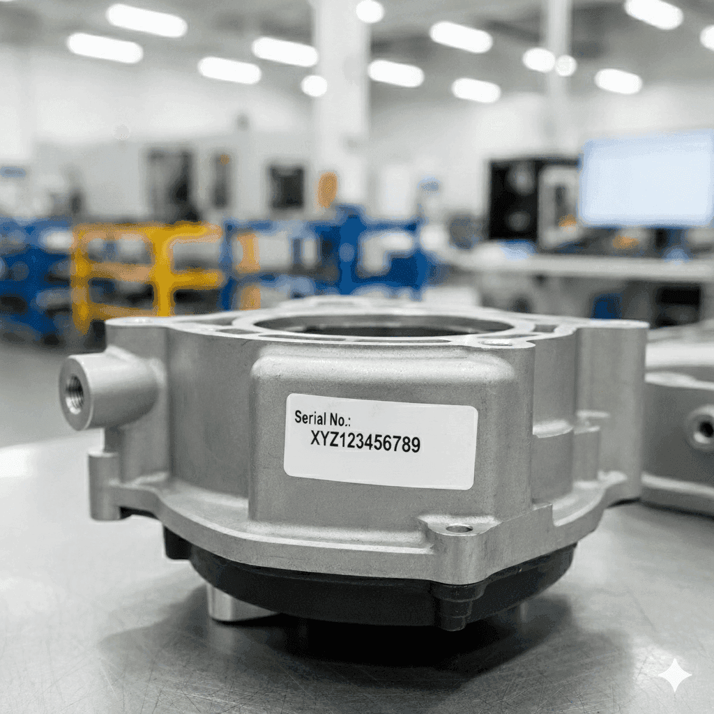

In any production facility, there are labels on everything. Products have serial numbers and lot codes. Packages have batch IDs and dates. All of it needs to be tracked.

<!--more-->

Most companies still do this manually. Someone scans or types in each code as products move through the line. It's repetitive, time-consuming work—and mistakes are inevitable.

That's where OCR comes in. Optical Character Recognition (OCR) uses cameras to automatically read and extract text from labels and product markings. Instead of manual data entry, a camera simply captures the image and the system pulls out the information you need. It's a straightforward solution that's already being deployed in modern manufacturing facilities worldwide.

{width="400" data-zoomable}
*Part with Serial No*

For example, take a look at the image above. When processed with OCR, it returns the following text:

```
Serial No: XYZ123456789
```

This tutorial shows you how you can build a OCR system using FlowFuse that can capture images from cameras, extract text from product labels, lot codes, and serial numbers, validate and parse the extracted data, store results in a database or trigger downstream workflows.

## Getting Started

Before we dive in, make sure you have a running FlowFuse instance.
If you do not have one yet, you can [sign up for the 14-day free trial](https://app.flowfuse.com/) and get a hosted instance running in under two minutes.

### Installing Required Nodes

To perform text extraction from images, you’ll need to install the `@sumit_shinde_84/node-red-contrib-simple-ocr` node in your FlowFuse instance.
This node uses the Tesseract OCR engine under the hood to recognize text from image files or image buffers.
To capture images and build a dashboard, you’ll also need the **FlowFuse Dashboard** and **Webcam** packages.

1. Open your **FlowFuse** editor.
2. From the main menu, select **Manage palette → Install**.
3. Search for and install the following packages one by one:

   * `@sumit_shinde_84/node-red-contrib-simple-ocr`
   * `@flowfuse/node-red-dashboard`
   * `@sumit_shinde_84/node-red-dashboard-2-ui-webcam`

Once installed, you’ll see the **simple-ocr** node under the **Function** category and the **Webcam** widget under the **dashboard 2.0** category in the left sidebar.

### Building the Scanner

Now, let’s build a scanner dashboard that you can open on a mobile device, allowing the phone to act as a scanner for capturing product labels and serial numbers.


_[Label Scanner Built with FlowFuse]_

To capture images directly from your browser, you can use the **FlowFuse Dashboard** along with the **Webcam widget**, lets install them first.

#### Configuring the Webcam Node

1. Drag the **Webcam** widget onto your canvas.
2. Double-click the node to open its configuration.
3. Create new ui group for it to render the feed (for example, *OCR Scanner*).
4. Drag the **Button** widget onto the canvas and set its label to **Scan**. Select the appropriate **group**, check **Enable pointerdown event**, and set the **payload** to `"capture"`. 
5. Click **Done**. When the button is clicked, it will send the `"capture"` payload, which will trigger the **Webcam** widget to capture an image.

{data-zoomable}
_Scan Label Button Widget Configuration_

5. Deploy the flow

When deployed, this flow creates a dashboard interface with a live camera preview and a large Scan Label button. Each time you click Scan Label, the captured image is sent as a `msg.payload.image` containing a base64-encoded image.

#### Converting Base64 to Buffer

The Webcam node outputs the captured image as a base64-encoded string, but the OCR node requires a buffer. We need to add a conversion step between them.

1. Drag a **Function** node onto the canvas.
2. Place it between the **Button** node and where your **OCR** node will be.
3. Double-click the Function node to open its editor.
4. Add the following code:

```javascript
// Remove data URI prefix if present
let base64Data = msg.payload.image.replace(/^data:image\/\w+;base64,/, '');

// Convert base64 string to buffer
msg.payload = Buffer.from(base64Data, 'base64');

return msg;
```

5. Click **Done**.

This function strips the data URI prefix (e.g., `data:image/png;base64,`) from the base64 string and converts the remaining data into a buffer that the OCR node can process.

> **Tip:** If your image files are large, you may need to compress them for faster processing. You can use the `node-red-contrib-image-tools` node to resize or compress images before passing them to the OCR node.

#### Adding the OCR Node

Now, let’s add the OCR node to extract text from the captured images, The node accepts image data in `msg.payload` as a buffer:

1. Drag the **simple-ocr** node onto the canvas.
2. Connect the output of the **Function** node to the input of the **simple-ocr** node.
3. Add a **Debug** node and connect it to the **simple-ocr** node to view the results.
4. Click **Done**, then **Deploy**.

Next, open the dashboard by clicking the **Dashboard 2.0** button in the right sidebar. Then, click the **Scan Label** button — the first click will activate your camera (make sure to grant your browser permission to access it).

Position the label in front of the camera, focus on it, and click **Scan** again. The recognized text will appear in the **Debug** panel.
Now, you need to validate and trim the recognized text, and add a visual indicator to show a successful scan. Let’s set that up next.

#### Validating and Parsing the Extracted Text

The OCR node returns raw text that may contain extra whitespace, line breaks, or unwanted characters. Let's add validation and parsing logic:

1. Drag another **Function** node onto the canvas.
2. Connect it after the **simple-ocr** node.
3. Add the following code:

```javascript
// Extract and clean OCR text
let text = (msg.payload.text || msg.payload || "")
  .replace(/[\r\n]+/g, ' ')
  .replace(/[^\w\s:]/g, '')
  .replace(/\s+/g, ' ')
  .trim();

// Match part number
let match = text.match(/(?:Part\s*No|No)[:\s]+([0-9A-Z]{6,12})/i);
let part = match?.[1]?.trim() || null;

// Validate format: 6 digits + 2 letters + 2 digits
let valid = part ? /^\d{6}[A-Z]{2}\d{2}$/.test(part) : false;

// Build payload
msg.payload = {
  success: valid,
  partNumber: valid ? part : null,
  timestamp: new Date().toISOString(),
  notificationMsg: valid
    ? `Label successfully scanned: ${part}`
    : "Scan failed — Invalid or unreadable label."
};

return msg;
```

> Tip: You don’t need to know JavaScript to create a function for validating and extracting the label text you’re scanning — just tell the [FlowFuse Assistant](/blog/2025/07/flowfuse-ai-assistant-better-node-red-manufacturing/) what you want, and it will generate it for you.

4. Click **Done**.

This function cleans the text, validates that something was detected, and attempts to extract structured data like serial numbers or part numbers using regular expressions.

#### Adding Visual Feedback

Users need immediate feedback when a scan succeeds or fails. Let's add both visual indicators:

1. Drag a **Change** node onto the canvas and connect it to the validation Function node.
2. Configure the Change node to set `msg.payload` to `msg.payload.notificationMsg`.
3. Drag a **ui-notification** widget onto the canvas.
4. Double-click the ui-notification node to configure it:
   - Select or create a **UI Base** configuration
   - Set the **position** to **center**
   - Optionally, configure the **timeout** duration (e.g., 3000ms for 3 seconds)
5. Connect the Change node output to the ui-notification node input.
6. Click **Done** and **Deploy** the flow.

Now when you scan a label:
- If the scan is successful, you'll see a green notification with "Label successfully scanned: [part number]"
- If the scan fails, you'll see a warning notification with "Scan failed — Invalid or unreadable label"

Your OCR scanning system is now complete! You can test it by opening the dashboard on your mobile device, positioning a product label in front of the camera, and clicking the Scan button. The system will capture the image, extract the text, validate it, and provide immediate visual feedback on the scan result.

If you want to fully automate this process, you can set up a fixed camera positioned where products pass through on the production line. This approach eliminates manual scanning, but it will require proper camera mounting, lighting setup, and trigger mechanisms to capture images at the right moment as products move past the camera.

Furthermore, you can push scanned label data to a database. The easiest way to do this is using [FlowFuse Tables](/blog/2025/08/getting-started-with-flowfuse-tables/), which is a built-in database service managed by FlowFuse. You'll find query node in the palette that automatically connect to the database and include FlowFuse Assistant integration, allowing you to [query the database with natural language](/blog/2025/09/ai-assistant-flowfuse-tables/)—no extra skills required.

## What's Next?

You've just built a working OCR system that turns any mobile device into a label scanner. It captures images, reads text, validates the data, and gives instant feedback—all without writing hundreds of lines of code.

This is just the starting point. Your system can grow with your needs: connect it to your inventory database, add support for different label formats, set up multiple scanning stations, or integrate it with your existing ERP system. The foundation is there.

Also, This OCR scanner is just one piece of what's possible with FlowFuse. Imagine connecting all your manufacturing systems—machine data, quality checks, inventory tracking, production metrics—into a unified industrial data platform where everything flows together seamlessly.

FlowFuse helps manufacturers like you break down data silos and build connected, intelligent operations. From shop floor to top floor, your data works together.

**See it in action.** [Book a demo](/book-demo/) and discover how FlowFuse can transform your entire facility—not just your label scanning.

Or start building today with our [14-day free trial](https://app.flowfuse.com/).
