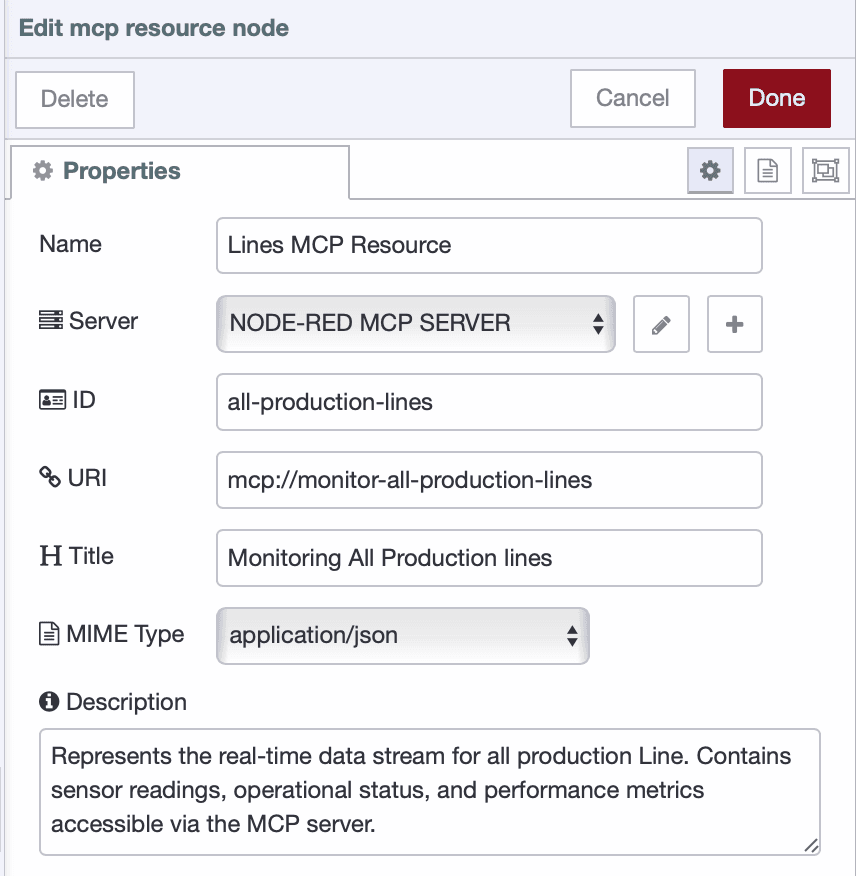
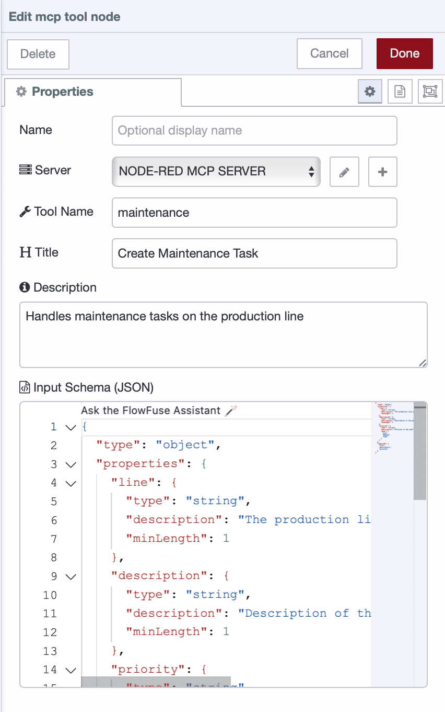

FlowFuse released MCP nodes for Node-RED, allowing AI to directly interact with the flows you have built. These nodes let AI read sensor data, query databases, and control equipment. You use FlowFuse to collect and manage data in your flows, while AI agents determines what actions to take and why, enabling intelligent monitoring and automated control of factory and IIoT/IoT systems.

<!--more-->

This article explains how to build an MCP server with FlowFuse and connect AI to your systems for real-time insights, operational decisions, and automated control.

### What Is MCP?

The **Model Context Protocol (MCP)** is the bridge between AI and your industrial systems. It defines a clear, structured way for AI to understand your factory or IIoT/IoT flows, know what it can read, and safely perform actions. With MCP, AI doesn’t just access data—it interacts intelligently with your systems.

MCP is built around three key components:

* **Resources**
  Think of resources as the eyes and ears of your AI. They provide read-only access to data like sensor readings, database tables, SCADA tags, or historical logs. Resources give AI the real-time context it needs to make informed decisions.

* **Tools**
  Tools are the hands of your AI. They are actions that AI can perform, from controlling equipment to adjusting system setpoints or generating reports. Each tool clearly defines what inputs it requires and what outputs it produces, so AI knows exactly how to act.

* **Prompts**
  Prompts are optional guides or recipes that show AI how to combine resources and tools to complete more complex tasks. They help AI follow multi-step workflows without guessing, making operations safer and more reliable.

When an AI agent connects to your MCP server, it instantly discovers all available resources and tools. The protocol handles all the technical details, so AI knows exactly how to request data, interpret responses, and take action.

## Getting Started

This section guides you through setting up an MCP server, defining resources, and creating tools so AI can interact with your system.

### Prerequisites

Before you begin, ensure you have the following:

* **A running FlowFuse instance.** If you do not have one, a 14-day free trial is available. [Sign up now](https://app.flowfuse.com/account/create) to set up your instance quickly and get started.

* **Ensure the `@flowfuse/nr-mcp-nodes` package is installed** in your Node-RED palette. These nodes are available on all FlowFuse tiers.

### Configuring the MCP Server

Before defining resources or tools, the MCP Server must be configured. This server acts as the central endpoint for AI agents, ensuring all resources and tools are accessible under a single, consistent configuration.

1. Drag an **MCP Resource or Tool** node onto your workspace and click the **+** next to Server to create a new configuration.

2. Define the server properties:

   * **Name**: Enter a descriptive name, e.g., `Factory MCP Server`.
   * **Protocol**: Leave the default `http/sse` (currently the only option).
   * **Path**: Specify the endpoint path for the server, e.g., `/mcp`.

{data-zoomable}
*Caption: Configuring the MCP Server in Node-RED*

3. **Click Done** to save the server configuration.

Once configured, this server is available for all subsequent Resources and Tools, providing a unified and discoverable endpoint for AI agents.

### Defining an MCP Resource

Now let's start by defining a Resource. In MCP, a Resource represents a data source that you want to expose to an AI agent. In an industrial context, this could be a sensor value, a machine's status, or a list of production lines.

1. Drag the MCP Resource node from the palette onto your workspace.
2. Double-click the node to open its configuration panel and select the added mcp server configuration.
3. Enter the unique id for the resource, for example : "all-production-lines"
4. Provide a unique URI for this specific resource, for example, `mcp://monitor-all-production-lines` Make sure your every resource must have a unique URI.
5. Enter a clear, human-readable title, like "Monitoring All production lines". This is the name the AI agent or client that will connect will see, so make it descriptive.
6. Give the node a descriptive name for your flow, such as Production Lines Resource, and enter a brief description.

{data-zoomable}
*Setting up an MCP Resource in FlowFuse*

7. Click Done and then Deploy your flow.

At this point, your MCP server is live and resource is discoverable. However, it doesn't contain any data yet.

To expose data you will need to connect the MCP Resource node to any data-producing node in your flow. This could be an HTTP Request node for retrieving data from an API, a FlowFuse Query node for fetching records from a database table, or industrial connectors such as OPC UA Client, Modbus Read, or MQTT In nodes to access live operational data.

8. Next, drag the MCP Response node and connect its input to the output of the upstream data source node. 

> The MCP Response node is crucial here because it delivers the results of your flow back to the AI agent. Without it, the AI will not receive the data it requests.

9. Deploy the flow

Now, when an AI agent or any other client requests this URI, the flow will automatically execute and query your data source for the latest information. This data is then returned to the agent, providing it with the real-time context needed to answer your questions.

#### Example: Monitoring Production Lines

For this article, we've built a demonstration data flow. We have a table named production-lines where new data is inserted every five seconds from 10 different lines.

We then created a data resource and exposed all the line data to it. Now, let's connect a AI Agent to this resource and explore the kinds of questions we can ask to monitor the factory floor effectively.

{data-zoomable}
*Production line monitoring using MCP Resources*

### Defining an MCP Tool

While resources are useful for providing access to data, tools enable an AI agent to perform specific, parameterized actions within your system.

1. Drag the MCP Tool node from the Node-RED palette onto your workspace.

2. Double-click the node to open the configuration panel and select the MCP Server configuration you previously created.

3. Enter a tool name that will be visible to clients connecting to the MCP server, such as *Maintenance* or *Maintenance Scheduler*.

4. Provide a clear description of the tool’s purpose, and assign a descriptive name to the node within your flow.

5. Define the input schema in JSON format. This schema helps the AI understand what data is required to perform the action and also validates incoming requests. For detailed guidance, refer to the [Getting Started Guide](https://json-schema.org/learn/getting-started-step-by-step).

   > Tip: You can also use the FlowFuse AI Assistant to generate the JSON schema automatically. Just click **Ask FlowFuse Assistant** in the input schema field and describe the expected input in plain English.

Below is an example schema for a Tool node. It shows how data is defined, its type, and which fields are required along with minimum lengths:

```json
{
  "type": "object",
  "properties": {
    "line": {
      "type": "string",
      "description": "The production line where maintenance is required",
      "minLength": 1
    },
    "description": {
      "type": "string",
      "description": "Description of the maintenance task",
      "minLength": 1
    },
    "priority": {
      "type": "string",
      "description": "Priority of the task",
      "enum": [
        "Low",
        "Medium",
        "High"
      ]
    }
  },
  "required": [
    "line",
    "description",
    "priority"
  ]
}
```

{data-zoomable}
*Setting up an MCP Tool in FlowFuse*

6. Click *Done*, then deploy your flow.

At this stage, the tool becomes discoverable by connected AI clients. However, it will not perform any action until it is linked to a flow that executes a task, such as an HTTP Request node performing a POST operation, a Query node inserting data into a database, or an OPC UA Write node controlling a device.

7. Drag the MCP Response node and connect its input to the output of the final node in your action flow. 

>The MCP Response node is necessary because the AI needs to receive the outcome of the action—whether it was successful or if an error occurred.

8.  Deploy the flow once again.

Your MCP Tool is now active. When an AI agent invokes it, the connected flow executes the defined action and returns the result to the agent.

#### Example: Scheduling Maintenance for Production Lines

In this example, the flow includes a tool that triggers a POST request to the maintenance system API, which was developed using FlowFuse and the FlowFuse Dashboard. The AI Assistant was then asked to identify which production line was performing the worst and schedule a maintenance task for it.

{data-zoomable}
*AI agent scheduling maintenance using an MCP Tool*

Below is the flow that includes the Resource we created to monitor production lines and the Tool that sends a POST request.

*Note: The flow uses the FlowFuse Query node and FlowFuse tables, which are only available on the Enterprise tier. If you do not have Enterprise, you can use other data sources instead, such as HTTP Request, OPC UA, or other database nodes.*


[{"id":"c0952d97df3a1491","type":"group","z":"3831e63ae3acc9b0","style":{"stroke":"#b2b3bd","stroke-opacity":"1","fill":"#f2f3fb","fill-opacity":"0.5","label":true,"label-position":"nw","color":"#32333b"},"nodes":["32c493499c4916c7","2da059f0b9465120","5ee2cab1a6affc67","a94b5c1aba4ffac8","feaeb5c4477ce7fe","1ea311e63b6b7b89"],"x":94,"y":219,"w":692,"h":162},{"id":"32c493499c4916c7","type":"http request","z":"3831e63ae3acc9b0","g":"c0952d97df3a1491","name":"Schedule Maintenance","method":"POST","ret":"txt","paytoqs":"ignore","url":"","tls":"","persist":false,"proxy":"","insecureHTTPParser":false,"authType":"","senderr":false,"headers":[],"x":460,"y":340,"wires":[["feaeb5c4477ce7fe"]]},{"id":"2da059f0b9465120","type":"mcp-response","z":"3831e63ae3acc9b0","g":"c0952d97df3a1491","name":"","x":680,"y":260,"wires":[]},{"id":"5ee2cab1a6affc67","type":"mcp-resource","z":"3831e63ae3acc9b0","g":"c0952d97df3a1491","name":"Lines MCP Resource","server":"460154892784fd4e","resourceUri":"mcp://monitor-all-production-lines","resourceId":"all-production-lines","title":"Monitoring All Production lines","description":"Represents the real-time data stream for all production Line. Contains sensor readings, operational status, and performance metrics accessible via the MCP server.","mimeType":"application/json","x":220,"y":260,"wires":[["1ea311e63b6b7b89"]]},{"id":"a94b5c1aba4ffac8","type":"mcp-tool","z":"3831e63ae3acc9b0","g":"c0952d97df3a1491","name":"","server":"460154892784fd4e","toolName":"maintenance","title":"Create Maintenance Task","description":"Handles maintenance tasks on the production line","inputSchema":"{\n  \"type\": \"object\",\n  \"properties\": {\n    \"line\": {\n      \"type\": \"string\",\n      \"description\": \"The production line where maintenance is required\",\n      \"minLength\": 1\n    },\n    \"description\": {\n      \"type\": \"string\",\n      \"description\": \"Description of the maintenance task\",\n      \"minLength\": 1\n    },\n    \"priority\": {\n      \"type\": \"string\",\n      \"description\": \"Priority of the task\",\n      \"enum\": [\n        \"Low\",\n        \"Medium\",\n        \"High\"\n      ]\n    }\n  },\n  \"required\": [\n    \"line\",\n    \"description\",\n    \"priority\"\n  ]\n}","x":190,"y":340,"wires":[["32c493499c4916c7"]]},{"id":"feaeb5c4477ce7fe","type":"mcp-response","z":"3831e63ae3acc9b0","g":"c0952d97df3a1491","name":"","x":680,"y":340,"wires":[]},{"id":"1ea311e63b6b7b89","type":"tables-query","z":"3831e63ae3acc9b0","g":"c0952d97df3a1491","name":"Retrieve Lines Data","query":"SELECT * FROM public.production_lines;","split":false,"rowsPerMsg":1,"x":450,"y":260,"wires":[["2da059f0b9465120"]]},{"id":"460154892784fd4e","type":"mcp-server","name":"MY NODE-RED SERVER","protocol":"http","path":"/mcp"},{"id":"d97f2d2e28df31e4","type":"global-config","env":[],"modules":{"@flowfuse-nodes/nr-mcp-server-nodes":"0.1.1","@flowfuse/nr-tables-nodes":"0.1.0"}}]


With your MCP server, Resources, and Tools in place, the AI agent can now interact with your industrial systems in a structured way. Up to this point, we've covered the basics and demonstrated a simple workflow. The MCP Prompt node, which allows AI agents to be guided through complex, multi-step tasks, will be explored in a future article.

## Conclusion

This guide demonstrated how to build a fully functional MCP server with FlowFuse and Node-RED, providing AI agents with structured access to industrial systems through Resources and Tools, which enable workflows such as monitoring production lines, scheduling maintenance, and automating operational decisions — all without complex coding.

FlowFuse [recently added ONNX AI nodes](/blog/2025/10/ai-on-flowfuse/). With these nodes, you can train custom models, deploy them in Node-RED, and execute tasks tailored to your processes. Combined with FlowFuse’s capabilities to collect, transform, and visualize industrial data, the platform makes development, monitoring, and optimization faster, smarter, and more scalable.

Adopting MCP with FlowFuse is a strategic step toward AI-enabled, future-ready industrial automation. [Book a demo today](https://flowfuse.com/blog/2025/10/ai-on-flowfuse/) to see how FlowFuse connects, transforms, and visualizes your industrial data while making AI-driven operations easy and actionable.
