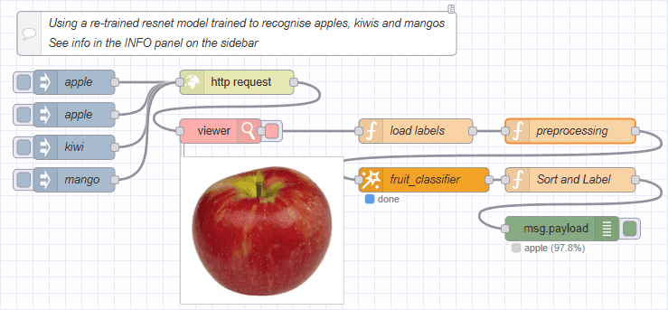

FlowFuse is introducing a new set of AI nodes to make it easier than ever to integrate AI and machine learning into your Node-RED workflows.
In this guide, you will learn how to train an image classifier model, and use it with the new FlowFuse AI Nodes to recognise your own products, components - or anything else you can imagine.

<!--more-->

### Introduction

In this article, we will be building a PyTorch-based image classification model to identify fruit types (apple, kiwi, mango) using a dataset of labelled images.
Of course, you would typically be classifying your own things like your company widgets and products, but for the sake of learning the process, we will be using images of fruit.
Once the model is trained, it is exported to the ONNX format, it is then ready for use with the new FlowFuse AI nodes.

Note: The code and sample dataset used in this tutorial can be downloaded from [this link](https://website-data.s3.eu-west-1.amazonaws.com/2025-10-onnx-model-training-dataset.zip).

### Some background first

The process we will use is commonly referred to as "transfer learning". This is where you take a pre-trained model and fine-tune it on your own dataset.
This is a common approach in deep learning as it allows us to leverage the knowledge learned by the pre-trained model and adapt it to our specific task with a smaller dataset.  For reference, this tutorial will use ResNet-18 which is an 18-layer Residual Network (ResNet), a convolutional neural network (CNN) architecture that uses "skip connections" to help train very deep networks by addressing the vanishing gradient problem. Pre-trained ResNet-18 models are often trained on the ImageNet dataset and are widely used for image classification of 1000 categories.

### Overview of operations

The 3 main steps to achieve this involves:

1. Setting up a Python environment with PyTorch, TorchVision, ONNX, and ONNX Runtime.
1. Organizing your dataset into train, validation, and test folders for each class.
1. Perform "transfer learning" to fine-tune the model against your images & generate the ONNX model.

Let's get started...


### Setup the environment


#### Pre-requisites

This tutorial was tested on Ubuntu using Python 3 and `pyenv` for environment management.

For the sake of brevity, from this point forward, the tutorial will assume you are using a debian based operating system and `pyenv`.
Instructions will need to be adapted if you are using something else.

##### Python tools

Ensure you have `pyenv` and `pyenv-virtualenv` installed.

```bash
pyenv --version
pyenv virtualenv --version
```

If you don't have them installed, this [Medium article](https://medium.com/@aashari/easy-to-follow-guide-of-how-to-install-pyenv-on-ubuntu-a3730af8d7f0) worked well in our case.

##### Sub dependencies

During setup and testing, my installation failed at the last step due to missing `bz2` support (a TorchVision dependency).
If you encounter this, you would need to install `libbz2` then you would need to rebuild your python environment.
To save time, I recommend that you perform the steps below now to ensure the dependencies are installed and avoid the mis-step.

```bash
sudo apt update
sudo apt install -y libbz2-dev liblzma-dev libsqlite3-dev libssl-dev zlib1g-dev libffi-dev build-essential
```


#### Virtual Environment Setup

Install python 3.10.14 (or any version compatible with pytorch and onnx):
```bash
pyenv install 3.10.14
```

Create a new virtual environment:
```bash
pyenv virtualenv 3.10.14 venv_py3_10_14_pytorch
```

Activate the virtual environment:
```bash
pyenv activate venv_py3_10_14_pytorch
```
_NOTE: Depending on your shell, your commandline may become decorated with the name of the virtual environment._

Install the required packages:
```bash
pip install --upgrade pip
pip install torch torchvision onnx onnxruntime matplotlib numpy
```

Create a working directory
```bash
mkdir ~/my-py-projects
cd ~/my-py-projects
mkdir pytorch-onnx
cd pytorch-onnx
# Associate this directory with the virtual env we created earlier
pyenv local venv_py3_10_14_pytorch
```

(Optional) Create a `requirements.txt` file to document the packages used in this project:
```bash
pip freeze > requirements.txt
```

### Organizing your dataset

For this example, I have created a simple dataset of images of apples, kiwis, and mangos.
You can use your own dataset or download a dataset from the internet (e.g. [this one](https://www.kaggle.com/datasets/) or [this one](https://images.cv/search-labeled-image-dataset)). 
Just make sure to organize the images in the following structure:

```bash
data/
    train/
        apples/
            apple1.jpg
            apple2.jpg
            ...
        kiwis/
            kiwi1.jpg
            kiwi2.jpg
            ...
        mangos/
            mango1.jpg
            mango2.jpg
            ...
    val/
        apples/
            apple3.jpg
            apple4.jpg
            ...
        kiwis/
            kiwi3.jpg
            kiwi4.jpg
            ...
        mangos/
            mango3.jpg
            mango4.jpg
            ...
    test/
        apples/
            apple5.jpg
            apple6.jpg
            ...
        kiwis/
            kiwi5.jpg
            kiwi6.jpg
            ...
        mangos/
            mango5.jpg
            mango6.jpg
            ...
```

Now, inside `~/my-py-projects/pytorch-onnx/` you should have:

```bash
pytorch-onnx/
│
├── data/
│   ├── train/
│   │   ├── apples/
│   │   ├── kiwis/
│   │   └── mangos/
│   ├── val/
│   └── test/
│
├── fruit_classifier.py   # we will create this shortly
└── requirements.txt      # optional
```

### Fine-tune the model

Now we can create a simple pytorch model to classify the images.

Create a new file called `fruit_classifier.py`

```bash
# Use nano to create the file (you can use your favorite editor e.g. vim, code, etc)
nano fruit_classifier.py
```

Add the following code:
```python
# fruit_classifier.py

import torch
import torch.nn as nn
import torch.optim as optim
from torch.utils.data import DataLoader
import torchvision.transforms as transforms
import torchvision.datasets as datasets
import torchvision.models as models
import onnxruntime as ort
import numpy as np

# --- Dataset ---
data_dir = "data"
transform = transforms.Compose([
    transforms.Resize((224, 224)),
    transforms.ToTensor(),
    transforms.Normalize(mean=[0.485, 0.456, 0.406],
                         std=[0.229, 0.224, 0.225])
])

train_dataset = datasets.ImageFolder(f"{data_dir}/train", transform=transform)
val_dataset   = datasets.ImageFolder(f"{data_dir}/val", transform=transform)
test_dataset  = datasets.ImageFolder(f"{data_dir}/test", transform=transform)

train_loader = DataLoader(train_dataset, batch_size=32, shuffle=True)
val_loader   = DataLoader(val_dataset, batch_size=32, shuffle=False)
test_loader  = DataLoader(test_dataset, batch_size=32, shuffle=False)

print("Class mapping:", train_dataset.class_to_idx)

device = torch.device("cuda" if torch.cuda.is_available() else "cpu")

# --- Model ---
model = models.resnet18(weights=models.ResNet18_Weights.IMAGENET1K_V1)
model.fc = nn.Linear(model.fc.in_features, len(train_dataset.classes))
model = model.to(device)

criterion = nn.CrossEntropyLoss()
optimizer = optim.Adam(model.parameters(), lr=1e-4)


# --- Training ---
def train(num_epochs=5):
    for epoch in range(num_epochs):
        model.train()
        running_loss = 0.0
        for inputs, labels in train_loader:
            inputs, labels = inputs.to(device), labels.to(device)

            optimizer.zero_grad()
            outputs = model(inputs)
            loss = criterion(outputs, labels)
            loss.backward()
            optimizer.step()

            running_loss += loss.item()

        avg_loss = running_loss / len(train_loader)
        print(f"Epoch {epoch+1}, Loss: {avg_loss:.4f}")


# --- Evaluation ---
def evaluate(loader):
    model.eval()
    correct, total = 0, 0
    with torch.no_grad():
        for inputs, labels in loader:
            inputs, labels = inputs.to(device), labels.to(device)
            outputs = model(inputs)
            _, preds = torch.max(outputs, 1)
            correct += (preds == labels).sum().item()
            total += labels.size(0)
    return correct / total


# --- Export to ONNX ---
def export_model():
    dummy_input = torch.randn(1, 3, 224, 224, device=device)

    torch.onnx.export(
        model,               # model being run
        dummy_input,         # model input (or a tuple for multiple inputs)
        "fruit_classifier.onnx",    # where to save the model (can be a file or file-like object)
        export_params=True,  # store the trained parameter weights inside the model file
        opset_version=16,    # the ONNX version to export the model to
        do_constant_folding=True,  # whether to execute constant folding for optimization
        input_names=['input'],   # the model's input names
        output_names=['output'],  # the model's output names
        dynamic_axes={"input": {0: "batch_size"}, "output": {0: "batch_size"}}
    )

    print("Model exported to fruit_classifier.onnx")


# --- Test with ONNX Runtime ---
def test_onnx():
    ort_session = ort.InferenceSession("fruit_classifier.onnx")

    def to_numpy(tensor):
        return tensor.detach().cpu().numpy() if tensor.requires_grad else tensor.cpu().numpy()

    inputs, _ = next(iter(test_loader))
    ort_inputs = {"input": to_numpy(inputs[:1])}
    ort_outs = ort_session.run(None, ort_inputs)

    pred_class = np.argmax(ort_outs[0])
    print("ONNX Prediction:", train_dataset.classes[pred_class])


# --- Main ---
if __name__ == "__main__":
    train(num_epochs=5)
    val_acc = evaluate(val_loader)
    print(f"Validation Accuracy: {val_acc:.2%}")

    export_model()
    test_onnx()

```


#### Run the fruit_classifier.py Python script
Now you can run the script that will train the model, export it to ONNX format, and run a quick classification test using the ONNX Runtime:

```bash
python fruit_classifier.py
```

What you should see:
```log
Class mapping: {'apple': 0, 'kiwi': 1, 'mango': 2}
Epoch 1, Loss: 0.7811
Epoch 2, Loss: 0.1383
Epoch 3, Loss: 0.0671
Epoch 4, Loss: 0.0399
Epoch 5, Loss: 0.0184
Validation Accuracy: 80.95%
Model exported to fruit_classifier.onnx
ONNX Prediction: apple
```

If you changed the data set from fruit to your use own images and classifications, it will output a different `Class mapping` that you will need to use in the Node-RED flow on the next step - make a note of this.


### Using your newly generated ONNX Model with the FlowFuse ONNX Node

1. Import the finished ONNX model into a location in the file system where your Node-RED instance can access it
    - In FlowFuse cloud you can do this via the Assets tab
2. Import the demo flow
   - Open your Node-RED editor
   - Press `CTRL-I` or select `Import` from the menu to open the Import Dialog
   - Select the **Examples** tab
   - Click the **@FlowFuse/nr-ai-nodes** entry
   - Click the demo named **advanced-custom-model**
   - Click the **Import** Button
3. Double click the ONNX node to open the configuration dialog
4. Enter the path to your ONNX model in the **Path** field
5. If necessary, update the classifications (labels) in the Function node named **load labels** as noted in the previous section
6. Deploy the flow
7. Click the inject button on the left of the flow to trigger an inference


{data-zoomable}
*Image showing how to import demo flow*

{data-zoomable}
*Image showing inference in action*

### Supplementary Notes

#### Clean up

To deactivate the virtual environment when you're done, simply run:
```bash
pyenv deactivate
```

You can remove the `__pycache__` and other temporary files if they were created:
```bash
rm -rf __pycache__
rm -rf runs/ logs/ checkpoints/
```

If you want to completely remove the virtual environment, you can do so with:
```bash
pyenv uninstall venv_py3_10_14_pytorch
```
