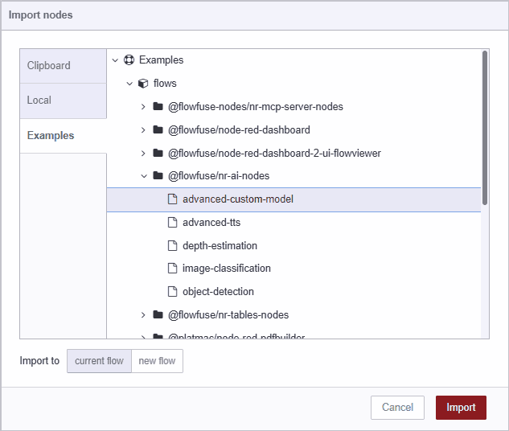

With FlowFuse, we are reducing the barriers to using AI. This article will guide you through generating your own, customised ONNX model that can be used in your application.

<!--more-->

## Main Steps

The main steps to achive this involves:

1. Setting up your Python environment with PyTorch, TorchVision, ONNX, and ONNX Runtime.
1. Organizing your dataset into train, validation, and test folders for each class.
1. Using transfer learning with a pre-trained ResNet18 model, fine-tuned on your images.
1. Training the model and evaluating its accuracy.
1. Exporting the trained PyTorch model to ONNX format for interoperability.

Get get started.


## Pytorch to ONNX Tutorial

In this article, we will be building a PyTorch-based image classification model to identify fruit types (apple, kiwi, mango) using a dataset of labeled images, and exporting the trained model to ONNX format for interoperability.

To demonstrate how to create an onnx model from a pytorch model, we will create a basic model based on transfer learning using ResNet18.
What this means is that we will use a pre-trained model (ResNet18) and fine-tune it on our dataset of fruit images. This is a common approach in deep learning as it allows us to leverage the knowledge learned by the pre-trained model on a large dataset (ImageNet) and adapt it to our specific task with a smaller dataset.

### Setup the environment for pytorch

#### Foreword
During setup and testing, my installation failed due to missing bz2 support (TorchVision dependency).
If you encounter this, you would need to install `libbz2` then you would need to rebuild your python environment.
To save time, I have included the dependencies below.

```bash
sudo apt update
sudo apt install -y libbz2-dev liblzma-dev libsqlite3-dev libssl-dev zlib1g-dev libffi-dev build-essential
```

#### Virtual Environment Setup
I am using `pyenv` for this example, but you can use any virtual environment manager you like.

Ensure you have `pyenv` and `pyenv-virtualenv` installed. 

Install python 3.10.14 (or any version compatible with pytorch and onnx):

```bash
pyenv install 3.10.14
```

Create a new virtual environment:
```bash
pyenv virtualenv 3.10.14 venv_py3_10_14_pytorch
```

Activate the virtual environment:
```bash
pyenv activate venv_py3_10_14_pytorch
```

Install the required packages:
```bash
pip install --upgrade pip
pip install torch torchvision onnx onnxruntime onnxscript matplotlib notebook
```

(Optional) Set Local Project Env
```bash
mkdir ~/pyprojects
cd ~/pyprojects
mkdir pytorch-onnx
cd pytorch-onnx
pyenv local venv_py3_10_14_pytorch
```

(Optional) Create a `requirements.txt` file for future reference:
```bash
pip freeze > requirements.txt
```

### Create a simple pytorch model

#### First gather training data

For this example, I have created a simple dataset of images of apples, kiwis, and mangos. You can use your own dataset or download a dataset from the internet e.g. [this one](https://www.kaggle.com/datasets/) or [this one](https://images.cv/search-labeled-image-dataset. Just make sure to organize the images in the following structure:

```bash
data/
    train/
        apples/
            apple1.jpg
            apple2.jpg
            ...
        kiwis/
            kiwi1.jpg
            kiwi2.jpg
            ...
        mangos/
            mango1.jpg
            mango2.jpg
            ...
    val/
        apples/
            apple1.jpg
            apple2.jpg
            ...
        kiwis/
            kiwi1.jpg
            kiwi2.jpg
            ...
        mangos/
            mango1.jpg
            mango2.jpg
            ...
    test/
        apples/
            apple1.jpg
            apple2.jpg
            ...
        kiwis/
            kiwi1.jpg
            kiwi2.jpg
            ...
        mangos/
            mango1.jpg
            mango2.jpg
            ...
```

#### Project Structure

Inside `~/pyprojects/pytorch-onnx/` you should now have:
```bash
pytorch-onnx/
│
├── data/
│   ├── train/
│   │   ├── apples/
│   │   ├── kiwis/
│   │   └── mangos/
│   ├── val/
│   └── test/
│
└── fruit_classifier.py   # we’ll write this shortly
└── requirements.txt      # optional
```

#### Dataset & Dataloaders

Now we can create a simple pytorch model to classify the images. Create a new file called `fruit_classifier.py` 

```bash
touch fruit_classifier.py
```

Add the following code:
```python
# fruit_classifier.py

import torch
from torch.utils.data import DataLoader
import torchvision.transforms as transforms
import torchvision.datasets as datasets

# --- Dataset ---
data_dir = "data"
transform = transforms.Compose([
    transforms.Resize((224, 224)),
    transforms.ToTensor(),
    transforms.Normalize(mean=[0.485, 0.456, 0.406],
                         std=[0.229, 0.224, 0.225])
])

train_dataset = datasets.ImageFolder(f"{data_dir}/train", transform=transform)
val_dataset   = datasets.ImageFolder(f"{data_dir}/val", transform=transform)
test_dataset  = datasets.ImageFolder(f"{data_dir}/test", transform=transform)

train_loader = DataLoader(train_dataset, batch_size=32, shuffle=True)
val_loader   = DataLoader(val_dataset, batch_size=32, shuffle=False)
test_loader  = DataLoader(test_dataset, batch_size=32, shuffle=False)

print("Class mapping:", train_dataset.class_to_idx)
```

#### Model Setup (ResNet18 Transfer Learning)

```python
import torch.nn as nn
import torchvision.models as models

device = torch.device("cuda" if torch.cuda.is_available() else "cpu")

# --- Model ---
model = models.resnet18(weights=models.ResNet18_Weights.IMAGENET1K_V1)
model.fc = nn.Linear(model.fc.in_features, len(train_dataset.classes))
model = model.to(device)
```

#### Training Loop

```python
import torch.optim as optim

criterion = nn.CrossEntropyLoss()
optimizer = optim.Adam(model.parameters(), lr=1e-4)

for epoch in range(num_epochs):
    model.train()
    running_loss = 0.0
    for inputs, labels in train_loader:
        inputs, labels = inputs.to(device), labels.to(device)

        optimizer.zero_grad()
        outputs = model(inputs)
        loss = criterion(outputs, labels)
        loss.backward()
        optimizer.step()

        running_loss += loss.item()

    avg_loss = running_loss / len(train_loader)
    print(f"Epoch {epoch+1}, Loss: {avg_loss:.4f}")
```

#### Evaluation

```python
def evaluate(loader):
    model.eval()
    correct, total = 0, 0
    with torch.no_grad():
        for inputs, labels in loader:
            inputs, labels = inputs.to(device), labels.to(device)
            outputs = model(inputs)
            _, preds = torch.max(outputs, 1)
            correct += (preds == labels).sum().item()
            total += labels.size(0)
    return correct / total

val_acc = evaluate(val_loader, model)
print(f"Validation Accuracy: {val_acc:.2%}")
```

#### Export to ONNX
```python
dummy_input = torch.randn(1, 3, 224, 224, device=device)

torch.onnx.export(
    model,               # model being run
    dummy_input,         # model input (or a tuple for multiple inputs)
    "fruit_classifier.onnx",    # where to save the model (can be a file or file-like object)
    export_params=True,  # store the trained parameter weights inside the model file
    opset_version=16,    # the ONNX version to export the model to
    do_constant_folding=True,  # whether to execute constant folding for optimization
    input_names=['input'],   # the model's input names
    output_names=['output'],  # the model's output names
    dynamic_axes={"input": {0: "batch_size"}, "output": {0: "batch_size"}}
)

print("Exported model to fruit_classifier.onnx")
```

#### Test in ONNX Runtime (Python)
```python
import onnxruntime as ort
import numpy as np

ort_session = ort.InferenceSession("fruit_classifier.onnx")

def to_numpy(tensor):
    return tensor.detach().cpu().numpy() if tensor.requires_grad else tensor.cpu().numpy()

inputs, _ = next(iter(test_loader))
ort_inputs = {"input": to_numpy(inputs[:1])}
ort_outs = ort_session.run(None, ort_inputs)

pred_class = np.argmax(ort_outs[0])
print("ONNX Prediction:", train_dataset.classes[pred_class])
```


### All together now

Here is the complete `fruit_classifier.py` file:

```python
import torch
import torch.nn as nn
import torch.optim as optim
from torch.utils.data import DataLoader
import torchvision.transforms as transforms
import torchvision.datasets as datasets
import torchvision.models as models
import onnxruntime as ort
import numpy as np

# --- Dataset ---
data_dir = "data"
transform = transforms.Compose([
    transforms.Resize((224, 224)),
    transforms.ToTensor(),
    transforms.Normalize(mean=[0.485, 0.456, 0.406],
                         std=[0.229, 0.224, 0.225])
])

train_dataset = datasets.ImageFolder(f"{data_dir}/train", transform=transform)
val_dataset   = datasets.ImageFolder(f"{data_dir}/val", transform=transform)
test_dataset  = datasets.ImageFolder(f"{data_dir}/test", transform=transform)

train_loader = DataLoader(train_dataset, batch_size=32, shuffle=True)
val_loader   = DataLoader(val_dataset, batch_size=32, shuffle=False)
test_loader  = DataLoader(test_dataset, batch_size=32, shuffle=False)

print("Class mapping:", train_dataset.class_to_idx)

device = torch.device("cuda" if torch.cuda.is_available() else "cpu")

# --- Model ---
model = models.resnet18(weights=models.ResNet18_Weights.IMAGENET1K_V1)
model.fc = nn.Linear(model.fc.in_features, len(train_dataset.classes))
model = model.to(device)

criterion = nn.CrossEntropyLoss()
optimizer = optim.Adam(model.parameters(), lr=1e-4)


# --- Training ---
def train(num_epochs=5):
    for epoch in range(num_epochs):
        model.train()
        running_loss = 0.0
        for inputs, labels in train_loader:
            inputs, labels = inputs.to(device), labels.to(device)

            optimizer.zero_grad()
            outputs = model(inputs)
            loss = criterion(outputs, labels)
            loss.backward()
            optimizer.step()

            running_loss += loss.item()

        avg_loss = running_loss / len(train_loader)
        print(f"Epoch {epoch+1}, Loss: {avg_loss:.4f}")


# --- Evaluation ---
def evaluate(loader):
    model.eval()
    correct, total = 0, 0
    with torch.no_grad():
        for inputs, labels in loader:
            inputs, labels = inputs.to(device), labels.to(device)
            outputs = model(inputs)
            _, preds = torch.max(outputs, 1)
            correct += (preds == labels).sum().item()
            total += labels.size(0)
    return correct / total


# --- Export to ONNX ---
def export_model():
    dummy_input = torch.randn(1, 3, 224, 224, device=device)

    torch.onnx.export(
        model,               # model being run
        dummy_input,         # model input (or a tuple for multiple inputs)
        "fruit_classifier.onnx",    # where to save the model (can be a file or file-like object)
        export_params=True,  # store the trained parameter weights inside the model file
        opset_version=16,    # the ONNX version to export the model to
        do_constant_folding=True,  # whether to execute constant folding for optimization
        input_names=['input'],   # the model's input names
        output_names=['output'],  # the model's output names
        dynamic_axes={"input": {0: "batch_size"}, "output": {0: "batch_size"}}
    )

    print("Model exported to fruit_classifier.onnx")


# --- Test with ONNX Runtime ---
def test_onnx():
    ort_session = ort.InferenceSession("fruit_classifier.onnx")

    def to_numpy(tensor):
        return tensor.detach().cpu().numpy() if tensor.requires_grad else tensor.cpu().numpy()

    inputs, _ = next(iter(test_loader))
    ort_inputs = {"input": to_numpy(inputs[:1])}
    ort_outs = ort_session.run(None, ort_inputs)

    pred_class = np.argmax(ort_outs[0])
    print("ONNX Prediction:", train_dataset.classes[pred_class])


# --- Main ---
if __name__ == "__main__":
    train(num_epochs=5)
    val_acc = evaluate(val_loader)
    print(f"Validation Accuracy: {val_acc:.2%}")

    export_model()
    test_onnx()
```

### Run the script
Now you can run the script to train the model, export it to ONNX, and test it with ONNX Runtime:

```bash
python fruit_classifier.py
```

### Notes
#### Clean up
To deactivate the virtual environment when you're done, simply run:
```bash
pyenv deactivate
```

To remove files created when running the script, you can delete the `fruit_classifier.onnx` file:
```bash
rm fruit_classifier.onnx

```
Additionally, you can remove the `__pycache__` and other temporary files if they were created:
```bash
rm -rf __pycache__
rm -rf runs/ logs/ checkpoints/
```

### Using your newly generated ONNX Model with the FlowFuse ONNX Node

1. Copy your finshied model to a location in the file system where Node-RED can access it
2. Import the demo flow
   - Open your Node-RED editor
   - Press `CTRL-I` or select `Import` from the menu to open the Import Dialog
   - Select the **Examples** tab
   - Click the **@FlowFuse/nr-ai-nodes** entry
   - Click the demo named **advanced-custom-model**
   - Click the **Import** Button


{data-zoomable}
*Image showing how to import demo flow*

{data-zoomable}
*Image showing inference in action*
