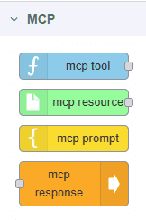
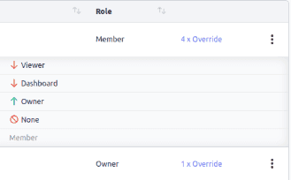
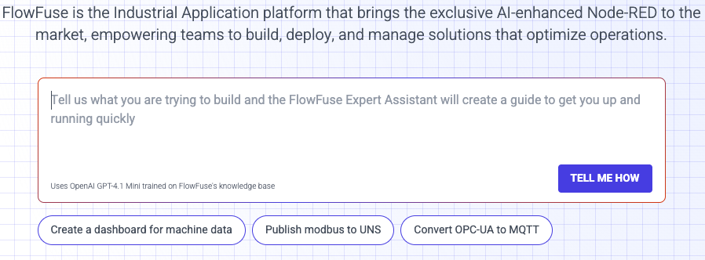

In this exciting release, we've shipped several features that accelerate development in Node-RED using AI, enable creation of AI agents using new Model Context Protocol nodes, provide application-level access controls for much more sophisticated user permissions management, and put an expert flow creator right on our homepage. It's a big one! Let's have a look.

<!--more-->

## MCP Nodes

_[MCP nodes in the Node-RED palette, ready for use]_

With this release, you can now create a Model Context Protocol server using Node-RED. The new MCP nodes enable the creation of a MCP server so that you can create AI agents that will rely on the exact data that you want to surface to an LLM. As AI services rely upon data presented to them, whether it's anything available on the world wide web (as with LLMs generically) or more focused information, our MCP nodes provide the ability to expose specific resources so that an AI service will rely upon the right data without making all of your information public. It's a really exciting development. Check out [the Changelog entry](https://flowfuse.com/changelog/2025/10/mcp-nodes/) for more.

## FlowFuse AI Nodes

While MCP makes it possible to create AI agents to rely on the data you have chosen, the new FlowFuse AI nodes allow you to connect AI models of your choosing--including ones that you have trained yourself--to Node-RED to create any workflow you like. The ONNX (Open Neural Network Exchange) format lets you connect a model for whatever purpose you have in mind. This package ships with nodes for running your own custom-trained model, for classifying images, for object detection, and for image depth estimation. This is a huge step in the direction of fully-controlled AI automation inside of Node-RED on FlowFuse.

For self-hosted customers, once you've upgraded, contact [FlowFuse Support](https://flowfuse.com/support) to get access to these exciting new nodes.

## Application-Level Role-Based Access Control

_[Control permissions at the application level]_

One of the key features of FlowFuse is the ability to manage Node-RED applications by choosing who gets access to what. Up to now, team owners had to configure permissions at the team level. But what if there are members of your team that should have write permissions to one Node-RED instance, but only viewer access to another? You would have to put those instances on different teams and configure permissions there. With many instances and applications, this could be a headache.

We've solved it. You can now manage permissions at the Application level. Now one and the same team can have users who can access some applications with one level of permissions, and and another application with a different level. We've heard your feedback on this need and are happy for you to give it a try!

## FlowFuse Expert

_[The FlowFuse Expert gives step-by-step instructions for building flows]_

You can now get complete instructions for building a Node-RED flow on [flowfuse.com](https://flowfuse.com) using the FlowFuse Expert! This newest feature in the FlowFuse AI toolkit provides detailed guidance on creating Node-RED flows for any purpose you have in mind.

Head over to [flowfuse.com](https://flowfuse.com) to check it out! We have big plans in mind for this feature, but can't say much yet. For now, it's enough to say that low code development is headed toward a whole new level with FlowFuse.

## FlowFuse Assistant for Self Hosted Deployments

Speaking of AI assistance, self-hosted FlowFuse deployments have until now not had access to the FlowFuse Assistant inside of Node-RED, helping to complete flows using natural language for explanation of flows, creation of Dashboard, Function, and Tables nodes, and Snapshot descriptions. These had been available only to FlowFuse Cloud customers. I'm happy to say that our many self-hosted customers now (finally) can get access to this tool, which helps speed flow creation exponentially. Contact [FlowFuse Support](https://flowfuse.com/support) to help get you setup.

## Import JSON at Instance Creation

Developers want the fastest way to spin up a functional Node-RED instance, and we've taken another step in that direction by offering the option of uploading a JSON file during the instance creation workflow.

# Sneak Peek

What if you could surface your FlowFuse Tables data outside of the FlowFuse environment, for broader consumption as you see fit? Or use data coming into Node-RED to predict maintainance needs? We have exciting things on the way for you!

## Don't Miss Node-RED Con 2025!

While not exactly a release item, I'd be remiss if I failed to mention Node-RED Conference 2025! We've got a great lineup of speakers who will cover a broad and deep variety of topics on the use of Node-RED. Check out the website and register here: [https://nrcon.nodered.org/.](https://nrcon.nodered.org/.)

## What else is new?

For a complete list of everything included in our 2.23 release, check out the [release notes](https://github.com/FlowFuse/flowfuse/releases/tag/v2.23.0).

Your feedback continues to be invaluable in shaping FlowFuse's development. We'd love to hear your thoughts on these new features and any suggestions for future improvements. Please share your experiences or report any [issues on GitHub](https://github.com/FlowFuse/flowfuse/issues/new/choose).

Which of these new features are you most excited to try? Email me directly at greg@flowfuse.com - I'd love to hear from you!

## Try FlowFuse

### FlowFuse Cloud

The quickest way to get started is with FlowFuse Cloud.

[Get started for free]({{ site.appURL }}/account/create) and have your Node-RED instances running in the cloud within minutes.

### Self-Hosted

Get FlowFuse running locally in under 30 minutes using [Docker](/docs/install/docker/) or [Kubernetes](/docs/install/kubernetes/).
