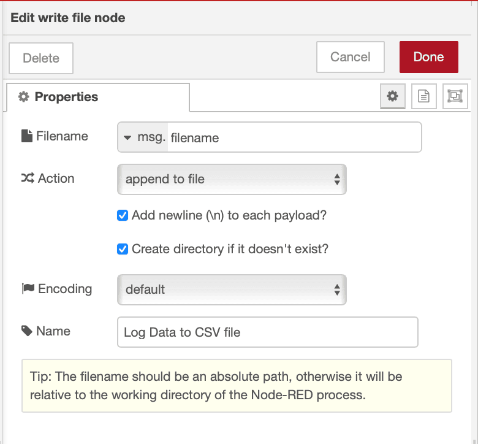

CSV files have been recording manufacturing data since the mid-1980s, over 40 years of continuous use across every industry. Logging to databases like InfluxDB, TimescaleDB, or PostgreSQL is excellent for real-time analytics, complex queries, and large-scale operations. But many organizations still rely on CSV files for good reasons: regulatory compliance, legacy system integration, offline analysis, or simply because it's the format their teams know and trust. If you're reading this, you're likely one of them and need a reliable solution.

<!--more-->

CSV files offer something databases can't always guarantee: universal compatibility and permanence. Excel opens them instantly, databases import them natively, and analysis tools expect them. No licensing, no vendor tie-ins, no format obsolescence. Data captured decades ago is still perfectly readable today and will be readable decades from now, regardless of what systems you're using.

The truth is, most manufacturers use both for distinct purposes. CSVs remain the standard on the shop floor for data loggers that write locally during network outages, regulatory submissions requiring immutable audit trails, batch documentation archived for decades, and data exchange with suppliers and auditors.

Meanwhile, databases handle real-time monitoring and automated alerts, cross-functional analytics, high-frequency sensor queries, and dynamic relationships across materials and equipment.

This isn't an either/or choice. It's a dual-track system where databases provide operational speed and CSVs provide the permanence layer, ensuring your compliance records and critical data outlive any technology stack.
This guide shows how to implement PLC data logging with **FlowFuse** in a way that keeps running, stable, resilient, and production-ready.

{data-zoomable}
_Image showing FlowFuse collecting data from a PLC using OPC UA and logging it to a CSV file._

## Prerequisites

Before getting started, make sure you have:

- **A running FlowFuse instance** – If you don’t have one yet, [sign up]({{ site.onboardingURL }}) for FlowFuse and set up an instance on your edge device. This device will manage data collection and logging from your PLC using Node-RED.

## Step 1: Setting Up PLC Communication in FlowFuse

Before logging data, you need a stable connection to your PLC. FlowFuse uses Node-RED under the hood, which supports every major industrial protocol through community-maintained packages. This means you can connect to any equipment—regardless of age or manufacturer.

### Choosing Your Protocol

The right protocol depends on what your PLC supports.

Modern PLCs typically offer open standards like OPC UA, Modbus TCP, or EtherNet/IP. These protocols work across different manufacturers and give you the most flexibility.

If your PLC supports OPC UA, that is likely your best option. It is becoming the common language across industrial equipment—Siemens, Rockwell, Schneider, and most other manufacturers support it. This is also the option I used in the demo I prepared for this article. For more information on how to use OPC UA with your PLC, you can refer to [this article](/blog/2025/07/reading-and-writing-plc-data-using-opc-ua/).

Legacy systems use vendor-specific protocols: [S7](/blog/2025/01/integrating-siemens-s7-plcs-with-node-red-guide/) for Siemens, MC Protocol for Mitsubishi, FINS for Omron, and [EtherNet/IP](/blog/2025/10/using-ethernet-ip-with-flowfuse/) for Allen-Bradley. If your PLC only speaks its native language, Node-RED has dedicated nodes for each one.

### Installing the Right Node

Node-RED's package ecosystem includes nodes for virtually every industrial protocol. The most common ones are:

- `node-red-contrib-modbus` – Modbus RTU/TCP devices
- `node-red-contrib-s7` – Siemens S7-300/400/1200/1500
- `node-red-contrib-opcua` – OPC UA servers
- `node-red-contrib-cip-ethernet-ip` – Allen-Bradley PLCs
- `node-red-contrib-mcprotocol` – Mitsubishi Q/L series
- `node-red-contrib-omron-fins` – Omron PLCs

To install a package in FlowFuse, go to the palette manager (hamburger menu → Manage palette → Install) and search for the node you need. Installation takes seconds.

### Configuring Your Connection

Drag the appropriate input node onto your canvas and configure it according to the node's documentation.

### Verifying Data Quality

Before building your logging flow, verify you're getting clean, consistent data. Connect a debug node to your PLC input, deploy, and watch the incoming messages.

You should see values updating at your configured interval with consistent structure and sensible numbers. No connection errors, timeouts, or garbage data.

If something's wrong—intermittent connections, bad values, protocol errors—fix it now. Connection problems multiply when you add logging logic on top.

A stable PLC connection is the foundation. Get this right, and the rest is straightforward.

## Step 2: Building the Basic CSV Logging Flow

With a stable PLC connection verified, you can now build the flow that writes data to CSV files.

### Understanding the Data Flow

The logging system needs four components working together:

1. PLC input node that collects data at regular intervals
2. Function node that adds timestamps and handles daily file rotation
3. CSV node that formats data into proper CSV structure
4. File node that writes to disk

### Adding Timestamps and Daily File Rotation

Your PLC data needs timestamps and a way to organize files by date.

1. Drag a function node onto your canvas
2. Connect it to your PLC input node
3. Double-click the function node and add this code:
```javascript
const now = new Date();
const timestamp = now.toISOString();

// Create filename with today's date (YYYY-MM-DD format)
const dateStr = now.toISOString().split('T')[0];
const filename = `./plc_data_${dateStr}.csv`;

// Structure the data
msg.payload = {
    timestamp: timestamp,
    temperature: msg.payload.temperature,
    pressure: msg.payload.pressure,
    flowRate: msg.payload.flowRate
};

// Store filename for the file node
msg.filename = filename;

return msg;
```

4. Click Done

This creates a new file each day automatically. When the date changes, the filename changes, and Node-RED starts writing to a fresh file. Your logs stay organized by date: `plc_data_2025-10-16.csv`, `plc_data_2025-10-17.csv`, and so on.

### Formatting Data with the CSV Node

The CSV node handles all the formatting work—proper escaping, column ordering, and headers.

1. Drag a CSV node onto your canvas
2. Connect it to your function node
3. Double-click to configure:
   - Set the columns: `timestamp,temperature`
   - Enable "first row contains column names"
   - Choose comma as the separator
   - Choose RFC 4180 as parser (this handles commas in your data—like alarm messages or status text—by wrapping them in quotes so they don't break the CSV structure)
4. Click Done

{data-zoomable}
_Image showing CSV node configuration_

The CSV node converts your data object into a properly formatted CSV line with headers included automatically when a new file is created.

### Writing to File

The file node writes your formatted CSV data to disk.

1. Drag a file node onto your canvas
2. Connect it to your CSV node
3. Double-click to configure:
   - Set filename to `msg.filename` (uses the dynamic filename from your function)
   - Choose "append to file" mode
   - Enable "Create directory if it doesn't exist"
4. Click Done
5. Deploy your flow

{data-zoomable}
_Image showing Write node configuration_

Let it run. Each day at midnight, the system automatically starts a new file. Old files stay untouched, new data goes to today's file.

This daily rotation keeps file sizes manageable and makes it easy to find data from specific dates. But there are still edge cases to handle—what happens when disk space runs low or file writes fail? The next step addresses these reliability issues.

## Step 3: Monitoring Disk Usage

Running a logging system continuously means files accumulate. Monitor disk space to prevent unexpected failures when storage runs low.

Add disk space monitoring to prevent unexpected failures.

1. Drag an inject node onto your canvas and configure it to trigger every hour
2. Add a Function node with the following code. Since the code uses the fs module, make sure to import it within the setup of function node:

```javascript
try {
    // Get disk usage information
    const stats = fs.statfsSync('./');

    const totalSpace = stats.blocks * stats.bsize;
    const freeSpace = stats.bfree * stats.bsize;
    const usedSpace = totalSpace - freeSpace;
    const percentUsed = (usedSpace / totalSpace) * 100;

    msg.payload = {
        totalGB: (totalSpace / (1024 ** 3)).toFixed(2),
        freeGB: (freeSpace / (1024 ** 3)).toFixed(2),
        usedGB: (usedSpace / (1024 ** 3)).toFixed(2),
        percentUsed: percentUsed.toFixed(2)
    };

    // Warning threshold
    if (percentUsed > 90) {
        msg.warning = `Disk space critical: ${percentUsed.toFixed(1)}% used`;
    }

    return msg;

} catch (err) {
    msg.payload = { error: err.message };
    return msg;
}
```

3. Connect it to your notification system to alert when space is critical, for notification you can use [email](/node-red/notification/email/), [telegram](/node-red/notification/telegram/), discord with [FlowFuse](/node-red/notification/discord/).
4. Deploy the flow

Now you'll get warnings before disk space becomes critical, giving you time to archive old data or expand storage.

## Step 4: Handling Connection Interruptions

Network issues, PLC restarts, or equipment maintenance can cause connection drops. Your logging system should handle these gracefully and automatically resume when the connection is restored.

Most PLC nodes emit error events when a connection fails. Add error handling to detect and log these events.

1. Add a Catch node configured to monitor your PLC input node and Write File node.
2. Drag a Function or Change node to format the error messages according to your chosen notification method, and connect it to the Catch node.
3. Connect the node that formats the error message to your selected Notification node.
4. Deploy the flow.

Below is the complete flow we have built throughout this article.

*Note: When testing with the Inject node, bypass the OPC UA Client and inject data directly into the logger flow.*


[{"id":"66776385db5794bc","type":"group","z":"FFF0000000000001","name":"","style":{"fill":"#ffcf3f","label":true,"fill-opacity":"0.57"},"nodes":["ac0d35a6466cfcb4","4aff5b57cbb63b8f","a5c5746934670306","d796d3aee8ea0343","23ebc0da4315ac46","181ed86f9c11d1f7","b34d440897108110","575ed67714072973","d08353a9c90b0396","e719ae6fee22c812","2518dc909d447655"],"x":94,"y":271.5,"w":1112,"h":269.5},{"id":"ac0d35a6466cfcb4","type":"csv","z":"FFF0000000000001","g":"66776385db5794bc","name":"","spec":"rfc","sep":",","hdrin":true,"hdrout":"once","multi":"one","ret":"\\r","temp":"timestamp,temperature","skip":"0","strings":true,"include_empty_strings":"","include_null_values":"","x":770,"y":320,"wires":[["a5c5746934670306"]]},{"id":"4aff5b57cbb63b8f","type":"function","z":"FFF0000000000001","g":"66776385db5794bc","name":"Daily PLC Logger","func":"// @ts-ignore Node ≥ 18.15 provides fs.statfsSync; editor types may lag\n\nconst now = new Date();\nconst dateStr = now.toISOString().split('T')[0];\nconst timestamp = now.toISOString();\n\nconst filename = `./plc_data_${dateStr}.csv`;\n\nmsg.payload = {\n    timestamp: timestamp,\n    temperature: msg.payload,\n};\n\nmsg.filename = filename;\n\n// Track last date in flow context\nconst lastDate = flow.get('lastDate') || '';\nif (lastDate !== dateStr) {\n    msg.reset = true; // Will trigger CSV node to write headers\n    flow.set('lastDate', dateStr);\n} \n\nreturn msg;\n","outputs":1,"timeout":0,"noerr":0,"initialize":"","finalize":"","libs":[],"x":610,"y":320,"wires":[["ac0d35a6466cfcb4"]]},{"id":"a5c5746934670306","type":"file","z":"FFF0000000000001","g":"66776385db5794bc","name":"Log Data to CSV file","filename":"filename","filenameType":"msg","appendNewline":true,"createDir":true,"overwriteFile":"false","encoding":"none","x":940,"y":320,"wires":[["2518dc909d447655"]]},{"id":"d796d3aee8ea0343","type":"OpcUa-Client","z":"FFF0000000000001","g":"66776385db5794bc","endpoint":"","action":"read","deadbandtype":"a","deadbandvalue":1,"time":10,"timeUnit":"s","certificate":"n","localfile":"","localkeyfile":"","securitymode":"None","securitypolicy":"None","useTransport":false,"maxChunkCount":1,"maxMessageSize":8192,"receiveBufferSize":8192,"sendBufferSize":8192,"setstatusandtime":false,"keepsessionalive":false,"name":"","x":420,"y":320,"wires":[["4aff5b57cbb63b8f"],[],[]]},{"id":"23ebc0da4315ac46","type":"inject","z":"FFF0000000000001","g":"66776385db5794bc","name":"","props":[{"p":"topic","vt":"str"}],"repeat":"5","crontab":"","once":false,"onceDelay":0.1,"topic":"ns=3;i=1004","x":220,"y":320,"wires":[["d796d3aee8ea0343"]]},{"id":"181ed86f9c11d1f7","type":"catch","z":"FFF0000000000001","g":"66776385db5794bc","name":"","scope":["a5c5746934670306"],"uncaught":false,"x":180,"y":420,"wires":[["b34d440897108110"]]},{"id":"b34d440897108110","type":"debug","z":"FFF0000000000001","g":"66776385db5794bc","name":"Errrors","active":true,"tosidebar":true,"console":false,"tostatus":false,"complete":"payload","targetType":"msg","statusVal":"","statusType":"auto","x":630,"y":420,"wires":[]},{"id":"575ed67714072973","type":"function","z":"FFF0000000000001","g":"66776385db5794bc","name":"Check Disk Space","func":"try {\n    // Get disk usage information\n    const stats = fs.statfsSync('./');\n\n    const totalSpace = stats.blocks * stats.bsize;\n    const freeSpace = stats.bfree * stats.bsize;\n    const usedSpace = totalSpace - freeSpace;\n    const percentUsed = (usedSpace / totalSpace) * 100;\n\n    msg.payload = {\n        totalGB: (totalSpace / (1024 ** 3)).toFixed(2),\n        freeGB: (freeSpace / (1024 ** 3)).toFixed(2),\n        usedGB: (usedSpace / (1024 ** 3)).toFixed(2),\n        percentUsed: percentUsed.toFixed(2)\n    };\n\n    // Warning threshold\n    if (percentUsed > 90) {\n        msg.warning = `Disk space critical: ${percentUsed.toFixed(1)}% used`;\n    }\n\n    return msg;\n\n} catch (err) {\n    msg.payload = { error: err.message };\n    return msg;\n}","outputs":1,"timeout":0,"noerr":0,"initialize":"","finalize":"","libs":[{"var":"fs","module":"fs"}],"x":430,"y":500,"wires":[["e719ae6fee22c812"]]},{"id":"d08353a9c90b0396","type":"inject","z":"FFF0000000000001","g":"66776385db5794bc","name":"","props":[{"p":"payload"},{"p":"topic","vt":"str"}],"repeat":"1800","crontab":"","once":false,"onceDelay":0.1,"topic":"","payload":"","payloadType":"date","x":210,"y":500,"wires":[["575ed67714072973"]]},{"id":"e719ae6fee22c812","type":"debug","z":"FFF0000000000001","g":"66776385db5794bc","name":"Disk Full Warning !","active":true,"tosidebar":true,"console":false,"tostatus":false,"complete":"payload","targetType":"msg","statusVal":"","statusType":"auto","x":670,"y":500,"wires":[]},{"id":"2518dc909d447655","type":"debug","z":"FFF0000000000001","g":"66776385db5794bc","name":"Result","active":true,"tosidebar":true,"console":false,"tostatus":false,"complete":"payload","targetType":"msg","statusVal":"","statusType":"auto","x":1110,"y":320,"wires":[]},{"id":"7131c5523d86fe8b","type":"global-config","env":[],"modules":{"node-red-contrib-opcua":"0.2.342"}}]


## Conclusion

You now have a production-ready PLC data logging system built on FlowFuse. It addresses the key reliability issues that typically cause downtime — connection drops, write failures, disk space limits, and daily file rotation — turning a simple flow into one that can run unattended for months.

The use of CSV ensures long-term data accessibility. Every analytics platform, database, and spreadsheet can read it, and it will remain usable decades from now — regardless of what tools or systems you adopt in the future.

Start small: connect one PLC, verify data quality, and deploy your first logging flow. Then gradually add error handling, storage monitoring, and redundancy as needed. Over time, this setup becomes a foundation for scalable, dependable industrial data collection.

FlowFuse makes this process straightforward by combining Node-RED’s flexibility with enterprise-grade management and monitoring. You can deploy updates remotely, manage devices across multiple sites, and standardize data collection — all from a single platform.

And while CSV is a reliable starting point, FlowFuse also integrates seamlessly with modern databases and historians like InfluxDB, TimescaleDB, and MySQL. Even better, FlowFuse Cloud includes a built-in PostgreSQL service and an AI Query Node that lets you explore your data conversationally — turning raw logs into actionable insights.

> You can [talk to our team](/book-demo/), they’ll walk you through a live demo showing how FlowFuse helps you connect, collect, transform, and visualize your industrial data reliably and intelligently.
