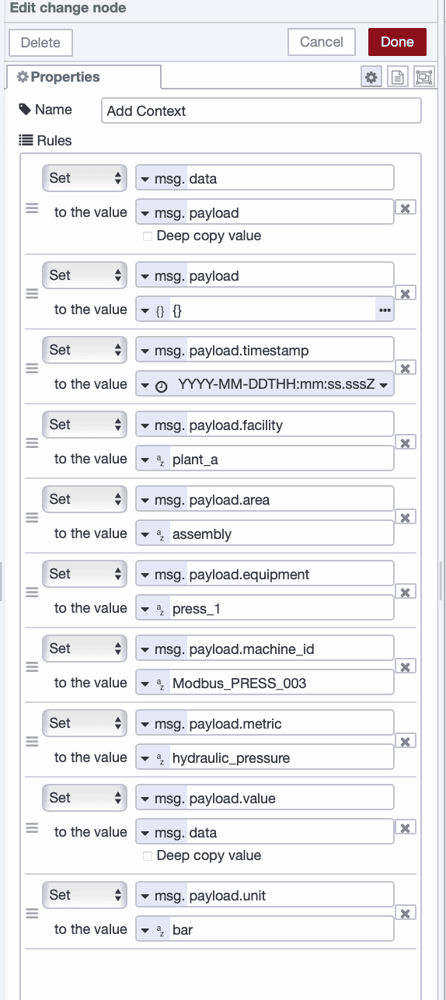
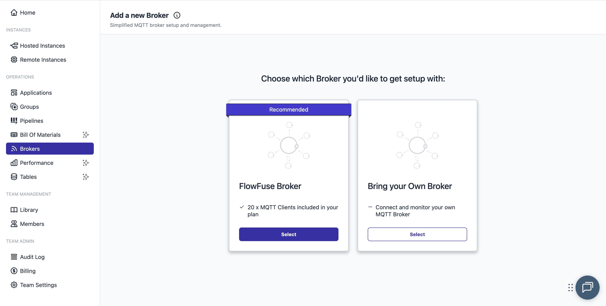
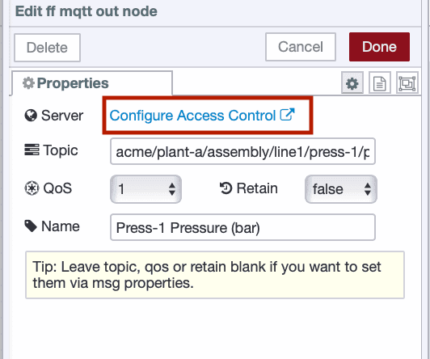
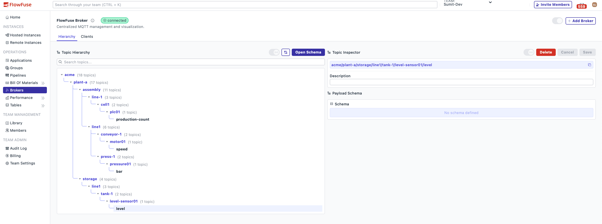

Getting PLC data into systems where it can be monitored, analyzed, and acted upon is essential for modern manufacturing. MQTT has become the standard for moving this data. It's lightweight, handles unreliable networks well, and excels at real-time streaming. Once your PLC data is published to MQTT, it creates a common pipeline that IT systems understand—flowing easily to cloud platforms, analytics tools, dashboards, and eliminating protocol translation headaches.

<!--more-->

The protocol itself is simple. But implementation in a real factory, with actual PLCs and production networks, is where things fall apart. Costs pile up, timelines drag on, and you end up needing expertise that's hard to find.

This guide cuts through that complexity. You'll learn how to connect PLCs using MQTT without the typical headaches. We'll walk through extracting data from any PLC protocol, transforming it properly, and publishing it reliably—with working examples you can adapt to your own setup.

## Why PLC-to-Cloud Gets So Complicated

Before diving into the solution, it's worth understanding why this is so difficult.

First, there's the proprietary protocols. Factory floors have PLCs from different manufacturers, each speaking their own language: Modbus, OPC-UA, Ethernet/IP, Profinet, FINS, etc. Getting data out means dealing with all of them at once, maintaining multiple drivers and troubleshooting different failure modes.

Then there's the networking challenge. Factory networks weren't built for internet connectivity. Isolated subnets, strict firewalls, and security-conscious IT departments mean getting approval for gateways (whether edge devices or software platforms) involves security reviews and architecture decisions that can drag on for months.

The costs add up quickly. Cloud platforms charge per message, and streaming data from dozens of machines easily reaches thousands per month, before gateway hardware and licenses.

And there's the expertise gap. Plant engineers know PLCs but not cloud APIs. IT teams know infrastructure but not industrial protocols. You end up needing expensive consultants, turning what should be straightforward into a six-figure project.

The solution lies in low-code integration platforms that consolidate protocol handling, edge computing, and cloud connectivity into a single system. This guide demonstrates one approach using FlowFuse, a platform built on Node-RED that addresses each challenge outlined above.

## Prerequisites

Before you start, make sure you have the following:

- A properly configured and fully operational PLCs, located on the same network as the edge device that will be reading its data.
- A running FlowFuse instance on your edge device. If you do not have an account, [sign up for a free trial](https://flowfuse.com/blog/2025/09/installing-node-red/) and set up your instance following the instructions in this article.

# Getting Started

Now, let's get started. First, watch this demo, where I have built a FlowFuse flow that collects data from four sources: Siemens S7 and Allen-Bradley PLCs, an OPC UA server, and a Modbus simulator.

<lite-youtube videoid="vptAoDR78Cc" params="rel=0" style="margin-top: 20px; margin-bottom: 20px; width: 100%; height: 480px;" title="YouTube video player"></lite-youtube>

This flow standardizes data from each protocol into a consistent JSON format, enriches it with contextual metadata, and publishes everything to the FlowFuse MQTT Broker — all within a single instance. The following guide explains how to replicate this setup for any PLC on your factory floor.

## Step 1: Extract Data from Your PLC

As mentioned earlier, extracting data is the first and most complex step. Get this wrong, and the complexity and costs can spiral out of control. FlowFuse simplifies this process. Its pre-built connectors handle Modbus, OPC UA, EtherNet/IP, and other protocols right out of the box—no custom coding, expensive proprietary gateways, or per-tag licensing fees required. You can configure your connections visually and have data flowing within minutes.

This is not just theory—Fortune 500 manufacturers are already running production systems on FlowFuse. Their consistent feedback? Massive cost savings compared to legacy systems, especially when deployed across multiple facilities. The enterprise features of FlowFuse handle the scale and security requirements large operations demand.

The Node-RED ecosystem that powers FlowFuse offers comprehensive protocol support. You'll find nodes available for every major PLC manufacturer, including:

- `node-red-contrib-modbus` – Modbus RTU/TCP PLCs and devices
- `node-red-contrib-s7` – Siemens S7-300/400/1200/1500
- `node-red-contrib-opcua` – OPC UA servers
- `node-red-contrib-cip-ethernet-ip` – Allen-Bradley PLCs
- `node-red-contrib-mcprotocol` – Mitsubishi PLCs
- `node-red-contrib-omron-fins` – Omron PLCs
- and many more

Adding a protocol node to your FlowFuse instance takes just a few clicks. Open the palette manager from the hamburger menu, select **Manage palette**, go to the **Install** tab, and search for the node you need.

## Convincing the IT Team

When talking to people in the IIoT community, one recurring challenge always comes up—**convincing the IT team**.

Traditional industrial gateways require inbound connections from the cloud. This means opening specific ports in your firewall, creating security exceptions, and giving external systems a pathway into your production network. IT security teams push back on this, and rightly so. Inbound connections expand your attack surface and violate the principle of defense in depth.

FlowFuse solves this with an **edge-first architecture**. The Device Agent installs directly on hardware inside your factory network—a Raspberry Pi, an industrial PC, or even directly on supported PLCs. Once running, the agent initiates **outbound** connections to the FlowFuse platform using standard web protocols (HTTPS and WebSocket over port 443). All communication flows through this outbound connection. The platform never initiates connections back to your network.

From a security standpoint, this changes everything. Your firewall configuration does not change.  
No new inbound rules. No DMZ setup. No VPN tunnels to maintain.  

The device agent behaves like any other business application making secure outbound HTTPS requests—something your network already allows.  

For networks with proxy servers, the agent supports standard proxy configurations through environment variables. For air-gapped networks, you can pre-cache Node-RED modules and deploy without internet connectivity after the initial setup.

## Step 2: Transform and Structure Your Data

Now let's move to the next step. Raw PLC data needs reshaping before cloud transmission. Register values, bit arrays, floating points, and timestamps arrive in different formats. FlowFuse offers several transformation methods suitable for different skill levels.

**Visual Transformation with Change Nodes and JSONata**

Change nodes handle simple transformations without coding. They allow you to map fields, modify values, convert units, and add metadata using dropdowns and form fields. JSONata allows more advanced data manipulation directly within the Change node.

Plant engineers can work directly with these visual tools—no programming required.

For example, suppose you are receiving a pressure sensor value as `msg.payload` but it lacks context.

You can use a **Change** node to:

* Add contextual information such as the machine ID, facility, or sensor location, unit

{data-zoomable}
*Change node used to convert temperature and add machine context*

**Function Nodes for Custom Logic**

Function nodes provide full JavaScript access for complex requirements. Write custom logic, install npm packages, and access the complete JavaScript standard library when Change nodes and JSONata reach their limits.

*Tip: Use the [FlowFuse Expert](/blog/2025/07/flowfuse-ai-assistant-better-node-red-manufacturing/) to generate function nodes. Describe the transformation you need in plain English, and it will create the code for you. For best results, provide sample input data to ensure the output matches your requirements.*

**Pre-built Community Nodes**

Before building custom solutions, check the palette manager. The Node-RED ecosystem includes thousands of nodes for data aggregation, statistical analysis, time-series buffering, and unit conversions. Many common transformation tasks already have ready-made solutions.

For example, a popular node I'm using in my demo for parsing and transforming data is `node-red-contrib-buffer-parser`. This node is especially useful when working with Modbus or PLC outputs, as it converts raw data into structured formats that can be easily processed further.

## Step 3: Set Up MQTT with FlowFuse

Most MQTT implementations require setting up a separate broker either paying for a managed service or hosting your own. FlowFuse includes a managed MQTT broker built directly into the platform, eliminating this extra step.

Traditional PLC-to-cloud setups typically involve several moving parts: edge gateways running protocol drivers, a separate MQTT broker (cloud-hosted or self-managed), and your destination cloud services. Each layer adds configuration work, licensing costs, and potential failure points. When data stops flowing, you end up troubleshooting across multiple systems to locate the issue.

FlowFuse consolidates those layers into a single integrated platform. It provides enterprise-grade features for management, scaling, deployment, and security—all handled by the FlowFuse infrastructure. You retain full control over configuration settings through a clean, intuitive interface, without needing to maintain multiple external systems.

To use the FlowFuse MQTT broker, you'll need a FlowFuse Pro or higher-tier account. Once on the Pro plan, you can enable the managed MQTT service by navigating to the Broker section from the left sidebar and selecting FlowFuse Broker.

{data-zoomable}
_Enabling FlowFuse MQTT Broker_

**Configure Publishing**

1. Drag a **FlowFuse MQTT Out** node onto your canvas.
2. Open the node configuration. It will automatically pick up its configuration.
3. Set the topic following ISA-95 hierarchy:

```
company/site/area/line/cell/device/measurement
```

For Example:

```
acme/plant-a/assembly/line1/press-1/pressure01/bar
```

**Why ISA-95 for MQTT Topics**

The ISA-95 Equipment Hierarchy Model is an international standard that defines how to organize manufacturing operations into logical layers. When you structure MQTT topics using this model, you're building toward a Unified Namespace (UNS)—a single, consistent way to organize all operational data across your entire organization.

The goal of UNS is to eliminate data silos. Instead of each system maintaining its own proprietary structure, everything publishes to one shared namespace using a common hierarchy. Applications subscribe to exactly the data they need without knowing where it physically comes from or how it was collected.

ISA-95 makes this possible because it maps to how factories actually operate. `company/site/area/line/cell` matches your organizational structure. When you expand to new facilities or add equipment, the hierarchy extends naturally. Analytics tools can compare performance across sites. MES systems subscribe to production line data. Dashboards pull from specific cells. Everything uses the same addressing scheme.

This enables powerful wildcard subscriptions:
- `acme/#` - all company data
- `acme/chicago/#` - single site  
- `+/+/assembly/#` - assembly operations everywhere
- `acme/chicago/assembly/line2/#` - one production line

*Note: Use lowercase with hyphens for multi-word names.*

4. Set **QoS** to **1**.
5. Click **Deploy**.

After deploying the flow, the MQTT client for your device will be automatically created. To configure access:

6. Double-click the MQTT Out node.
7. Click **Configure Access Control**. You will be redirected to the platform's broker client management section, filtered to show the client created for this instance.

{data-zoomable}
_Configure MQTT Client Access Control_

8. Click the client **edit**, select **Publish**, and then click **Confirm**.

{data-zoomable}
_Configure MQTT Client Access Control_

That's it. You now have PLC data flowing to MQTT with proper access controls configured and a topic structure that scales with your organization. To view the topic hierarchy and the schema for your topics, go to the FlowFuse Broker section. Here, you'll see all the topics within your MQTT broker. By clicking **Open Schema**, you can view the auto-generated schema document created by FlowFuse.

{data-zoomable}
_FlowFuse Topic Hierarchy View_

{data-zoomable}
_Topic schema auto-generated by FlowFuse_

## Bridging the Expertise Gap and Cutting Costs

Now let's talk about the remaining problems: the expertise gap and cost. FlowFuse solves both by changing how the work gets done.

Plant engineers configure PLC connections, transform data, contextualize it, and send it to MQTT through drag-and-drop interfaces without writing code—that's what you saw in the steps above. IT teams manage security and access controls through standard web tools. Neither needs expertise in the other's domain.

The FlowFuse Expert fills remaining gaps—describe what you need in plain English, and it generates function nodes, database queries, or dashboard components. Click "Explain" on any flow to get instant documentation.

This eliminates the consultant dependency that inflates project costs. Your team handles implementation and maintenance without external help at $150-$250 per hour, saving $12,000 to $30,000 on setup alone. The managed MQTT broker includes unlimited messaging with no per-message fees. Protocol drivers are free and open-source with no per-tag licensing. Deploy on existing industrial hardware instead of buying $10,000 proprietary gateways.

Manufacturers typically see substantial cost reduction in the first year, with improving economics as you scale since hardware and licensing costs stay eliminated. Most engineers ship production flows in their first session.

## Get Started

Connect your first PLC today. [Sign up for FlowFuse](https://app.flowfuse.com/), install the Device Agent on your edge hardware, and have data flowing to MQTT in under an hour. The platform handles the complexity—you focus on turning factory data into insights.
