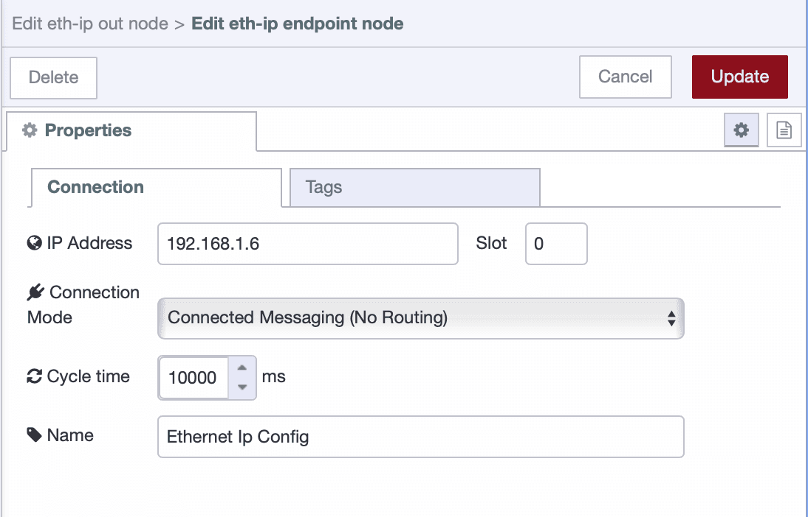
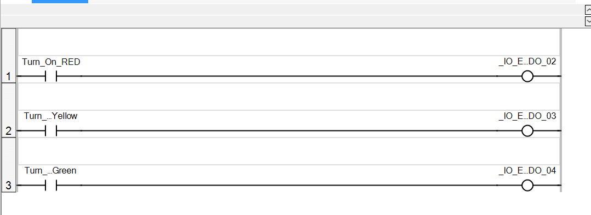
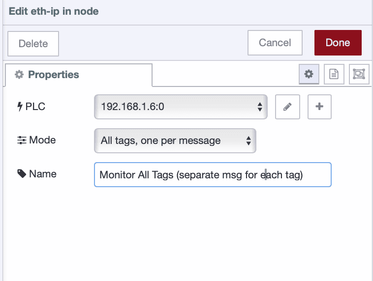
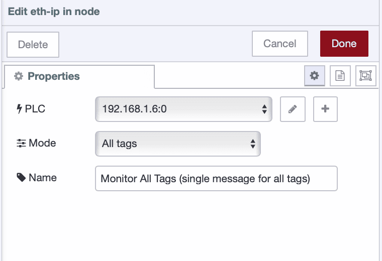

EtherNet/IP is one of the most widely used industrial communication protocols for connecting PLCs, sensors, and controllers across manufacturing environments. If you're working with Allen-Bradley PLCs—whether it's ControlLogix, CompactLogix, or MicroLogix—you're using some of the most trusted automation hardware in the industry.

<!--more-->

This guide will show you how to integrate Allen-Bradley PLCs with FlowFuse using EtherNet/IP. While the focus is on Allen-Bradley, the same Node-RED nodes and techniques also work with other EtherNet/IP-compatible PLCs, such as Omron and Automation Direct. You will learn both connected and unconnected messaging modes, so you can choose the approach that fits your setup. By the end of this guide, your PLCs will be communicating with FlowFuse (Node-RED with enterprise capabilities), enabling you to build powerful industrial automation workflows.

## Prerequisites

Before integrating your Allen-Bradley PLC with FlowFuse, ensure you have the following:

**PLC Configuration:**
- Your Allen-Bradley PLC (ControlLogix, CompactLogix, or MicroLogix) should be properly configured and operational.
- Ensure that the appropriate ladder logic program is written according to your requirements and successfully downloaded to the PLC.
- Verify that the controller tags or data structures you want to access are properly defined.
- Note the PLC's IP address and slot number (typically slot 0 for the processor).

**Node-RED:**
- Install Node-RED on the device that will communicate with the Allen-Bradley PLC. You cannot install Node-RED directly on the PLC, as PLCs are controllers, not computers. You can use devices like the Raspberry Pi, Revolution Pi, or industrial PCs to connect and transfer data across systems.
- Use the [FlowFuse Device Agent](https://flowfuse.com/platform/device-agent/) to install Node-RED on your edge device.

> **Why FlowFuse Device Agent?** FlowFuse provides Node-RED with enterprise capabilities like remote management, team collaboration, device management, and DevOps pipelines—essential features for scaling industrial automation across your organization. These capabilities help streamline operations and ensure reliability in complex manufacturing environments. [Sign up for free](https://app.flowfuse.com/) to get started.

**Network Setup:**
- Verify that the device running Node-RED is on the same network as the PLC and can successfully ping the PLC's IP address.
- Ensure the PLC is properly connected to the network via Ethernet with a static IP address configured.
- Ensure that firewalls do not block EtherNet/IP communication (typically port 44818 for both TCP and UDP).

## Understanding EtherNet/IP Communication Modes

EtherNet/IP is an industrial network protocol widely used to communicate with Allen-Bradley and other PLCs over Ethernet. It allows devices to exchange data efficiently and reliably, making it a common choice for industrial automation systems.

EtherNet/IP supports two primary communication modes: **connected** and **unconnected** messaging. Your choice depends on how frequently you need to communicate with the PLC, the number of available connection resources, and—most importantly—what your PLC actually supports. Not all PLCs support both modes. For example, Allen-Bradley Micro800 series PLCs only support connected messaging, while ControlLogix and CompactLogix typically support both.

### Connected Messaging

Connected messaging establishes a persistent session between Node-RED and the PLC using the Forward Open protocol. Once connected, data flows continuously with minimal overhead, making it ideal for real-time monitoring and high-frequency updates. The advantage is speed—after the initial handshake, communication is fast and efficient. The tradeoff is that each session consumes one of the PLC's limited connection slots, typically ranging from 8 to 32 depending on the model.

Connected messaging itself can operate in two ways:

**Without Routing (Direct Connection):**
Used for PLCs that connect directly via Ethernet without backplane routing, such as the Allen-Bradley Micro800/850/870 series. Only the IP address is needed—no slot number or routing path is required.

**With Routing:**
Used for chassis-based PLCs like ControlLogix and CompactLogix, where the processor sits in a backplane slot. In this case, the slot number must be specified, as it automatically creates a routing path through the backplane to reach the processor.

### Unconnected Messaging

Unconnected messaging sends individual requests without maintaining a persistent connection. Each transaction is standalone—request, response, done.

This approach doesn't consume connection slots, making it ideal when resources are limited or when multiple systems need occasional PLC access. The downside is higher overhead per message, resulting in slower performance compared to connected mode.

In practice, use connected mode for frequent polling and unconnected mode for occasional reads or writes—but always check your PLC's documentation to confirm which modes are supported.

## Installing the EtherNet/IP Node

To communicate with Allen-Bradley PLCs from FlowFuse, use the popular node-red-contrib-cip-ethernet-ip node, which supports both connected and unconnected messaging modes.

1. Open your FlowFuse Instance Node-RED editor in a web browser.

2. Click the main menu (three horizontal lines) in the top-right corner.

3. Select "Manage Palette" from the menu.

4. Switch to the "Install" tab and search for `node-red-contrib-cip-ethernet-ip`.

5. Click "Install" next to the node name.

6. Wait for the installation to complete.

Once installed, you'll find the EtherNet/IP nodes in your palette under the "plc" category. The main nodes are `ethernet-ip in` for reading data and `ethernet-ip out` for writing data to the PLC.

## Configuring the EtherNet/IP Node

Now that you have installed the EtherNet/IP node, it is time to configure the connection to your Allen-Bradley PLC.

1. Drag any EtherNet/IP node onto the canvas.

2. Double-click the node to open its configuration panel.

3. Click the "+" icon next to the **"PLC"** dropdown to add a new PLC configuration.

4. Enter the basic connection details:

   * Give your connection a descriptive name, such as **"Line 1 PLC"**, for easy identification.
   * Enter your PLC’s **IP address**.
   * Specify the **slot number** where your processor is located.

5. Configure the communication parameters:

   * **Cycle time** controls how often the node communicates with the PLC (for example, 500 ms means it updates twice per second).

6. Select the communication mode:

   * **Standard (Unconnected)** — This is the default option supported by most PLCs.
   * **Connected (With Routing)** — Use this option if you want to enable connected messaging with routing.

{data-zoomable}
_EtherNet/IP Node Configuration_

This node does not currently support connected messaging (without routing). I have developed node — `@sumit_shinde_84/node-red-contrib-cip-ethernet-ip-enhanced` — which supports connected messaging (without routing) but is still under development.

If you need connected messaging without routing, you can use that node. To enable connected messaging without routing, select Connected (no routing) from the communication mode dropdown in the configuration dialog.

### Adding Tags to Read or Write

After configuring the endpoint, you need to specify which tags you want to read from or write to the PLC.

1. In the same configuration window, switch to the "Tags" tab.

2. Click the "+Add" button in the top-right corner to add a new tag.

3. Enter the tag details:
   - **Name**: Enter the exact tag name as it appears in your PLC program (e.g., "Motor1Speed" or "Program:MainProgram.Motor1Speed")
   - **Type**: Select the data type from the dropdown (e.g., BOOL, INT, DINT, REAL, etc.)

4. Repeat this process for each tag you want to monitor or control. You can add multiple tags that will all use the same PLC connection you configured earlier.

{data-zoomable}
_Adding tags to read and write_

If your tag belongs to a different scope, click the “+ Add” button at the top to create a new scope. Then, within that scope, add the tags in the same manner.

5. Once you've added all your tags, click "Add" to save the configuration, then "Done".

6. Finally, deploy the flow by clicking the "Deploy" button in the top-right corner.

**Important:** Tag names must match exactly as they appear in your PLC program—they are case-sensitive. Make sure to select the correct data type for each tag to ensure proper communication.

## Getting Started

Before we start, I'd like to show you what I've prepared—a flow where I'm sending commands to the PLC to control the stack light. To interact with it, I've built a nice dashboard using [FlowFuse Dashboard](https://dashboard.flowfuse.com/). Here's a quick demonstration:

<lite-youtube videoid="6X9HXJLKPyo" params="rel=0" style="margin-top: 20px; margin-bottom: 20px; width: 100%; height: 480px;" title="YouTube video player"></lite-youtube>

That’s the program I have downloaded to the PLC

{data-zoomable}
_Program downloaded to the PLC_

Now let’s learn how to build a flow that can both read and write data to your PLC.

### Writing Data to Your PLC

Writing to a PLC is where things get exciting—this is where you move from monitoring to actually controlling your equipment. Maybe you want to start a motor, adjust a setpoint, or trigger a sequence. Whatever your goal, the process is straightforward.

1. Drag an **`ethernet-ip out`** node onto the canvas.

2. Double-click the node to open its configuration.

3. Select the PLC configuration you created earlier from the dropdown.

4. Select the scope under which you added the tag, choose the tag that you want to write to.

{data-zoomable}
_Configuring the EtherNet/IP out node to write data to a PLC tag_

5. Click "Done".

6. Connect an **`inject`** node or any other input node to send data.

7. Deploy the flow and click inject button to test it.

The node expects the incoming message payload to contain the value you want to write to the tag. Ensure that the value type matches the data type you configured when adding the tag and what the PLC expects.

### Reading Single Tag from Your PLC

Reading data from your PLC is the foundation of any monitoring or control system. Whether you're tracking production counts, monitoring temperatures, or checking machine status, you'll start here.

Here's how to set it up:

1. Drag an **`ethernet-ip in`** node onto the canvas.

2. Double-click the node to open its configuration.

3. Select the PLC configuration you created earlier from the dropdown.

4. Select the scope under which you added the tag, select the mode to "Single Tag" and choose the tag that you want to read.

{data-zoomable}
_Configuring the EtherNet/IP in node to read a single tag from the PLC_

5. Click "Done".

6. Connect a **`debug`** node to view the data.

7. Deploy the flow.

The node will automatically read data based on your configured cycle time and output it.

*Note: Reading single tags individually isn't recommended for production use as it creates unnecessary network overhead. Consider using "All tags" mode or structuring your PLC with array data types to read multiple values efficiently in one request.*

### Reading Multiple Tags from Your PLC

Sometimes you need the full picture—not just one data point, but everything that matters for your process. Reading multiple tags at once gives you a complete snapshot of your system in a single message.

Let me show you how:

1. Drag an **`ethernet-ip in`** node onto the canvas.

2. Double-click the node to open its configuration.

3. Select the PLC configuration you created earlier from the dropdown.

4. In the **Mode** field, select **"All tags"** to read all configured tags together in a single message, or select **"All tags (one per msg)"** if you want each tag value sent as a separate message.

{data-zoomable}
_Reading all tags with each tag sent as a separate message_

{data-zoomable}
_Reading all tags together in a single message object_

5. Click "Done".

6. Connect a **`debug`** node to view the data.

7. Deploy the flow.

The node will automatically read all configured tags based on your cycle time, giving you full visibility into your PLC data.

## Next Steps

Now that you've learned how to read and write data with your Allen-Bradley PLC, you can build interactive dashboards to monitor and control your industrial processes. FlowFuse Dashboard makes it easy to create professional interfaces with buttons, gauges, charts, and controls—all without writing complex code.

Check out our [Getting Started with Dashboard guide](/blog/2024/03/dashboard-getting-started/) to learn how to build your first dashboard.

### Beyond Allen-Bradley

FlowFuse isn't limited to EtherNet/IP. Connect Siemens PLCs via S7, use OPC UA for vendor-neutral communication, integrate Modbus devices, or connect IoT sensors with MQTT. Mix protocols as needed—your factory floor probably isn't single-vendor anyway.

[Book a demo](/book-demo/) to see how FlowFuse connects your entire operation.
