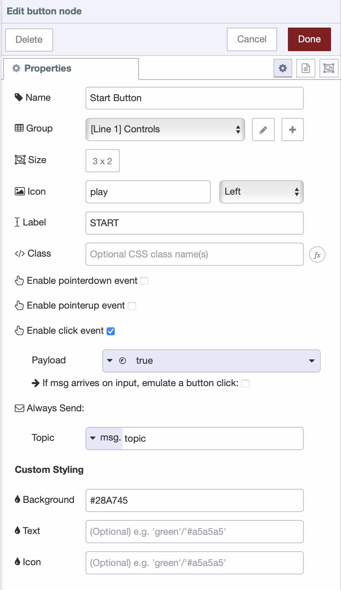
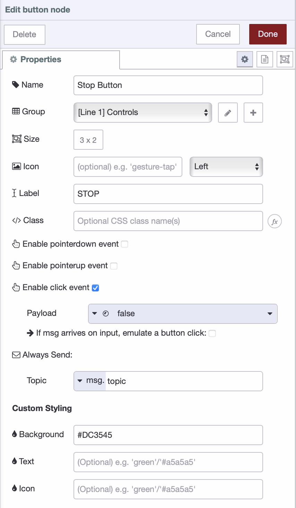
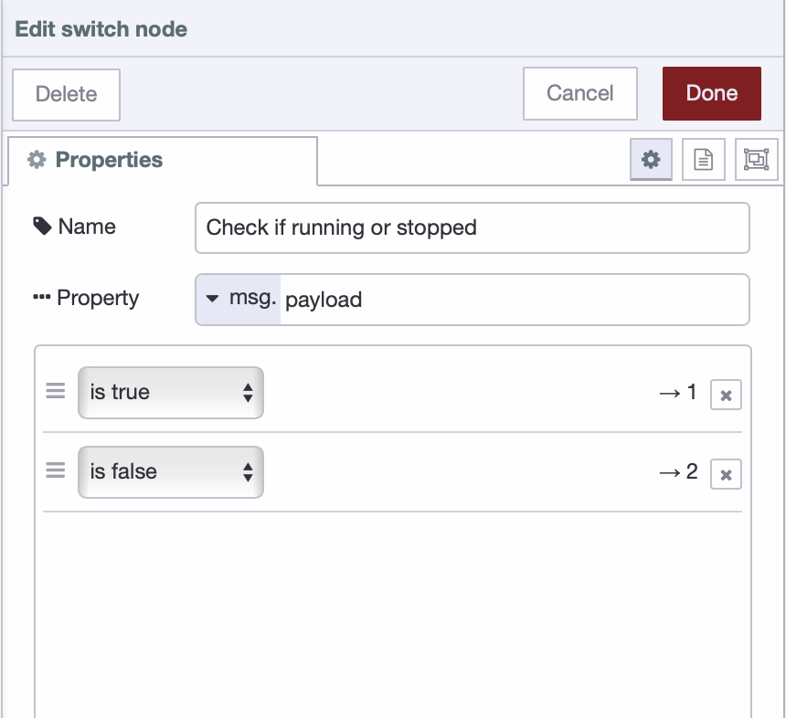
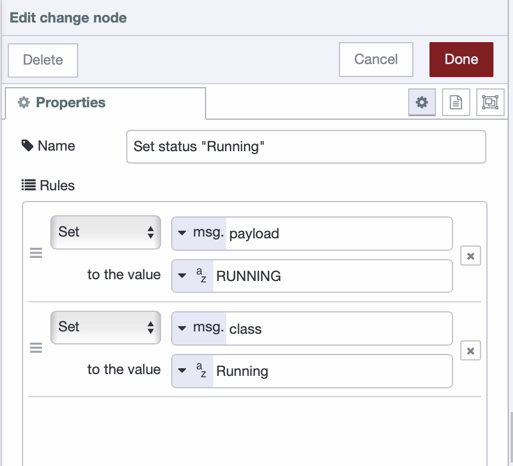
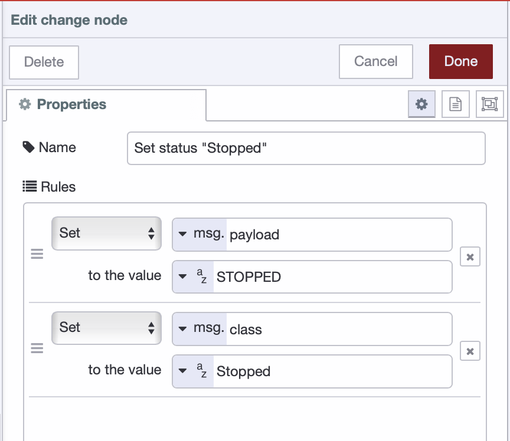
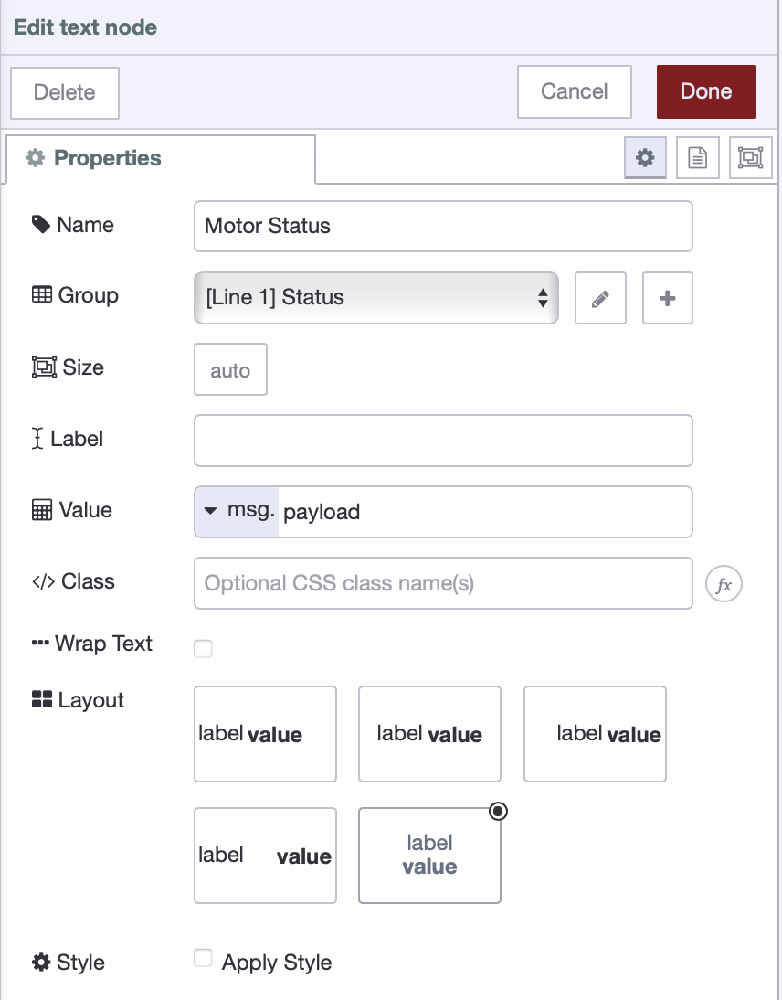
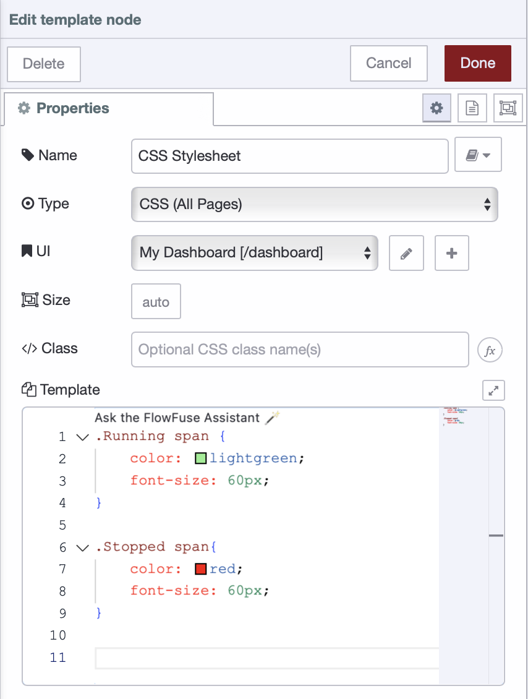
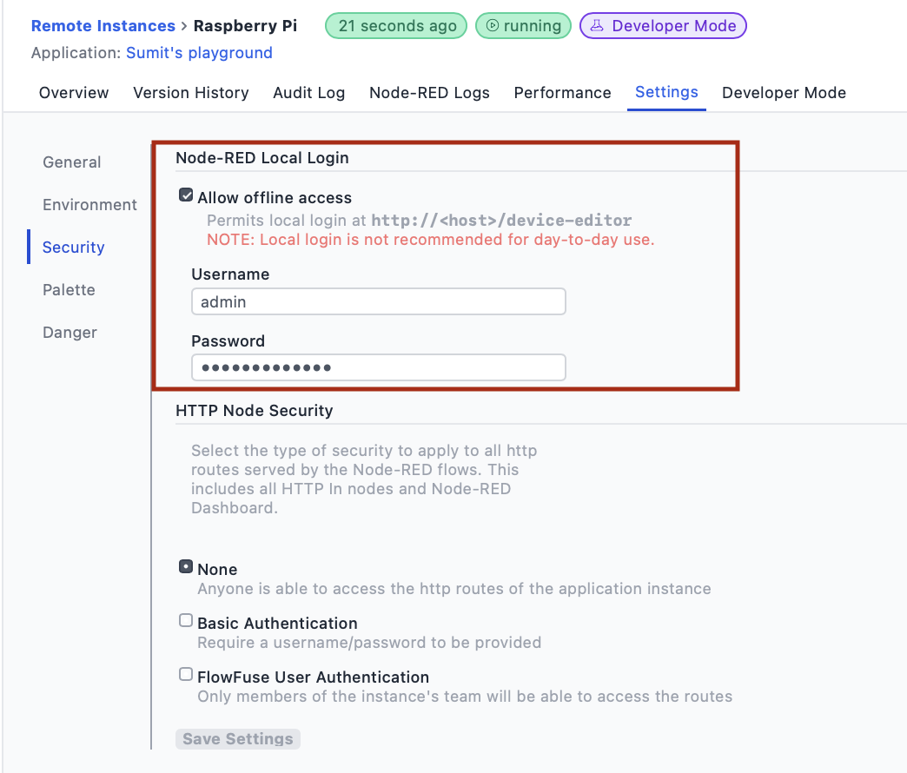
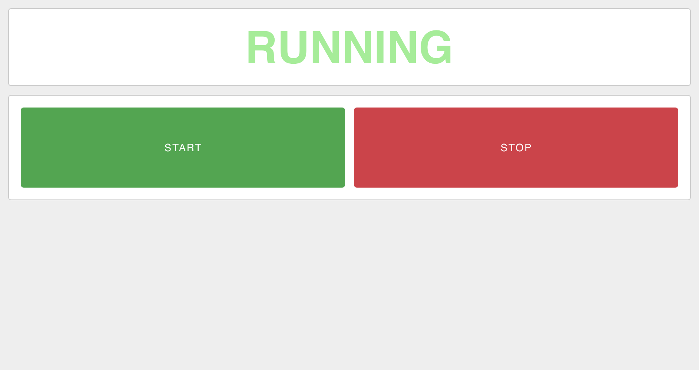

Most factory HMIs are still stuck in one place. Dedicated panels mounted next to equipment, or SCADA workstations in the control room. Need to check something? You're walking over there.

<!--more-->

Web-based HMIs change that. Build your interface once in FlowFuse, and it runs anywhere—desktop, tablet, phone. Your operators can monitor and control equipment from wherever they need to be.

This tutorial walks you through building a simple motor control interface: two buttons and a status display. You will learn how to connect to PLCs, build HMI dashboards, and enable remote access. From there, you can scale up to production lines with multiple sensors and actuators, live charts, gauges, sliders, and interactive controls.

Here's what you'll build:

<lite-youtube videoid="NQZ_u25sy1Q" params="rel=0" style="margin-top: 20px; margin-bottom: 20px; width: 100%; height: 480px;" title="YouTube video player"></lite-youtube>

## Prerequisites

Before beginning, ensure you have:

- **Edge device** - A computer, Raspberry Pi, or industrial PC that connects to your PLC and runs FlowFuse
- **PLC on the same network** - Your PLC must be networked with your edge device
- **Equipment to control** (optional but recommended) - Having a motor or other equipment connected to your PLC helps you follow along and see real results as you build the HMI

## Understanding the Setup

Your PLC already controls your equipment. It reads sensors, executes logic, and switches outputs. That doesn't change.

FlowFuse sits between operators and the PLC. It runs on an edge device connected to the same network as your PLC. FlowFuse communicates with the PLC using Modbus, OPC UA, EtherNet/IP, S7, or whatever protocol your PLC speaks.

Inside FlowFuse, nodes handle the PLC communication and data transformation while dashboard nodes let you build the HMI. These nodes create buttons, gauges, charts, and status displays. FlowFuse serves this interface as a webpage that any browser can access.

When an operator clicks a button, FlowFuse writes the command to the PLC. When the PLC updates its output, FlowFuse reads it and pushes the new value to the dashboard. The browser updates automatically.

## HMI Design Principles Worth Knowing

Before diving into the build, it's helpful to understand what makes industrial HMIs effective. Our tutorial keeps things simple, but these principles are worth knowing as you get more comfortable with FlowFuse and expand your system.

Good HMIs let operators quickly assess what's happening at a glance. Status should be immediately obvious: what is running, what is stopped, what needs attention. Color coding helps with this: green for running, red for stopped, yellow for warnings. Following standards like [ISA-101](https://www.isa.org/standards-and-publications/isa-standards/isa-101-standards) ensures your color choices are consistent with what operators expect across different systems. We'll use this approach in our motor control example.

Your PLC handles real-time control—your HMI just reflects what's happening. Polling intervals between 500-1000ms work well for most applications. Faster polling doesn't improve control, it just increases network traffic. Status indicators should be large and clear, with critical information immediately visible and text readable from a reasonable distance.

If operators will use tablets, design for touch targets (minimum 44x44 pixels) and avoid interactions that depend on hovering. Test on actual devices your team will use. Most importantly, always show operators when the HMI is disconnected from the PLC. This is critical for safety—operators need to know immediately if their commands aren't reaching the equipment. Display connection status prominently, and consider disabling controls when disconnected.

## Step 1: Set Up FlowFuse

You need the FlowFuse agent running on an edge device that can reach your PLC over the network. 

Start by creating a [FlowFuse account](). Once logged in, install and register the FlowFuse agent on your edge device by following this guide: [Installing Node-RED on Your Edge Device](/blog/2025/09/installing-node-red/)

## Step 2: Connect to Your PLC

Your HMI needs to talk to your PLC to read equipment status and send control commands. FlowFuse handles this through Node-RED's protocol nodes, which support every major industrial controller. No proprietary gateways, no per-tag licensing, no vendor lock-in—just direct communication with your PLC.

Choose the node that matches your PLC:

- **[node-red-contrib-modbus](/node-red/protocol/modbus/)** – Modbus RTU/TCP PLCs and devices
- **[node-red-contrib-s7](/blog/2025/01/integrating-siemens-s7-plcs-with-node-red-guide/)** – Siemens S7-300/400/1200/1500
- **[node-red-contrib-opcua](/blog/2025/07/reading-and-writing-plc-data-using-opc-ua/)** – OPC UA servers (universal industrial standard)
- **[node-red-contrib-cip-ethernet-ip](/blog/2025/10/using-ethernet-ip-with-flowfuse/)** – Allen-Bradley/Rockwell PLCs
- **[node-red-contrib-mcprotocol](https://flows.nodered.org/node/node-red-contrib-mcprotocol)** – Mitsubishi PLCs
- **[node-red-contrib-omron-fins](https://flows.nodered.org/node/node-red-contrib-omron-fins)** – Omron PLCs
- **[node-red-contrib-bacnet](https://flows.nodered.org/node/node-red-contrib-bacnet)** – BACnet building automation devices

**Installing Protocol Nodes:**

1. Click the hamburger menu (top right) → **Manage palette**.
2. Go to the **Install** tab.
3. Search for your protocol node (e.g., `node-red-contrib-s7` for Siemens).
4. Click **Install**.

**Configuring Your Connection**

After installation, drag the protocol node onto your canvas. You’ll need two types of nodes: one for reading equipment status and one for sending commands.

Start with an input node for reading status (motor running, faults, sensor values). Use **S7 In** for Siemens, **Modbus Read** for Modbus devices, or **OPC UA Client** for OPC UA servers, etc. Open the node configuration and click the pencil icon next to the **Server/Connection** dropdown to create a new connection configuration. Here, enter the connection details for your PLC or server — such as IP address, port, credentials, and polling interval. The exact parameters vary by protocol; if you need help understanding what to configure, refer to the documentation links in the protocol node list above. Each link includes detailed setup guidance.

After saving the connection configuration, specify the **variable addresses that provide the status information** you want to read (tags/registers such as motor state, faults, and sensor values). If available, enable efficiency features like **“emit only on change”** or **“subscribe mode”** to minimize unnecessary updates.

For sending commands (start motor, stop motor, setpoints), drag the corresponding output node onto your canvas. When configuring it, select the **same Server/Connection** from the dropdown instead of creating a new one. This shared connection approach means the IP address, port, and credentials only need to be configured once and can be reused across all your PLC/server nodes. You then only need to specify the variable addresses that control your equipment, and connect those nodes to your dashboard buttons or automation logic.

**Important Note:** Some PLCs require configuration in their engineering software before allowing external access. For example, Siemens S7 requires **PUT/GET communication** enabled in TIA Portal, and Allen-Bradley controllers may need **explicit messaging** enabled in Studio 5000. Refer to your PLC’s documentation for any communication prerequisites.

**Test Your Connection:**

1. Add a **Debug** node and connect it to your input node.
2. Click **Deploy**.
3. Check for a green "connected" or "online" status indicator on your protocol node.
4. Open the debug panel to verify data is flowing from your PLC.

Once you see live values in the debug panel, your PLC connection is working and you're ready to build the operator interface.

## Step 3: Build Your HMI Dashboard

With your PLC connected, let's create the operator interface using FlowFuse Dashboard, a set of UI nodes that build web-based interfaces without writing HTML or JavaScript.

### Install Dashboard 2.0

1. Click the hamburger menu and select **Manage palette**.
2. Go to the **Install** tab.
3. Search for `@flowfuse/node-red-dashboard`.
4. Click **Install**.

### Create Your Motor Control Interface

**Add Control Buttons:**

1. Drag a **ui-button** widget onto your canvas.
2. Double-click to open its configuration.
3. Click the pencil icon next to "Group" to create a new group name, example, "Motor Controls" or another name that fits your equipment.
4. Click the pencil icon next to "Page" to create a new page like "Line 1", for example, "Line 1" or the area of your process this interface belongs to.
5. Configure the button:
   - **Label**: "Start"
   - **Payload**: `true` (boolean)
   - **Background**: `#28A745`

{data-zoomable}
_Start button node configuration_

6. Click Done.
7. Connect this node to your PLC write node.
8. Repeat to add a "Stop" button with payload `false` and `#DC3545` background.

{data-zoomable}
_Stop button node configuration_

### Add Status Display

The PLC continuously reports whether the motor is running or stopped as a boolean value. We'll convert these values into readable text with color-coded styling.

**Convert Boolean Values to Readable Status:**

1. Drag a **switch** node onto the canvas and connect it to your PLC read node.
2. Add two conditions: `is true` and `is false` to check `msg.payload`.

{data-zoomable}
_Switch node configuration for motor status_

3. Drag two **change** nodes onto the canvas:
   - Connect the first to the "true" output: set `msg.payload` to "RUNNING" and `msg.class` to "running"
   - Connect the second to the "false" output: set `msg.payload` to "STOPPED" and `msg.class` to "stopped"

{data-zoomable}
_Change node configuration for running status_

{data-zoomable}
_Change node configuration for stopped status_

**Create the Status Display:**

1. Drag a **ui-text** widget onto your canvas.
2. Double-click to configure:
   - **Group**: Select "Motor Controls" (or create a "Status" group).
   - **Label**: Leave empty or enter "Motor Status:"
   - **Value Format**: `msg.payload`.
3. Click Done.
4. Connect both change nodes to the ui-text widget.

{data-zoomable}
_Motor status text widget configuration_

**Add Status Styling:**

1. Drag a **ui-template** widget onto the canvas.
2. Configure:
   - **Type**: Select "CSS (All Pages)" or "CSS (Single Page)".
   - Add this CSS:

```css
.running {
    color: lightgreen !important;
    font-size: 60px !important;
    font-weight: bold;
}
.stopped {
    color: red !important;
    font-size: 60px !important;
    font-weight: bold;
}
```

{data-zoomable}
_CSS template for status display styling_

3. Click **Done** and deploy the flow

You've just built a basic motor control interface. FlowFuse Dashboard includes gauges, charts, sliders, and other widgets that work the same way—drag, configure, connect. See the [widget reference](https://dashboard.flowfuse.com/nodes/widgets.html) for the full list.

### Accessing Your Dashboard

**Local Network Access:**

The dashboard in a remote instance isn't accessible by default. To enable it:

1. Go to **Instance Settings** → **Security**.
2. Check **"Allow Offline Access"** and set a username and password.

{data-zoomable}
_Enabling offline access in instance security settings_

3. Click **save settings**, then restart the instance using the top-right **action** button dropdown
4. Navigate to `http://[device-IP]:1880/dashboard` in your browser.

{data-zoomable}
_Completed HMI dashboard running in browser_

> **Note:** While offline access is convenient for testing purposes, it should be avoided in production environments. Running the dashboard locally may bypass secure authentication, potentially exposing sensitive controls and data. For production deployments, we recommend using a FlowFuse-hosted instance, which provides proper security. Setup instructions are available below.

**Remote Access:**

While a local dashboard works for on-site monitoring, it’s not ideal for production. A FlowFuse hosted instance lets you securely monitor and control your equipment from anywhere. Your edge device remains behind your factory network, while the hosted instance subscribes to PLC data via MQTT and displays it on the dashboard.

The architecture is straightforward: your edge device publishes PLC data to MQTT topics, and a hosted FlowFuse instance subscribes to those topics to display the data. When an operator clicks a control button in the hosted dashboard, it publishes a command to MQTT, which your edge device receives and writes to the PLC.

**Enable MQTT in Your Team:**

Before you can use MQTT, you need to [enable the FlowFuse MQTT broker](/blog/2025/10/plc-to-mqtt-using-flowfuse/) for your team, a one-time setup in your FlowFuse team settings that also covers PLC to MQTT integration in depth.

**Configure Your Edge Device:**

On your remote instance (the one connected to your PLC), you'll publish status data and subscribe to commands:

1. Drag an **ff-mqtt-out** node onto the canvas.
2. Double-click to open configuration and click **"Configure access control"**.
3. FlowFuse automatically creates an MQTT client for your instance—enable both **Publish** and **Subscribe** permissions.
4. Set the topic to something descriptive like: `factory/line1/motor/status`
5. Connect this node to your PLC read node (the one that gets motor status).
6. Add an **ff-mqtt-in** node and set its topic to: `factory/line1/motor/command`
7. Connect this node to your PLC write node (the one that controls the motor).
8. Deploy your flow.

Your edge device now shares motor status via MQTT and listens for control commands.

**Build Your Remote Dashboard:**

Create a new [hosted instance](/docs/user/introduction/#creating-a-node-red-instance) in FlowFuse. This instance runs in the cloud and will host your operator dashboard:

1. Install `@flowfuse/node-red-dashboard` using Manage Palette.
2. Build your control interface following the same steps as before—add ui-button widgets for start/stop and ui-text widgets for status display.
3. Add an **ff-mqtt-in** node with topic `factory/line1/motor/status` and connect it to your status display widgets.
4. Add an **ff-mqtt-out** node with topic `factory/line1/motor/command` and connect it to your control buttons.
5. Configure access control for this hosted instance's MQTT client (enable Publish and Subscribe).
6. Deploy.

Your dashboard is now accessible at `https://[your-instance].flowfuse.cloud/dashboard` from any device with internet access. Commands flow from the hosted dashboard through MQTT to your edge device, then to your PLC. Status updates travel the reverse path.

## Next Steps

You now have a working HMI that controls real equipment from any browser. The same approach scales to more equipment—motors, conveyors, pumps, valves—just repeat the connection and dashboard steps.

As your system grows, organize controls across multiple dashboard pages for different production lines or work cells. Add chart widgets to visualize production rates, cycle times, and sensor trends. Configure notification nodes to alert your team via email or Telegram when faults occur.

And if you need to deploy the solution across many production lines, FlowFuse's DevOps features help you manage the scale. Build your HMI once, then deploy it across multiple edge devices and push updates centrally without visiting each location.

[Book a demo](/book-demo/) to see how FlowFuse can help your organization connect, collect, transform, and visualize industrial data with our low-code and AI-powered editor—without the hassle of infrastructure management, deployment complexities, or security concerns at scale.
