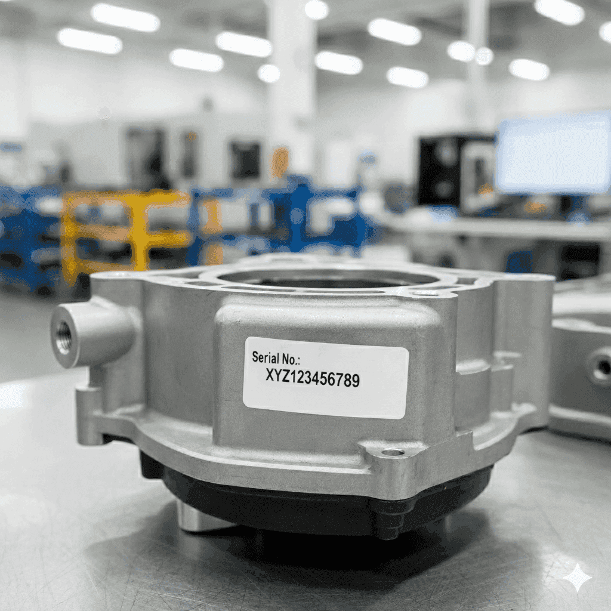
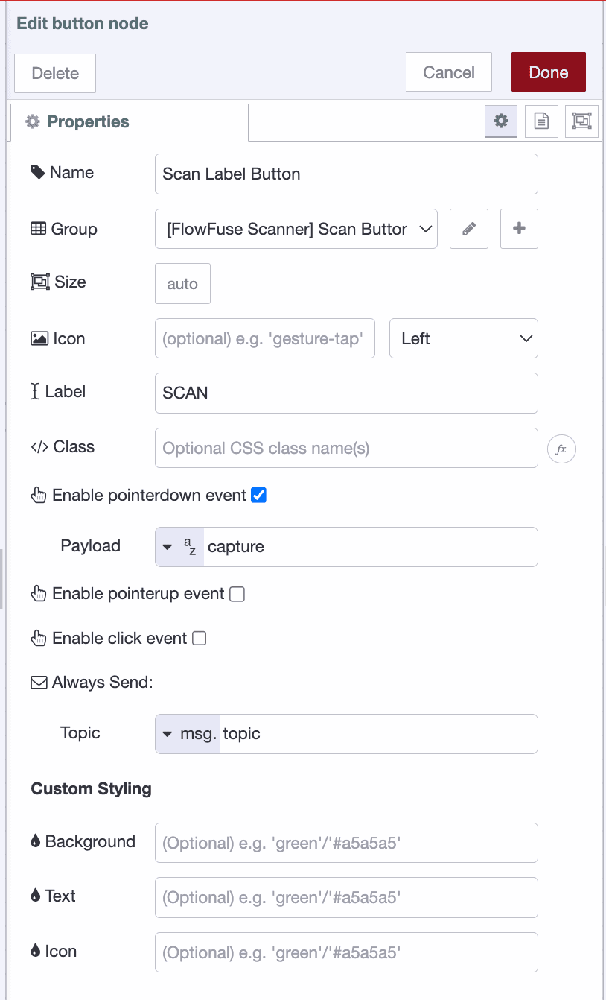

In production environments, labels are everywhere! Products have Serial Numbers and Lot Codes, Packages have Batch IDs and Dates. These are often critical to the processes for packaging, tracking, logging, inventory and so on.

<!--more-->

Many companies still do this manually. Someone types in each code as products move through the line. It's repetitive, time-consuming work - mistakes are inevitable.

That's where OCR comes in. Optical Character Recognition (OCR) uses cameras to automatically read and extract text from labels and product markings. Instead of manual data entry, a camera simply captures the image and the system pulls out the information you need. It's a straightforward solution that's already being deployed in modern manufacturing facilities worldwide.

{width="400" data-zoomable}
*Part with Serial No*

For example, take a look at the image above. When processed with OCR, it returns the following text:

```
Serial No: XYZ123456789
```

This tutorial shows you how you can build an OCR system using FlowFuse that can capture images from cameras, extract text from product labels, lot codes, and serial numbers, validate and parse the extracted data, store results in a database or trigger downstream workflows.

## Getting Started

Before we dive in, make sure you have a running FlowFuse instance.
If you do not have one yet, you can [sign up for the 14-day free trial](https://app.flowfuse.com/) and get a hosted instance running in under two minutes.

### Installing Required Nodes

To perform text extraction from images, you’ll need to install the `@sumit_shinde_84/node-red-contrib-simple-ocr` node in your FlowFuse instance.
This node uses the Tesseract OCR engine under the hood to recognize text from image files or image buffers.
To capture images and build a dashboard, you’ll also need the **FlowFuse Dashboard** and **Webcam** packages.

1. Open your **FlowFuse** editor.
2. From the main menu, select **Manage palette → Install**.
3. Search for and install the following packages one by one:

   * `@sumit_shinde_84/node-red-contrib-simple-ocr`
   * `@flowfuse/node-red-dashboard`
   * `@sumit_shinde_84/node-red-dashboard-2-ui-webcam`

Once installed, you’ll see the **simple-ocr** node under the **Function** category and the **Webcam** widget under the **dashboard 2.0** category in the left sidebar.

### Building the Scanner

Now, let’s build a scanner dashboard that you can open on a mobile device, allowing the phone to act as a scanner for capturing product labels and serial numbers.


_[Label Scanner Built with FlowFuse]_

To capture images directly from your browser, you can use the **FlowFuse Dashboard** along with the **Webcam widget**, let's install them first.

#### Configuring the Webcam Node

1. Drag the **Webcam** widget onto your canvas.
2. Double-click the node to open its configuration.
3. Create a new ui group for it to render the feed (for example, *OCR Scanner*).
5. Drag the **Button** widget onto the canvas and set its label to **Scan**. Select the appropriate **group**, check **Enable pointerdown event**, and set the **payload** to `"capture"`. 
6. Click **Done**. When the button is clicked, it will send the `"capture"` payload, which will trigger the **Webcam** widget to capture an image.

{data-zoomable}
_Scan Label Button Widget Configuration_

6. Deploy the flow

When deployed, this flow creates a dashboard interface with a live camera preview and a large Scan Label button. Each time you click Scan Label, the captured image is sent as a `msg.payload.image` containing a image buffer.

> *Tip: To correct a flipped or mirrored camera preview, open the three-dot menu (⋮) on the webcam widget and enable "Mirror Image".*

##### Handling High-Resolution Images

When capturing an image, if you encounter an error stating that the image size exceeds **Dashboard 2.0’s** `maxHttpBufferSize`, you’ll need to reduce the image resolution or quality — otherwise, the dashboard connection may reset.

To fix this:

1. Double-click the **Webcam** widget.
2. Adjust the **image width**, **height**, and **quality** parameters.
3. By default, these are set to **640×480** resolution and **0.8** quality.

You can also check the image size from the webcam output using `msg.payload.sizeBytes`.

#### Adding the OCR Node

Now, let’s add an OCR node to extract text from the captured images.

1. Drag a **Change** node onto the canvas and set `msg.payload` to `msg.payload.image`.
2. Drag a **Simple OCR** node onto the canvas.
3. Connect the output of the **Webcam** widget to the **Change** node, and then connect the **Change** node’s output to the **Simple OCR** node.
4. Add a **Debug** node and connect it to the **Simple OCR** node to view the results.
5. Click **Done**, then **Deploy**.

Next, open the dashboard by clicking the **Dashboard 2.0** button in the right sidebar. Then, click the **Scan Label** button — the first click will activate your camera (make sure to grant your browser permission to access it).

Position the label in front of the camera, focus on it, and click **Scan** again. The recognized text will appear in the **Debug** panel.
Now, you need to validate and trim the recognized text, and add a visual indicator to show a successful scan. Let’s set that up next.

#### Validating and Parsing the Extracted Text

The OCR node returns raw text that may contain extra whitespace, line breaks, or unwanted characters. Let's add validation and parsing logic:

1. Drag another **Function** node onto the canvas.
2. Connect it after the **simple-ocr** node.
3. Add the following code:

```javascript
// Extract and clean OCR text
let text = (msg.payload.text || msg.payload || "")
  .replace(/[\r\n]+/g, ' ')
  .replace(/[^\w\s:]/g, '')
  .replace(/\s+/g, ' ')
  .trim();

// Match part number
let match = text.match(/(?:Part\s*No|No)[:\s]+([0-9A-Z]{6,12})/i);
let part = match?.[1]?.trim() || null;

// Validate format: 6 digits + 2 letters + 2 digits
let valid = part ? /^\d{6}[A-Z]{2}\d{2}$/.test(part) : false;

// Build payload
msg.payload = {
  success: valid,
  partNumber: valid ? part : null,
  timestamp: new Date().toISOString(),
  notificationMsg: valid
    ? `Label successfully scanned: ${part}`
    : "Scan failed — Invalid or unreadable label."
};

return msg;
```

> Tip: You don’t need to know JavaScript to create a function for validating and extracting the label text you’re scanning — just tell the [FlowFuse Assistant](/blog/2025/07/flowfuse-ai-assistant-better-node-red-manufacturing/) what you want, and it will generate it for you.

4. Click **Done**.

This function cleans the text, validates that something was detected, and attempts to extract structured data like serial numbers or part numbers using regular expressions.

#### Adding Visual Feedback

Users need immediate feedback when a scan succeeds or fails. Let's add both visual indicators:

1. Drag a **Change** node onto the canvas and connect it to the validation Function node.
2. Configure the Change node to set `msg.payload` to `msg.payload.notificationMsg`.
3. Drag a **ui-notification** widget onto the canvas.
4. Double-click the ui-notification node to configure it:
   - Select or create a **UI Base** configuration
   - Set the **position** to **center**
   - Optionally, configure the **timeout** duration (e.g., 3000ms for 3 seconds)
5. Connect the Change node output to the ui-notification node input.
6. Click **Done** and **Deploy** the flow.

Now when you scan a label:
- If the scan is successful, you'll see a green notification with "Label successfully scanned: [part number]"
- If the scan fails, you'll see a warning notification with "Scan failed — Invalid or unreadable label"

Your OCR scanning system is now complete! You can test it by opening the dashboard on your mobile device, positioning a product label in front of the camera, and clicking the Scan button. The system will capture the image, extract the text, validate it, and provide immediate visual feedback on the scan result.


[{"id":"604f466d22e1157b","type":"group","z":"9cf82b68bb89e8ce","style":{"stroke":"#b2b3bd","stroke-opacity":"1","fill":"#f2f3fb","fill-opacity":"0.5","label":true,"label-position":"nw","color":"#32333b"},"nodes":["a21c3c47d1f1cf10","3a71e800415a3966","ce383856293fe7e8","8858da9d0167fa59","45093fdd9e8c7374","223bb060bd896be0","c4a91f5b52a9c469","020e11e740154489","6ad6bad695c34c7b","31d2eb3589e05d01"],"x":84,"y":279,"w":822,"h":242},{"id":"a21c3c47d1f1cf10","type":"simple-ocr","z":"9cf82b68bb89e8ce","g":"604f466d22e1157b","name":"","x":750,"y":320,"wires":[["c4a91f5b52a9c469"]]},{"id":"3a71e800415a3966","type":"ui-webcam","z":"9cf82b68bb89e8ce","g":"604f466d22e1157b","name":"","group":"5a89ac7171f51cc3","width":0,"height":0,"passthru":false,"qrDetection":false,"imageWidth":"150","imageHeight":"150","imageQuality":"","x":380,"y":320,"wires":[["31d2eb3589e05d01"]]},{"id":"ce383856293fe7e8","type":"ui-button","z":"9cf82b68bb89e8ce","g":"604f466d22e1157b","group":"5a89ac7171f51cc3","name":"Scan Label Button","label":"SCAN","order":2,"width":0,"height":0,"emulateClick":false,"tooltip":"","color":"","bgcolor":"","className":"","icon":"","iconPosition":"left","payload":"","payloadType":"str","topic":"topic","topicType":"msg","buttonColor":"","textColor":"","iconColor":"","enableClick":false,"enablePointerdown":true,"pointerdownPayload":"capture","pointerdownPayloadType":"str","enablePointerup":false,"pointerupPayload":"","pointerupPayloadType":"str","x":200,"y":320,"wires":[["3a71e800415a3966"]]},{"id":"8858da9d0167fa59","type":"function","z":"9cf82b68bb89e8ce","g":"604f466d22e1157b","name":"Extract and Validate Part Number","func":"// Extract and clean OCR text\nlet text = (msg.payload.text || msg.payload || \"\")\n  .replace(/[\\r\\n]+/g, ' ')\n  .replace(/[^\\w\\s:]/g, '')\n  .replace(/\\s+/g, ' ')\n  .trim();\n\n// Match part number\nlet match = text.match(/(?:Part\\s*No|No)[:\\s]+([0-9A-Z]{6,12})/i);\nlet part = match?.[1]?.trim() || null;\n\n// Validate format: 6 digits + 2 letters + 2 digits\nlet valid = part ? /^\\d{6}[A-Z]{2}\\d{2}$/.test(part) : false;\n\n// Build payload\nmsg.payload = {\n  success: valid,\n  partNumber: valid ? part : null,\n  timestamp: new Date().toISOString(),\n  notificationMsg: valid\n    ? `✅ Label successfully scanned: ${part}`\n    : \"⚠️ Scan failed — Invalid or unreadable label.\"\n};\n\nreturn msg;\n","outputs":1,"timeout":0,"noerr":0,"initialize":"","finalize":"","libs":[],"x":310,"y":420,"wires":[["223bb060bd896be0","6ad6bad695c34c7b"]]},{"id":"45093fdd9e8c7374","type":"ui-notification","z":"9cf82b68bb89e8ce","g":"604f466d22e1157b","ui":"afea04ce8735c0a6","position":"center center","colorDefault":true,"color":"#000000","displayTime":"3","showCountdown":true,"outputs":1,"allowDismiss":true,"dismissText":"Close","allowConfirm":false,"confirmText":"Confirm","raw":false,"className":"","name":"","x":780,"y":420,"wires":[[]]},{"id":"223bb060bd896be0","type":"change","z":"9cf82b68bb89e8ce","g":"604f466d22e1157b","name":"","rules":[{"t":"set","p":"payload","pt":"msg","to":"payload.notificationMsg","tot":"msg"}],"action":"","property":"","from":"","to":"","reg":false,"x":570,"y":420,"wires":[["45093fdd9e8c7374"]]},{"id":"c4a91f5b52a9c469","type":"link out","z":"9cf82b68bb89e8ce","g":"604f466d22e1157b","name":"link out 1","mode":"link","links":["020e11e740154489"],"x":865,"y":320,"wires":[]},{"id":"020e11e740154489","type":"link in","z":"9cf82b68bb89e8ce","g":"604f466d22e1157b","name":"link in 1","links":["c4a91f5b52a9c469"],"x":125,"y":420,"wires":[["8858da9d0167fa59"]]},{"id":"6ad6bad695c34c7b","type":"debug","z":"9cf82b68bb89e8ce","g":"604f466d22e1157b","name":"Result","active":true,"tosidebar":true,"console":false,"tostatus":false,"complete":"payload","targetType":"msg","statusVal":"","statusType":"auto","x":540,"y":480,"wires":[]},{"id":"31d2eb3589e05d01","type":"change","z":"9cf82b68bb89e8ce","g":"604f466d22e1157b","name":"","rules":[{"t":"set","p":"payload","pt":"msg","to":"payload.image","tot":"msg"}],"action":"","property":"","from":"","to":"","reg":false,"x":560,"y":320,"wires":[["a21c3c47d1f1cf10"]]},{"id":"5a89ac7171f51cc3","type":"ui-group","name":"Scanner","page":"f1eb99b1e714d411","width":6,"height":1,"order":1,"showTitle":true,"className":"","visible":"true","disabled":"false","groupType":"default"},{"id":"afea04ce8735c0a6","type":"ui-base","name":"UI Name","path":"/dashboard","includeClientData":true,"acceptsClientConfig":["ui-control","ui-notification"],"headerContent":"page","titleBarStyle":"default","showReconnectNotification":true,"notificationDisplayTime":5,"showDisconnectNotification":true,"allowInstall":true},{"id":"f1eb99b1e714d411","type":"ui-page","name":"Page Name","ui":"afea04ce8735c0a6","path":"/page1","icon":"home","layout":"grid","theme":"93822a7b43673c58","breakpoints":[{"name":"Default","px":"0","cols":"3"},{"name":"Tablet","px":"576","cols":"6"},{"name":"Small Desktop","px":"768","cols":"9"},{"name":"Desktop","px":"1024","cols":"12"}],"order":1,"className":"","visible":"true","disabled":"false"},{"id":"93822a7b43673c58","type":"ui-theme","name":"Default Theme","colors":{"surface":"#00a3d7","primary":"#0094ce","bgPage":"#eeeeee","groupBg":"#ffffff","groupOutline":"#cccccc"},"sizes":{"density":"default","pagePadding":"12px","groupGap":"12px","groupBorderRadius":"4px","widgetGap":"12px"}},{"id":"b5b8bfbe56c87605","type":"global-config","env":[],"modules":{"@sumit_shinde_84/node-red-contrib-simple-ocr":"0.1.1","@sumit_shinde_84/node-red-dashboard-2-ui-webcam":"1.1.2","@flowfuse/node-red-dashboard":"1.29.0"}}]


If you want to fully automate this process, you can set up a fixed camera positioned where products pass through on the production line. This approach eliminates manual scanning, but it will require proper camera mounting, lighting setup, and trigger mechanisms to capture images at the right moment as products move past the camera.

Furthermore, you can push scanned label data to a database. The easiest way to do this is using [FlowFuse Tables](/blog/2025/08/getting-started-with-flowfuse-tables/), which is a built-in database service managed by FlowFuse. You'll find the **query** node in the palette that not only simplifies setup by connecting to the FlowFuse Tables database without any setup, it also has access to the integrated FlowFuse Assistant, allowing you to [generate queries using natural language](/blog/2025/09/ai-assistant-flowfuse-tables/) — no SQL skills required!

## What's Next?

You've just built a working OCR system that turns any mobile device into a label scanner. It captures images, reads text, validates the data, and gives instant feedback—all without writing hundreds of lines of code.

This is just the starting point. Your system can grow with your needs: connect it to your inventory database, add support for different label formats, set up multiple scanning stations, or integrate it with your existing ERP system. The foundation is there.

Also, this OCR scanner is just one piece of what's possible with FlowFuse. Imagine connecting all your manufacturing systems—machine data, quality checks, inventory tracking, production metrics—into a unified industrial data platform where everything flows together seamlessly.

FlowFuse helps manufacturers like you break down data silos and build connected, intelligent operations. From shop floor to top floor, your data works together.

**See it in action.** [Book a demo](/book-demo/) and discover how FlowFuse can transform your entire facility—not just your label scanning.

Or start building today with our [14-day free trial](https://app.flowfuse.com/).
