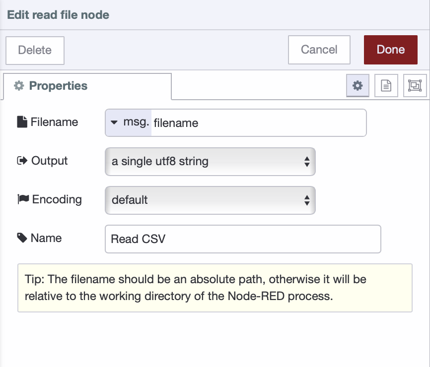
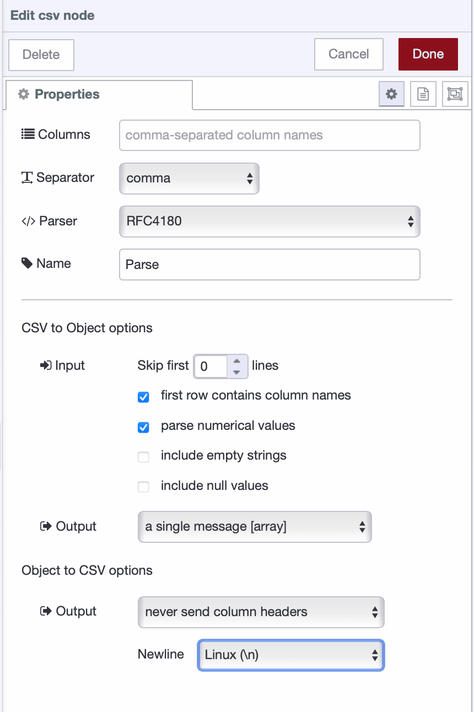
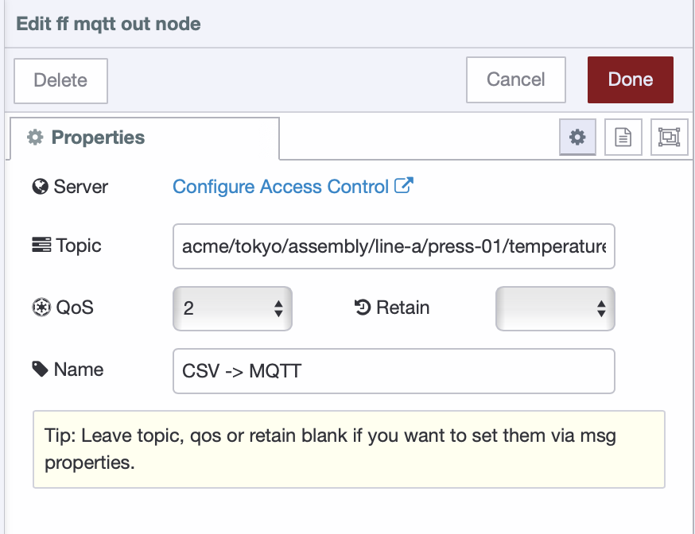
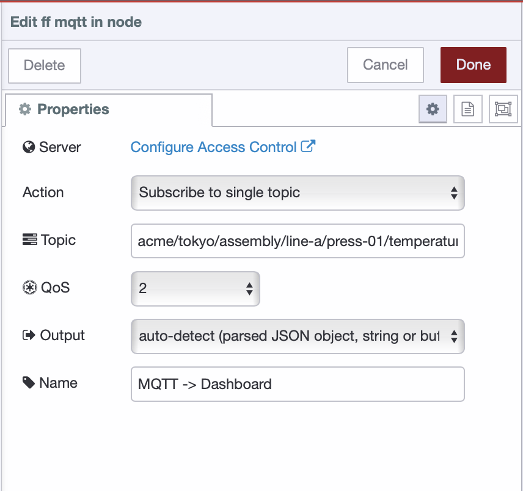
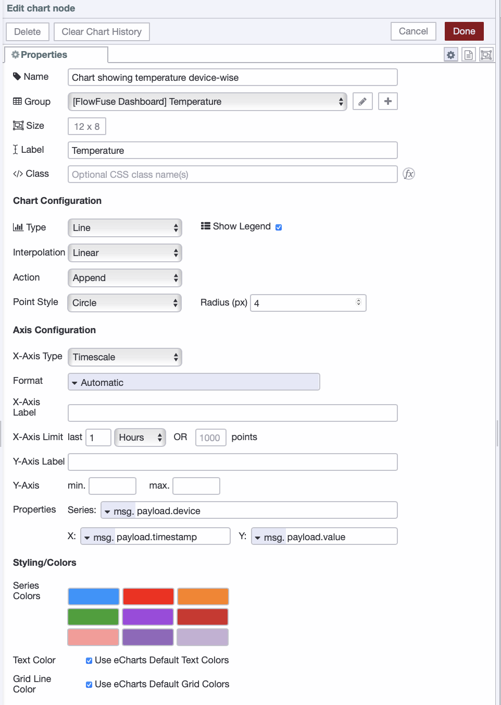
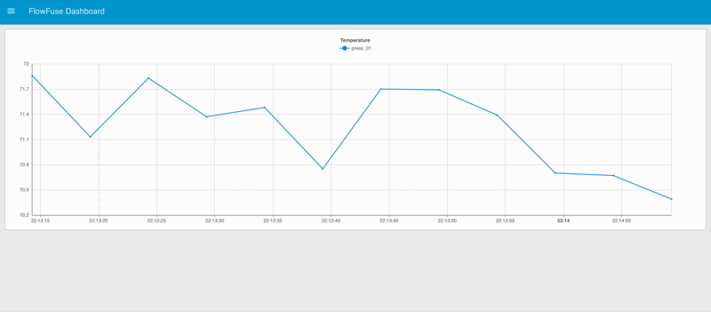

If you work in manufacturing, you likely have gigabytes of data in CSV files—temperature logs, production counts, machine status records. The data exists and is organized, but it's not accessible to the systems that need it.

<!--more-->

PLCs log directly to CSV through proprietary software. Legacy SCADA systems write flat files. Custom applications generate daily reports. These systems are reliable, but they weren't built to integrate with MQTT brokers or databases.

If you're using FlowFuse to log data, you can send to MQTT and databases as data flows through FlowFuse. But if your CSV files come from PLCs, SCADA systems, or other external tools, you need to read and ingest them after they're written.

This guide shows you how to read CSV files—whether real-time or historical—and route them to MQTT brokers, databases, and dashboards.

### Prerequisites

Before starting, ensure you have:

- A running FlowFuse instance. If you don't have one, [sign up for free](https://app.flowfuse.com/)
- CSV log files with industrial data
- Access to an MQTT broker
- Access to a database

**Note:** If you have an Enterprise account, you won't need to set up external MQTT brokers or databases, FlowFuse provides these services built into the platform.

### Sample Data

If you don't have a CSV file and want to follow along, you can import the following flow and deploy it. This flow will simulate a temperature sensor and log readings to a daily CSV file.


[{"id":"66776385db5794bc","type":"group","z":"5a0080d134f80f7d","name":"","style":{"fill":"none","label":true,"fill-opacity":"0.57"},"nodes":["ac0d35a6466cfcb4","4aff5b57cbb63b8f","a5c5746934670306","23ebc0da4315ac46","2518dc909d447655"],"x":214,"y":279,"w":892,"h":82},{"id":"ac0d35a6466cfcb4","type":"csv","z":"5a0080d134f80f7d","g":"66776385db5794bc","name":"","spec":"rfc","sep":",","hdrin":true,"hdrout":"once","multi":"one","ret":"\\r","temp":"timestamp,temperature","skip":"0","strings":true,"include_empty_strings":"","include_null_values":"","x":670,"y":320,"wires":[["a5c5746934670306"]]},{"id":"4aff5b57cbb63b8f","type":"function","z":"5a0080d134f80f7d","g":"66776385db5794bc","name":"Daily PLC Logger","func":"// @ts-ignore Node ≥ 18.15 provides fs.statfsSync; editor types may lag\n\nconst now = new Date();\nconst dateStr = now.toISOString().split('T')[0];\nconst timestamp = now.toISOString();\n\nconst filename = `./plc_data_${dateStr}.csv`;\n\nmsg.payload = {\n    timestamp: timestamp,\n    temperature: msg.payload,\n};\n\nmsg.filename = filename;\n\n// Track last date in flow context\nconst lastDate = flow.get('lastDate') || '';\nif (lastDate !== dateStr) {\n    msg.reset = true; // Will trigger CSV node to write headers\n    flow.set('lastDate', dateStr);\n} \n\nreturn msg;\n","outputs":1,"timeout":0,"noerr":0,"initialize":"","finalize":"","libs":[],"x":490,"y":320,"wires":[["ac0d35a6466cfcb4"]]},{"id":"a5c5746934670306","type":"file","z":"5a0080d134f80f7d","g":"66776385db5794bc","name":"Log Data to CSV file","filename":"filename","filenameType":"msg","appendNewline":true,"createDir":true,"overwriteFile":"false","encoding":"none","x":840,"y":320,"wires":[["2518dc909d447655"]]},{"id":"23ebc0da4315ac46","type":"inject","z":"5a0080d134f80f7d","g":"66776385db5794bc","name":"","props":[{"p":"payload"}],"repeat":"5","crontab":"","once":false,"onceDelay":0.1,"topic":"","payload":"$round(70 + ($random() * 2), 2)","payloadType":"jsonata","x":310,"y":320,"wires":[["4aff5b57cbb63b8f"]]},{"id":"2518dc909d447655","type":"debug","z":"5a0080d134f80f7d","g":"66776385db5794bc","name":"Result","active":true,"tosidebar":true,"console":false,"tostatus":false,"complete":"payload","targetType":"msg","statusVal":"","statusType":"auto","x":1010,"y":320,"wires":[]}]


## Real-Time Data Pipeline

This pipeline monitors CSV files for changes and immediately publishes new data to MQTT topics. Use this approach when you need live data streams for dashboards, alerting systems, or real-time coordination between multiple systems.

### Step 1: Monitoring CSV Files

The Watch node continuously monitors a directory and triggers whenever a file is created or modified.

1. Drag the **Watch node** onto the canvas and double-click to configure it. Enter the directory path you want to monitor in the Files field, such as `/home/user/data/`. 

2. Drag a **Change node** onto the canvas to set the correct filename. Configure it to set `msg.filename` using a JSONata expression: `"plc_data_" & $moment().format("YYYY-MM-DD") & ".csv"` which dynamically constructs the filename based on today's date. If your files use a different naming convention, adjust the expression accordingly.

3. Drag a **Read File node** onto the canvas to read the file contents. Set the Filename field to `msg.filename` as a message property. Configure the Output as "a single utf8 string" and leave Encoding at Default.

{data-zoomable}
*Configuration of the File In node to read CSV file contents*

4. Connect the output of the **Watch node** to the input of the **Change node**, and the output of the **Change node** to the input of the **Read File** node.

5. Deploy the flow.

At this point, whenever a CSV file in your monitored directory is created or modified, the flow reads its contents. The raw CSV data is now in `msg.payload` as a text string, ready to be parsed.

### Step 2: Parsing CSV Data

Now we'll convert the raw CSV text into structured data.

1. Drag a **CSV node** onto the canvas and connect it to the File In node output. Double-click to configure it to set:
   - Separator: Comma
   - Parser: RFC4180
   - Check "First row contains column names" and "Parse numerical values"
   - Output: "a single message [array]"

{data-zoomable}
*CSV parser configuration for batch processing with RFC4180 standard*

The CSV node now converts the raw text into an array of objects, where each object represents a row with named properties from the column headers.

### Step 3: Extracting the Latest Record

Since we’re reading the entire file each time it changes, we only need to publish the most recent data point to MQTT.

1. Drag a **Function node** onto the canvas and connect it to the CSV node output.

2. Add this code to extract only the latest row:

```javascript
// msg.payload is an array of all CSV rows
const rows = msg.payload;

// Extract only the latest row
if (rows && rows.length > 0) {
    msg.payload = rows[rows.length - 1];
    return msg;
} else {
    // No data in file yet
    return null;
}
```

3. Deploy the flow.

Your parsed data now flows through as individual records, ready to be published to MQTT.

### Step 4: Publishing to MQTT

Now we'll publish the parsed CSV data to an MQTT broker for real-time distribution. If you have FlowFuse Team or Enterprise tier, [enable the MQTT broker within your FlowFuse team](/blog/2025/10/plc-to-mqtt-using-flowfuse/#step-3%3A-set-up-mqtt-with-flowfuse).

#### Adding Context to Your Data

1. Drag a **Change node** onto the canvas and connect it to the output of the **Function node**. This step adds useful context for better data traceability.

2. Configure the node to set `msg.payload` to a structured object—customize it based on your data and application needs:

```javascript
{
    "timestamp": payload.timestamp,
    "site": "tokyo_plant",
    "line": "assembly_line_a",
    "device": "press_01",
    "measurement": "temperature",
    "value": payload.temperature,
    "unit": "celsius"
}
```

#### Configuring the MQTT Publisher

1. Drag the **ff-mqtt-out node** onto the canvas and connect it to the **Change node**. When you drag the node, it will be automatically configured with the FlowFuse MQTT broker—you do not need to manually add configuration.

2. By default, the client automatically created for your instance only has **subscribe** permissions. Click **Configure Access Control** next to the server in the node configuration window. This will redirect you to the platform’s broker client management page, filtered to show the client associated with this instance. Click the **Edit** button, enable both **Publish** and **Subscribe** actions, and then restart your instance.

3. Set the **topic** following ISA-95 hierarchy:

```
company/site/area/line/cell/device/measurement
```

For example:

```
acme/tokyo/assembly/line-a/press-01/temperature
```

4. Configure the **QoS level** in the MQTT node. Set it to QoS 1 for reliable delivery—this ensures your data reaches subscribers even if there are brief network issues, or choose according to your reliability requirements (QoS 0 for high-frequency non-critical data, QoS 2 for critical data).

{data-zoomable}
*Configuring the MQTT Out node*

5. Deploy the flow.

## Batch Processing Pipeline

This pipeline reads CSV files on a schedule and writes data to databases in efficient batches. Use this approach for historical data storage, trend analysis, and reporting where immediate writes aren't necessary.

### Step 1: Reading CSV Files on Schedule

Unlike the real-time pipeline that watches for file changes, batch processing runs on a timer.

1. Drag an **Inject node** onto the canvas. Configure it to trigger on your desired schedule:
   - For hourly batches: Set repeat interval to "interval" and enter 1 hour
   - For shift-based batches: Add multiple inject nodes, For example, one at 08:00 for night shift end, another at 16:00 for day shift end, and a third at 00:00 for evening shift end.
   - For daily batches: Set to trigger "at a specific time" once per day

2. Drag a **Change node** and configure it to set `msg.filename` to your CSV file path. Use a JSONata expression if you need dynamic filenames: `"plc_data_" & $moment().format("YYYY-MM-DD") & ".csv"`. If your files use a different naming convention, adjust the expression accordingly.

3. Drag a **Read File node** onto the canvas to read the file contents. Set the Filename field to `msg.filename` as a message property. Configure the Output as "a single utf8 string" and leave Encoding at Default.

4. Connect the output of the **Inject node** to the input of the **Change node**, and the output of the **Change node** to the input of the **Read File** node.

### Step 2: Parsing All Records

1. Drag a **CSV node** and connect it to the File In node output.

2. Configure it the same way as in the real-time pipeline:
   - Separator: Comma
   - Parser: RFC4180
   - Check "First row contains column names" and "Parse numerical values"
   - Output: "a single message [array]"

### Step 3: Filtering New Records

Since we’re reading the entire CSV file each time, we need to track which rows have already been written to the database to avoid duplicates.

1. Drag a **Function node** and connect it to the **CSV node** output. Add this code:

```javascript
const allRows = msg.payload;

// Get the last processed row count from flow context
let lastRowCount = flow.get('lastRowCount') || 0;

// Get only new rows since last processing
const newRows = allRows.slice(lastRowCount);

if (newRows.length > 0) {
    // Update the row count for next run
    flow.set('lastRowCount', allRows.length);
    
    msg.payload = newRows;
    return msg;
} else {
    // No new data to process
    node.warn("No new records to process");
    return null;
}
```

### Step 4: Inserting to Database

Now we'll configure the database insertion to write batched data efficiently.

#### Enabling FlowFuse Database

If you have a Enterprise account, you can use the built-in PostgreSQL database service instead of setting up an external database. Follow the instructions in [Getting Started with FlowFuse Tables](https://flowfuse.com/blog/2025/08/getting-started-with-flowfuse-tables/#step-1%3A-enable-the-database-in-your-project) to enable the database in your project.

Once enabled, you'll have access to a fully managed PostgreSQL database that's automatically configured and ready to use with your FlowFuse flows.

#### Creating the Database Table

Before inserting data, you need to create a table to store your sensor readings.

1. In your Node-RED editor, drag a **Query node** onto the canvas. Just like the FlowFuse MQTT nodes, it will automatically configure itself when added to the canvas.

2. Double-click to open it and click **"Ask the FlowFuse assistant"** at the top of the configuration dialog.

3. In the assistant prompt, enter:
   *“Create a new table named `sensor_data` to store sensor readings with the following columns: `timestamp`, `site`, `line`, `device`, `measurement`, `value`, and `unit`.”*, Modify the table name and columns as needed to match your specific data and application requirements.

4. Click the **"Ask the FlowFuse assistant"** button. The assistant will generate the SQL query for you and automatically populate it in the Query field.

6. Drag an **Inject node** onto the canvas, set it to trigger once, and connect it to the **Query node**.

7. Add a **Debug node** connected to the **Query node** output to see the result.

8. Deploy the flow and click the Inject button to create the table.

#### Preparing Data for Batch Insert

Instead of writing each CSV row individually to the database, we'll use batch inserts for much better performance. A single transaction with many rows is far more efficient than many separate transactions.

1. Drag a **Function node** onto the canvas and connect it to the previous **Function node** (the one that filters new records).

2. Name this node "Prepare Batch Insert" and add the following code:

```javascript
// msg.payload contains the new rows from CSV
const newRows = msg.payload;

// Transform each row to match your database schema
const formattedData = newRows.map(row => ({
    timestamp: row.timestamp,
    site: 'tokyo_plant',
    line: 'assembly_line_a', 
    device: 'press_01',
    measurement: 'temperature',
    value: row.temperature,
    unit: 'celsius'
}));

// Generate parameter placeholders for batch insert
// Each row has 7 fields, so we need 7 parameters per row
// Example: ($1,$2,$3,$4,$5,$6,$7), ($8,$9,$10,$11,$12,$13,$14), ...
const values = formattedData.map((_, i) => 
    `($${i * 7 + 1}, $${i * 7 + 2}, $${i * 7 + 3}, $${i * 7 + 4}, $${i * 7 + 5}, $${i * 7 + 6}, $${i * 7 + 7})`
).join(',');

// Build the SQL insert query with placeholders, modify the query according to your table name and schema.
msg.query = `
    INSERT INTO sensor_data 
    (timestamp, site, line, device, measurement, value, unit)
    VALUES ${values};
`;

// Flatten the data into a single array of parameters
// Order must match the columns in the INSERT statement
msg.params = formattedData.flatMap(r => [
    r.timestamp,
    r.site,
    r.line,
    r.device,
    r.measurement,
    r.value,
    r.unit
]);

return msg;
```

3. Click Done.

This function generates a parameterized SQL query that inserts all rows in a single database transaction, which is significantly faster than individual inserts.

## Visualizing CSV Data on Dashboard

Now that we've ingested CSV data into MQTT and databases, let's visualize it on a dashboard. We'll focus on real-time visualization using the MQTT pipeline we built earlier. For historical data visualization from FlowFuse Tables, refer to our comprehensive guide: [Building Time-Series Dashboards with FlowFuse Tables](/blog/2025/08/time-series-dashboard-flowfuse-postgresql/)

#### Step 1: Installing Dashboard

1. In your Node-RED editor, click the hamburger menu (≡) in the top right corner.
2. Select **Manage palette**.
3. Go to the **Install** tab.
4. Search for `@flowfuse/node-red-dashboard`.
5. Click **Install** and confirm.

#### Step 2: Subscribing to MQTT Data

1. Drag an **ff-mqtt-in node** onto the canvas.
2. Configure the Topic to match your publisher: `acme/tokyo/assembly/line-a/press-01/temperature`
3. Set **Output** to "auto-detect (string or buffer)".

{data-zoomable}
*Configuring the MQTT Out node*

#### Step 3: Creating the Dashboard Widgets

Now we'll add a chart to visualize the temperature data in real-time.

1. Drag a **ui-chart** widget onto the canvas and double-click it. Create a new UI group for it to render.
2. Set the size according to your needs for the chart, label to "Temperature", type to "line", action to "append", and x-axis to "timescale".
3. Next, set series to `msg.payload.device`, x to `msg.payload.timestamp`, and y to `msg.payload.value`.

{data-zoomable}
*Chart widget configuration for real-time temperature visualization*

4. Click **Deploy**.

Once deployed, open the dashboard — you should see a real-time line chart displaying temperature values over time, with each device shown as a separate series. Data points will automatically update as new MQTT messages arrive.

{data-zoomable}
*Live dashboard displaying real-time temperature readings from CSV data stream*

## What's Next

You've transformed static CSV files into live data streams that flow through MQTT, databases, and dashboards. Your legacy equipment now communicates with modern systems without any hardware changes.

This tutorial walked you through building a data pipeline. FlowFuse takes it further by handling both development and production deployment. When you need to scale across multiple production lines, manage team collaboration, deploy to hundreds of devices remotely, or maintain infrastructure like MQTT brokers and databases, FlowFuse provides the platform to do it all. As you saw, it also includes an AI Assistant to speed up your workflow.

If you want to see more on how FlowFuse helps with scaling and production deployments, [book a demo](/book-demo/) today.
