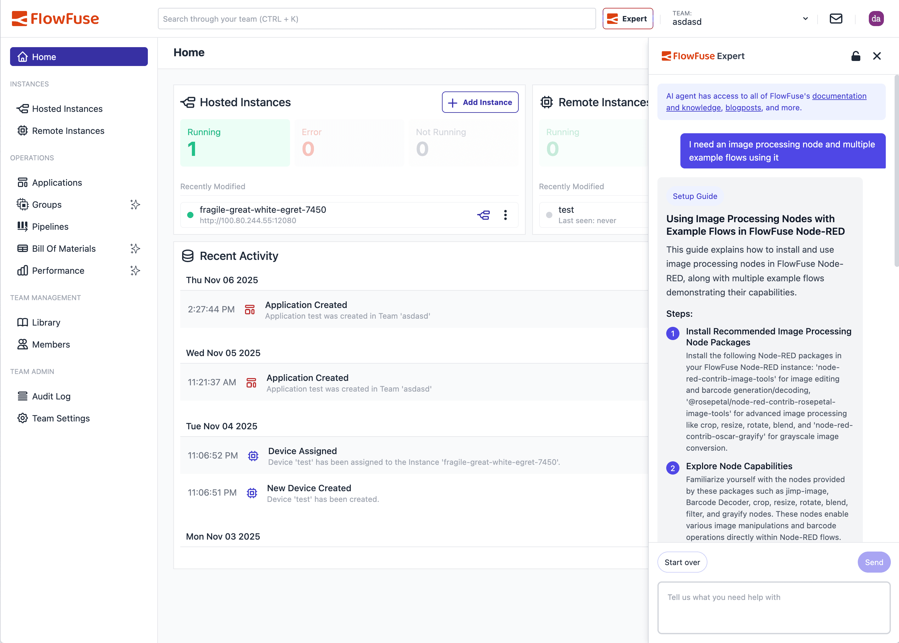
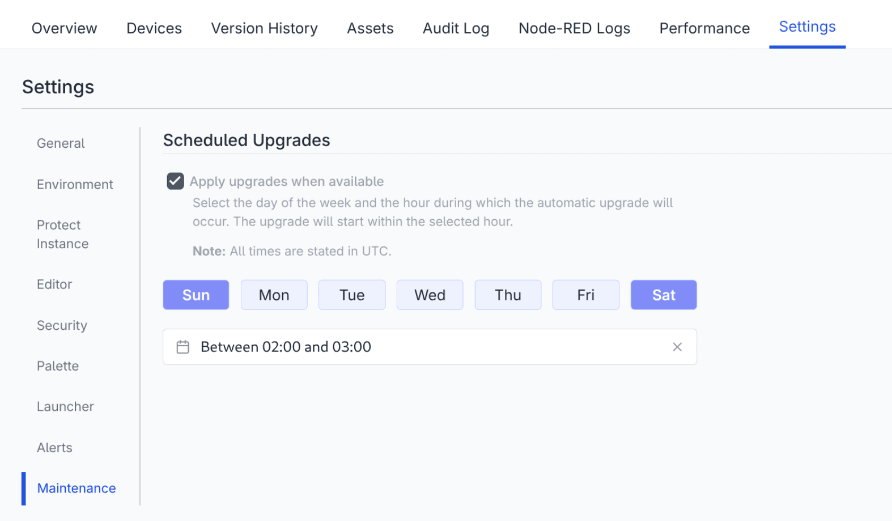
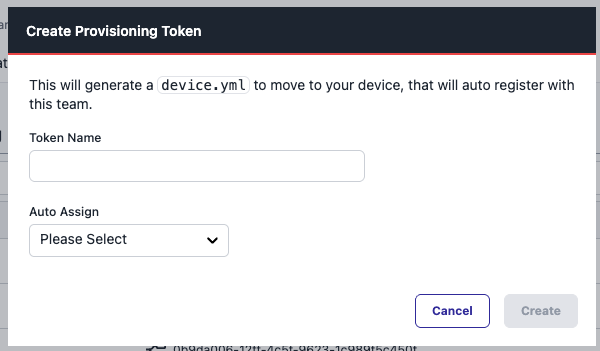

This release unlocks several new abilities for our users, speeding your development time, easing management of Node-RED instances, providing a smoother path to adding large numbers of devices, and more. Let's dig in.

<!--more-->

## FlowFuse Expert

_[FlowFuse Expert UI]_

The FlowFuse Expert used to live only on flowfuse.com, where you could use an LLM trained on FlowFuse and Node-RED documentation, and trained by the Node-RED experts at FlowFuse. Now, we've taken it a step further. The FlowFuse Expert is now available inside of the FlowFuse UI, and even in the Immersive Editor in Node-RED! 

You are no longer limited in your interactions with the FlowFuse Expert by the location where you started your conversation. Keep the conversation going and rely on the Expert's advice right where you're building in Node-RED.

Even better, when you're working in the Immersive Editor, the Expert will recommend flows based on your inputs, and you can copy and paste them directly into the Node-RED Editor, once again saving you time and reducing the effort needed to develop in Node-RED.

## Automatic Updates of Instances

_[Scheduled Updates Interface]_

When there are new updates to Node-RED, or the FlowFuse components, it has been a manual task for users to spot the update and trigger the upgrade to get the latest fixes and features applied to their instances.

We're here to make your tasks easier, not to give you more maintenance burdens. So with this release, we've introduced the ability to automatically apply any updates that are available to Node-RED or the FlowFuse stack around it. You get to pick a maintenance window during the week for when the updates should get applied.

For Starter tier teams, we will apply a default schedule for overnight at the weekend to minimise disruption. For Pro and Enterprise tiers, users can configure their own schedule via the Instance's Maintenance settings tab.

Keeping your software up to date is important, and this features gives you one less thing to worry about.

## Simpler Edge Device Addition

_[Provisioning Token Interface]_

Many of our customers make use of large fleets of edge devices. Through the use of provisioning tokens it's easy to get lots of devices setup quickly - but there were still some additional steps needed to get the devices properly named and organised. Now, when setting up a new device with a provisioning token, it is possible to name it at the same time, reducing the complexity of the workflow. We want you to be able to scale up your edge device count quickly and easily, and this represents a significant step in that direction. 

## Blueprint: Store and Forward

When data acquisition and processing at the edge is mission critical, it is vital that data received at the edge can be stored and protected until it can be forwarded to its destination. Having heard from customers that an easy way to execute a store and forward structure is needed, we have created this Blueprint to speed your development of this data-preserving flow.

Find out more on the [blueprint page](/blueprints/getting-started/store-and-forward/).

# Sneak Peek

FlowFuse MCP nodes allow you to surface information to an LLM to create custom AI agents. We're working on enabling FlowFuse to identify anything you have surfaced to an MCP, paving the way for creating massively powerful agents, enabled by everything you've connected to FlowFuse.

## FlowFuse Expert for Open-Source Node-RED

FlowFuse Expert is our collection of AI-enhancements within the Node-RED editor - assisted creation of Function nodes, autocompleting flows and documentation generation amongst other features. Currently it's an exclusive feature of the FlowFuse platform, but we're hard at work to bring it to standalone Node-RED instances.

Coming soon you'll be able to experience the power of AI-enhanced development within Node-RED wherever it's running.

## What else is new?

For a complete list of everything included in our 2.24 release, check out the [release notes](https://github.com/FlowFuse/flowfuse/releases/tag/v2.24.0).

Your feedback continues to be invaluable in shaping FlowFuse's development. We'd love to hear your thoughts on these new features and any suggestions for future improvements. Please share your experiences or report any [issues on GitHub](https://github.com/FlowFuse/flowfuse/issues/new/choose).

Which of these new features are you most excited to try? Email me directly at greg@flowfuse.com - I'd love to hear from you!

## Try FlowFuse

### FlowFuse Cloud

The quickest way to get started is with FlowFuse Cloud.

[Get started for free]({{ site.onboardingURL }}) and have your Node-RED instances running in the cloud within minutes.

### Self-Hosted

Get FlowFuse running locally in under 30 minutes using [Docker](/docs/install/docker/) or [Kubernetes](/docs/install/kubernetes/).
