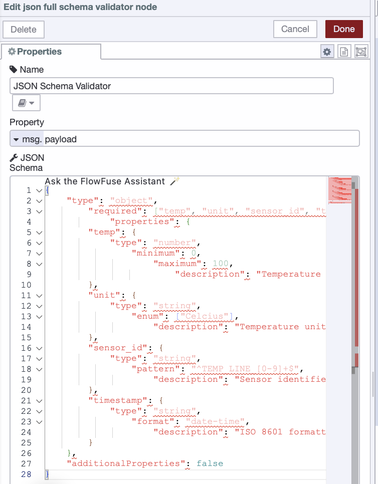

Bad data quietly corrupts production analytics, triggers false equipment alarms, and causes automation systems to make faulty control decisions. Unlike system crashes, these issues go unnoticed until they've already propagated through your operations—affecting multiple processes and causing unexpected shutdowns or production anomalies.

<!--more-->

This article shows you how to build a data validation gateway using FlowFuse that stops bad data before it reaches your critical systems. You'll implement validation checkpoints, establish quality rules, and configure alerts, creating a protective barrier that ensures only reliable data flows into your production environment.

Below is a short video demonstration of the data validation gateway we'll be building together.

<lite-youtube videoid="_yThV3eurhw" params="rel=0" style="margin-top: 20px; margin-bottom: 20px; width: 100%; height: 480px;" title="YouTube video player"></lite-youtube>

## The Problem with Trusting Your Data

Most industrial applications assume incoming data is valid—temperature sensors send numbers between 0-100°C, MQTT messages contain properly formatted JSON, PLC status codes follow documented formats. There's usually no validation checking if these assumptions hold true.

This works until it doesn't. Sensors drift out of calibration. Network issues corrupt packets. Firmware updates change data formats without warning. When these things happen, bad data flows straight through unchecked.

Consider a temperature sensor sending `{"temperature": 72.5, "unit": "Celsius"}`. Then electromagnetic interference corrupts transmission, and your system receives `{"temperature": "ERR", "unit": "Celsius"}`. Your code tries to do math with "ERR"—it fails silently, throws an exception, or worse, coerces "ERR" to NaN or 0. Now you're making decisions based on garbage data without realizing it.

Scale makes this worse. With hundreds of sensors, multiple PLCs, edge gateways, and third-party integrations sending data continuously, quality issues aren't occasional—they're constant. You spend more time troubleshooting data problems than actual equipment problems. Reports contain incorrect numbers. Predictive models make bad predictions from corrupted training data.

The solution isn't hoping for perfect data—it's validating it explicitly. That's what we're building in this guide.

## Understanding Data Quality

Before we start building, we need to answer a simple but critical question:

**What makes data "good"?**

This isn't about what data you collect or which machine it comes from. It's about whether the data is **reliable enough to drive decisions without causing chaos**.

Good data enables confident automation and informed decision-making.

Bad data misleads—and when your automation acts on misleading information, your team and operations pay the price.

To build effective validation, you need to check multiple dimensions of data quality. Some key aspects include:

- **Type Correctness**: Is the temperature a number or the string "ERR"?
- **Completeness**: Are all required fields present?
- **Range Validation**: Is the temperature between 0-100°C or an impossible 500°C?
- **Format Consistency**: Is the timestamp in ISO 8601 format or some custom format?

These aren't rigid categories—they're lenses through which you examine your data. Real validation often combines several of these checks together.

## Building Your Data Quality Checker

Now that we understand what "good data" looks like, let's build guardrails to enforce it.

> Before we start, make sure you have a running FlowFuse instance that is collecting data. If you don't have a real data source, don't worry—we'll provide a simulated setup as well. Just make sure you have a FlowFuse account and instance running. If you don't have an account, create one now with our [free trial](https://app.flowfuse.com/account/create/).

### Installing the JSON Schema Validator Node

For our validation system, we'll use [JSON Schema](https://json-schema.org/), a powerful, industry-standard way to define what valid data should look like. Think of it as a contract that your data must fulfill before entering your system.

JSON Schema lets you specify exactly what fields should exist, what types they should be, what ranges are acceptable, and what formats are required. Instead of writing dozens of if-statements to check each condition, you define the rules once in a schema, and the validator does the heavy lifting.

To get started, install the `node-red-contrib-full-msg-json-schema-validation` node in your FlowFuse instance:

1. Open your FlowFuse instance
2. Click the hamburger menu (three horizontal lines) in the top right
3. Select **Manage palette**
4. Go to the **Install** tab
5. Search for `node-red-contrib-full-msg-json-schema-validation`
6. Click **Install** next to the node

Once installed, you'll find the "json full schema validator" node in your palette under the function category.

### Creating Your First Validation Schema

Let's start with a practical example—validating temperature sensor data. Here's what we expect our sensor to send:

```json
{
    "temperature": 72.5,
    "unit": "Celsius",
    "sensor_id": "TEMP_LINE_01",
    "timestamp": "2025-11-21T10:30:00Z"
}
```

Now let's create a JSON Schema that validates this structure:

```json
{
    "type": "object",
        "required": ["temperature", "unit", "sensor_id", "timestamp"],
            "properties": {
        "temperature": {
            "type": "number",
                "minimum": 0,
                    "maximum": 100,
                        "description": "Temperature reading in Celsius"
        },
        "unit": {
            "type": "string",
                "enum": ["Celsius"],
                    "description": "Temperature unit (Celsius only)"
        },
        "sensor_id": {
            "type": "string",
                "pattern": "^TEMP_LINE_[0-9]+$",
                    "description": "Sensor identifier following the required naming convention"
        },
        "timestamp": {
            "type": "string",
                "format": "date-time",
                    "description": "ISO 8601 formatted timestamp"
        }
    },
    "additionalProperties": false
}
```

Let's break down what this schema validates:

- **Type Safety:** temperature must be a number (catches `"ERR"`, null, undefined)
- **Required Fields:** all 4 must exist (catches incomplete messages)
- **Range Limits:** temperature must be between 0–100°C.
- **Value Constraints:** unit must match the enum "Celsius" (enforces consistent units)
- **Format Rules:** ISO 8601 timestamps and `TEMP_LINE_*` naming (catches config/naming errors)

The `additionalProperties: false` line is particularly important—it rejects any data with unexpected fields, preventing schema drift over time.

#### Building the Validation Flow

Now let's build the flow:

1. Drag in your data input node such as MQTT In node, HTTP In node, or Inject node (for testing)

2. Drag the **JSON Full Schema Validator** node into your flow

3. Double-click the validator node and paste your JSON schema into the schema field.

{data-zoomable}
_JSON Schema Validator node configured with schema rules_

4. The validator node has two outputs:
   - **Output 1**: Valid data that passes all schema checks
   - **Output 2**: Invalid data that fails validation
   
When validation fails, the node adds a `msg.error` property as an array, where each item provides detailed information about what went wrong (missing fields, incorrect types, out-of-range values, etc.)

5. Connect Output 1 to your normal processing pipeline (database writes, dashboards, automation logic)

6. Connect Output 2 to an error handler that logs the error details.

### Testing Your Validator

Time to test your validator. We'll use the **temperature sensor schema from the example above**, but you can follow these same steps with any schema you create. Just make sure your test payload matches what your schema expects—same field names, correct data types, and proper structure. Then you can tweak the values to trigger validation failures and see how your error handling responds. 

Add an **Inject** node with this valid payload, and connect it to your JSON Schema Validator node:

```json
{
    "temperature": 72.5,
    "unit": "Celsius",
    "sensor_id": "TEMP_LINE_01",
    "timestamp": "2025-11-21T10:30:00Z"
}
```

This passes all checks against the temperature sensor schema example and routes to your valid data handler.

Now test with bad data:

```json
{
    "temperature": "ERR",
    "unit": "Celsius",
    "sensor_id": "TEMP_LINE_01",
    "timestamp": "2025-11-21T10:30:00Z"
}
```

This fails because `temperature` is a string instead of a number (as defined in our example schema), routing to your error handler. The `msg.error` output shows exactly what's wrong:

```json
[{
  "keyword": "type",
  "dataPath": ".temperature",
  "schemaPath": "#/properties/temperature/type",
  "params": {
    "type": "number"
  },
  "message": "should be number"
}]
```

These detailed error messages eliminate guesswork. You see the field, the problem, and where validation failed.

Test additional scenarios to see how the validator catches different issues:

**Missing required field:**
```json
{
  "temperature": 72.5,
  "unit": "Celsius",
  "timestamp": "2025-11-21T10:30:00Z"
}
```

**Out of range value:**
```json
{
  "temperature": 150,
  "unit": "Celsius",
  "sensor_id": "TEMP_LINE_01",
  "timestamp": "2025-11-21T10:30:00Z"
}
```

**Invalid enum value:**
```json
{
  "temperature": 72.5,
  "unit": "F",
  "sensor_id": "TEMP_LINE_01",
  "timestamp": "2025-11-21T10:30:00Z"
}
```

Each failure produces specific error messages that pinpoint the exact issue.

## Setting Up Error Alerts

Now that your validator is catching bad data on Output 2, let's set up Telegram notifications so you get instant mobile alerts whenever validation fails.

### Installing the Telegram Node

First, install the Telegram node from the palette:

1. Click the **hamburger menu** (three horizontal lines) in the top right.
2. Select **Manage palette**.
3. Go to the **Install** tab.
4. Search for `node-red-contrib-telegrambot`.
5. Click **Install** next to the node.
6. Wait for installation to complete.

Once installed, you'll find the "telegram sender" and "telegram receiver" nodes in your palette.

### Creating Your Telegram Bot and Getting Your Chat ID

Before you can send alerts, you need to create a Telegram bot and get your Chat ID. We have a detailed guide that walks you through the entire process:  [How to Create a Telegram Bot and Find Your Chat ID](/node-red/notification/telegram/#creating-a-bot-in-telegram)

Once you have your **bot token** and **Chat ID**, come back here to continue with the alert setup.

### Create the Alert Message

Now we'll format the error information into a clear Telegram message.

1. Find your validator node (the JSON Schema Validator).
2. Look at its **second output** (the bottom one). This is where bad data with errors comes out.
3. Drag a **function** node onto the canvas.
4. Connect it to the validator's **second output**.
5. Double-click the function node to open it.
6. Change the **Name** at the top to: `Format Alert` and add the following JavaScript:

```javascript
// Get error information
const errors = msg.error || [];
const badData = msg.payload || {};

// Build error list
let errorText = "";
errors.forEach((err, index) => {
    errorText += `${index + 1}. Field: ${err.dataPath || 'unknown'}\n`;
    errorText += `   Problem: ${err.message}\n\n`;
});

// Get current time
const time = new Date().toLocaleString();

// Build the alert message
msg.payload = {
  chatId: "PUT_YOUR_CHAT_ID_HERE",
  type: "message",
  content: `🚨 DATA VALIDATION FAILED

Time: ${time}
Sensor: ${badData.sensor_id || 'Unknown'}

ERRORS FOUND:
${errorText}

BAD DATA:
${JSON.stringify(badData, null, 2)}`
};

return msg;
```

1. Find the line `chatId: "PUT_YOUR_CHAT_ID_HERE"`.
2. Replace `PUT_YOUR_CHAT_ID_HERE` with your actual Chat ID.
3. Click **Done**.
4. Drag **telegram sender** node onto the canvas.
5. Connect your **Format Alert** function node to the **telegram sender** node.
6. Double-click the **telegram sender** node.
7. Click the **+** icon next to **Bot** to add your bot configuration.
8. Paste your **Bot Token** that you got from BotFather.
9. Give it a name like "Quality Check Bot".
10. Click **Add**, then **Done**.
11. Click **Deploy**.

Now test your setup by triggering a validation failure. You should receive an instant Telegram message showing exactly what went wrong.

Below is the complete flow that demonstrates the entire validation pipeline—from receiving sensor data to catching errors and sending Telegram alerts.


[{"id":"9b9f55548911ac66","type":"inject","z":"d7101f3a4d45deed","name":"Invalid Data","props":[{"p":"payload"}],"repeat":"","crontab":"","once":false,"onceDelay":0.1,"topic":"","payload":"{\"temperature\":\"ERR\",\"unit\":\"Celsius\",\"sensor_id\":\"TEMP_LINE_01\",\"timestamp\":\"2025-11-21T10:30:00Z\"}","payloadType":"json","x":260,"y":480,"wires":[["93c2895e93507e19"]]},{"id":"ae110e07ad7685d7","type":"debug","z":"d7101f3a4d45deed","name":"Data","active":true,"tosidebar":true,"console":false,"tostatus":false,"complete":"true","targetType":"full","statusVal":"","statusType":"auto","x":760,"y":360,"wires":[]},{"id":"df3cea6a5e793d66","type":"function","z":"d7101f3a4d45deed","name":"Format Alert","func":"// Get error information\nconst errors = msg.error || [];\nconst badData = msg.payload || {};\n\n// Build error list\nlet errorText = \"\";\nerrors.forEach((err, index) => {\n    errorText += `${index + 1}. Field: ${err.dataPath || 'unknown'}\\n`;\n    errorText += `   Problem: ${err.message}\\n\\n`;\n});\n\n// Get current time\nconst time = new Date().toLocaleString();\n\n// Build the alert message\nmsg.payload = {\n    chatId: \"PUT_YOUR_CHAT_ID_HERE\",\n    type: \"message\",\n    content: `🚨 DATA VALIDATION FAILED\n\nTime: ${time}\nSensor: ${badData.sensor_id || 'Unknown'}\n\nERRORS FOUND:\n${errorText}\n\nBAD DATA:\n${JSON.stringify(badData, null, 2)}`\n};\n\nreturn msg;","outputs":1,"timeout":0,"noerr":0,"initialize":"","finalize":"","libs":[],"x":750,"y":500,"wires":[["73c2d99fc1d7025a"]]},{"id":"c97a4811cf6d94ec","type":"inject","z":"d7101f3a4d45deed","name":"Valid Data","props":[{"p":"payload"}],"repeat":"","crontab":"","once":false,"onceDelay":0.1,"topic":"","payload":"{\"temperature\":72.5,\"unit\":\"Celsius\",\"sensor_id\":\"TEMP_LINE_01\",\"timestamp\":\"2025-11-21T10:30:00Z\"}","payloadType":"json","x":250,"y":400,"wires":[["93c2895e93507e19"]]},{"id":"b82034c189d13fd5","type":"comment","z":"d7101f3a4d45deed","name":"Data Simulation","info":"","x":260,"y":340,"wires":[]},{"id":"93c2895e93507e19","type":"json-full-schema-validator","z":"d7101f3a4d45deed","name":"","property":"payload","propertyType":"msg","func":"{\n    \"type\": \"object\",\n        \"required\": [\"temperature\", \"unit\", \"sensor_id\", \"timestamp\"],\n            \"properties\": {\n        \"temperature\": {\n            \"type\": \"number\",\n                \"minimum\": 0,\n                    \"maximum\": 100,\n                        \"description\": \"Temperature reading in Celsius\"\n        },\n        \"unit\": {\n            \"type\": \"string\",\n                \"enum\": [\"Celsius\"],\n                    \"description\": \"Temperature unit (Celsius only)\"\n        },\n        \"sensor_id\": {\n            \"type\": \"string\",\n                \"pattern\": \"^TEMP_LINE_[0-9]+$\",\n                    \"description\": \"Sensor identifier following the required naming convention\"\n        },\n        \"timestamp\": {\n            \"type\": \"string\",\n                \"format\": \"date-time\",\n                    \"description\": \"ISO 8601 formatted timestamp\"\n        }\n    },\n    \"additionalProperties\": false\n}","x":520,"y":420,"wires":[["ae110e07ad7685d7"],["df3cea6a5e793d66","30dce9e4816b95a9"]]},{"id":"73c2d99fc1d7025a","type":"telegram sender","z":"d7101f3a4d45deed","name":"","bot":"c588ce99d237a64a","haserroroutput":false,"outputs":1,"x":770,"y":560,"wires":[[]]},{"id":"30dce9e4816b95a9","type":"debug","z":"d7101f3a4d45deed","name":"Error","active":true,"tosidebar":true,"console":false,"tostatus":false,"complete":"true","targetType":"full","statusVal":"","statusType":"auto","x":760,"y":440,"wires":[]},{"id":"c588ce99d237a64a","type":"telegram bot","botname":"Quality Check Bot","usernames":"","chatids":"","baseapiurl":"","testenvironment":false,"updatemode":"polling","pollinterval":300,"usesocks":false,"sockshost":"","socksprotocol":"socks5","socksport":6667,"socksusername":"anonymous","sockspassword":"","bothost":"","botpath":"","localbothost":"0.0.0.0","localbotport":8443,"publicbotport":8443,"privatekey":"","certificate":"","useselfsignedcertificate":false,"sslterminated":false,"verboselogging":false},{"id":"e1abd01699c129df","type":"global-config","env":[],"modules":{"node-red-contrib-full-msg-json-schema-validation":"1.1.0","node-red-contrib-telegrambot":"17.0.3"}}]


## Wrapping Up

You now have a working validator that stops corrupted data before it reaches your dashboards and automation logic. Bad sensor readings, malformed payloads, missing fields—your system catches them all and sends you detailed Telegram alerts the moment validation fails.

Pick one critical data source and deploy your validator there first. Watch how it performs, adjust your schema based on real patterns, then roll it out to additional sources. Apply this approach everywhere data enters your system—MQTT streams, API endpoints, PLC connections. You'll shift from constantly troubleshooting mysterious failures to preventing them entirely.

Pay attention to your validation metrics. High failure rates from specific sensors signal equipment problems. Recurring error patterns reveal network issues or configuration drift. Your validator becomes an early warning system for operational problems.

The validation patterns you build today make your automation trustworthy tomorrow.

Want to discover how FlowFuse helps you collect, validate, enrich, and use machine data to reduce costs and improve operational efficiency, along with powerful enterprise features? [Contact us](/contact-us/) or [Book a demo](/book-demo/) to get started.
