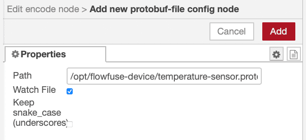

You're generating terabytes of sensor data every day. Most of it is waste, I mean..

Not the measurements—those are fine. It's the packaging. Text formats wrap every reading in field names, quotes, and brackets. You're moving more formatting characters than actual data across your network.

<!--more-->

Protocol Buffers eliminates this. It's binary serialization that transmits only what matters—no overhead, no bloat. This article shows you how to implement it and what happens when you stop paying to transmit garbage.

Don't worry about complexity—in FlowFuse this is three nodes and one text file. No thousand lines of code. You'll define your data structure in 5-10 lines, drag some nodes into your flow, point them at that file, and you're done. FlowFuse handles the rest.

## What You're Actually Transmitting

Your network doesn't have a data problem. It has a packaging problem.

Right now, somewhere in your facility, a sensor just reported 74°C. Simple reading. Four pieces of information. But here's what actually transmitted:

```json
{
  "sensor_id": "T-220",
  "temperature": 74,
  "unit": "C",
  "timestamp": 1700580000,
  "status": "OK"
}
```

See those field names? `sensor_id`, `temperature`, `unit`, `timestamp`, `status`. You wrote them once when you defined your data model. Now you're transmitting them thousands of times per second. Every single message carries a complete description of itself.

It's like receiving a package where the shipping label is bigger than what's inside.

**Here's what this costs you:**

One sensor sending 109 bytes every 5 seconds is nothing. One thousand sensors doing the same thing creates 21.8 KB/second of continuous traffic. That's 1.88 GB per day. Except only about 650 MB are actual measurement—the rest is field names, quotes, and brackets you're paying to transmit, store, and process.

Your edge device receives this message and fires up a JSON parser. It reads character by character, validates every quote matches, converts "74" from a string into a number, and builds a data structure. This happens millions of times per day in a mid-sized facility. The CPU isn't processing sensor data—it's processing text formatting.

Your control loop needs that temperature reading in 50 milliseconds. But the network is congested because it's moving 3-4x more data than necessary. The parser is slow because it's converting strings. And suddenly your 50ms requirement becomes 200ms, and nobody can figure out why because "we have plenty of bandwidth."

Meanwhile, your cloud provider charges by the gigabyte. Every month, you pay to ingest 1.88 GB from this sensor array. About 1.2 GB of that is field names and formatting. You're literally paying to store the word "temperature" millions of times.

**The compression trap:**

The obvious fix is GZIP. Compress everything, cut it in half, problem solved. Except now you're compressing garbage, then paying CPU cycles to decompress it, then parsing the same bloated JSON on the other end. You've added latency and processing overhead to save bandwidth on data you shouldn't be sending in the first place.

**What if you just didn't send it?**

Protocol Buffers doesn't compress your JSON. It replaces it. No field names in every message—they're defined once in a schema. No quotes or brackets—it's binary. No string-to-number conversions—numbers are already numbers.

That 109-byte JSON message becomes 47 bytes with Protocol Buffers. Not compressed. Just stripped of everything that isn't data—a 60% reduction in size.

The same sensor array that generated 1.88 GB per day now generates 750 MB. Your edge devices process messages in microseconds instead of milliseconds. Your control loops hit their timing requirements. And your cloud bill drops by 60%.

This isn't theoretical. It's measurable, repeatable, and you can implement it in an afternoon.

## Understanding Protocol Buffers

Before we dive into implementation, let's understand what makes Protocol Buffers different.

Protocol Buffers (protobuf) is a serialization format developed by Google. Unlike JSON, which describes data with every message, protobuf separates the schema from the data. You define your message structure once in a `.proto` file:

```protobuf
syntax = "proto3";

// Temperature sensor reading
message TemperatureSensorReading {
  string sensor_id = 1;
  float temperature = 2;
  string unit = 3;
  int64 timestamp = 4;
  string status = 5;
}
```

Those numbers (1, 2, 3, 4, 5) are field identifiers. When you encode a message, protobuf transmits only the field number and the value. No field names, no formatting characters, no whitespace.

**The binary difference:**

- JSON: `{"sensor_id":"T-220","temperature":74,...}` (109 bytes)
- Protobuf: `[21,0,0,74,66,26,7,99,101,108,11...` (47 bytes)

The receiver uses the same `.proto` file to decode field 1 as sensor_id, field 2 as temperature, and so on. The schema exists once on each side—never in the message itself.

Now let's implement this in FlowFuse.

## Implementing Protocol Buffers in FlowFuse

We'll build a complete protobuf pipeline: define your data schema, encode sensor readings, transmit them, and decode on the receiving end.

> Before you start, Make sure you have a FlowFuse instance running on your edge device. If you don't have an account yet, [create one with our free trial](). FlowFuse simplifies connecting devices and systems—transform, validate, contextualize, and visualize data while building industrial applications, all in a low-code environment. It includes enterprise features that accelerate management, development, deployment, and scaling with built-in security.

### Preparing Your Protocol Buffers Schema

Let's start by defining your data structure. This will be the foundation of your binary serialization. If you're using FlowFuse Device Agent to run your Node-RED instance, it's recommended to create this file inside the `/opt/flowfuse-device/` directory for proper access and management.

Create a file named `temperature-sensor.proto` ( or you can give it any name you want ). Make sure it ends with the `.proto` extension:

```protobuf
syntax = "proto3";

message TemperatureSensorReading {
  string sensor_id = 1;
  float temperature = 2;
  string unit = 3;
  int64 timestamp = 4;
  string status = 5;
}
```

You can define as many message types as you need for different data in the file. Each message type gets its own structure optimized for the specific data it carries.

### Installing the Protocol Buffers Node

To work with Protocol Buffers in FlowFuse, you'll need the protobuf node:

1. In your FlowFuse instance, open the palette manager (Menu → Manage palette)
2. Search for `node-red-contrib-protobuf`
3. Install the node

Once installed you will see the nodes in the left palette under the protobuf category.

### Encoding Data with Protocol Buffers

1. Drag your data source node (Modbus Read, OPC UA Client, S7, etc.) into the flow. Ensure it's configured correctly and that data is coming through — you can verify this using a Debug node.
2. Transform the data as needed and add any required metadata.
3. Add the **Encode** node to the flow. Open its configuration and click the **+** icon next to **Protofile** to add the full path to your `.proto` file.

   - Enable **Watch file** if you want the node to automatically reload when the `.proto` changes
   - Enable **Keep snake_case (underscores)** if your field names require it

{data-zoomable}
_Protocol Buffers node configuration_

4. Specify the **Message Type** as defined in your `.proto` file. For example, using the schema shown earlier, the type would be:

```
TemperatureSensorReading
```

This tells the Encode node which message structure to apply during serialization.

If you need to set the type dynamically, you can also do:

```js
msg.protobufType = "TemperatureSensorReading";
```

5. Finally, connect the **Encode** node to the communication node (or to the node that is transforming data and adding metadata) that will send your data onward, for example, MQTT Out, HTTP Request, or any other transport you're using.
6. Deploy the flow.

Once data passes through the Encode node, it will automatically encode it into Protocol Buffers. When everything is working correctly, you'll see the node status update to "processed" with a green indicator.

### Decoding Protocol Buffers Data

Now that you're encoding and transmitting binary data, you need to decode it on the receiving end. This is where the matching `.proto` schema comes into play.

On your receiving FlowFuse instance (or wherever you're processing the data):

1. Copy the same `.proto` file to your receiving system. The schema must match exactly—same field numbers, same types, same message structure. This is critical for successful decoding.
2. Add the Decode node to your flow where you receive the protobuf data (after MQTT In, HTTP In, etc.)
3. Configure the Decode node by Clicking the + icon next to Protofile and enter the full path to your `.proto` file. Set the Message Type to match what was encoded (e.g., `TemperatureSensorReading`). Enable Watch file if you want automatic reloading on schema changes.
4. Connect Protocol buffer data source to Decode node.
5. Deploy the flow.

The Decode node will parse the binary message and output a standard JavaScript object that you can work with in function nodes, store in databases, or display in dashboards.

## What You Actually Get

Let's talk about what changes when you actually implement this.

Your network traffic drops by half or more. That struggling edge gateway suddenly has headroom. You can add more data sources or increase message frequency without upgrading anything.

Your edge devices aren't parsing text anymore. Messages that took milliseconds now decode in microseconds. Those freed CPU cycles go back to your actual application logic. Your processing loops hit their timing requirements again.

Your time-series database just got considerably smaller. The storage you already paid for goes further. That retention policy you've been managing? You just extended it without buying anything.

Your cloud provider charges per gigabyte. You were paying to transmit and store field names with every reading. Whatever your current cloud bill is, expect it to drop by 40-60%. Your provider doesn't care why—they just bill you for what moved through their infrastructure.

Before Protocol Buffers, scaling meant budgeting for more capacity. After implementation, the same infrastructure handles more without additional spend. That next tier pricing? You just pushed it out by years.

You're not rebuilding anything. Define a `.proto` schema, drop in encode/decode nodes, deploy. No consultants, no multi-phase rollout, no capital purchases.

This isn't optimization theater. It's removing waste that never should have been there. And once implemented, every new data source, every increased message rate, every additional field benefits from the same reduction. You're not just cutting your bill once—you're changing the cost structure of every future expansion.

## Cut the Waste Now

Your messages are 60% packaging. Protocol Buffers strips it out.

One schema file. Three nodes in FlowFuse. Deploy. Done.

The same platform you use to connect devices, systems and build dashboards now optimizes every byte you transmit. No new tools. No complexity. Just smaller messages and lower bills.

Pick one data flow. Implement it this afternoon. Scale it tomorrow.

[Start your free FlowFuse trial]() and stop paying to transmit field names.
