Network outages happen. A fiber cut, a switch failure, or infrastructure maintenance can take your connectivity offline without warning. When it does, your PLCs continue operating normally—they don't wait for the network to recover.

<!--more-->

The problem is that all the data they generate during that outage has nowhere to go. Production metrics, quality measurements, and alarm events accumulate with no path to your historian or cloud platform. When connectivity returns, you're left with gaps in your operational records. Those gaps create real problems: incomplete batch records for quality audits, missing data for troubleshooting production issues, and compliance documentation that doesn't hold up under review.

Store-and-forward solves this. This article walks through building a store-and-forward system with FlowFuse that maintains complete data continuity during network failures.

Below is the demo video where I show how production data can be lost without buffering, and how buffering prevents that from happening.

<lite-youtube videoid="J1gDj6S-ijI" params="rel=0" style="margin-top: 20px; margin-bottom: 20px; width: 100%; height: 480px;" title="YouTube video player"></lite-youtube>

## What is Store-and-Forward?

Store-and-forward is a pattern where data is saved locally before transmission, then forwarded when network connectivity is available. Your edge device writes every data point to local SQLite storage first. If the network is up, the data transmits to your destination—MQTT broker, historian, cloud platform, or database. If the network is down, the data stays in storage until connectivity returns.

The edge device operates in three states. During normal operation, data writes to the buffer and forwards successfully—the buffer stays near-empty. During a network outage, data continues writing to the buffer but cannot forward—the buffer grows. When connectivity returns, the device forwards the buffered backlog in chronological order while continuing to collect new data—the buffer drains back to empty.

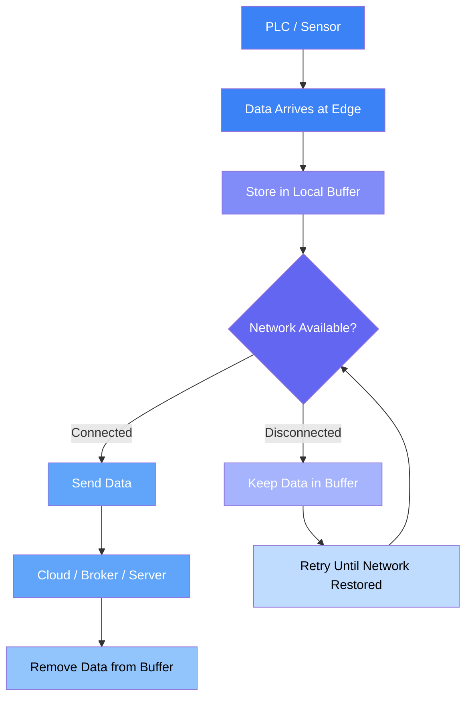

This solves the core problem in industrial data collection: network failures creating gaps in your time-series data. A four-hour outage would normally mean four hours of missing production data. With store-and-forward, that same outage causes zero data loss. Your destination system receives complete chronological data with only a delivery delay.

## Getting Started

Let's build a store-and-forward system to protect your data during network outages.

We'll approach this in six steps: establish a connection to collect data, set up a local buffer to temporarily store that data, write incoming data to the buffer, monitor network connectivity status, create forwarding logic to transmit buffered data when connectivity returns, and finally add error handling and buffer management to ensure reliable operation.

### Prerequisites

You'll need the following before implementing store-and-forward:

- **Edge Device Running FlowFuse Agent**: A running FlowFuse instance deployed on your edge hardware or gateway device.
- **node-red-node-sqlite**: SQLite node for local data storage.
- **node-red-contrib-ping**: Ping node for connectivity monitoring.

### Step 1: Set Up Data Collection

Data collection is the foundation of store-and-forward. Your edge device needs reliable connectivity to your data sources before you can buffer and forward their data.

FlowFuse handles this through Node-RED's 5,000+ community nodes, which support virtually every industrial protocol and interface—Modbus, OPC UA, MQTT, Ethernet/IP, GPIO pins, serial connections, and more. You collect data from your sources, transform it into the format you need, and prepare it for buffering.

For this guide, we'll assume you already have data flowing into FlowFuse. The store-and-forward pattern works the same regardless of which data sources or protocols you're using.

For more information on how FlowFuse can help you connect, collect, transform, and contextualize your data, and how it simplifies deployment, management, scaling, and security with enterprise features for production environments, [book a demo](/book-demo/).

### Step 2: Implement SQLite Buffering

SQLite provides the persistent storage layer for your store-and-forward buffer. It's lightweight, requires no separate database server, and handles the write volumes typical of industrial data collection without issue.

Follow these steps to set up your SQLite buffer:

1. Drag the **sqlite** node from the palette onto your workspace.

2. Double-click the node to open its configuration panel. Click the pencil icon next to the Database field to create a new database configuration. Give it a name like **sqlite**, select **Read-write-create** as the mode, and click **Add** to save the configuration.

{data-zoomable}
_SQLite database configuration with read-write-create mode enabled_

3. Set the SQL Query mode to **Fixed Statement**. In the SQL Query field, enter:

```sql
CREATE TABLE IF NOT EXISTS data_buffer (
    id INTEGER PRIMARY KEY AUTOINCREMENT,
    timestamp INTEGER NOT NULL,
    sent INTEGER DEFAULT 0,
    payload TEXT,
    created_at INTEGER DEFAULT (strftime('%s','now') * 1000)
);
```

The payload stores the serialized data as JSON. The `sent` flag indicates whether the record is still pending (0) or has been successfully delivered (1) — this acts as a safety marker to prevent cleanup of unsent data.

1. Connect an **Inject** node to **Sqlite** node
2. Deploy your flow and click the inject node button to create the table.

Your SQLite buffer is now ready to store data during network outages. The next step implements the logic to write incoming data to this buffer.

### Step 3: Store Incoming Data in Buffer

With your SQLite buffer ready, implement the logic to write incoming PLC data to storage.

1. Drag a **JSON** node onto the canvas and connect it to your data input source.

2. Double-click the node to open its configuration. Set the Action to `Always convert to JSON String` and set the Property to `msg.payload`, then click **Done** to save.

> **Note**: JSON converts your data object into a text string for storage. If your data source already provides a JSON string (not an object), you must delete this node.

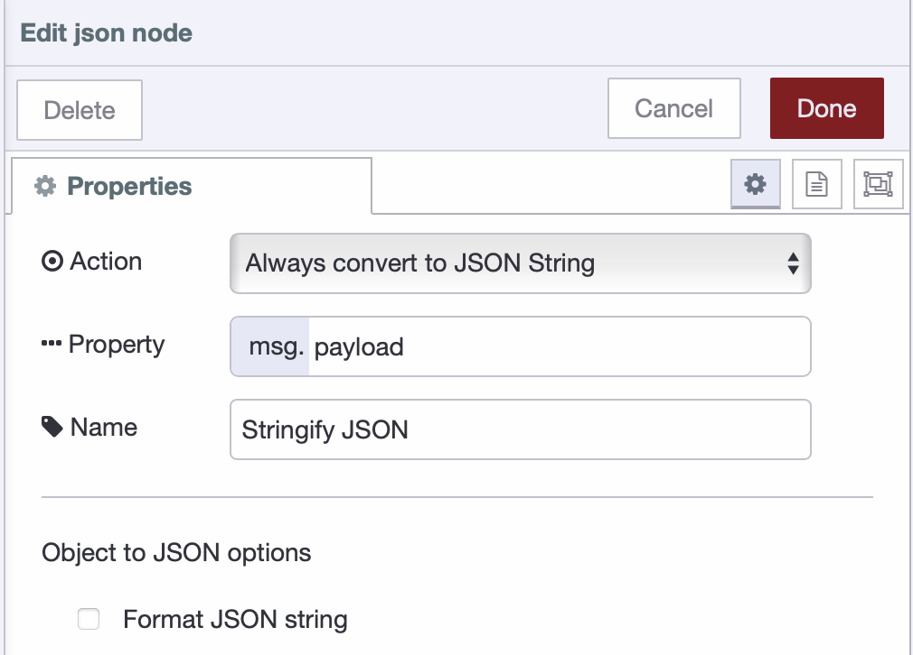{data-zoomable}
_JSON node configured to stringify payload data for storage_

3. Drag a **Change** node onto the canvas and connect it to the **JSON** node.

4. Double-click the **Change** node to configure it. Add the following rules:
   - **Rule 1**: Set `msg.params` to `{}` (JSONata expression)
   - **Rule 2**: Set `msg.params.$ts` to `msg.timestamp`
   - **Rule 3**: Set `msg.params.$payload` to `msg.payload`

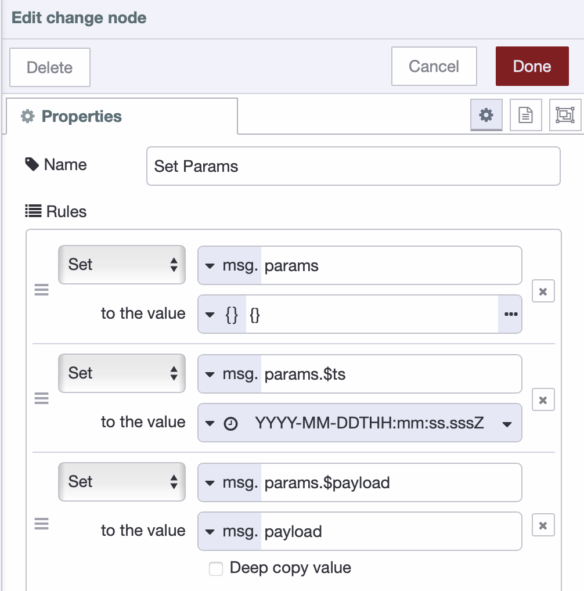{data-zoomable}
_Change node rules for preparing SQLite insert parameters_

5. Drag another **Sqlite** node onto the canvas and connect it to the **Change** node.

6. Double-click the node to configure it. Select your existing **Sqlite** database, set the SQL Query mode to `Prepared Statement`, and in the SQL Query field, enter:

```sql
INSERT INTO data_buffer (timestamp, payload, sent)
VALUES ($ts, $payload, 0);
```

7. Click **Done** to save the configuration and deploy your flow.

Your buffer now accumulates all incoming data. Each data point is serialized to JSON, structured into parameters, and written to SQLite with `sent=0` (not yet forwarded). The prepared statement approach prevents SQL injection issues and handles special characters correctly.

### Step 4: Monitor Network Connectivity

Network connectivity monitoring determines when your system can forward buffered data. The ping node checks connectivity to your destination system, and when the network is available, it triggers the forwarding process.

Follow these steps to implement connectivity monitoring:

1. Drag a **Ping** node onto the canvas.

2. Double-click the node to configure it. Enter the IP address or hostname of your destination system in the Target field (e.g., `broker.flowfuse.cloud`), select mode to "Automatic", set "Ping every" to `30` seconds (adjust based on your requirements), name it "Network Health Check", and click **Done** to save.

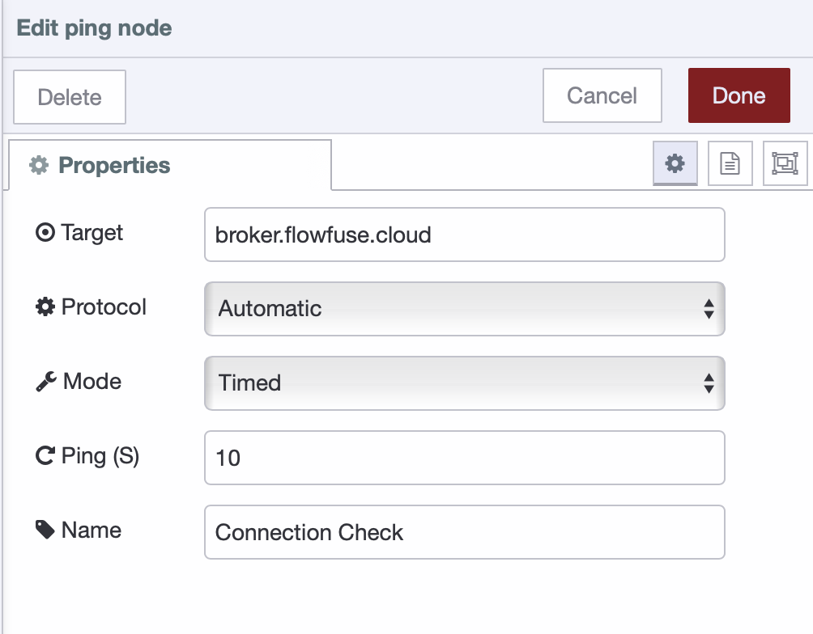{data-zoomable}
_Ping node configured to monitor network connectivity every 30 seconds_

3. Drag a **Switch** node onto the canvas and connect it to the **Ping** node.

4. Double-click the **Switch** node to configure it. Set the Property to `msg.payload`, 
    - add Rule 1 as `false` (network is down), 
    - add Rule 2 as `otherwise` (network is reachable).

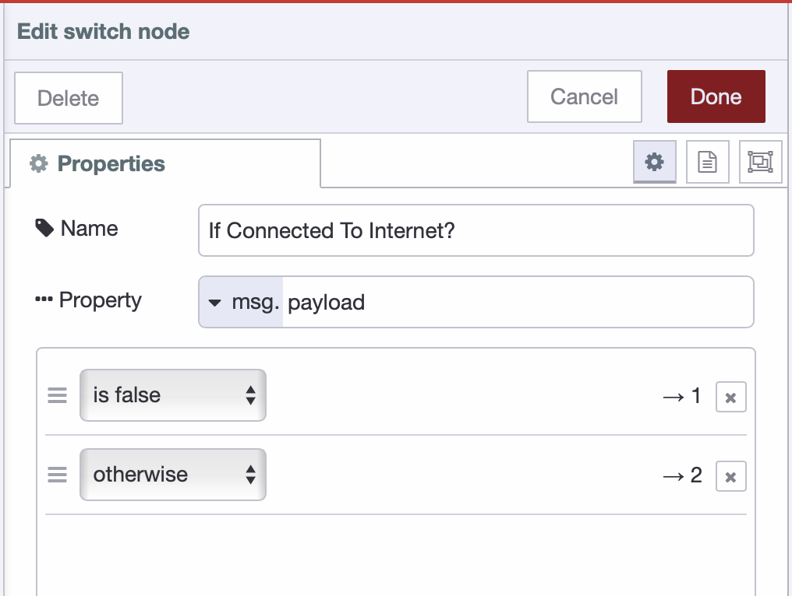{data-zoomable}
_Switch node routing messages based on network connectivity status_

5. Click **Done** to save.

The switch node routes messages based on ping results. When ping fails, `msg.payload` is `false`. Otherwise, the ping succeeded with a response time.

6. Drag two **change** nodes onto the canvas. Connect the first one to output 1 of the switch node (network down), and the second one to output 2 (network reachable).

7. Double-click the first change node to configure it:
   - **Rule 1**: Set `flow.networkOnline` to `false` (boolean) ( make sure it is stored in the persistent storage )
   - Name it "Set Network Offline"
   - Click **Done** to save.

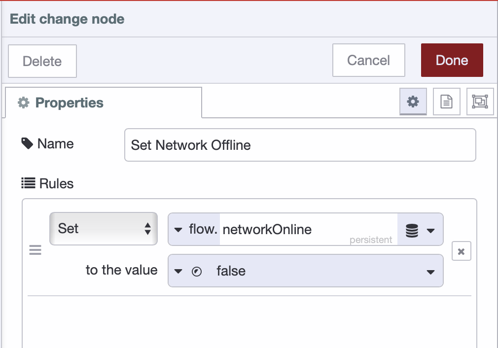{data-zoomable}
_Change node setting network offline flag in persistent storage_

8. Double-click the second change node to configure it:
   - **Rule 1**: Set `flow.networkOnline` to `true` (boolean)
   - Name it "Set Network Online"
   - Click **Done** to save.

{data-zoomable}
_Change node setting network online flag when connectivity is restored_

9. Drag another **change** node onto the canvas and configure it:
    - **Rule 1**: Set `flow.flowError` to **false** (this resets the error state triggered in the [Handle Errors and Disconnections](#handle-errors-and-disconnections) section).

{data-zoomable}
_Change node resetting error state when network becomes available_

10.  Drag a **Link Out** node onto the canvas and connect it to the "Set Network Online" node. Name it "Trigger Forward".

Your connectivity monitoring is now complete. When the network is available, the system will trigger the forwarding logic to send buffered data.

### Step 5: Build the Forwarding Logic

The forwarding logic retrieves unsent data from the buffer, prepares it for transmission, and sends it to the destination. This section shows how to build a forwarding system that processes buffered data in batches.

#### Retrieve and Prepare Unsent Records

1. Drag a **Link In** node onto the canvas and name it "Trigger Forward". Link this to the **Link Out** node from Step 4.

2. Drag an **SQLite** node onto the canvas and connect it to the **Link In** node. Name it "Get Unsent Data" and configure it by selecting your database, setting SQL Query mode to **Fixed statement**, and entering the following SQL:
```sql
   SELECT * FROM data_buffer 
   WHERE sent = 0 
   ORDER BY timestamp ASC 
   LIMIT 50;
```

3. Click **Done** to save.

4. Drag a **Split** node onto the canvas and connect it to the SQLite node. Configure it to split **msg.payload** and click **Done**.

5. Drag a **Change** node onto the canvas and connect it to the **Split** node. Name it "Prepare Forward Message" and add the following rules:
   - **Rule 1**: Set `msg.record_id` to `msg.payload.id`
   - **Rule 2**: Set `msg.payload` to `msg.payload.payload`

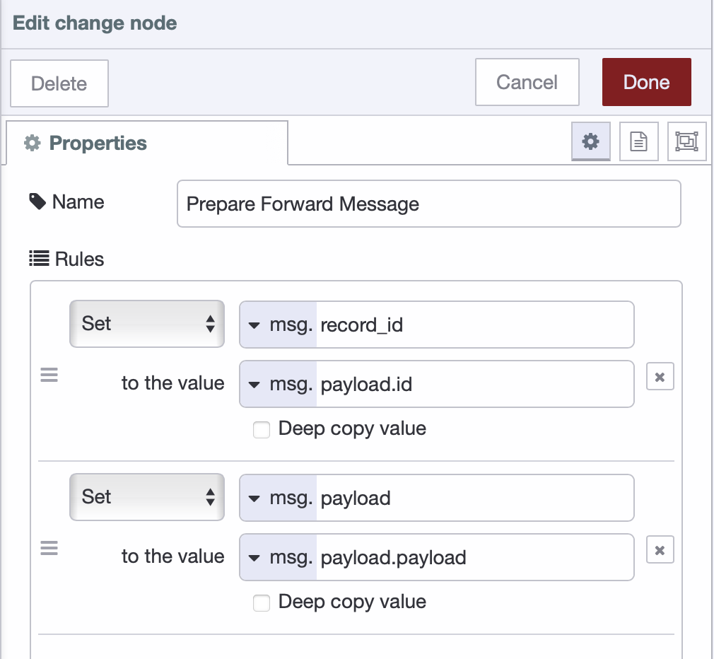{data-zoomable}
_Change node extracting record ID and payload for forwarding_

6. Click **Done** to save.

7. Drag a **JSON** node onto the canvas and connect it to the **Change** node. Configure it by setting Action to **Always Convert to JSON Object** and Property to `msg.payload`, then click **Done**.

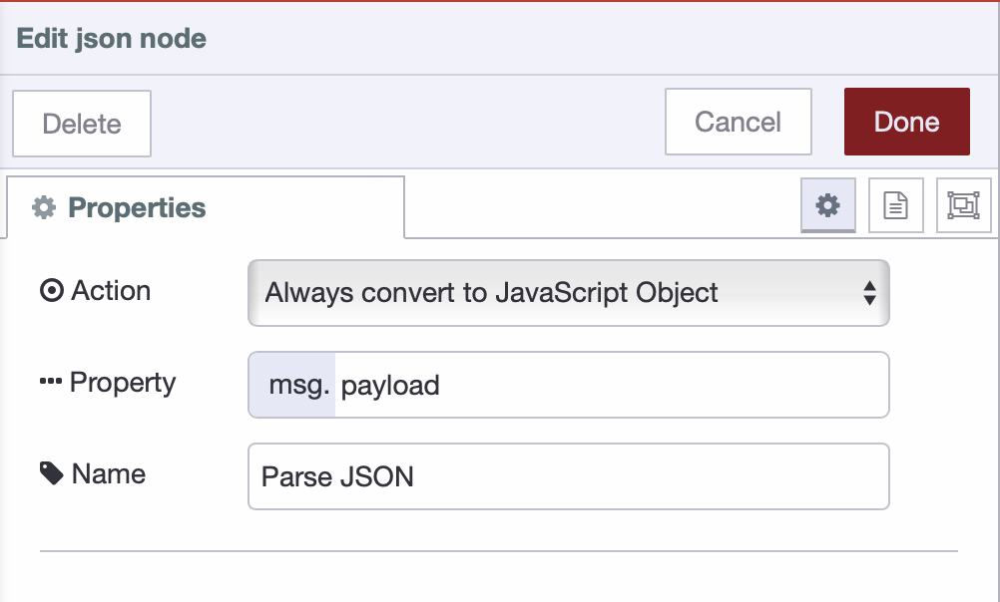{data-zoomable}
_JSON node configured to parse stored JSON string back to object_

8. Click **Done** to save.

9. Drag a **Link Out** node onto the canvas and connect it to the **JSON** node. Name it "Send to Destination".

Your forwarding logic now retrieves unsent records, prepares them for transmission, and passes them to the next stage for sending.

### Step 6: Send Data and Handle Errors

This step implements data transmission to your destination with comprehensive error handling and buffer management.

#### Send Data to Destination

1. Drag a **Link In** node onto the canvas and link it to the **Link Out** node from Step 5. Name it "Send to Destination".

2. Drag a **Switch** node onto the canvas and connect it to the **Link In** node. Name it "Check Network Online", set the Property to `flow.networkOnline`, add a condition `is true`, and click **Done** to save.

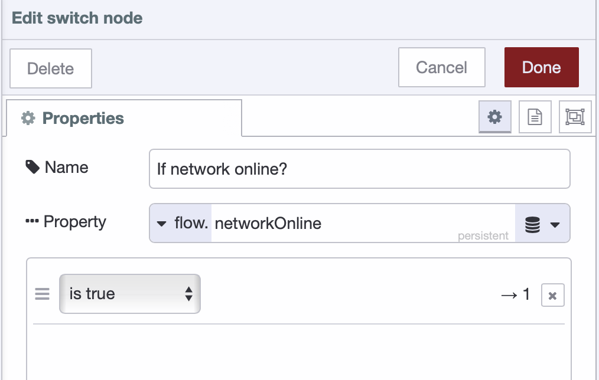{data-zoomable}
_Switch node verifying network connectivity before sending data_

3. Drag another **Switch** node onto the canvas and connect it to the first switch node's output. Name it "Check Flow Error", set the Property to `flow.flowError`, add a condition `is false`, and click **Done** to save.

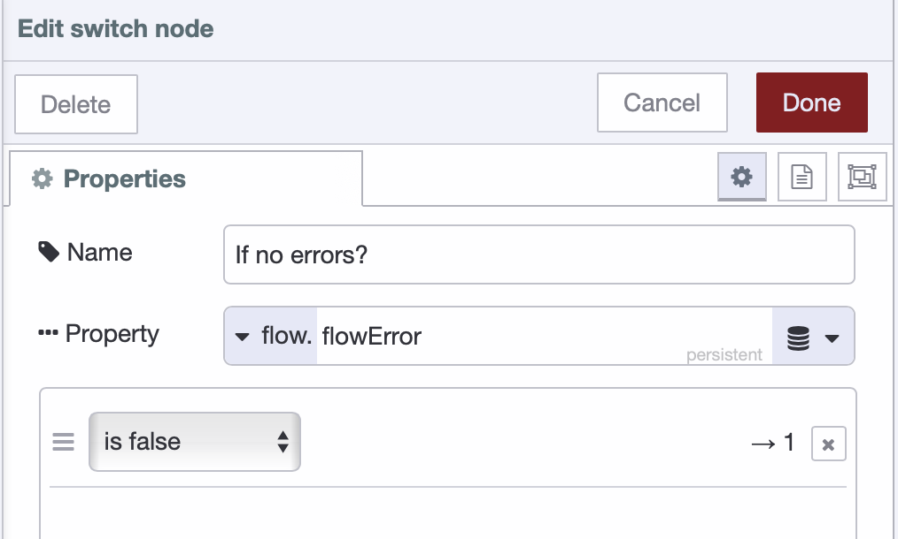{data-zoomable}
_Switch node checking for error-free state before transmission_

4. Drag a **Change** node onto the canvas and connect it to the second switch node's output. Configure it to append the record ID into the payload for transmission confirmation:
   - Rule 1: Set `msg.record_id` to `msg.payload.record_id`

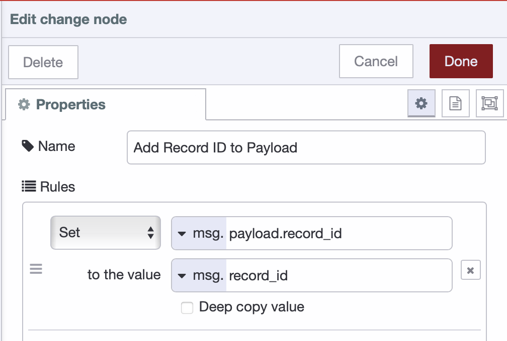{data-zoomable}
_Change node preserving record ID for transmission confirmation_

5. Drag a **Project Out** node onto the canvas and connect it to the **Change** node. Double-click the node to open its configuration. Select "Send to specified node" as the mode, then enter select target "broadcast message" and enter topic (for example: `acme_manufacturing/plant_01/floor_2/cell_a/machine_A12/measurements`). Click **Done** to save the configuration.

> **Note:** you can use any output node that suits your architecture instead of Project Out, such as **MQTT Out** for publishing to MQTT brokers, **HTTP Request** for sending data to REST APIs, **Database** nodes for writing directly to databases or other protocol-specific nodes depending on your destination requirements.

6. Deploy the flow.

#### Mark Records as Sent and Clear Buffer

1. Drag a **Project In** node onto the canvas, double-click the node to configure it with source set to "Listen for broadcast messages", and configure it to listen on all instances and devices with the topic that should match the same topic you configured in the Project Out node earlier to subscribe to your data that was sent before.

> **Note:** The Project In node is used here to confirm successful transmission when using Project Out nodes. If you are using other output nodes such as MQTT Out, HTTP Request, or database nodes, replace the Project In node with the corresponding confirmation mechanism for your chosen protocol. For example, if your output node such as HTTP Request responds with a status code or success message, you can use that response directly for confirmation instead of the Project In node.

2. Drag a **Change** node onto the canvas and connect it to the **Project In** node. Name it "Prepare Record ID" and configure the following rules:
   - **Rule 1**: Set `msg.params` to `{}` (JSONata expression: `{}`)
   - **Rule 2**: Set `msg.params.$record_id` to `msg.record_id`

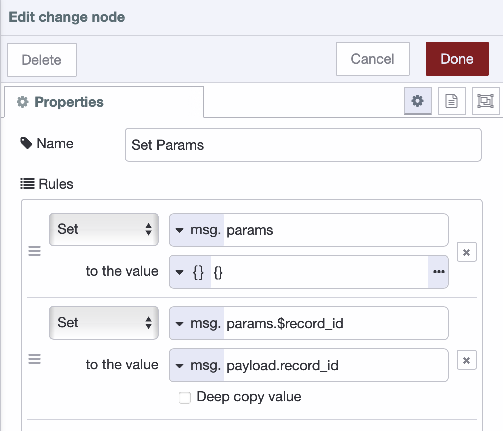{data-zoomable}
_Change node preparing parameters for marking record as sent_

3. Click **Done** to save.

4. Drag an **SQLite** node onto the canvas and connect it to the **Change** node. Name it "Mark as Sent", then double-click it to configure. Select your database, set SQL Query mode to **Prepared Statement**, and enter the following SQL:
```sql
   UPDATE data_buffer 
   SET sent = 1 
   WHERE id = $record_id;
```

5. Click **Done** to save.

6. Drag another **SQLite** node onto the canvas and connect it to the previous SQLite node. Name it "Delete Record", then double-click it to configure. Select database, set SQL Query mode to **Prepared Statement**, and enter the following SQL:
```sql
   DELETE FROM data_buffer
   WHERE id = $record_id
   AND sent = 1;
```

7. Click **Done** to save and deploy the flow.

#### Handle Errors and Disconnections

1. Drag a **Catch** node onto the canvas. Configure it to catch errors from all nodes.

2. Drag a **Change** node onto the canvas and connect it to the **Catch** node.

3. Name it "Set Flow Error" and configure it:
   - **Rule 1**: Set `flow.flowError` to `true` (boolean)

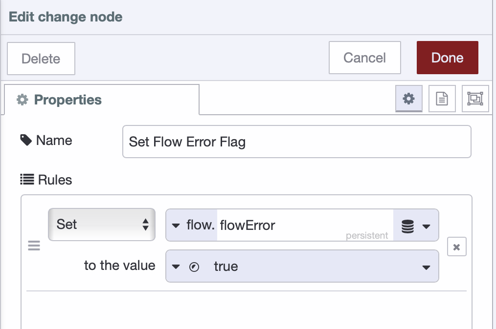{data-zoomable}
_Change node setting error flag when transmission fails_

4. Click **Done** to save.

5. Drag a **Status** node onto the canvas and configure it to monitor the **Project** node's status.

6. Drag a **Switch** node onto the canvas and connect it to the status node.

7. Name it "Check Disconnected", set the Property to `msg.status.text`, add a condition `==` with value `disconnected`, and click **Done** to save.

8. Drag a **Change** node onto the canvas and connect it to the **Switch** node.

9. Name it "Set Network Failure Flag" and configure it:
   - **Rule 1**: Set `flow.networkOnline` to `false` (boolean)

10. Click **Done** to save and deploy your flow.

## Conclusion

You now have a working store-and-forward system that protects your data during network failures.

When the network is up, data flows through the buffer and transmits immediately. When the network goes down, data accumulates in SQLite. When connectivity returns, the buffered data forwards automatically while new data continues collecting. No data is lost, regardless of how long the outage lasts.

This pattern solves a common problem in industrial environments: maintaining complete time-series data when network infrastructure fails. Your production systems can now operate independently of network reliability.

The system you've built is production-ready as-is, but you can extend it based on your requirements—add monitoring for buffer capacity, implement data validation rules, or configure forwarding to multiple destinations. The core mechanism remains the same.

If you want to get the flow template that you can use directly and modify according to your needs, check out our [latest blueprint](/blueprints/getting-started/store-and-forward/).
