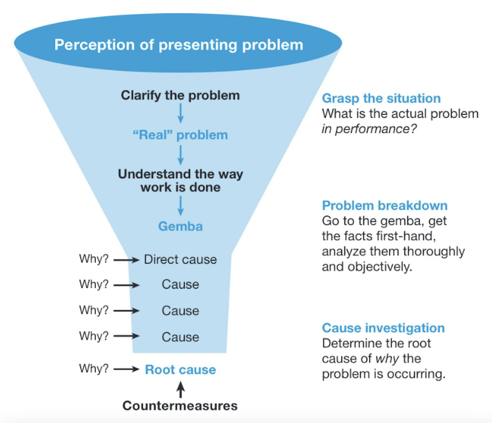

The Five Whys is a root cause analysis technique where you ask "why" repeatedly—typically five times—until you identify the underlying systemic cause instead of just symptoms.

<!--more-->

Your equipment fails on Tuesday. The maintenance team fixes it. It fails again on Friday. They fix it again. Three weeks later, same failure. This cycle continues because everyone treats the symptom—the broken part—instead of asking why it broke.

The Five Whys breaks this pattern. Developed by Sakichi Toyoda at Toyota in the 1930s, it's become the standard root cause analysis method across manufacturing, healthcare, software development, and anywhere recurring problems drain productivity. The technique works through systematic questioning that strips away symptoms to expose fixable failures in your systems—the process gaps, training deficiencies, and procedural weaknesses that allow problems to persist. When applied correctly, it takes under an hour and prevents problems from returning.

## What Is the Five Whys Method?

The Five Whys is a questioning technique where you ask "why" a problem occurred, then ask "why" that condition existed, then keep asking until you hit something you can actually fix at a systemic level. It was developed by Sakichi Toyoda in the 1930s and became a core tool in the Toyota Production System. Today it's used across manufacturing, healthcare, software development, and anywhere else people need to solve recurring problems.

The technique is deceptively simple. You start with a specific problem. You ask why it happened. You take that answer and ask why again. You keep going until asking "why" one more time would just be splitting hairs or rehashing what you already know. Usually that takes about five iterations—the number comes from the observation that five whys is typically sufficient to reveal the root cause—but I've seen effective analyses that stopped at three and others that went to eight.

Watch this video if you prefer video format:

<lite-youtube videoid="-_nN_YTDsuk" params="rel=0" style="margin-top: 20px; margin-bottom: 20px; width: 100%; height: 480px;" title="YouTube video player"></lite-youtube>

## Why the Five Whys Works When Other Methods Don't

Organizations often spend weeks on elaborate root cause analyses using [fault trees](https://en.wikipedia.org/wiki/Fault_tree_analysis), [fishbone diagrams](https://en.wikipedia.org/wiki/Ishikawa_diagram), and [statistical process control charts](/blog/2025/07/quality-control-automation-spc-charts), only to implement solutions that don't stick. The Five Whys succeeds where these methods often fail for three reasons.

First, it's fast. You can complete a thorough analysis in under an hour. That speed matters because problems are freshest when they just happened. Witnesses remember details. Physical evidence hasn't been cleaned up or moved. The sense of urgency is still there. Wait two weeks to schedule your analysis meeting, and you're working from memory and assumptions.

Second, it's accessible. The machine operator who saw the problem doesn't need training in statistical methods or failure mode analysis. They just need to answer questions honestly about what they observed. This democratization of problem-solving means you're not waiting for specialists to free up their calendars. The people closest to the work can solve problems themselves.

Third, it forces you to follow a single causal chain all the way down. Other methods encourage you to map out every possible contributing factor simultaneously. That comprehensiveness sounds good in theory, but in practice it often leads to analysis paralysis. You've identified seventeen potential causes, and now you're trying to fix all of them at once. The Five Whys makes you pick the most likely path and follow it to the end. You can always come back and explore alternative explanations if your first solution doesn't work.

## The Five Whys Checklist: What You Need Before You Start

Most failed Five Whys sessions fail before they even begin because people skip the setup. You need four things in place before you ask the first question.

Before you ask the first question, you need four things:

- **A specific problem statement.** "Quality issues in Department B" won't work. "Thirty-seven units failed final inspection on December 18th due to incomplete welds" will. Specificity disciplines your thinking and keeps the analysis focused.

- **The right people.** That means at least one person who directly observed or experienced the problem, someone who understands the process well enough to spot abnormal conditions, and a facilitator who can keep the questions moving forward. Three to five people is ideal. More than that and you'll spend more time managing the discussion than conducting the analysis.

- **Location at the gemba.** Conduct the analysis close to where the problem occurred. This principle, which Toyota calls [gemba](https://en.wikipedia.org/wiki/Gemba), matters more than most people realize. Conference rooms encourage abstract thinking. The shop floor, the customer service desk, or the server room keeps everyone grounded in physical reality. You can point at things. You can test hypotheses on the spot.

- **Commitment to honest answers.** If the real reason your new hires keep making mistakes is that your training program is inadequate, you need people willing to say that out loud. If your preventive maintenance schedule was designed fifteen years ago and never updated, someone needs to acknowledge it. The Five Whys only works if people tell the truth about what they see.

## How to Complete a Five Whys Root Cause Analysis

The mechanics of the method are straightforward, but execution requires more care than most people expect.

_Five Whys funnel diagram from problem to root cause_

Start by stating the problem as precisely as you can. Write it down where everyone can see it. If you're working through this at the gemba, write it on a whiteboard or a large sheet of paper. If you're remote, put it in a shared document. The problem statement anchors everything that follows, so take the time to get it right. Include what happened, when it happened, where it happened, and how you know it happened. Measurements matter here. "Production was slow" is too vague. "Line 3 produced 847 units against a target of 1,000 units during the first shift on December 20th" gives you something concrete to investigate.

Ask your first why: Why did this specific problem occur? The answer should be factual, not speculative. "I think maybe the bearings were worn" isn't good enough. "The motor seized, and when we disassembled it, we found metal shavings in the bearing housing" is what you're after. If you don't know the answer with certainty, stop and gather evidence before continuing.

Take that answer and ask why again. Why did the motor bearings fail? Because the lubrication system wasn't delivering oil to that bearing. How do you know? Because we checked the oil flow and found the feed line was clogged. This is where many analyses go wrong. People start speculating instead of observing. They say things like "probably the operator forgot to check it" when what they actually know is that the line was clogged. Stick to what you can verify.

Continue this pattern. Each answer becomes the subject of the next question. Why was the feed line clogged? Because particulate from the oil reservoir got into the line. Why was there particulate in the reservoir? Because we're not filtering the oil when we top off the reservoir. Why aren't we filtering it? Because the maintenance procedure doesn't specify using a filter when adding oil.

Stop when you've identified a process failure or systemic gap. In this case, the inadequate maintenance procedure is your root cause. It's something you can fix with a clear corrective action: revise the maintenance procedure to require filtered oil and provide the appropriate filtering equipment. That's different from "operator error" or "equipment failure," which are symptoms, not causes.

Notice that this example took exactly five questions, but that's coincidental. Effective analyses sometimes reach the root cause in three questions and other times need eight. The number doesn't matter. What matters is reaching the point where you've identified something you can actually fix.

## When and Where Should You Use the Five Whys?

The Five Whys is particularly effective for problems with a dominant causal chain. If your problem has one primary cause with some contributing factors, this method will find it quickly. It works well for equipment failures, quality defects, process bottlenecks, safety incidents, and customer complaints where you're trying to understand what broke down in your systems.

It's less effective for complex problems with multiple simultaneous causes that interact with each other. If you're investigating a major product recall with contributing factors spanning design, materials, manufacturing, and distribution, the Five Whys will feel inadequate. You're better off with something like fishbone analysis or fault tree analysis that lets you map multiple causal pathways simultaneously.

The method also struggles with problems that have deep organizational or cultural roots. If your real issue is that nobody wants to report problems because they fear retaliation, asking "why" five times might surface that fact, but fixing it requires organizational change management that's well beyond what a questioning technique can address. The Five Whys can identify the issue, but you'll need other tools to solve it.

The method works well for equipment failures and maintenance issues, quality problems that recur despite corrections, process bottlenecks that resist obvious solutions, safety incidents requiring rapid investigation, and customer complaints where you need to fix internal processes. It struggles with problems that have multiple independent causes, new product development scenarios where you're trying to prevent future failures, strategic planning issues, and situations where participants don't have sufficient knowledge to answer accurately.

## The Toyota Five Whys: Where This Method Came From

[Sakichi Toyoda](https://en.wikipedia.org/wiki/Sakichi_Toyoda) developed the Five Whys in the 1930s as part of the manufacturing methodology that would eventually become the [Toyota Production System](https://en.wikipedia.org/wiki/Toyota_Production_System). Toyoda, who founded what would become Toyota Industries, was obsessed with understanding why things failed. His approach was radical for its time: instead of accepting problems as inevitable, he insisted they were symptoms of deeper issues that could be identified and eliminated.

His son [Kiichiro Toyoda](https://en.wikipedia.org/wiki/Kiichiro_Toyoda) and engineer [Taiichi Ohno](https://en.wikipedia.org/wiki/Taiichi_Ohno) refined the method as they developed Toyota's production system in the decades after World War II. They formalized the practice of going to the gemba to observe problems firsthand and asking why until you hit something systemic rather than symptomatic.

Toyota's success with this approach attracted attention in the 1970s and 1980s when Western manufacturers were trying to understand why Japanese companies were outcompeting them. The Five Whys spread beyond automotive manufacturing into other industries, though often without the cultural foundation that made it effective at Toyota. Many companies adopted the technique as a standalone tool without understanding that it only works in an environment where people feel safe identifying systemic problems and where management is committed to fixing them.

That context matters when you're implementing the Five Whys in your organization. The technique itself is simple, but it won't survive in a culture that shoots the messenger or treats problem identification as complaining rather than continuous improvement.

## Best Practices From Experienced Root Cause Analysis

Focus on processes and systems, not people. When your analysis points to an individual who made a mistake, don't stop there. Ask why that mistake was possible. Why didn't training cover this situation? Why didn't the procedure include a verification step? Why wasn't there a physical or administrative control that would have caught the error? Robust processes assume people will make mistakes and build in safeguards. If your process allows one person's mistake to cause a significant problem, your process is inadequate.

Verify every answer before moving to the next question. The Five Whys fails when it becomes an exercise in brainstorming rather than investigation. Each answer should be based on evidence you can point to: physical observations, data from sensors or logs, documents, measurements, or direct testimony from witnesses. If your team is guessing, stop and gather facts.

Stay on one causal chain at a time. Real problems often have multiple contributing causes, and your team will want to explore all of them simultaneously. Resist this. Follow the most likely path all the way to the end first. If the corrective actions you implement don't solve the problem, you can come back and explore alternative paths. Trying to investigate everything at once creates confusion and dilutes your focus.

Keep your questions neutral. "Why did the operator forget to check the pressure?" assumes forgetfulness and points toward blame. "Why wasn't the pressure checked?" opens up multiple possibilities including procedural gaps, time pressure, distraction, inadequate training, or unclear responsibility. How you phrase the question shapes what answers you'll get.

Know when to stop. You've found your root cause when the answer identifies something you can fix through a procedural change, a training modification, a design improvement, or another corrective action that addresses the systemic level. If you keep asking why beyond that point, you'll end up with philosophical answers about organizational culture or budget constraints that aren't actionable in the context of this specific problem.

## Common Mistakes That Undermine Five Whys Analysis

The most frequent mistake is stopping at symptoms. A part fails, and the team replaces it, logs "component failure" as the root cause, and moves on. That's not root cause analysis. That's just describing what happened. The root cause is why the component failed: inadequate maintenance, incorrect installation, design limitation, contamination, or some other systemic issue that made the failure possible.

Another common failure is accepting "human error" as a root cause. People make mistakes. This is not new information. If your analysis concludes that someone made a mistake, ask why that mistake was possible and why existing safeguards didn't prevent or catch it. Human error is a symptom, not a cause.

Teams sometimes rush through the analysis because they're uncomfortable with the questions. Someone asks why a procedure wasn't followed, and instead of actually investigating, the team quickly blames the operator and moves on. This happens in organizations where problem-solving has become a blame-finding exercise. If your culture doesn't support honest answers, the Five Whys won't work regardless of how well you understand the technique.

Some teams branch off into multiple causal chains without finishing any of them. They ask the first why, get an answer, then immediately see three more potential causes and start investigating all of them. Before long, they've filled a whiteboard with possibilities but haven't followed any single path to a concrete root cause. Discipline yourself to investigate one chain completely before exploring alternatives.

## Tools and Software for Five Whys Analysis

You don't need specialized software to conduct a Five Whys analysis. A whiteboard, a notepad, or a simple word processing document works fine. The tool matters far less than the discipline with which you apply the method.

That said, organizations that conduct frequent root cause analyses often find value in standardized digital tools. Quality management systems like ETQ, MasterControl, or Sparta Systems include Five Whys templates integrated with corrective action tracking. This integration helps ensure that the actions identified during analysis actually get completed and verified.

Project management platforms can be adapted for Five Whys documentation if you configure custom workflows. The advantage here is that corrective actions automatically flow into your existing task management processes rather than living in a separate system that nobody checks.

Some organizations prefer physical tools. I've worked in plants that keep Five Whys templates on clipboards at each production line. When a problem occurs, the shift supervisor conducts the analysis right there, documents it on the physical form, and posts it on a problem-solving board where everyone can see it. This visibility reinforces the importance of root cause analysis and shares lessons learned across shifts.

The best tool is the one your team will actually use consistently. If your organization already has a quality management system, use that. If you're just starting out, begin with the simplest thing that works: a shared document template and a commitment to complete one analysis per week.

## What Is the 5 Problem-Solving Steps Process?

The 5 problem-solving steps is a broader framework that incorporates the Five Whys as one component. The steps are: define the problem, analyze the root cause, develop solutions, implement corrective actions, and verify effectiveness. The Five Whys specifically addresses the second step, root cause analysis.

This framework matters because root cause analysis by itself doesn't solve problems. You also need clear problem definition up front, solution development after you identify the cause, disciplined implementation, and verification that your corrective actions actually worked. Organizations sometimes do excellent Five Whys analyses but never implement the corrective actions they identify. The analysis becomes an end in itself rather than a means to improvement.

Effective problem-solving requires all five steps in sequence. Rushing to solutions before you understand root causes leads to wasted effort fixing the wrong things. Identifying root causes but failing to implement solutions means nothing changes. Implementing solutions without verification means you never know if they actually worked or if the problem just hasn't recurred yet by chance.

## Example of a 5 Why Question in Practice

What does an effective Five Whys question actually sound like? Here's the classic example from Taiichi Ohno, one of the architects of the Toyota Production System, documented in his book "Toyota Production System: Beyond Large-Scale Production" (1988, p. 17).

**The problem:** A machine stopped functioning on the factory floor.

**Why #1:** "Why did the machine stop?"  
*Answer:* There was an overload and the fuse blew.

**Why #2:** "Why was there an overload?"  
*Answer:* The bearing was not sufficiently lubricated.

**Why #3:** "Why was it not lubricated sufficiently?"  
*Answer:* The lubrication pump was not pumping sufficiently.

**Why #4:** "Why was it not pumping sufficiently?"  
*Answer:* The shaft of the pump was worn and rattling.

**Why #5:** "Why was the shaft worn out?"  
*Answer:* There was no strainer attached and metal scrap got in.

**Root cause:** No strainer in the lubrication system allowing debris contamination.

**Corrective action:** Install a strainer in the lubrication system to prevent metal scrap from entering the pump.

This example demonstrates the fundamental questioning pattern. Modern Five Whys analyses typically include more detailed evidence documentation at each step (inspection reports, sensor data, maintenance logs), but the core approach of following a single causal chain to reach a systemic issue remains unchanged. Notice how the analysis moved from a symptom (blown fuse) through intermediate causes (overload, insufficient lubrication, worn shaft) to arrive at a fixable process gap (missing strainer).

## Implementing the Five Whys in Your Organization

If you want to implement the Five Whys effectively, start with a pilot program rather than a company-wide rollout. Select one department or one type of problem as your initial focus. Train a small group of people thoroughly rather than providing superficial training to everyone. Conduct your first few analyses with experienced facilitation, ideally from someone who has used the method successfully in another organization.

Expect the first several analyses to feel awkward. People will struggle with phrasing neutral questions. They'll want to skip ahead to solutions before finishing the analysis. They'll be uncomfortable when the questioning reveals gaps in procedures or training. This is normal. The skill develops with practice.

After each analysis, conduct a brief debrief focused on the process itself. What went well? Where did we struggle? Did we gather evidence before answering, or did we speculate? Did we follow one causal chain to the end, or did we branch off into multiple paths? This reflection builds capability faster than simply conducting more analyses.

Track your corrective action completion rate. If actions identified during Five Whys analyses aren't being implemented, you have an organizational problem that needs attention. Root cause analysis without follow-through is worse than no analysis at all because it creates the illusion of improvement while nothing actually changes.

Give it six months before evaluating whether the method is working for your organization. You should see a reduction in recurring problems, faster resolution of new problems, and increasing confidence among frontline staff in their ability to identify and solve issues. If you're not seeing these outcomes, the problem is usually implementation rather than the method itself.

## Measuring Whether the Five Whys Is Working

How do you know if the Five Whys is actually improving your operations? Four metrics tell the story:

**Problem recurrence rates.** If you're conducting thorough root cause analyses and implementing effective corrective actions, the same problems should stop reappearing. Pull your incident data from six months before you started using the Five Whys and compare it to six months after. Look for problems that used to recur monthly or quarterly that have stopped appearing.

**Cycle time from problem to solution.** As your team gets more practiced with the method, this should decrease. Early on, you might take two weeks to complete an analysis and implement corrections. After several months of practice, you should be conducting same-day or next-day analyses with corrective actions implemented within a week.

**Quality of corrective actions.** Are you implementing procedural changes, training improvements, and system modifications? Or are you repeatedly concluding that operators need to "be more careful" and issuing reminders? High-quality corrective actions address systemic issues. Low-quality corrective actions ask people to try harder without changing anything about the system they work in.

**Staff engagement.** Are frontline staff bringing problems forward more readily? Are they participating actively in analyses? Are they suggesting root causes and corrective actions? Increasing engagement signals that the method is building problem-solving capability across your organization rather than remaining a management-only activity.

## The Limitations Nobody Talks About

The Five Whys has limitations that don't get discussed much in the literature promoting it. Understanding these limitations helps you apply the method appropriately rather than treating it as a universal solution.

First, the method assumes a relatively linear cause-and-effect relationship. Many real-world problems involve complex interactions between multiple systems where causes and effects aren't clearly distinguishable. Equipment failures in modern automated systems often result from software interactions, sensor drift, mechanical wear, and operator actions all contributing simultaneously. The Five Whys struggles with this kind of complexity because it forces you to follow a single thread.

Second, the technique depends entirely on the knowledge and honesty of the people answering the questions. If they don't actually know why something happened, they'll speculate. If they're afraid of identifying systemic issues that might reflect poorly on management, they'll stop at superficial answers. The Five Whys doesn't magically generate insight. It structures questioning, but the quality of answers depends on the people providing them.

Third, the method can lead to what statisticians call "confirmation bias." If your team already suspects the cause of a problem, the questions will unconsciously steer toward confirming that hypothesis rather than genuinely exploring alternatives. A facilitator aware of this bias can counteract it, but it requires conscious effort.

Finally, the Five Whys doesn't help you prioritize which problems to investigate. If you have twenty recurring issues, it doesn't tell you which five deserve immediate root cause analysis and which can wait. You need a separate prioritization framework based on safety risk, financial impact, frequency, or strategic importance.

These limitations don't make the method useless. They just mean you need to recognize when you're facing a problem that requires a different or additional approach.

## What Happens After the Analysis

The Five Whys analysis is the easy part. Implementation is where most organizations struggle. You've identified that your preventive maintenance schedule is inadequate, or your training program has gaps, or your procedures haven't been updated to match your current equipment. Now you have to actually fix these things, which requires resources, time, and organizational commitment.

Effective implementation requires clear ownership. Someone needs to be specifically responsible for each corrective action, with a realistic deadline and the authority to make the necessary changes. "The maintenance department will handle it" doesn't work. "James will revise the PM schedule by December 15th and review it with the maintenance manager before implementation" does.

Build verification into your corrective actions. How will you know if the changes you implemented actually solved the problem? In some cases, verification is straightforward: if the problem was equipment failures, track whether failures stop occurring. In other cases, you need to actively test: if you revised a procedure, observe someone following the new procedure to ensure it's clear and complete.

Communicate the results. When a Five Whys analysis leads to improvements, tell people about it. Post the analysis and the corrective actions where staff can see them. Mention it in team meetings. This visibility serves two purposes: it demonstrates that problem-solving leads to real changes, and it shares lessons learned across your organization so other areas can benefit from what you discovered.

Don't declare victory too soon. Some corrective actions take time to show results, and some problems are intermittent enough that you need several months of data to confirm they're truly resolved. Plan a follow-up review three to six months after implementation to verify effectiveness and make adjustments if needed.

The Five Whys is a tool for getting to root causes. But getting to root causes only matters if you do something about them. The analysis takes thirty minutes. The real work comes after.

## Monitor Your Corrective Actions Across All Systems

You've identified the root cause and implemented fixes. Now you need to verify they're working, across IT systems, OT equipment, quality databases, and maintenance platforms.

[FlowFuse](/) connects them all. Whether it's legacy PLCs or modern IoT sensors, ERP systems or SCADA networks, FlowFuse brings your data together in one place. Build dashboards that track the metrics proving your solutions worked: reduced equipment failures, lower defect rates, improved maintenance compliance, or whatever KPIs matter for your specific corrective actions.

Catch warning signs before problems recur. See trends that reveal whether your fixes are holding or degrading over time. Turn root cause analysis into continuous improvement with real-time monitoring.

[Start connecting your systems with FlowFuse](https://app.flowfuse.com) and prove your Five Whys analyses deliver lasting results.
