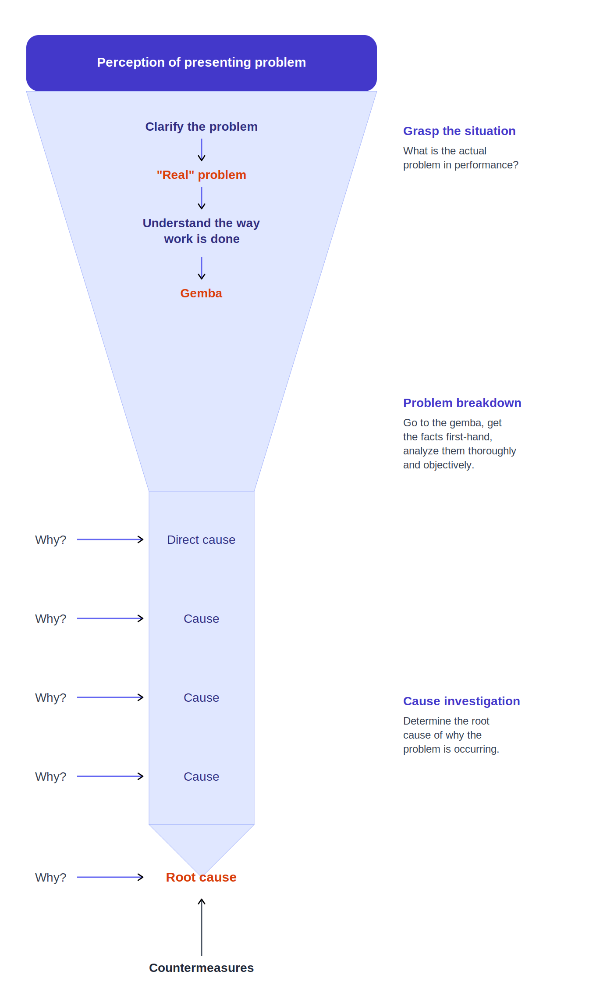

The 5 Whys is a root cause analysis technique where you ask "why" repeatedly until you identify an underlying cause rather than just treating the symptom.

<!--more-->

Your equipment fails on Tuesday. The maintenance team fixes it. It fails again on Friday. Three weeks later, the same failure occurs. The problem keeps returning because the repair addresses the immediate failure without investigating what caused it.

The 5 Whys provides a simple way to trace that failure back through its causes. This guide explains how the method works, when to use it, the classic Toyota example, and how to avoid common mistakes.

::

## What Is the 5 Whys Root Cause Analysis Method?

The 5 Whys is a questioning technique used to trace a specific problem back through its causes. Start with what happened, ask why it occurred, then use each answer as the basis for the next question.

The goal is to reach an underlying cause that can be addressed through a corrective action. The process usually involves around five questions, but there is no requirement to stop at exactly five.

## How to Run a 5 Whys Analysis

Start with a specific problem statement. "Quality issues in Department B" is too broad; "Thirty-seven units failed final inspection on December 18 due to incomplete welds" gives the team something concrete to investigate.

Bring together people who observed the problem or understand the process, along with someone who can facilitate the discussion. When practical, conduct the analysis at the [gemba](https://en.wikipedia.org/wiki/Gemba), close to where the problem occurred, so the team can examine the process and evidence directly.

*Five Whys funnel diagram from problem to root cause*

Then work through the causal chain:

1. **State the problem:** Describe what happened, where, when, and how you know it occurred.
2. **Ask why:** Identify the immediate cause of the problem.
3. **Verify the answer:** Check logs, measurements, physical evidence, or other reliable sources.
4. **Repeat:** Use the previous answer to form the next why question.
5. **Identify the root cause:** Stop when you've reached an underlying cause that can be addressed.
6. **Define the corrective action:** Specify what needs to change, who owns it, and how you will verify the result.

Each answer should be supported by evidence rather than assumptions. If the team cannot answer a question confidently, investigate the process before continuing.

Our [5 Whys template](/blog/2026/09/five-whys-template/) provides a ready-made structure for documenting the analysis and corrective actions.

## When to Use the 5 Whys (and When Not To)

The 5 Whys works best when a problem has a relatively straightforward causal chain. Common applications include equipment failures, quality defects, process bottlenecks, safety incidents, and customer complaints.

It is less suitable when a problem has several independent or interacting causes. A major product recall involving design, materials, manufacturing, and distribution may require methods such as a fishbone diagram or fault tree analysis to examine multiple pathways.

The method also cannot replace broader organizational changes. For example, if an investigation reveals that employees avoid reporting problems because they fear retaliation, identifying that condition is only the beginning. Addressing it requires changes beyond the Five Whys exercise itself.

## 5 Whys Best Practices and Common Mistakes

A useful Five Whys analysis depends on the quality of the answers. Base each answer on evidence that can be checked, such as a measurement, maintenance record, system log, physical inspection, or direct observation.

Don't stop at the immediate cause. "The bearing failed" describes what happened but doesn't explain why it failed. Continue until you identify an underlying condition that can be addressed.

Keep the analysis focused on the process rather than blaming an individual. If an operator made a mistake, investigate why the process allowed it to happen and why existing controls didn't catch it.

Don't force the analysis to exactly five questions. Stop when the evidence points to an actionable root cause, and investigate further if an answer is based on an assumption.

If the evidence shows that several independent causes contributed to the problem, investigate each causal path separately rather than forcing them into one chain.

## 5 Whys Example: The Original Toyota Case

The Five Whys is closely associated with the Toyota Production System and Taiichi Ohno, who described the technique through practical examples in *Toyota Production System: Beyond Large-Scale Production*.

One of the best-known examples begins with a machine stopping on the factory floor.

**The problem:** A machine stopped functioning.

**Why #1:** "Why did the machine stop?"
**Answer:** There was an overload and the fuse blew.

**Why #2:** "Why was there an overload?"
**Answer:** The bearing was not sufficiently lubricated.

**Why #3:** "Why was it not lubricated sufficiently?"
**Answer:** The lubrication pump was not pumping sufficiently.

**Why #4:** "Why was it not pumping sufficiently?"
**Answer:** The shaft of the pump was worn and rattling.

**Why #5:** "Why was the shaft worn out?"
**Answer:** There was no strainer attached and metal scrap got in.

**Root cause:** No strainer in the lubrication system allowed debris to enter the pump.

**Corrective action:** Install a strainer in the lubrication system to prevent metal scrap from entering the pump.

The analysis moves from the immediate symptom, a blown fuse, through several intermediate causes to a condition that can be addressed.

## Verify That the Corrective Action Worked

Finding a root cause is not the end of the investigation. You also need to confirm that the corrective action prevented the problem from recurring.

Choose a relevant measure before implementing the fix. Depending on the problem, this could be failure frequency, defect rate, downtime, or another process metric.

Continue monitoring after the change. If the same failure returns, the original analysis or corrective action may need to be revisited.

## 5 Whys Limitations

The Five Whys is simple, but its results depend on the quality of the investigation. If participants lack information or rely on assumptions, the causal chain can lead to the wrong conclusion.

It can also be affected by confirmation bias. If the team enters the investigation convinced that a particular cause is responsible, they may frame each question to support that assumption.

Finally, Five Whys is not a prioritization method. It helps investigate a problem; it does not determine which of many problems an organization should address first. That decision may require separate criteria such as risk, cost, frequency, or customer impact.