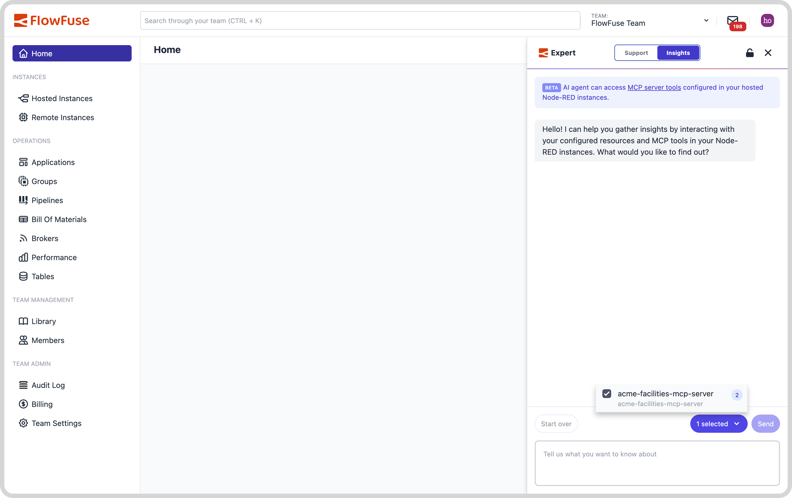
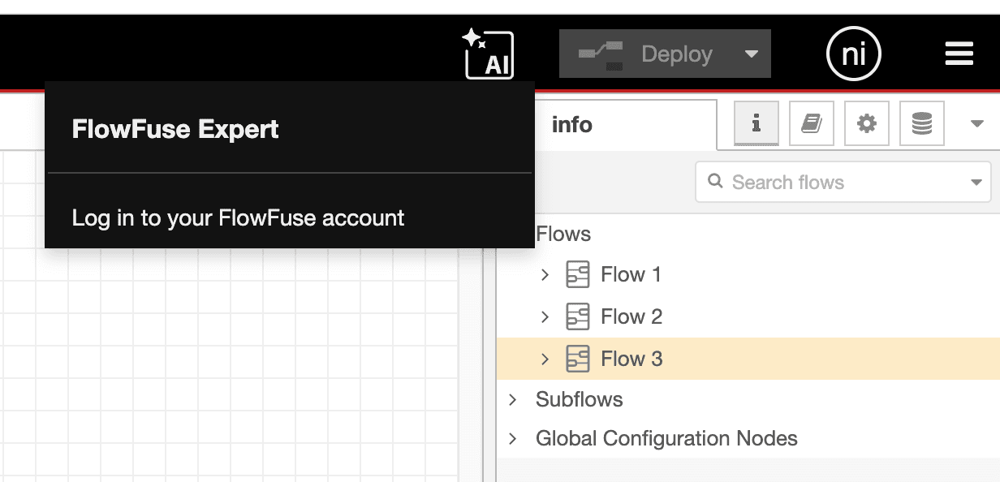
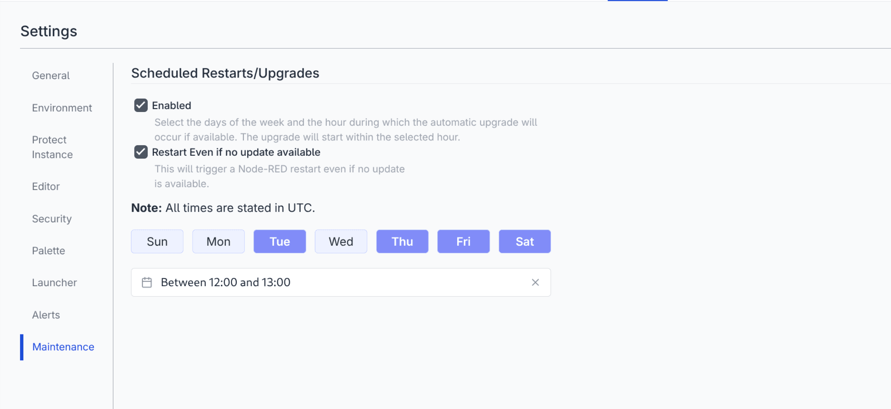

This release comes with some big updates for the FlowFuse Expert.

<!--more-->

## Interact with MCP Resources in FlowFuse Expert

_[FlowFuse Expert Interface]_

Our [MCP nodes](https://flowfuse.com/node-red/flowfuse/mcp/) make is super easy to extend AI Agents with tools and resources in your environment. With this release, we're introducing the ability to interact your MCP servers directly within the FlowFuse Expert.

Previously, when setting up an MCP server in FlowFuse, you would first designate your tools, resources, and servers in side of Node-RED using the MCP nodes. Then, to interact with them, you needed a separate tool like VSCode to query and perform operations.

We want you to be able to access your resources as quickly and easily as possible, and reduce the manual overhead involved in managing and querying your MCP resources.

We've greatly simplified this process. You can now set everything up in Node-RED and then use the FlowFuse expert to designate your tools and interact with them, without ever leaving FlowFuse. This will speed you up and simplify your operations.

## FlowFuse Expert Assistant in Node-RED

_[FlowFuse Expert UI]_

We're very excited to announce that all Node-RED users can now use our FlowFuse Expert Assistant. The ASsistant will help you create Function nodes, Template nodes, and explain highlighted flows using the Flow Explainer.

Previously, this was only available in Node-RED managed directly by the FlowFuse platform. Now everyone using Node-RED, whether they are a FlowFuse user or not, can make use of this technology and speed the development of their Node-RED workflows.

You will need an account on FlowFuse Cloud to connect it to, but for this release, it does *not* require a paid subscription to use.

Check the FlowFuse Expert Assistant docs for [how to get started](https://flowfuse.com/docs/user/assistant/#flowfuse-assistant-plugin).

## Improved Update Scheduling

_[Scheduled Updates Interface]_

We added the ability to schedule updates for your instances in the last release. Based on user feedback, we've now also added the ability to schedule restarting of your instance regardless of whether an update is available.

## Lots of small updates for a better user experience

When we plan our releases, we look for what will make good headlines in our release annoucements - the big, shiny features that can get lots of attention. Sometimes we also take an opportunity to clear lots of little issues that ultimately are less headline-worthy, but all make for a better user experience.

For example, this release sees lots of small improvements to the FlowFuse Tables user experience; adding the ability to refresh the displayed data, more accessible column table names, an improved layout. Nothing to set the socials buzzing, but genuine quality of life improvements to our users.

## What else is new?

For a complete list of everything included in our 2.25 release, check out the [release notes](https://github.com/FlowFuse/flowfuse/releases/tag/v2.25.0).

Your feedback continues to be invaluable in shaping FlowFuse's development. We'd love to hear your thoughts on these new features and any suggestions for future improvements. Please share your experiences or report any [issues on GitHub](https://github.com/FlowFuse/flowfuse/issues/new/choose).

Which of these new features are you most excited to try? Reach out on GitHub or social media!

## Try FlowFuse

### FlowFuse Cloud

The quickest way to get started is with FlowFuse Cloud.

[Get started for free]({{ site.appURL }}/account/create) and have your Node-RED instances running in the cloud within minutes.

### Self-Hosted

Get FlowFuse running locally in under 30 minutes using [Docker](/docs/install/docker/) or [Kubernetes](/docs/install/kubernetes/).
