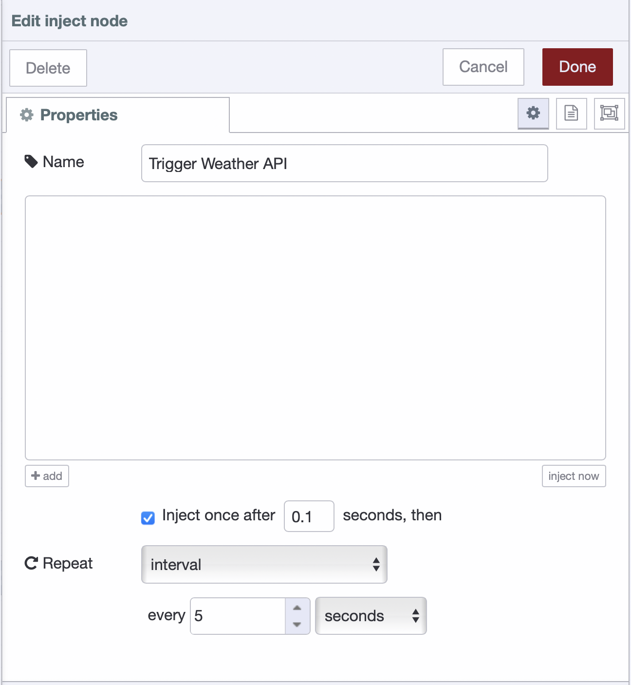
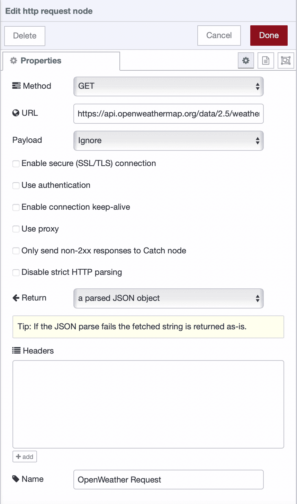
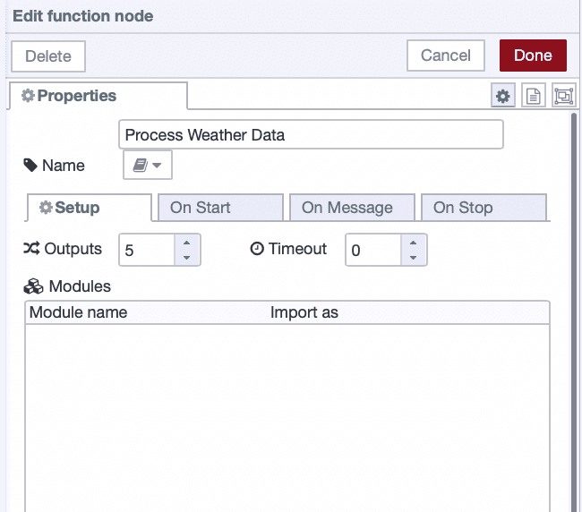
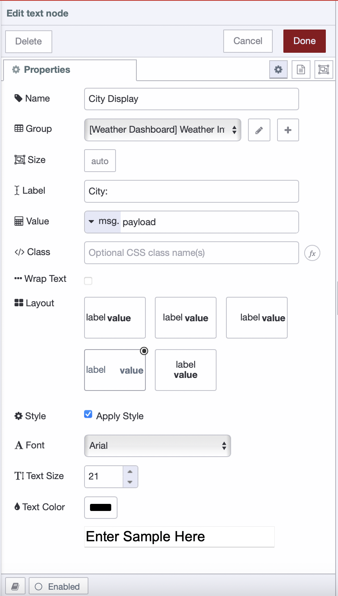
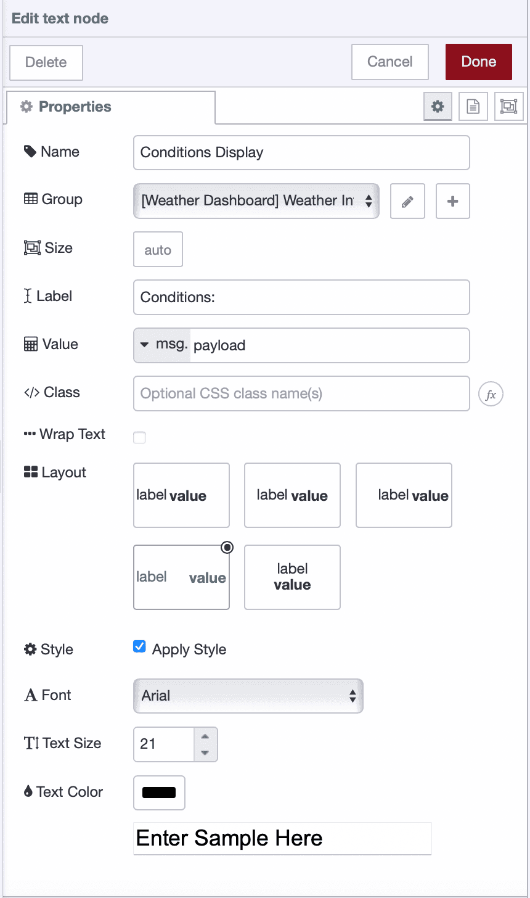
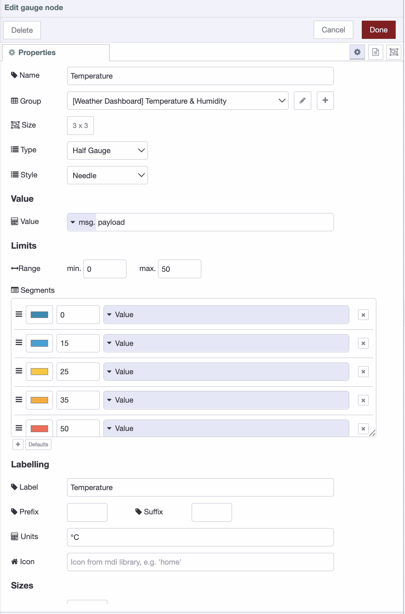
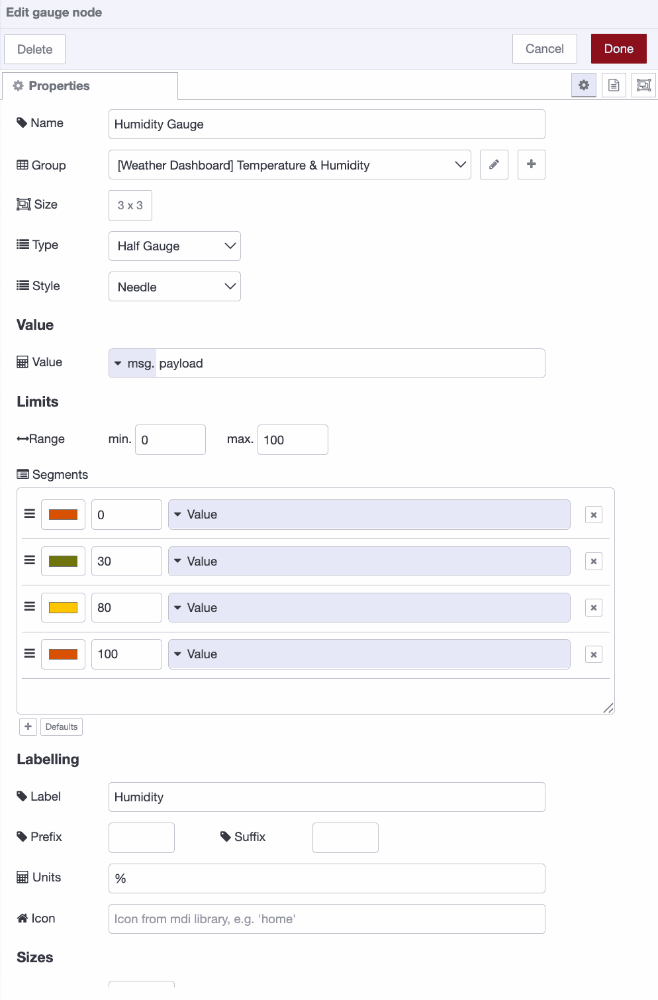
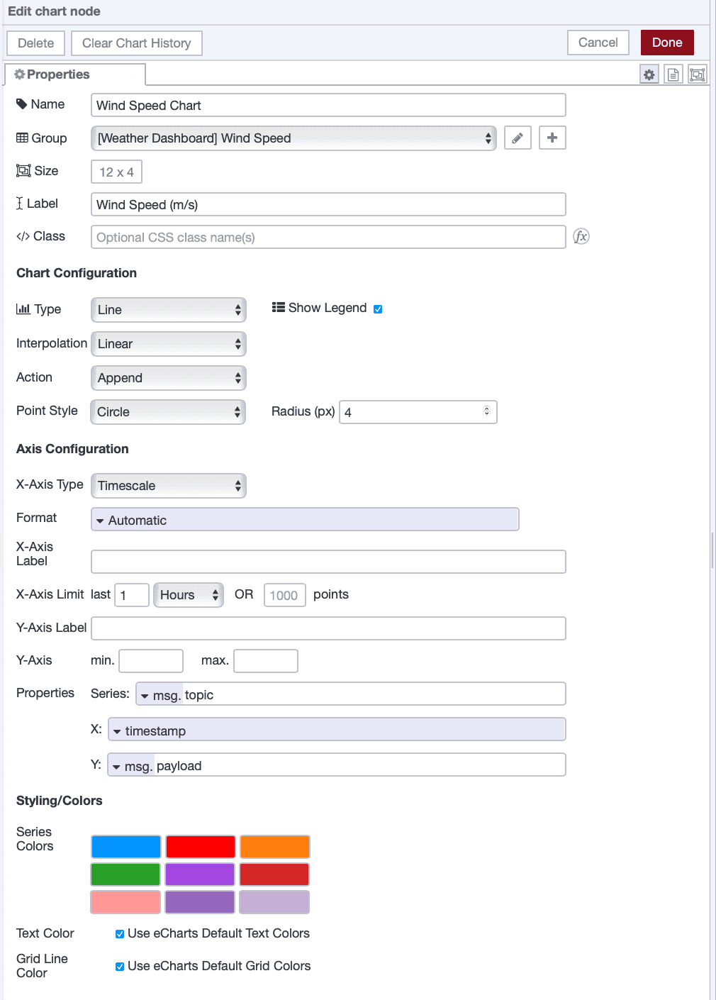
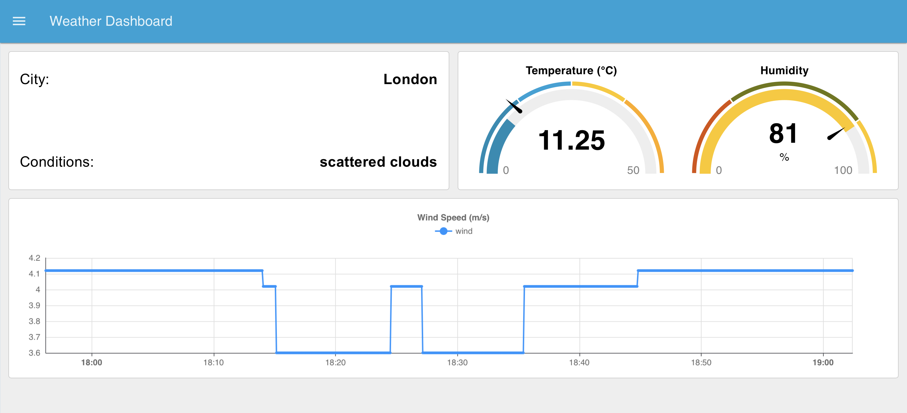

A weather dashboard is honestly the best first project if you're getting into Node-RED. Takes about 10-15 minutes from start to finish, and by the end you'll understand how the whole thing works - connecting to APIs, processing data, and displaying it visually.

<!--more-->

This isn't one of our typical deep-dive industrial posts—it's a straightforward starter tutorial. You'll be building something real: calling an actual weather API, handling JSON responses, and watching live data appear on your dashboard. It's the kind of project that makes Node-RED's flow-based approach suddenly make sense. Once you've built it, you'll have a solid foundation for more complex projects.

We'll use FlowFuse Dashboard for the UI since it's modern and easier to work with. If you know how to drag nodes around and hit the deploy button, you're ready to start.

## What You'll Need

Before you start, make sure you have:

- **Node-RED Instance:** You need Node-RED running somewhere. Easiest option is FlowFuse, [grab a free trial]() and you get a cloud-hosted instance ready to go. No server setup, no port forwarding hassles.
- **OpenWeatherMap Account:** Sign up at `openweathermap.org`. The free tier gives you enough API calls for this project.

## Installing FlowFuse Dashboard

First, get the dashboard package installed:

1. Click the hamburger menu in the top right corner
2. Select Manage palette
3. Go to the Install tab
4. Type `@flowfuse/node-red-dashboard` in the search box
5. Click the install button next to it

Wait for it to finish. You'll see a bunch of new dashboard nodes pop up in your left sidebar, things like **ui-gauge**, **ui-text**, **ui-chart**. That's how you know it worked.

## Getting Your API Key

Log in to your OpenWeather account. Once you're signed in:

1. Go to your account section
2. Find API keys
3. Copy the default key (or generate a new one)
4. Save it in a text file or a note app.

## Setting Up the API Connection

First, we need to connect to the weather API and make sure it's working.

1. Drag an **inject** node onto the canvas
2. Double-click to configure it
3. Change **Repeat** from "none" to "interval"
4. Set it to repeat every 5 seconds (or whatever interval you prefer)
5. Check the box for **Inject once after** and set it to 0.1 seconds, this will trigger the flow immediately when you deploy
6. Click Done

{data-zoomable}
_Inject node configured to trigger the weather API every 5 seconds_

7. Drag an **http request** node to the right of it
8. Drag a **debug** node to the right of the **http request** node
9. Double-click the **http request** node to open its settings:
10. Make sure **Method** is set to GET
11. In the **URL** field, paste: `https://api.openweathermap.org/data/2.5/weather?q=London&appid=YOUR_API_KEY&units=metric`
12. Replace `YOUR_API_KEY` with the actual API key you copied from OpenWeatherMap
13. Replace `London` with your city if you want
14. Select the Return as **parsed JSON**.

{data-zoomable}
_HTTP request node configured to fetch weather data from OpenWeatherMap API_

14.  Click Done

The `units=metric` gives you Celsius. Change it to `units=imperial` for Fahrenheit. For more details on what parameters you can use, check out the [OpenWeatherMap API documentation](https://openweathermap.org/current).

Now wire the nodes together by clicking and dragging from the **inject** node's right side to the **http request** node's left side, then from the **http request** node to the **debug** node.

Click the **Deploy** button in the top right and open the debug panel on the right sidebar if it's not already open.

You should see a JSON object with weather data, temperature, humidity, wind speed, description, and more. This is the raw data coming back from the API.

If you see a 401 error, your API key may still be activating. Wait 10–15 minutes and try again, or verify the key again in case it’s invalid or mistyped.

## Processing the Weather Data

Now that you're getting data from the API, you need to extract the specific values you want to display. We'll use a **function** node to pull out temperature, humidity, weather description, and wind speed.

1. Drag a **function** node and add following code into it and connect it to the **http request** node:

```javascript
// Extract the data we need
const temp = msg.payload.main.temp;
const humidity = msg.payload.main.humidity;
const description = msg.payload.weather[0].description;
const windSpeed = msg.payload.wind.speed;
const city = msg.payload.name;

// Create separate messages for each value
return [
    { payload: city, topic: "city" },
    { payload: description, topic: "description" },
    { payload: temp, topic: "temperature" },
    { payload: humidity, topic: "humidity" },
    { payload: windSpeed, topic: "wind" },
];
```

> **Tip:** If you're using FlowFuse, you don't need to write this JavaScript manually. You can use the FlowFuse Expert to generate the function code for you—just describe what you want the **function** node to do. Check out the [article](/blog/2025/07/flowfuse-ai-assistant-better-node-red-manufacturing/) for more details.

2. Set the **function** node's **Outputs** (in the Setup tab) to 5, since the function will return five separate messages.

{data-zoomable}
_Function node configured with 5 outputs to split weather data_

3. Click Done

This **function** node splits the API response into separate outputs - one for temperature, one for humidity, and so on. Each output gets its own topic label so you can track what's what.

## Building the Dashboard

Now you'll see your weather data displayed on screen. This demonstrates how Node-RED connects data sources to visual components. We'll organize the dashboard into separate groups for better visual organization.

### Configuring the City Name Display

Start by displaying which city you're tracking:

1. Drag a **ui-text** node onto the canvas
2. Connect it to **output 1** of your **function** node (the city output)
3. Double-click the **ui-text** node to open its settings
4. Set **Label** to "City"
5. For **Group**, click the pencil icon to create a new group called "Weather Info"
6. Click Add, then Done

{data-zoomable}
_UI text node configured to display city name in Weather Info group_

You've just created your first dashboard element and dashboard group. Groups organize widgets on the page and function as containers.

### Configuring the Weather Description

Add a text field to show current conditions:

1. Drag another **ui-text** node onto the canvas
2. Connect it to **output 2** of your **function** node (description output)
3. Double-click to configure
4. Set **Label** to "Conditions"
5. Use the same "Weather Info" group
6. Click Done

{data-zoomable}
_UI text node configured to display weather conditions_

The API returns descriptions like "scattered clouds" or "light rain" - human-readable conditions.

### Configuring the Temperature Gauge

Next, add a circular gauge for temperature:

1. Drag a **ui-gauge** node onto the canvas
2. Connect it to **output 3** of your **function** node (the temperature output)
3. Double-click to open settings
4. Set **Label** to "Temperature (°C)"
5. Set **Min** to 0 and **Max** to 50 (adjust these based on your climate)
6. Add the color segments you want, as shown in the reference image.
7. For **Group**, click the pencil icon to create a **new group** called "Temperature & Humidity"
8. Click Add to create the group
9. Under the **Appearance** tab, you can select a color scheme if desired
10. Click Done

{data-zoomable}
_Temperature gauge configured with color-coded segments in Temperature & Humidity group_

The gauge will automatically color-code based on the value - cooler temperatures display in blue tones, warmer in orange/red.

### Configuring the Humidity Gauge

Add the humidity gauge to the same group:

1. Drag another **ui-gauge** node onto the canvas
2. Connect it to **output 4** of your **function** node (humidity output)
3. Double-click to configure
4. Set **Label** to "Humidity (%)"
5. Set **Min** to 0 and **Max** to 100 (humidity is always a percentage)
6. Add the color segments you want, as shown in the reference image.
7. Use the same "Temperature & Humidity" group from the dropdown
9. Click Done

{data-zoomable}
_Humidity gauge configured to display percentage values with color coding_

The two gauges will display side by side in the same group, making it easy to compare both metrics at once.

## Configuring the Wind Speed Display

Next, create a dedicated chart to display wind speed trends over time:

1. Drag a **ui-chart** node onto your flow.
2. Connect it to **output 5** of your **function** node (the wind speed output).
3. Double-click the **ui-chart** node to configure it.
4. Set **Label** to **"Wind Speed (m/s)"**.
5. Set **Type** to **Line chart**.
6. For the **X-axis**, select **Timestamp**.
7. Set **Y-axis** to use **msg.payload**.
8. Set **Series** to **msg.topic**.
9. Under **Group**, click the pencil icon and create a **new group** named **"Wind Speed"**.
10. Click **Add**, then **Done** to save the configuration.

{data-zoomable}
_Wind speed chart configured as a line chart to show trends over time_

## Viewing Your Dashboard

Hit the Deploy button in the top right corner.

Then, open the Dashboard 2.0 sidebar and click the Open Dashboard button. You should now see a dashboard similar to the one shown below.

{data-zoomable}
_Complete weather dashboard displaying real-time weather data_

Below is the complete flow. Import it, enter your API URL with your API key in the **http request** node, and deploy the flow:


[{"id":"f4c08591654c29ef","type":"inject","z":"9cf82b68bb89e8ce","name":"Trigger Weather API","props":[],"repeat":"5","crontab":"","once":true,"onceDelay":0.1,"topic":"","x":100,"y":1300,"wires":[["70d3dab532802c97"]]},{"id":"70d3dab532802c97","type":"http request","z":"9cf82b68bb89e8ce","name":"OpenWeather Request","method":"GET","ret":"obj","paytoqs":"ignore","url":"","tls":"","persist":false,"proxy":"","insecureHTTPParser":false,"authType":"","senderr":false,"headers":[],"x":340,"y":1300,"wires":[["849a9025bb2f8a78"]]},{"id":"849a9025bb2f8a78","type":"function","z":"9cf82b68bb89e8ce","name":"Process Weather Data","func":"// Extract the data we need\nconst temp = msg.payload.main.temp;\nconst humidity = msg.payload.main.humidity;\nconst description = msg.payload.weather[0].description;\nconst windSpeed = msg.payload.wind.speed;\nconst city = msg.payload.name;\n\n// Create separate messages for each value\nreturn [\n    { payload: city, topic: \"city\" },\n    { payload: description, topic: \"description\" },\n    { payload: temp, topic: \"temperature\" },\n    { payload: humidity, topic: \"humidity\" },\n    { payload: windSpeed, topic: \"wind\" },\n];","outputs":5,"timeout":0,"noerr":0,"initialize":"","finalize":"","libs":[],"x":580,"y":1300,"wires":[["b32ec3dc036c981e"],["d6a1cfaa374bf3e9"],["5313d0217f55e2cf"],["fca37c757fb4d69d"],["b668bf185e686847"]]},{"id":"5313d0217f55e2cf","type":"ui-gauge","z":"9cf82b68bb89e8ce","name":"Temperature","group":"9470e51a8ec86d8e","order":1,"value":"payload","valueType":"msg","width":"3","height":"3","gtype":"gauge-half","gstyle":"needle","title":"Temperature","alwaysShowTitle":false,"floatingTitlePosition":"top-left","units":"°C","icon":"","prefix":"","suffix":"","segments":[{"from":"0","color":"#008cb4","text":"","textType":"value"},{"from":"15","color":"#00a3d7","text":"","textType":"value"},{"from":"25","color":"#fec700","text":"","textType":"value"},{"from":"35","color":"#ffaa00","text":"","textType":"value"},{"from":"50","color":"#ff6251","text":"","textType":"value"}],"min":0,"max":"50","sizeThickness":16,"sizeGap":4,"sizeKeyThickness":8,"styleRounded":true,"styleGlow":false,"className":"","x":790,"y":1300,"wires":[[]]},{"id":"b32ec3dc036c981e","type":"ui-text","z":"9cf82b68bb89e8ce","group":"5a89ac7171f51cc3","order":1,"width":"0","height":"0","name":"City Display","label":"City:","format":"{{msg.payload}}","layout":"row-spread","style":true,"font":"Arial,Arial,Helvetica,sans-serif","fontSize":"21","color":"#000000","wrapText":false,"className":"","value":"payload","valueType":"msg","x":790,"y":1220,"wires":[]},{"id":"d6a1cfaa374bf3e9","type":"ui-text","z":"9cf82b68bb89e8ce","group":"5a89ac7171f51cc3","order":3,"width":"0","height":"0","name":"Conditions Display","label":"Conditions:","format":"{{msg.payload}}","layout":"row-spread","style":true,"font":"Arial,Arial,Helvetica,sans-serif","fontSize":"21","color":"#000000","wrapText":false,"className":"","value":"payload","valueType":"msg","x":810,"y":1260,"wires":[]},{"id":"fca37c757fb4d69d","type":"ui-gauge","z":"9cf82b68bb89e8ce","name":"Humidity Gauge","group":"9470e51a8ec86d8e","order":2,"value":"payload","valueType":"msg","width":"3","height":"3","gtype":"gauge-half","gstyle":"needle","title":"Humidity","alwaysShowTitle":false,"floatingTitlePosition":"top-left","units":"%","icon":"","prefix":"","suffix":"","segments":[{"from":"0","color":"#d95000","text":"","textType":"value"},{"from":"30","color":"#6f7608","text":"","textType":"value"},{"from":"80","color":"#fec700","text":"","textType":"value"},{"from":"100","color":"#d95000","text":"","textType":"value"}],"min":0,"max":"100","sizeThickness":16,"sizeGap":4,"sizeKeyThickness":8,"styleRounded":true,"styleGlow":false,"className":"","x":800,"y":1340,"wires":[[]]},{"id":"b668bf185e686847","type":"ui-chart","z":"9cf82b68bb89e8ce","group":"7b2025c104cd506e","name":"Wind Speed","label":"Wind Speed (m/s)","order":1,"chartType":"line","category":"topic","categoryType":"msg","xAxisLabel":"","xAxisProperty":"","xAxisPropertyType":"timestamp","xAxisType":"time","xAxisFormat":"","xAxisFormatType":"auto","xmin":"","xmax":"","yAxisLabel":"","yAxisProperty":"payload","yAxisPropertyType":"msg","ymin":"","ymax":"","bins":10,"action":"append","stackSeries":false,"pointShape":"circle","pointRadius":4,"showLegend":true,"removeOlder":1,"removeOlderUnit":"3600","removeOlderPoints":"","colors":["#0095ff","#ff0000","#ff7f0e","#2ca02c","#a347e1","#d62728","#ff9896","#9467bd","#c5b0d5"],"textColor":["#666666"],"textColorDefault":true,"gridColor":["#e5e5e5"],"gridColorDefault":true,"width":"12","height":"4","className":"","interpolation":"linear","x":790,"y":1380,"wires":[[]]},{"id":"9470e51a8ec86d8e","type":"ui-group","name":"Temperature & Humidity","page":"f1eb99b1e714d411","width":6,"height":1,"order":2,"showTitle":false,"className":"","visible":"true","disabled":"false","groupType":"default"},{"id":"5a89ac7171f51cc3","type":"ui-group","name":"Weather Info","page":"f1eb99b1e714d411","width":"6","height":"4","order":1,"showTitle":false,"className":"","visible":"true","disabled":"false","groupType":"default"},{"id":"7b2025c104cd506e","type":"ui-group","name":"Wind Speed","page":"f1eb99b1e714d411","width":"12","height":1,"order":3,"showTitle":false,"className":"","visible":"true","disabled":"false","groupType":"default"},{"id":"f1eb99b1e714d411","type":"ui-page","name":"Weather Dashboard","ui":"afea04ce8735c0a6","path":"/weather","icon":"home","layout":"grid","theme":"93822a7b43673c58","breakpoints":[{"name":"Default","px":"0","cols":"3"},{"name":"Tablet","px":"576","cols":"6"},{"name":"Small Desktop","px":"768","cols":"9"},{"name":"Desktop","px":"1024","cols":"12"}],"order":1,"className":"","visible":true,"disabled":false},{"id":"afea04ce8735c0a6","type":"ui-base","name":"UI Name","path":"/dashboard","includeClientData":true,"acceptsClientConfig":["ui-control","ui-notification"],"headerContent":"page","titleBarStyle":"default","showReconnectNotification":true,"notificationDisplayTime":5,"showDisconnectNotification":true,"allowInstall":true},{"id":"93822a7b43673c58","type":"ui-theme","name":"Default Theme","colors":{"surface":"#00a3d7","primary":"#0094ce","bgPage":"#eeeeee","groupBg":"#ffffff","groupOutline":"#cccccc"},"sizes":{"density":"default","pagePadding":"12px","groupGap":"12px","groupBorderRadius":"4px","widgetGap":"12px"}},{"id":"950b3b399ea22ea6","type":"global-config","env":[],"modules":{"@flowfuse/node-red-dashboard":"1.29.0"}}]


## What's Next?

That's it! You've built a real-time weather dashboard and learned the basics of Node-RED—connecting to APIs, processing data, and building visual interfaces.

Throughout this tutorial, you used FlowFuse to host Node-RED and FlowFuse Dashboard for the UI. If you're just starting out, FlowFuse makes things easier—no server setup, no port forwarding, and your dashboard works anywhere. Plus, when you're ready to build bigger projects, features like team collaboration, DevOps pipelines, RBAC, snapshots, and audit logs are already built in.

Try expanding your dashboard by adding more cities, creating historical charts, or setting up weather alerts. The pattern stays the same—you're just swapping data sources and visualizations.

[Start your free FlowFuse trial]() and keep building.
