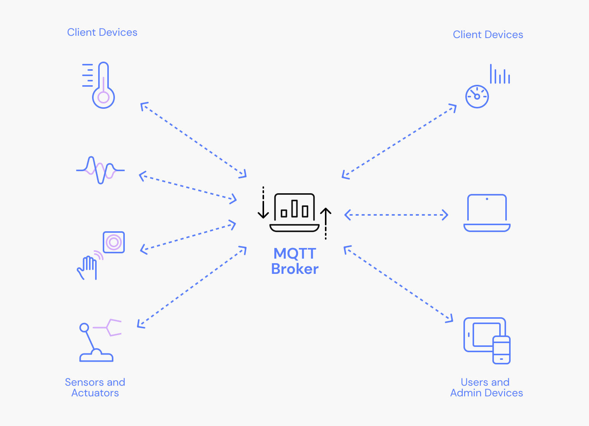
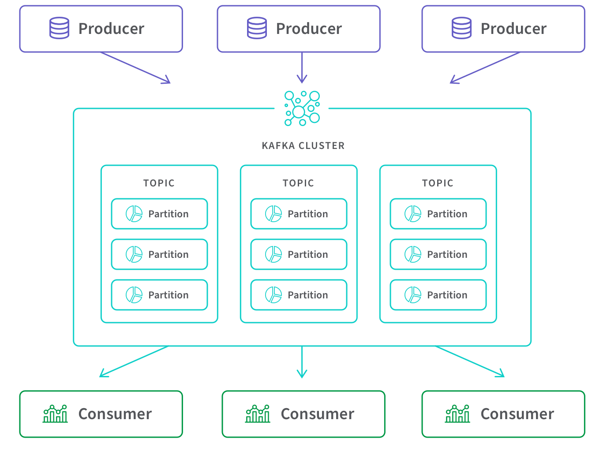

Building IoT systems means making hard choices about how messages flow through your infrastructure. Apache Kafka and MQTT couldn't be more different in their approaches. MQTT came from the world of sensors and resource-constrained devices. Kafka was designed to push massive data streams between backend systems. Getting this choice right early determines whether your architecture scales smoothly or hits a wall.

## What Makes MQTT Different

MQTT (Message Queuing Telemetry Transport) showed up in 1999 when engineers needed to monitor oil pipelines with SCADA systems over sketchy satellite links. The whole point was squeezing messages through terrible networks without killing battery life.

The protocol uses binary encoding with headers as small as 2 bytes. That's it. This matters when you're running on an ESP32 with 520KB of RAM or sending data over a 2G connection that costs per kilobyte. MQTT runs over TCP/IP and supports TLS when you need encryption.

Here's how it works: A central broker sits in the middle. Devices publish messages to topics like `factory/line-1/temperature`. Other devices subscribe to those topics. The broker figures out who gets what. Topics use forward slashes to create hierarchies, so you can subscribe to `factory/#` and catch everything happening in the factory.

MQTT has three Quality of Service levels:

**QoS 0** - Fire and forget. Send the message once, hope it arrives. No acknowledgment, no retry. Fast but unreliable.

**QoS 1** - At least once delivery. The broker acknowledges receipt and retries if needed. You might get duplicates.

**QoS 2** - Exactly once through a four-way handshake. Slowest but guaranteed.

Pick based on what you're sending. Temperature readings every 10 seconds? QoS 0 is fine. Critical alarm messages? QoS 2.

## How Kafka Works

LinkedIn built Kafka in 2011 because they were drowning in activity streams and operational metrics. Traditional message queues couldn't keep up. So they designed something that acts more like a distributed database than a message broker.

Kafka organizes everything into topics, and topics split into partitions. Each partition is just an ordered log of messages that never changes once written. Producers append messages to the end. Consumers track where they are in each partition using offsets. Multiple producers and consumers can hammer different partitions simultaneously, which is how Kafka gets ridiculous throughput.

The architecture spreads partitions across multiple broker servers. Each partition gets replicated to other brokers based on your replication factor. If a broker crashes, another one takes over for its partitions immediately. No data loss, no downtime.

Unlike MQTT, messages don't disappear after delivery. Everything writes to disk. You configure retention policies—keep messages for 7 days, 30 days, or forever. This means you can replay messages, let new consumers read historical data, or reprocess everything if your analytics code had a bug.

Early Kafka needed Apache Zookeeper for cluster coordination, which added complexity. Recent versions support KRaft mode that removes this dependency, though many production systems still run Zookeeper.

## The Real Differences

### Architecture Philosophy

MQTT keeps things simple with a central broker. Devices connect, the broker routes messages, everyone's happy. You can get started with a single Raspberry Pi running Mosquitto. The 2-byte headers and compact binary format mean your sensor data flows efficiently even on constrained networks.

Kafka is distributed by design. Topics partition across brokers. Consumers track offsets themselves. Everything replicates for fault tolerance. You need coordination infrastructure (Zookeeper or KRaft), multiple brokers for production, and someone who knows distributed systems. But this complexity buys you throughput that makes single-broker systems look silly.

### Performance Reality

MQTT delivers messages in milliseconds. It runs on microcontrollers with kilobytes of RAM. A sensor reading might be 10-20 bytes including protocol overhead. A decent broker handles thousands to tens of thousands of messages per second, which works fine when you have hundreds of thousands of devices sending data every few seconds.

Kafka sacrifices latency for volume. Messages take tens to hundreds of milliseconds because of disk writes, replication, and consumer polling. But a single broker can handle hundreds of thousands of messages per second. Clusters process billions daily. You need real hardware—multiple cores, 32GB+ memory, fast SSDs—but you get data movement at enterprise scale.

### How Messages Get Delivered

MQTT's three QoS levels give you options. QoS 0 is fast but lossy. QoS 1 guarantees delivery but might duplicate. QoS 2 does exactly-once with a four-way handshake. Brokers can queue messages for offline subscribers, but they're not designed for long-term storage.

Kafka writes everything to disk based on your retention policy. Producers pick acknowledgment levels: wait for the leader broker (fast, less safe) or wait for all replicas (slower, fully durable). Consumers commit offsets after processing messages. Modern Kafka supports exactly-once semantics through transactions and idempotent producers. The persistence model enables message replay and handles consumer failures completely differently than MQTT.

### Running This Stuff in Production

Setting up an MQTT broker is straightforward. Mosquitto or HiveMQ, configure authentication, maybe add clustering for high availability. Monitor connection counts, message rates, queue depths. Most brokers have REST APIs for metrics.

Kafka demands more. You need at least three brokers plus coordination services. Monitor partition distribution, replication lag, consumer group status, disk usage. Plan capacity for both storage and network bandwidth. Rolling upgrades require care. Partition reassignment needs coordination. The learning curve is real, but the system handles failures gracefully once you understand it.

### Where to Use Each One

MQTT dominates in manufacturing plants with sensor networks, building automation, remote sites on cellular connections, and fleet tracking. It's the right call when devices have limited CPU and memory, networks constrain bandwidth, you're dealing with thousands of messages per second, and you don't need long-term storage.

Kafka powers financial transaction processing, e-commerce backends, infrastructure monitoring at scale, and data engineering pipelines. Use it when message volumes hit hundreds of thousands per second, multiple systems need independent access to the same data stream, you need replay capabilities, or you're feeding data into analytics platforms.

Most real systems use both. MQTT handles the edge, Kafka moves data between central systems. You see this pattern everywhere—MQTT at factory sites, Kafka in the data center.

## Making the Choice

Here's how to think about it:

**Pick MQTT when:**

- Your devices are resource-constrained (microcontrollers, embedded systems)
- Network bandwidth is limited or expensive
- You're handling thousands of messages per second
- Simple deployment matters
- You need efficient edge device communication
- Long-term message storage isn't a requirement

**Pick Kafka when:**

- Message volumes hit hundreds of thousands per second or more
- Multiple applications need independent access to message streams
- You need message replay or event sourcing capabilities
- Stream processing is part of the architecture
- Integration with big data tools matters
- Your ops team knows distributed systems

Neither is "better." They solve different problems. Your requirements drive the decision.

## Integrating MQTT and Kafka

Real production systems don't choose between these—they use both. Devices and sensors typically publish data over MQTT, while analytics platforms, data lakes, and stream processors consume events from Kafka. The real challenge lies in bridging the two reliably and cleanly.

Most teams write custom bridge services or deploy Kafka Connect with MQTT source connectors. Custom bridges give you complete control but require development and maintenance. Kafka Connect reduces code but adds configuration complexity, especially when you need transformation logic beyond simple field mapping.

FlowFuse takes a different approach using Node-RED's visual programming model. [MQTT](blog/2024/06/how-to-use-mqtt-in-node-red/) and [Kafka](/blog/2024/03/using-kafka-with-node-red/) nodes connect through flows that define routing and transformation logic. The platform manages protocol connections and flow execution without separate bridge infrastructure.

If you need managed MQTT brokers, FlowFuse provides them directly in the platform. Beyond MQTT and Kafka, it supports industrial protocols like Modbus, OPC UA, and HTTP. Device connections, message processing, and Kafka integration all happen in one environment. You get version control, deployment management, and team collaboration built in.

Flow-based integration works well when routing requirements change frequently or when multiple teams contribute to pipeline logic.

FlowFuse offers a free trial for testing MQTT-Kafka workflows. [Start building](https://app.flowfuse.com/) or [schedule a consultation](/contact-us/) to discuss your specific needs.

## Conclusion

MQTT and Kafka solve different problems. MQTT gives you efficient device connectivity with minimal overhead. Kafka delivers high-throughput event streaming with persistence and replay.

Understanding these differences helps you pick the right tool for the job. Most production systems use both, leveraging each where it provides the most value. Base your decision on message volumes, device capabilities, operational requirements, and team expertise—not on whatever's trending on Hacker News.