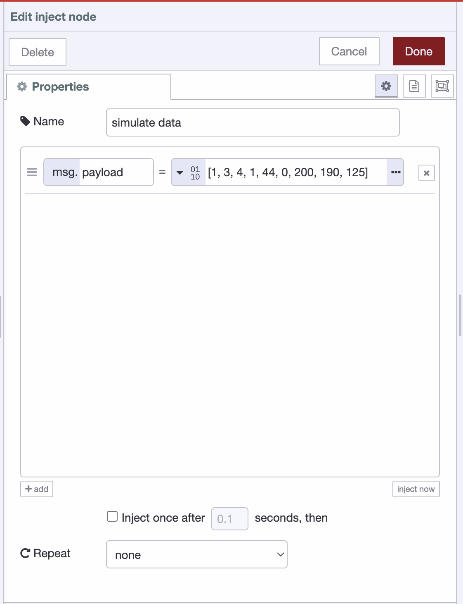
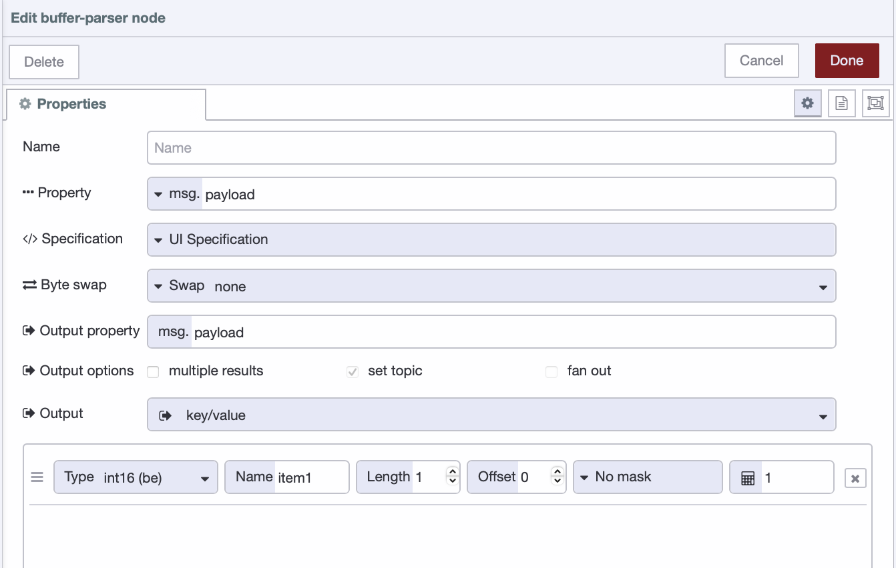
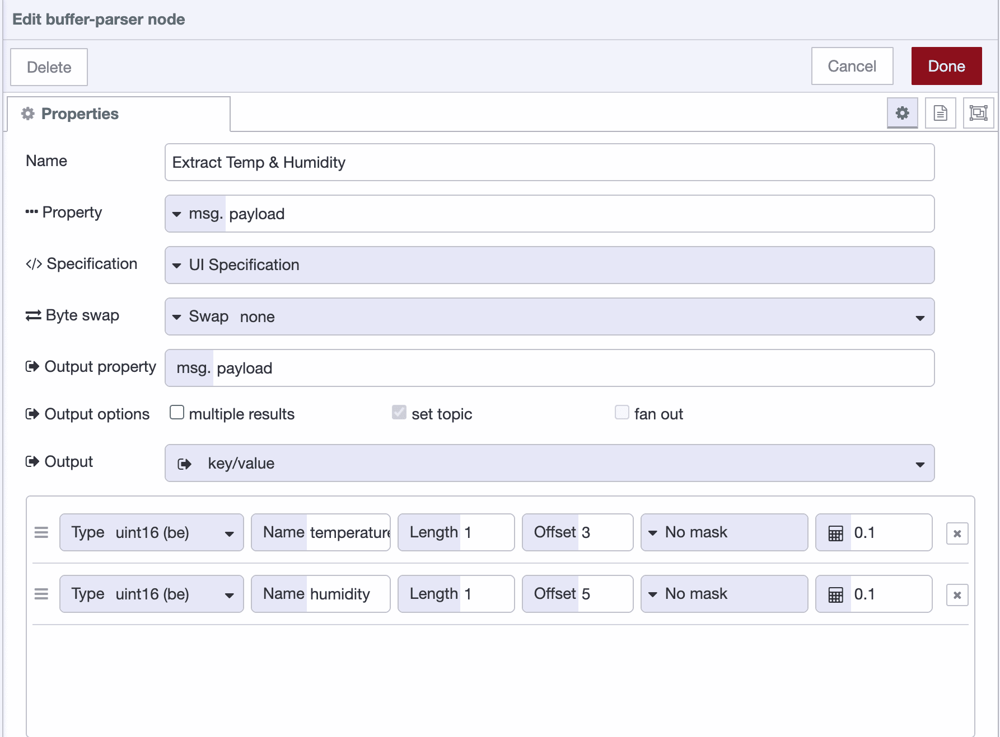

Legacy industrial devices communicate in bytes. Your temperature sensor doesn't send you `{"temp": 23.5}` - it sends you `[1, 3, 4, 1, 44, 0, 200, 190, 125]`. Those numbers are meaningless unless you know how to decode them.

<!--more-->

This is what makes working with legacy PLCs and Modbus sensors challenging. You're not dealing with modern APIs that return JSON. You're dealing with raw binary data where byte 3 might be temperature and byte 4 might be humidity, and if you read them in the wrong order, everything breaks.

Node-RED's Buffer Parser node solves this problem. Instead of writing JavaScript to manually decode every buffer, you configure it once visually and it handles the conversion automatically. In this article, we'll learn how to use this node effectively.

## Understanding Buffer Data

When your Modbus sensor responds to a query, Node-RED shows you something like this in the debug panel:

```
[1, 3, 4, 1, 44, 0, 200, 190, 125]
```

Nine bytes. Each one is a number between 0 and 255. This data is completely meaningless without context.

Byte 0 might be a device address. Bytes 3 and 4 together might encode temperature. But the buffer itself doesn't tell you any of this - you need the device manual to figure out what goes where.

Take bytes 3 and 4: `1` and `44`. If you're supposed to read them as a 16-bit integer, that's either 300 or 11265 depending on byte order. If the device uses a scale factor of 10, the actual temperature could be 30.0°C or 1126.5°C. Get any part of this wrong and your dashboard shows nonsense.

So why do devices work this way? Why not just send `{"temperature": 30.0}`?

That JSON message takes 21 bytes. The same information in binary takes 2 bytes. When you're on a serial connection running at 9600 baud, sending thousands of sensor readings per day, those extra bytes add up fast.

More importantly, this is how industrial hardware has worked since 1979. Modbus was designed when PLCs had kilobytes of memory. Modern factories still run equipment from the 90s. The protocol isn't going to change because it would be more convenient for us.

You work with what's on the factory floor, this means you need to parse buffers.

## Example: Temperature and Humidity Sensor

Suppose you have a temperature and humidity sensor connected via Modbus RTU. When you query it for data, you get this buffer:

```
[1, 3, 4, 1, 44, 0, 200, 190, 125]
```

The device manual says this buffer breaks down as:

- Byte 0: Device address (1)
- Byte 1: Modbus function code (3 = read holding registers)
- Byte 2: Data length in bytes (4)
- Bytes 3-4: Temperature reading
- Bytes 5-6: Humidity reading
- Bytes 7-8: CRC checksum

You need to extract temperature and humidity. Everything else is Modbus protocol overhead.

The manual also specifies:

- Temperature: 16-bit unsigned integer, big-endian, divide by 10 for actual value in °C
- Humidity: 16-bit unsigned integer, big-endian, divide by 10 for actual value in %RH

Without Buffer Parser, you'd write a function node like this:

```javascript
const buffer = Buffer.from(msg.payload);
const temperature = buffer.readUInt16BE(3) / 10;
const humidity = buffer.readUInt16BE(5) / 10;

msg.payload = { temperature, humidity };
return msg;
```

This works, but it's also fragile. When you need to add a pressure reading next month, you're editing code and hoping you don't break the offset calculations. When someone else looks at this flow, they have no idea what's happening without reading the function and if they don't understand JavaScript, they're stuck.

Buffer Parser turns this into configuration you can see and modify without touching code. Let's walk through a practical example.

> But before you start, make sure you have a Node-RED instance running on your edge device. The fastest, easiest, and most production-ready way is using FlowFuse. If you don't have an account yet, create one with our [free trial](https://app.flowfuse.com/). FlowFuse simplifies managing remote instances and provides the ability to create hosted instances—no matter how many you need to manage, it makes it easy. There are no deployment headaches either; everything is managed by FlowFuse with built-in security. You'll also get access to tools such as DevOps pipelines, snapshots for recovery, audit logs, real-time collaboration with granular role-based access control (RBAC), and much more.

## Setting Up the Buffer Parser

The Buffer Parser node is part of the `node-red-contrib-buffer-parser` package. To install it:

1. Open your Node-RED editor
2. Click the menu icon (three horizontal lines) in the top-right corner
3. Select **Manage palette**
4. Go to the **Install** tab
5. Search for `node-red-contrib-buffer-parser`
6. Click **Install**

## Building the Flow

Now let's create a flow to parse the buffer data. For this example, we'll use an Inject node to simulate Modbus data, so while reading you can follow along and learn.

1. Drag an **Inject** node from the palette onto the canvas
2. Double-click the Inject node to open its configuration
3. Set **msg.payload** to "Buffer" from the dropdown
4. In the field, enter: `[1, 3, 4, 1, 44, 0, 200, 190, 125]`

{data-zoomable}
*Node-RED Inject node configuration showing payload set to a Buffer array for simulating data.*

5. Click **Done**
6. Drag a **Buffer Parser** node from the palette onto the canvas
7. Drag a **Debug** node onto the canvas
8. Connect the Inject node output to the Buffer Parser node input
9. Connect the Buffer Parser node output to the Debug node input

## Configuring the Buffer Parser

Now let's configure the Buffer Parser node to extract temperature and humidity.

1. Double-click the **Buffer Parser** node to open its configuration panel

{data-zoomable}

You'll see several fields. Most of them you can ignore for basic parsing. Here's what matters:

**Property**: Leave this set to `msg.payload`. This tells the node where to find your buffer data.

**Specification:** Keep this set to UI Specification. This is the visual method, allowing you to configure everything directly within the node.

**Result Type**: Set this to "Key/value". This gives you clean JSON output like `{"temperature": 30.0, "humidity": 20.0}`.

**Byte Swap**: Leave this set to "No swap" for now. Byte swapping reorders bytes within multi-byte values and is only needed when your device stores data in an unusual format that doesn't match standard big-endian or little-endian conventions. If you've selected the correct endianness (like uint16be or uint16le) and values still look wrong, you might need swap16 (for 16-bit values), swap32 (for 32-bit values), or swap64 (for 64-bit values). Most devices won't require this.

Now let's configure the actual data extraction.

## Extracting Temperature

Let's add the first field to extract temperature from bytes 3-4.

1. Click the **add** button at the bottom of the configuration panel to create a new row in **buffer parser** node

You'll see several fields appear in the row. Let's fill them in:

2. In the **Name** field, enter `temperature`. This is what you'll see in your output JSON.

3. In the **Type** dropdown, select `uint16be`
   - This breaks down as:
     - `uint16` = 16-bit unsigned integer (positive values only)
     - `be` = big-endian (reads bytes in order: first byte is high, second is low)
   - The manual specified "16-bit unsigned integer, big-endian" so this is a direct match

4. In the **Offset** field, enter `3`. Temperature data starts at byte 3. Offset counts from zero, so byte 0 is first, byte 3 is fourth.

5. In the **Length** field, enter `1`. We're reading one value, not an array of values. Length stays at 1 for single values.

6. In the **Scale** field, enter `0.1`. Here's the important part: the Buffer Parser **multiplies** by the scale value, so to divide by 10, you need to multiply by 0.1. Raw value 300 × 0.1 = 30.0.

> Note: Beyond simple multiplication, the Buffer Parser also supports scale equations for more complex transformations. You can use operators like >> for bit shifting (e.g., >>4 to shift right 4 bits), + or - for offsets (e.g., +42 to add 42), / or * for division/multiplication, ** for exponents, and comparison operators like ==, !=, >, < for boolean results. These equations are applied after any mask, giving you powerful options for handling bit-packed data or applying formulas without writing JavaScript.

Let's verify this works with a simple calculation. Bytes 3 and 4 in our buffer are `1` and `44`. Big-endian means we read them in order: (1 × 256) + 44 = 300 in decimal. Multiplied by 0.1 gives 30.0°C. Perfect.

## Extracting Humidity

Now let's add the second field to extract humidity from bytes 5-6.

1. Click the **add** button again to create a second row

2. In the **Name** field, enter `humidity`. This will appear as the key in your output JSON.

3. In the **Type** dropdown, select `uint16be`
   - Same as temperature:
     - `uint16` = 16-bit unsigned integer (no negative values)
     - `be` = big-endian (reads bytes in order)

4. In the **Offset** field, enter `5`. Humidity data starts at byte 5.

5. In the **Length** field, enter `1`. We're reading a single humidity value.

6. In the **Scale** field, enter `0.1`. Again, multiply by 0.1 to effectively divide by 10.

{data-zoomable}
*Buffer Parser configuration rows defining temperature and humidity extraction using uint16be with offsets and scale values.*

7. Click **Done** to save the configuration

Let's verify this. Bytes 5 and 6 are `0` and `200`. Big-endian reads them in order: (0 × 256) + 200 = 200. Multiplied by 0.1 = 20.0% RH. Perfect.

## Testing the Configuration

Now let's test if everything works correctly.

1. Click **Deploy** in the top-right corner of the Node-RED editor
2. Click the button on the left side of the Inject node to trigger it
3. Open the Debug panel on the right side of the editor

Your Buffer Parser output should look like:

```json
{
  "temperature": 30.0,
  "humidity": 20.0
}
```

This example should work as shown, but with your actual device data, the output may differ. If the values in your JSON don't match what you expect, you're likely running into one of a few common issues. Here's how to recognize and fix them.

If your values are way off—for example, you expect 300 but see 11265, or expect 100 but see 25600—you've got the endianness backwards. Change `int16le` to `int16be` (or vice versa) in the Type field. Alternatively, try setting Byte Swap to `swap16` (or `swap32`/`swap64` for larger data types).

If you're seeing negative numbers when you know the value should be positive, you're using signed integers when you need unsigned. Change `int16` to `uint16` (or `int32` to `uint32`) in the Type field.

If your values are exactly 256 times too large or too small, you're using the wrong data type size. If you're using `int8` but the device sends 16-bit values, change it to `int16be` or `int16le`. If you're using `int16` but the device sends 32-bit values, change it to `int32be` or `int32le`. Check your device manual for the correct bit size.

If you're getting raw values instead of scaled values (for example, 300 instead of 30.0), it means you either forgot to set the Scale field or set it incorrectly. If the device manual says ‘divide by 10,’ enter 0.1 in the Scale field (not 10). Remember: the Buffer Parser multiplies by the scale, so to divide by 10, you must multiply by 0.1

If every number looks completely wrong, recount your offsets carefully. Check each Offset value and verify against your device manual. Remember that byte 0 is first, byte 1 is second, byte 3 is fourth, and so on. The most common mistake is being off by one byte.

If you're getting only one value when the device sends multiple, check the Length field. If your device sends an array of 5 temperature readings starting at byte 10, set Offset to `10` and Length to `5`. The node will return an array of values instead of a single value.

## What About Those Other Fields?

The configuration screen has more fields we didn't touch:

**Bit Offset** only matters when you're using the `bool` type to extract a single bit from a byte. This field is only visible when the bool type is selected. If you need to check whether bit 3 of byte 7 is set (like a "pump running" status flag), you'd set Offset to 7, Type to bool, and Bit Offset to 3. For reading whole numbers, ignore this field.

**Mask** is for when multiple values are packed into the same byte. Industrial protocols do this to save space - why waste 8 bits on a simple on/off flag when you can pack eight flags into one byte? If bits 0-3 hold one sensor reading and bits 4-7 hold another, you use masks like `0x0F` (binary: 00001111, lower 4 bits) and `0xF0` (binary: 11110000, upper 4 bits) to extract each value separately. You'll know when you need this because the manual will say something like "status bits 0-3 contain pump speed, bits 4-7 contain valve position."

For more details on the Buffer Parser node, you can also explore the official [Buffer Parser node documentation](https://flows.nodered.org/node/node-red-contrib-buffer-parser) — it's comprehensive, well-maintained, and a great reference when working with more advanced parsing options.

## When You Need More Complex Parsing

Buffer Parser handles most industrial protocols, but not everything.

If you need conditional parsing where the structure changes based on values in the buffer itself, you'll need JavaScript. For example, if byte 2 tells you how many temperature readings follow and that number varies, Buffer Parser can't handle variable-length structures dynamically.

If you're dealing with bit-packed data where individual bits within bytes have meaning (common in PLC memory maps), you can use the `bool` type with Bit Offset, but extracting many bits gets tedious. Sometimes a function node doing bitwise operations is cleaner.

> If you're using FlowFuse, you don’t even need to write JavaScript yourself. You can simply ask the [FlowFuse Expert](/blog/2025/07/flowfuse-ai-assistant-better-node-red-manufacturing/) in plain English, paste what your device manual says, and it will generate the Function node directly on your Node-RED canvas.

For standard Modbus registers, serial sensor protocols, and fixed-structure PLC memory layouts - which covers most industrial data, Buffer Parser does exactly what you need.

## Final Thoughts

Binary data from industrial devices isn’t going anywhere. Modbus isn’t disappearing. Neither are PLCs from the 90s or sensors that still speak in raw bytes. This is the reality of factory floors, and it will be for a long time.

The Buffer Parser makes that reality manageable. You don't need to be a buffer expert or master bitwise operations. You just need your device manual, a few minutes to configure the node, and—occasionally—the patience to flip the endianness when a value looks strange. The buffers are still just arrays of bytes, but now you have a tool that turns them into meaningful data without rewriting JavaScript every time you add a new sensor. That's worth something.

And if you’re managing industrial devices at scale—handling remote Node-RED instances, deploying updates across fleets of edge hardware, or keeping everything secure and consistent—FlowFuse can remove much of the daily friction. With features like remote deployment, snapshots, secure device connectivity, and the FlowFuse AI Expert built right into the editor, you can **[book a free demo](/book-demo/)**. Our team will understand your requirements, show you exactly how FlowFuse fits into your workflow, and guide you on getting the most out of your industrial data pipelines.
