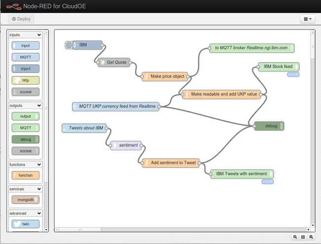
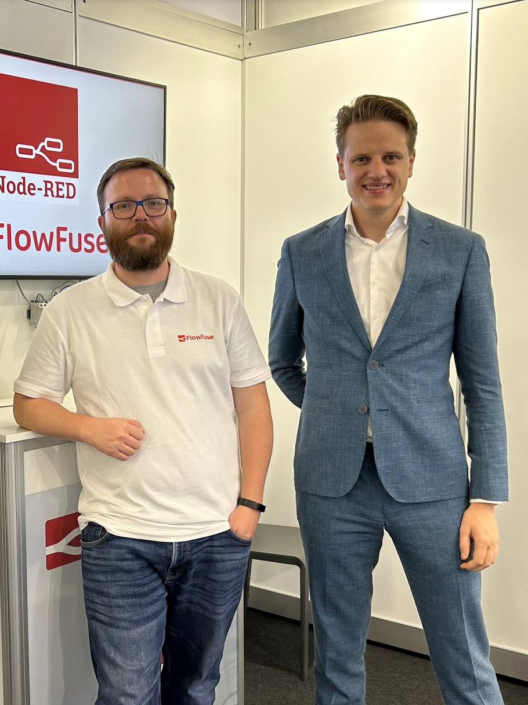

In late 2011, Nick O'Leary (one of the “computer geeks” recognized by Prince Charles many years earlier) was a “plumber” of the digital age. As part of IBM's Emerging Technology Group, he had just showcased a mind-controlled taxi on the [BBC’s Bang Goes the Theory](https://knolleary.net/2010/04/22/how-i-got-onto-prime-time-bbc-one/). It was a feat of engineering—but the back-end “wiring” required to make brainwaves talk to car pedals was grueling, manual work.

<!--more-->

{data-zoomable}

{data-zoomable}

## The Birth of Node-RED

For every new experiment at IBM's Emerging Technology lab, Nick found himself writing the same boilerplate code over and over. Connect this protocol. Parse that data format. Wire these systems together. The demos were exciting, but the plumbing behind them was tedious, repetitive work that no one saw.

By early 2013, Nick had had enough. Over a single weekend, he built something different—a visual programming tool that would let him drag boxes and draw wires instead of writing endless integration code. No more boilerplate. No more repetitive plumbing. Just connect things and make them work.

When he showed it to his colleague Dave Conway-Jones on Monday morning, Dave looked at the screen, thought for a moment, and said two words that would change everything: "Go on then."

{data-zoomable}
_Nick and Dave_

Node-RED offered something different: freedom. Drag boxes. Connect wires. Make anything talk to anything. No permission required.

{data-zoomable}
_Early Node-RED Screenshot_

## The Public Debut: ThingMonk 2013

For months, Node-RED was a secret internal tool. That changed on December 3, 2013, at the ThingMonk conference in London. In Node-RED's first major professional interview and demonstration, titled "Wiring the Internet of Things," Nick stepped onto the stage to show the world how his weekend side-project could solve the "plumbing" problems of the modern world.

<lite-youtube videoid="zUoCJb0jzuo" params="rel=0" style="margin-top: 20px; margin-bottom: 20px; width: 100%; height: 480px;" title="ThingMonk 2013: Wiring The Internet of Things"></lite-youtube>

The reaction was immediate. While IBM saw it as a tool for enterprise cloud infrastructure, the audience saw a master key to freedom. Word spread. Within weeks, people who had never written a line of professional code were using it to bridge smart home devices that were never meant to speak to one another.

The buzz didn't stop there. Nick and Node-RED appeared in numerous interviews, podcasts, and conference presentations over the following years, spreading the word about visual programming for IoT. Each appearance brought new developers, new use cases, and new possibilities to the growing community.

## The Explosion: The Raspberry Pi Milestone

By November 2015, Node-RED was officially integrated into the Raspbian Jessie image, marking its transition from a manual install to a core component of the Raspberry Pi ecosystem. The [announcement was made by Simon Long](https://www.raspberrypi.com/news/latest-raspbian-update/), the Raspberry Pi Foundation’s UX Engineer, who detailed the update in a blog post on December 2, 2015. This milestone meant that millions of $35 computers suddenly shipped with a visual programming tool built specifically for the "Internet of Things," sitting prominently in the application menu alongside educational staples like Scratch and Python.

{data-zoomable}
_Screenshot of the Raspbian Jessie desktop menu showing Node-RED included by default with Scratch and Python on Raspberry Pi_

## A Home for the Future: The OpenJS Foundation

By 2016, Node-RED had outgrown its "side project" status at IBM. To ensure the tool remained open and vendor-neutral, [IBM moved Node-RED into the newly formed JS Foundation](https://nodered.org/blog/2016/10/17/js-foundation) (which merged in 2019 to become the OpenJS Foundation) as a founding project.

This was a pivotal moment for industrial adoption. By moving the project to a neutral foundation, Node-RED was no longer just an "IBM tool"—it became a public utility. Large-scale industrial players like Hitachi and Siemens could now contribute to the code and build their own products on top of it without fear of "vendor lock-in." It signaled that Node-RED was a stable, world-class piece of software infrastructure, governed by the same community standards as jQuery and Node.js.

## The Community Takes Over

The community didn't just use Node-RED—they built it. By 2023, the library contained over 4,300 nodes. Every new smart device gets a Node-RED node within weeks. Every protocol got wrapped. Forums filled with shared flows. Someone in Germany would solve a lighting problem at 2 AM, share the solution, and someone in California would adapt it for their garage door an hour later.

This wasn’t just a user base—it was a movement. Makers, hobbyists, and tinkerers around the world were solving problems and sharing solutions freely. The barrier to contribution was low—anyone could create a node and publish it. The barrier to adoption was even lower—anyone could install a node with a single click.

The community’s creativity extended across domains. Nodes were built for popular platforms, industrial protocols, cloud services, databases, messaging systems, AI services, and thousands of integrations beyond. If a technology existed, someone had already made it work in Node-RED.

And movements don't stay contained. This one was about to reach factory floors, power plants, and industrial control rooms worldwide.

## The Bridge Nobody Planned

The movement unexpectedly reached Hitachi's factory floors. Node-RED emerged as a crucial communication tool bridging the gap between IT and factory engineers. Its intuitive interface allowed the entire flow to be visible on screen, facilitating discussions and collaborative efforts seamlessly.

For decades, IT and OT spoke different languages. IT managed databases and networks. OT ran machines and production lines. They needed each other but couldn't understand each other. Node-RED gave them a shared vocabulary—visual flows that both sides could read.

A factory engineer could build a flow reading data from a Modbus PLC. An IT engineer could look at that same flow and immediately understand what it did. No translation needed. The same visual language that connected smart home devices was now connecting industrial equipment to enterprise systems.

The movement had arrived in the industry. And it brought its community-driven, protocol-agnostic approach with it.

## The Numbers Prove It

[The 2019](https://nodered.org/about/community/survey/2019/) survey captured the movement mid-expansion: 31.5% used it in manufacturing, and 24% had created PLC applications. Home automation remained strong, but the industry was already significant.

By [2023](https://nodered.org/about/community/survey/2023/), the industrial footprint had solidified. Manufacturing remained the second largest industry at 40%, up from 31.5%. Just over 40% now use Node-RED professionally. Home automation usage held steady at 70%—both sectors thriving, not competing.

The protocols revealed the depth of industrial adoption. MQTT and HTTP dominated both sectors. But Modbus and OPC-UA—industrial protocols—saw significant growth. These weren't hobbyists experimenting. These were engineers connecting real production equipment.

The movement had conquered two worlds simultaneously.

## FlowFuse: Conquering Industrial IoT

By 2021, the challenge had shifted. Node-RED worked brilliantly for individual developers, but enterprises needed more: how do you scale it across tens of thousands of factory instances? How do you secure it? How do you make teams collaborate on flows without stepping on each other's work? To solve these problems, Node-RED creator Nick O'Leary founded FlowFuse (formerly FlowForge).

But a technical revolution needs both an inventor and an architect. In January 2022, Zeger-Jan van de Weg (ZJ) joined as CEO. Drawing on his experience as an early GitLab employee, ZJ knew how to turn a successful open-source project into an enterprise-grade platform. While Nick continues to guide the technical direction as CTO, ZJ leads the effort to scale industrial automation for Fortune 500 companies.

{data-zoomable}
_ZJ and Nick"_

Together, they have raised $14.5 million to build the infrastructure enterprises demand. With this funding, they assembled a talented team spanning engineering, product, customer success, marketing, sales, and community, each member contributing their unique expertise to drive FlowFuse's growth across every aspect of the business.

Between 2021 and 2025, FlowFuse evolved into a full industrial ecosystem through deliberate focus on operational maturity. The journey began with team collaboration and scaling—introducing version control, team permissions, and DevOps pipelines that let engineering teams work together on flows like software projects, then deploy updates across thousands of remote Node-RED instances with discipline. With collaboration and scale established, the focus shifted to enterprise security, adding SSO, RBAC, and SOC 2 compliance to meet strict governance requirements. Next came infrastructure independence, integrating a built-in MQTT broker and FlowFuse Tables to reduce reliance on external services. By 2025, as AI began reshaping industry, FlowFuse entered the intelligence era with AI assistance, MCP nodes, and FlowFuse Expert—an AI copilot that converts plain-English industrial problems directly into working Node-RED flows.

FlowFuse’s mission went beyond enterprise features. It invested continuously in Node-RED core development and community sustainability. When the original [Node-RED Dashboard was deprecated](https://discourse.nodered.org/t/announcement-node-red-dashboard-v1-deprecation-notice/89006/2), FlowFuse rebuilt [Node-RED Dashboard 2.0](https://dashboard.flowfuse.com) from the ground up.

That commitment extended to the ecosystem itself. Through the [Certified Nodes program](/blog/2025/07/certified-nodes-v2/), FlowFuse identifies critical community nodes and subjects them to rigorous security and quality testing. To ensure long-term reliability, FlowFuse supports maintainers financially or assumes maintenance responsibility—an approach aligned with the expectations of large industrial organizations.

Education and community came next. FlowFuse launched [Node-RED Academy](https://node-red-academy.learnworlds.com), the first official Node-RED Academy offering Node-RED certification, providing a clear path from learning flows to building production-ready systems. This was followed by major investment in [modernizing the Node-RED editor UI](https://discourse.nodered.org/t/node-red-survey-shaping-the-future-of-node-reds-user-experience/98346/95) through an open, community-driven process. The journey culminated in the Node-RED Conference, bringing together over 1,000 live attendees worldwide and transforming a distributed user base into a connected industrial community.

Five years into its journey, FlowFuse stands as a rare example of open source scaling into industrial reality without losing its soul. What started as a way to operate Node-RED at scale is now a production platform deployed in some of the world’s largest factories—increasingly taking on responsibilities once dominated by legacy industrial platforms like Kepware. It demonstrates that when community stewardship, engineering rigor, and long-term vision align, open source can form the backbone of modern industrial systems. 

This vision has translated into explosive market adoption, with the company multiplying its annual recurring revenue and customer base by nearly 5x in the last year alone.

## Why It Succeeded

Node-RED won because it was simple when everyone else was complicated.

The smart home industry sold subscriptions and proprietary hubs. Industrial automation sold certifications and consulting contracts. Both pretended that connecting systems was harder than it actually is.

Node-RED proved them wrong. Drag a box. Draw a line. Done.

A homeowner connecting their thermostat to weather data is using the same concepts as an engineer connecting factory equipment to a data lake. Input. Logic. Output. The scale changes. The principles don't.

The visual interface removed the gatekeepers. You didn't need to understand APIs or write integration code. You could see the logic, understand it, and modify it—all on one screen. When both the factory floor worker and the IT manager can look at the same flow and understand what it does, you've eliminated the translation layer that created vendor dependency.

## Today and Tomorrow

Today, Node-RED powers both worlds completely, and FlowFuse has made it enterprise-ready.

Millions of homes still use Node-RED to make incompatible smart devices work together. But in industry, FlowFuse has transformed how thousands of factories deploy it—turning a powerful tool into production infrastructure with fleet management, enterprise security, and DevOps pipelines that Fortune 500 companies depend on.

The scale is real. Manufacturing plants run FlowFuse across thousands of remote sites. Energy companies trust it for critical infrastructure monitoring. What started as visual programming for hobbyists now handles mission-critical operations where downtime costs millions per hour.

And the momentum is accelerating. FlowFuse is pushing Node-RED into new territory—AI-powered flow generation, advanced analytics, and industrial IoT capabilities that didn't exist even two years ago. As AI reshapes manufacturing and operational technology, FlowFuse is positioning Node-RED at the center of that transformation.

The revolution that began in living rooms and reached factory floors isn't finished. With FlowFuse, it's entering its next phase.

## A Final Note from Sumit Shinde

Writing this article, I realized I’ve only scratched the surface. While I’ve covered the major milestones, the true story isn't just in the code—it’s written every day by thousands of community members who solve flow puzzles, share solutions, and champion Node-RED.

Having a foot in both worlds—as a long-time community member and a FlowFuse team member—I’ve seen a side of this movement that many don’t. It is an environment that truly encourages people to speak up, share their thoughts, learn, innovate, and lead with kindness.

And on that note, I’ll wrap it up here, happy New Year!

If you're facing the same scaling challenges that led to FlowFuse's creation, learn how others solved them by [contacting us](/contact-us/)
