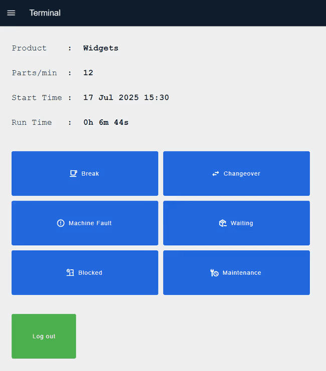
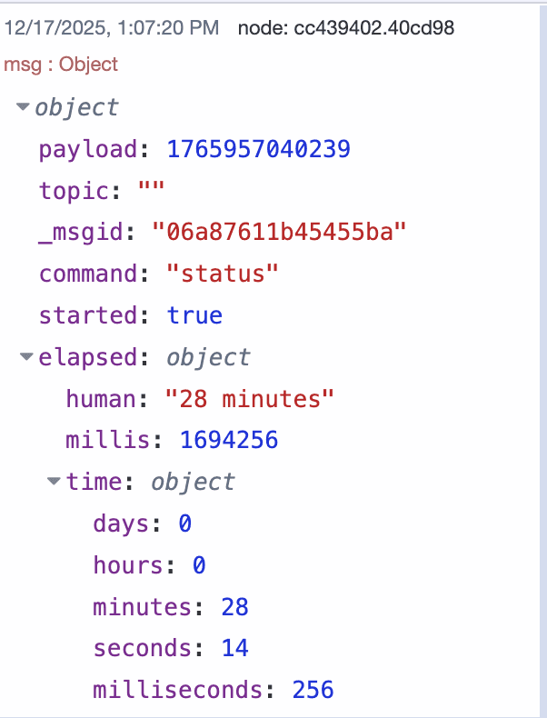
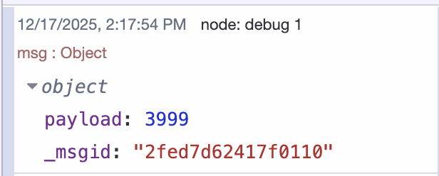

Timers are everywhere in industrial automation. You need them to track how long a machine has been running, measure downtime, schedule maintenance, or coordinate processes that happen in sequence.

<!--more-->

Through my work as a technical writer covering IIoT, building industrial applications, and being part of a company where our customers deploy real-world automation systems, I've observed that **timers** are ubiquitous in production environments. Whether it's a production floor display showing machine runtime, a maintenance terminal counting down to the next service window, or an operator interface tracking downtime by reason code—timers are foundational to industrial visibility. Here's an example of a performance operator terminal with timer functionality:

{data-zoomable}
_Performance operator terminal displaying real-time production metrics with timer functionality_

If you want to explore this interface yourself, you can [deploy this blueprint](/blueprints/manufacturing/performance-operator-terminal/) to your **FlowFuse** instance and start experimenting immediately.

In this article, we'll build two types of timers in [Node-RED](/): **stopwatches** that measure elapsed time and countdowns that trigger actions after a set duration. Both are straightforward to implement and essential for most automation projects.

## Prerequisites

Before following this tutorial, you should have:

- A running **Node-RED instance**. For professional development and production deployments, **[FlowFuse](/)** is the recommended platform. If you don’t have an account, [start your free trial](http://app.flowfuse.com) today.

> FlowFuse provides enterprise-grade Node-RED hosting with managed infrastructure, built-in [DevOps tools](/blog/2024/10/how-to-build-automate-devops-pipelines-node-red-deployments/), [MQTT broker](/blog/2025/10/plc-to-mqtt-using-flowfuse/#step-3%3A-set-up-mqtt-with-flowfuse), [database](/blog/2025/08/getting-started-with-flowfuse-tables/), [team collaboration](/blog/2024/12/flowfuse-team-collaboration/) with [granular access control](https://www.youtube.com/watch?v=mb1s1YQIpZY), and seamless scaling capabilities. Whether you need cloud-hosted instances managed by FlowFuse or remote instances running on your edge devices, the platform provides unified management for both. FlowFuse also includes AI-powered features that accelerate flow development and streamline automation projects. From prototyping to mission-critical production deployments, FlowFuse handles the infrastructure complexity so you can focus on building flows.

That's all you need to get started.

# Getting Started

We'll use two Node-RED community nodes for this tutorial: **node-red-contrib-hourglass** for stopwatch timers and node-red-contrib-countdown for **countdown timers**. Both are simple to configure and work reliably in production environments.

Let's start with installing and building a stopwatch.

### Installing the Hourglass Node

First, install the **hourglass node** in your Node-RED instance:

1. Open the Node-RED editor
2. Click the **hamburger menu** (top right) and select "Manage palette"
3. Go to the "Install" tab
4. Search for `node-red-contrib-hourglass`
5. Click **"Install"**

The **hourglass node** will appear in your palette under the function category.

## Understanding Hourglass Commands

The hourglass node responds to control commands sent via `msg.command`. The available commands are:

- **start** - Begins timing operation
- **stop** - Stops the timer and outputs elapsed time
- **pause** - Pauses timing without resetting
- **reset** - Clears timer state and stops operation
- **status** - Outputs current timer state without stopping

These commands control timer behavior.

### Implementing a Stopwatch Timer

Build a basic **stopwatch flow**:

1. Drag four inject nodes onto the canvas
2. Add four **change nodes**, one after each inject node, and connect them
3. Configure the change nodes to set `msg.command`:
   - First **change node**: set to `"start"`
   - Second change node: set to `"status"`
   - Third **change node**: set to `"stop"`
   - Fourth change node: set to `"reset"`
4. Drag an **hourglass node** onto the canvas
5. Connect all four change nodes to the **hourglass node** input
6. Add a debug node and connect it to the hourglass node output
7. Deploy the flow

When you trigger the first inject node, the **stopwatch starts**. The second inject node checks current elapsed time without stopping the timer—you can configure this inject node to repeat at intervals for continuous time monitoring. The third inject node stops the **stopwatch** and outputs the total elapsed time. The fourth inject node resets the stopwatch back to zero.

The node outputs a message containing timing information:

{data-zoomable}
_Hourglass node output message showing elapsed time in multiple formats_

The `elapsed` object provides multiple formats: a human-readable string, total milliseconds, and broken-down time components. This flexibility supports different display requirements and calculation needs.

This basic example demonstrates the pattern. In production applications, replace the inject nodes with actual process triggers—**machine status signals** from PLCs or MQTT messages from sensors. The **hourglass node output** then connects to databases for logging, dashboards for visualization, or notification systems for alerts when thresholds are exceeded.

Below is the complete flow.


[{"id":"a8e05e4b1a8a8e5e","type":"group","z":"b446dfa04d79d359","style":{"stroke":"#b2b3bd","stroke-opacity":"1","fill":"#f2f3fb","fill-opacity":"0.5","label":true,"label-position":"nw","color":"#32333b"},"nodes":["81365fac1ccf6299","65cf5a523eaee926","560a9271f2b46687","4c5449af7a4dd6ef","e8400461cd50b356","55a008aab6204565","18630deedc38af9f","9ef4a745bd0194cf","cf84add540c079ce","35ab3bbb1674b4f6"],"x":194,"y":2231,"w":892,"h":230},{"id":"81365fac1ccf6299","type":"hourglass","z":"b446dfa04d79d359","g":"a8e05e4b1a8a8e5e","name":"","humanizeLocale":"","x":820,"y":2340,"wires":[["9ef4a745bd0194cf"]]},{"id":"65cf5a523eaee926","type":"inject","z":"b446dfa04d79d359","g":"a8e05e4b1a8a8e5e","name":"Auto Start","props":[{"p":"payload","v":"","vt":"date"},{"p":"topic","v":"","vt":"str"}],"repeat":"","crontab":"","once":true,"onceDelay":0.1,"topic":"","payload":"","payloadType":"date","x":310,"y":2272,"wires":[["560a9271f2b46687"]]},{"id":"560a9271f2b46687","type":"change","z":"b446dfa04d79d359","g":"a8e05e4b1a8a8e5e","name":"Start","rules":[{"t":"set","p":"command","pt":"msg","to":"start","tot":"str"}],"action":"","property":"","from":"","to":"","reg":false,"x":570,"y":2272,"wires":[["81365fac1ccf6299"]]},{"id":"4c5449af7a4dd6ef","type":"change","z":"b446dfa04d79d359","g":"a8e05e4b1a8a8e5e","name":"Status","rules":[{"t":"set","p":"command","pt":"msg","to":"status","tot":"str"}],"action":"","property":"","from":"","to":"","reg":false,"x":570,"y":2320,"wires":[["81365fac1ccf6299"]]},{"id":"e8400461cd50b356","type":"change","z":"b446dfa04d79d359","g":"a8e05e4b1a8a8e5e","name":"Stop","rules":[{"t":"set","p":"command","pt":"msg","to":"stop","tot":"str"}],"action":"","property":"","from":"","to":"","reg":false,"x":570,"y":2368,"wires":[["81365fac1ccf6299"]]},{"id":"55a008aab6204565","type":"inject","z":"b446dfa04d79d359","g":"a8e05e4b1a8a8e5e","name":"Read every 1 seconds","props":[{"p":"payload"},{"p":"topic","vt":"str"}],"repeat":"1","crontab":"","once":false,"onceDelay":0.1,"topic":"","payload":"","payloadType":"date","x":350,"y":2320,"wires":[["4c5449af7a4dd6ef"]]},{"id":"18630deedc38af9f","type":"inject","z":"b446dfa04d79d359","g":"a8e05e4b1a8a8e5e","name":"Manual Stop","props":[{"p":"payload","v":"","vt":"date"},{"p":"topic","v":"","vt":"str"}],"repeat":"","crontab":"","once":false,"onceDelay":0.1,"topic":"","payload":"","payloadType":"date","x":310,"y":2369,"wires":[["e8400461cd50b356"]]},{"id":"9ef4a745bd0194cf","type":"debug","z":"b446dfa04d79d359","g":"a8e05e4b1a8a8e5e","name":"Result","active":true,"tosidebar":true,"console":false,"tostatus":false,"complete":"true","targetType":"full","statusVal":"","statusType":"auto","x":990,"y":2340,"wires":[]},{"id":"cf84add540c079ce","type":"change","z":"b446dfa04d79d359","g":"a8e05e4b1a8a8e5e","name":"Reset","rules":[{"t":"set","p":"command","pt":"msg","to":"reset","tot":"str"}],"action":"","property":"","from":"","to":"","reg":false,"x":570,"y":2420,"wires":[["81365fac1ccf6299"]]},{"id":"35ab3bbb1674b4f6","type":"inject","z":"b446dfa04d79d359","g":"a8e05e4b1a8a8e5e","name":"Manual Reset","props":[{"p":"payload"},{"p":"topic","vt":"str"}],"repeat":"","crontab":"","once":false,"onceDelay":0.1,"topic":"","payload":"","payloadType":"date","x":310,"y":2420,"wires":[["cf84add540c079ce"]]},{"id":"5191dd25898c631c","type":"global-config","env":[],"modules":{"node-red-contrib-hourglass":"1.5.0"}}]


## Implementing a Countdown Timer

Countdown timers trigger actions after a specified duration. Common applications include scheduled maintenance windows, batch process timeouts, and timed equipment shutdowns.

To implement a countdown, we will use `node-red-contrib-countdown`.

#### Installing the Countdown Node

Install the **countdown node** in your Node-RED instance:

1. Open the Node-RED editor
2. Click the hamburger menu (top right) and select **"Manage palette"**
3. Go to the "Install" tab
4. Search for `node-red-contrib-countdown`
5. Click **"Install"**

The countdown node will appear in your palette.

### Building a Countdown Timer

Create a **countdown timer flow** in Node-RED:

1. Drag an **Inject** node onto the canvas.
2. Add a Change node and configure it to:

   - Set `msg.payload` to the countdown duration in **seconds** (for example, `50` for 50 seconds).
   - Set `msg.topic` to `"control"`.
   - You can configure the countdown duration either in the **Change** node or directly in the Inject node, as long as `msg.payload` is in milliseconds and `msg.topic` is `"control"`.

3. Drag a **Countdown** node onto the canvas and configure it with the following settings:

   - **Timer On payload**: The message payload sent when the countdown starts (for example, `true`).
   - **Timer Off payload**: The message payload sent when the countdown completes (for example, `false`).
   - **Restart countdown if message is received while running**: Enable this to restart the countdown if a new control message is received.
   - **Send output message on Reset**: Enable this to send a message when the countdown is reset.
   - **Set time to new duration if control message is received while running**: Enable this to update the countdown duration while it is running.
   - **Start countdown if control message is received while not running**: Enable this to start the countdown using a control message, enable it for this example to allow starting countdown when control message recived 

4. Connect the Change node to the **Countdown** node.
5. Add a **Debug** node and connect it to the Countdown node output.
6. Click **Deploy** to activate the flow.

When you trigger the Inject node, the **countdown starts**. The Countdown node outputs messages at regular intervals, and the **second output** shows the remaining time.

{data-zoomable}
_Countdown node output showing remaining time updates_

From the first output, it will send the message you configured at the start of the count and at the end of the countdown.

Below is the flow implementation that you can use as a starting point.


[{"id":"13e3937b0555d34d","type":"group","z":"b446dfa04d79d359","style":{"stroke":"#b2b3bd","stroke-opacity":"1","fill":"#f2f3fb","fill-opacity":"0.5","label":true,"label-position":"nw","color":"#32333b"},"nodes":["0a7fdceb7b844c76","b1d36b608bafb531","e7e0894b2832e93e","52d0abe15e3533c8","c48dcaec998440aa"],"x":134,"y":3419,"w":692,"h":122},{"id":"0a7fdceb7b844c76","type":"countdown","z":"b446dfa04d79d359","g":"13e3937b0555d34d","name":"","topic":"","payloadTimerStart":"true","payloadTimerStartType":"bool","payloadTimerStop":"false","payloadTimerStopType":"bool","timer":"30","resetWhileRunning":false,"outputOnReset":false,"setTimeToNewWhileRunning":false,"startCountdownOnControlMessage":true,"x":550,"y":3480,"wires":[["e7e0894b2832e93e"],["52d0abe15e3533c8"]]},{"id":"b1d36b608bafb531","type":"inject","z":"b446dfa04d79d359","g":"13e3937b0555d34d","name":"Start","props":[],"repeat":"","crontab":"","once":false,"onceDelay":0.1,"topic":"","x":230,"y":3480,"wires":[["c48dcaec998440aa"]]},{"id":"e7e0894b2832e93e","type":"debug","z":"b446dfa04d79d359","g":"13e3937b0555d34d","name":"Result","active":true,"tosidebar":true,"console":false,"tostatus":false,"complete":"payload","targetType":"msg","statusVal":"","statusType":"auto","x":690,"y":3460,"wires":[]},{"id":"52d0abe15e3533c8","type":"debug","z":"b446dfa04d79d359","g":"13e3937b0555d34d","name":"Countdown","active":true,"tosidebar":true,"console":false,"tostatus":false,"complete":"payload","targetType":"msg","statusVal":"","statusType":"auto","x":710,"y":3500,"wires":[]},{"id":"c48dcaec998440aa","type":"change","z":"b446dfa04d79d359","g":"13e3937b0555d34d","name":"Set Countdown","rules":[{"t":"set","p":"payload","pt":"msg","to":"50","tot":"num"},{"t":"set","p":"topic","pt":"msg","to":"control","tot":"str"}],"action":"","property":"","from":"","to":"","reg":false,"x":380,"y":3480,"wires":[["0a7fdceb7b844c76"]]},{"id":"66be08ead79304bf","type":"global-config","env":[],"modules":{"node-red-contrib-countdown":"1.3.2"}}]


For this demonstration, we used an inject node to manually trigger the countdown. In production environments, you would replace this with actual process triggers—**equipment status signals** from [PLCs](/blog/2025/10/plc-to-mqtt-using-flowfuse/), [MQTT](/blog/2024/06/how-to-use-mqtt-in-node-red/) messages from sensors, or completion signals from upstream operations. For example, you might start a **maintenance window countdown** when equipment reaches a scheduled service interval, or initiate a cleanup cycle timer when a batch process completes.

While these examples cover the essential timer operations, both nodes offer additional configuration options. For comprehensive documentation, visit the [node-red-contrib-hourglass](https://flows.nodered.org/node/node-red-contrib-hourglass) and [node-red-contrib-countdown](https://flows.nodered.org/node/node-red-contrib-countdown) pages on the **Node-RED flows library**.

# Conclusion

That's it, you now have working **stopwatch** and **countdown timers** in Node-RED. The hourglass node tracks elapsed time, and the countdown node triggers actions after a set duration.

These implementations are ready for production use. Start with these basic patterns, test them in your environment, and expand as needed. Connect them to your **PLCs**, add dashboard displays, or integrate with your existing automation workflows.

Both nodes are actively maintained and used in real industrial systems, so you're building on proven foundations.
