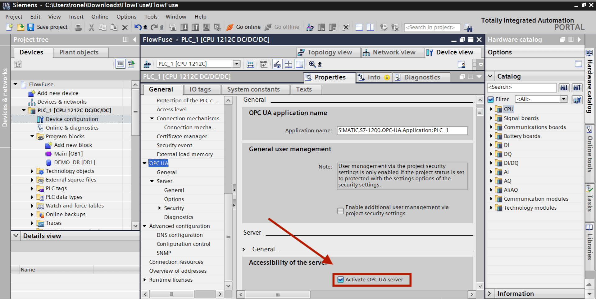
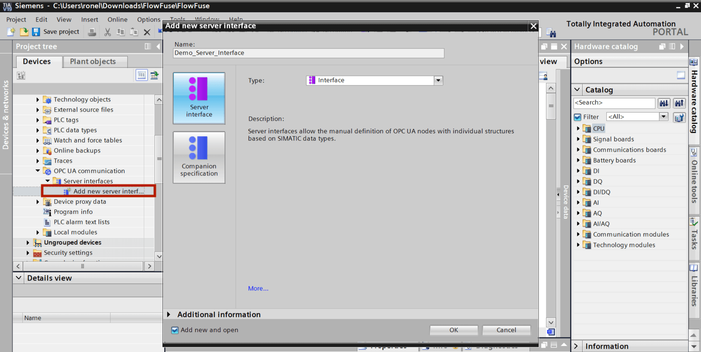
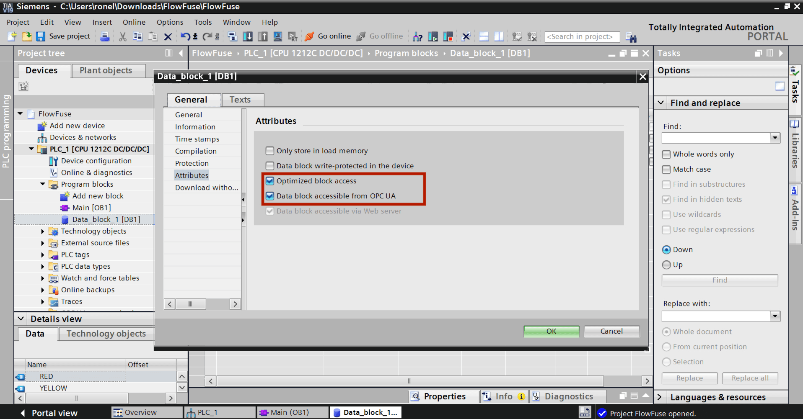
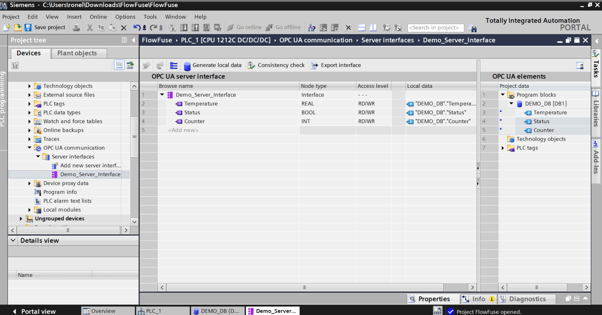

When working with Siemens S7-1200 and S7-1500 PLCs, you'll notice that TIA Portal creates optimized data blocks by default. These optimized blocks arrange data differently than the classic S7-300/400 controllers, which makes reading data through FlowFuse or Node-RED more challenging.

<!--more-->

You can disable optimization in TIA Portal by unchecking the "Optimized block access" option in your data block properties. This gives you the old-style addressing where you can read data using fixed offsets like `DB1.DBW0`. However, this approach has several drawbacks. Optimized blocks run faster, use less memory, and follow Siemens' current best practices. If you're working on existing projects with thousands of tags, converting everything to standard blocks isn't practical. Many companies also require optimized blocks as part of their coding standards.

This guide shows you how to read optimized data blocks directly without disabling optimization. You'll learn to use symbolic addressing, which is the proper way to access data from modern Siemens PLCs.

## Why Reading Optimized Data Blocks Is Challenging

**The S7 Protocol Problem**

Traditional S7 communication, which most Node-RED S7 nodes use, relies on absolute memory addresses. You read data by specifying exact locations like `DB1,INT0` (read integer at byte 0) or `DB5,REAL10` (read real at byte 10).

This worked fine with classic S7-300/400 controllers where memory layout was predictable. If you declared an integer first in your data block, it always started at byte 0. Simple and reliable.

**What Optimization Breaks**

Optimized data blocks rearrange variables for better performance and memory efficiency. The compiler groups variables by type, adds alignment padding, and reorders declarations. Your variable positions become unpredictable and can change with each recompile.

Example: You create variables Temperature (Real), Status (Bool), Pressure (Real), Alarm (Bool). Instead of sequential storage, the optimizer might group the two Real values together and pack Bools elsewhere. The Status boolean isn't at byte 4 anymore—it could be anywhere.

**Why S7 Nodes Fail**

Node-RED packages like `node-red-contrib-s7` need exact memory addresses. With optimized blocks:

- TIA Portal doesn't show you the actual memory layout
- Offsets can't be reliably determined
- Recompiling your PLC program silently breaks all your addresses
- The S7 protocol has no way to read variables by name

You're stuck guessing at memory locations that keep changing.

## The Solution: OPC UA

OPC UA reads variables by name, not memory address. Instead of asking "what's at byte 10?" it asks "what's the value of Temperature_Sensor_01?"

Siemens S7-1200 and S7-1500 PLCs have built-in OPC UA server. Activate it in TIA Portal, mark which variables to expose, and the PLC handles all memory mapping internally. FlowFuse connects and reads data by variable name, regardless of how the PLC organizes memory.

When you modify your data block or recompile, your flows keep working because they reference variable names, not memory locations that might shift.

## Prerequisites

Before you begin, make sure you have:

- TIA Portal V13 or later, and you know how to download a program to your PLC
- A Siemens S7-1200 or S7-1500 PLC with OPC UA server support
- A [FlowFuse Agent](/blog/2025/09/installing-node-red/) running on your edge device
- The PLC and edge device connected to the same network

## Step 1: Activate OPC UA Server on Your PLC

First, you need to activate the OPC UA server that's built into your S7-1200/1500 PLC.

1. Launch TIA Portal and open your project
2. In the project tree on the left, select your PLC and double-click it
3. Find **OPC UA** in the device properties (usually under General or Properties section)
4. Check **Activate OPC UA Server**

{data-zoomable}
_Activate OPC UA server option in TIA Portal_

5. Set **Port** to `4840` (the standard OPC UA port)
6. Set **Security Policy** to **None** (for testing only)
7. Enable **Guest authentication**.

> *Note that we've disabled security entirely in steps 6-7 to get you up and running quickly. This is fine for learning and testing, but don't leave it this way. Before moving to production, configure proper authentication with certificates and user credentials. Get the communication working first, then secure it.*

## Step 2: Add OPC UA Server Interface

Before exposing variables, you need to create an OPC UA server interface in your PLC configuration.

**For S7-1500 PLCs (firmware V2.5 or higher):**

If you're using an S7-1500 PLC with firmware version 2.5 or higher, you have the option to enable the standard SIMATIC server interface. Simply check **Enable standard SIMATIC server interface** in the OPC UA settings. This automatically makes all PLC tags that are marked as accessible available through OPC UA.

**For S7-1200 PLCs (or manual configuration for S7-1500):**

For S7-1200 PLCs, you must manually create a server interface and add the tags you want to expose:

1. In TIA Portal, navigate to **OPC UA communication** in the project tree
2. Right-click on **Server interfaces**
3. Select **Add new server interface**

{data-zoomable}
_Adding OPC UA server interface in TIA Portal_

4. Leave the default settings and click OK
5. The server interface will be created (you can rename it if needed)

Now this interface needs to know which data blocks to expose.

## Step 3: Expose Your Data Block Variables

For OPC UA to access your data blocks, you need to mark them as accessible.

**First, enable OPC UA access on your data blocks (required for all methods):**

1. Open your data block in TIA Portal
2. Right-click on the data block name in the project tree
3. Select **Properties**
4. Go to the **Attributes** tab
5. Check **Accessible from HMI/OPC UA** and **Optimized Block Access**
6. Click **OK**

{data-zoomable}
_Attribute settings for optimized and OPC UA accessible data blocks_

**If using S7-1500 with standard SIMATIC server interface:**

You're done. All variables in data blocks marked as accessible are now automatically available through OPC UA.

**If using manual server interface (S7-1200 or S7-1500):**

You need one more step to add specific variables to your server interface:

1. In the project tree, expand **OPC UA communication**
2. Expand your server interface
3. Drag and drop variables from the **OPC UA elements** panel (on the right) into your server interface table
4.  Alternatively, right-click **Variables** and select **Add new variable**, then browse to select them

{data-zoomable}
_Tags added inside OPC UA server interface_

**Compile and download:**

5.  Click **Compile** in TIA Portal
6.  Download the program to your PLC

Your OPC UA server is now running with the exposed variables ready for access.

## Step 4: Install OPC UA Client in FlowFuse

Now switch to your FlowFuse instance to set up the connection to your PLC.

1. Open your FlowFuse editor
2. Click the menu icon (three horizontal lines, top right)
3. Select **Manage palette**
4. Go to the **Install** tab
5. In the search box, type `node-red-contrib-opcua`
6. Find the package in the results and click **Install**
7. Confirm the installation when prompted
8. Close the palette manager

The OPC UA nodes will now appear in your node palette on the left side under the "opcua" category.

## Step 5: Configure OPC UA Connection

Create a new flow to connect to your PLC and read data.

1. Drag an **OpcUa-Client** node onto your canvas
2. Double-click it to open the configuration
3. Click the pencil icon next to **Endpoint** to add a new connection
4. Enter the endpoint URL: `opc.tcp://[YOUR_PLC_IP]:4840`
   - Replace `[YOUR_PLC_IP]` with your actual PLC IP address (e.g., `opc.tcp://192.168.1.10:4840`)
5. Set **Security Policy** to **None**
6. Set **Security Mode** to **None**
7. Under **Authentication**, select **Anonymous**
8. Click **Add** to save the endpoint
9. Click **Done** to close the node configuration

Your OPC UA client is now configured to connect to your PLC.

## Step 6: Browse Available Variables

Now it's time to discover what's actually available on your PLC. Think of this like opening a file explorer to see what's inside.

1. Drag an **Inject** node onto your canvas
2. Drag an **OpcUa-Browser** node onto the canvas
3. Drag a **Debug** node onto the canvas
4. Connect the Inject node to the OpcUa-Browser node, then connect the OpcUa-Browser node to the Debug node
5. Double-click the **OpcUa-Browser** node to open its configuration
6. In the **Endpoint** dropdown, select the connection you created in Step 5
7. Leave the **Action** field set to **browse**
8. Click **Done**
9. Click **Deploy** in the top-right corner
10. Click the inject node button
11. Open the **Debug** panel on the right side
12. You'll see a structured tree showing everything your PLC is sharing

## Step 7: Read Your First Variable

Let's prove this actually works by reading real data from your PLC.

1. Drag an **Inject** node onto your canvas
2. Double-click the Inject node to configure it
3. Change **Repeat** from "none" to **interval**
4. Set it to repeat **every 5 seconds**
5. In the **Topic** field, enter the NodeId you copied (e.g., `ns=3;s="Demo_Datablock"."Temperature"`)
6. Click **Done**
7. Drag an **OpcUa-Client** node onto the canvas
8. Double-click the OpcUa-Client node to open its configuration
9. Select your endpoint from the **Endpoint** dropdown
10. Change **Action** to **read**
11. Click **Done**
12. Drag a **Debug** node onto the canvas
13. Double-click the Debug node
14. Change the output to **complete msg object**
15. Click **Done**
16. Connect the Inject node to the OpcUa-Client node, then connect the OpcUa-Client node to the Debug node
17. Click **Deploy**
18.  Open the Debug panel on the right side
19.  You'll see messages appearing every 5 seconds with your variable's value in `msg.payload`

Try changing the value in your PLC through TIA Portal and watch the updates appear in FlowFuse. No memory addresses, no offset calculations, just the variable name.

To explore more OPC UA capabilities like subscribing to value changes, writing data back to your PLC, and working with complex data types, check out our [article](/blog/2025/07/reading-and-writing-plc-data-using-opc-ua/).

## Scale Your Industrial Applications with FlowFuse

You've successfully read data from your Siemens PLC, but FlowFuse does much more than connect to a single device. The platform helps you build complete industrial applications that connect to any equipment, collect and transform data from across your factory floor, visualize it in real-time dashboards, and take automated actions based on what's happening in your operation.

FlowFuse makes deployment and management simple, even at scale. Develop your application once, then deploy it to thousands of edge devices across multiple facilities. Manage all your instances from one central platform—push updates, monitor performance, and troubleshoot remotely without visiting each site. Built-in security features protect your industrial data, while horizontal and vertical scaling ensures your applications grow with your business needs.

Whether you're building a predictive maintenance system, a production monitoring dashboard, or a complete MES solution, FlowFuse provides the unified platform to connect, collect, transform, visualize, and act on your industrial data.

Ready to scale beyond a single PLC? [Book a demo](/book-demo/) to see how FlowFuse can transform your industrial operations.
