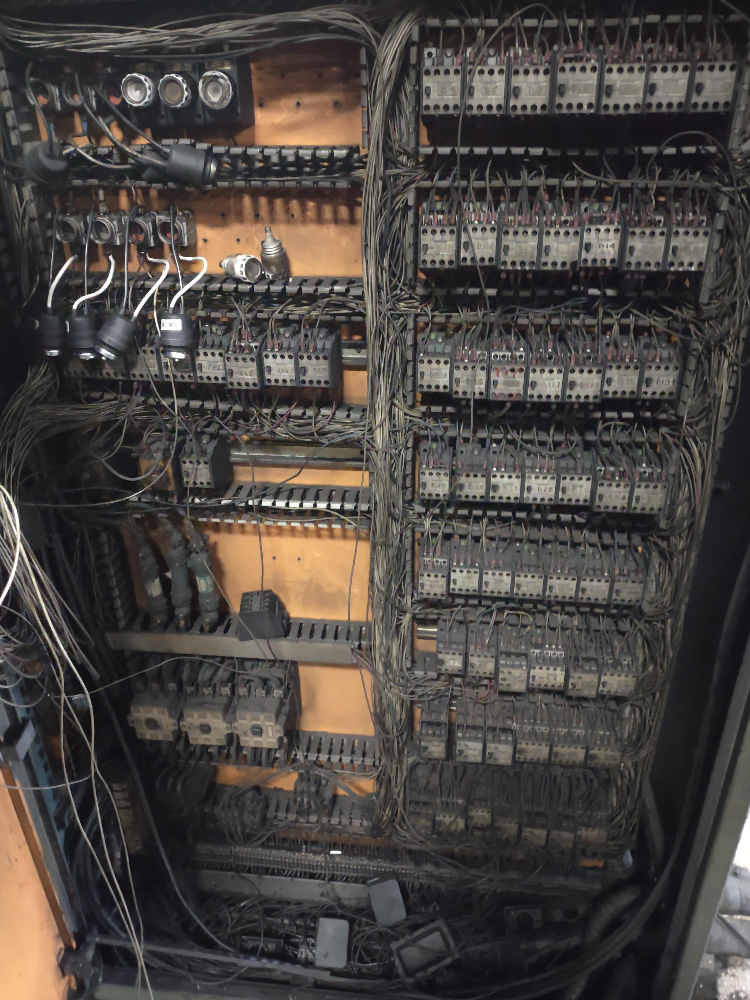
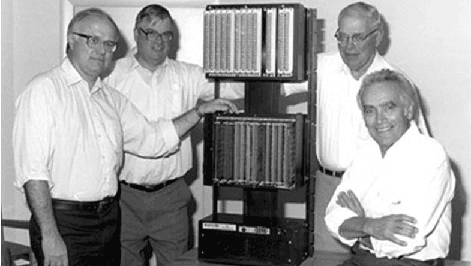
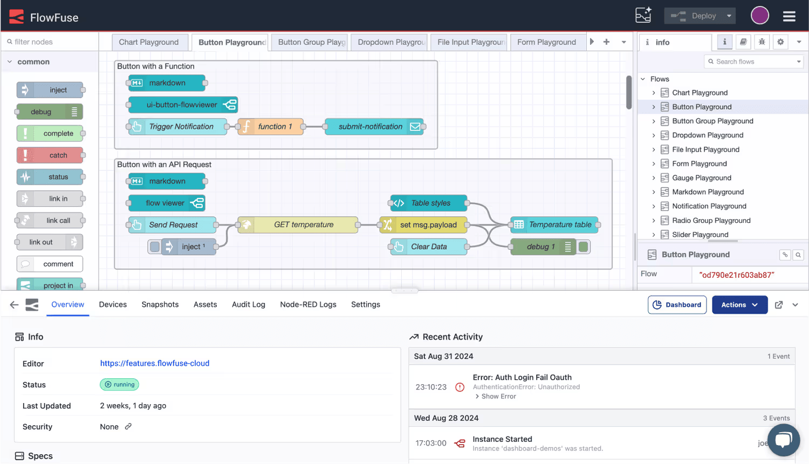

***A PLC (Programmable Logic Controller) is an industrial computer that continuously monitors sensors, executes control logic, and operates motors, valves, and equipment in real time, serving as the reliable backbone of modern manufacturing and industrial automation.***

<!--more-->

On New Year's Day 1968, [Dick Morley](https://en.wikipedia.org/wiki/Dick_Morley) woke up with a brutal hangover and wrote the specification that would replace relay logic in factories worldwide. Nursing what he later described as a wicked headache, he defined a device that could run a production line, survive a factory floor, and be reprogrammed without anyone touching a wire.

Before that morning, changing how a factory operated meant physically rewiring thousands of electromagnetic relays. General Motors was losing weeks of production and millions in labor costs every time it retooled a line. Morley's design turned that into a software change.

Today PLCs control the assembly of the car you drive, the batch that produced your medication, and the pumps that treat your drinking water. They run power substations, traffic systems, and semiconductor fabs. It is a [$13 billion market](https://www.mordorintelligence.com/industry-reports/programmable-logic-controller-plc-market), and most people have never heard of the technology.

This article covers what a PLC actually is, what sits inside one, how the scan cycle works, how PLCs are programmed, the types available, where they run, and the problem that dominates industrial automation projects today: getting controllers from different vendors to share their data.

## What is a PLC (Programmable Logic Controller)?

A Programmable Logic Controller is an industrial computer built for one job: controlling machines and processes in real time with high reliability. Unlike a laptop or a cloud server, a PLC operates in conditions that destroy standard computers, including temperature extremes, constant vibration, electrical noise, dust, and humidity.

The concept is simple. A PLC reads inputs from sensors and switches, executes logic from its stored program, and updates outputs that drive motors, valves, lights, and equipment. It repeats that loop continuously, hundreds or thousands of times per second. Read inputs. Run logic. Update outputs. Repeat.

What sets a PLC apart is not computing power. Your phone outperforms every PLC ever built. It is deterministic execution. The program runs the same way, in the same order, in a predictable amount of time, on every single scan. No operating system decides to install an update. No background process steals a time slice. In a plant where a missed decision means a ruined batch, a damaged machine, or an injured operator, that predictability is the entire product.

The hardware reflects the same priority. Industrial-grade components tolerate heat and electrical interference. Power supplies absorb the voltage sags and spikes that come with starting large motors. I/O modules interface directly with field devices at industrial voltages and currents, with isolation so a fault in the field does not reach the processor. The programming languages are visual and built around relay diagrams, because the people who commission and maintain these systems are controls engineers and electricians, not software developers.

That design has barely changed since 1968, and the reason is straightforward: it works. A PLC installed in a chemical plant runs for decades. A controller in an automotive body shop executes millions of cycles without a fault. Industrial automation never adopted "move fast and break things." The operating principle here is narrower: do not break.

## History of PLCs: from relay rooms to smart controllers

Before PLCs, control logic lived in walls of electromagnetic relays. Thousands of mechanical switches, wired together, defined how a machine behaved. Changing a process meant rewiring a cabinet by hand. Every model change brought weeks of downtime, crews of electricians, and a real chance that one wrong wire would stop the plant.

{data-zoomable}
_A relay control cabinet of the kind PLCs replaced. Every logic change here meant physically rewiring the panel._

By the late 1960s that inflexibility was becoming untenable, especially in automotive. Meanwhile Dick Morley was running Bedford Associates, a small consultancy helping machine tool firms move to solid-state controls. The work paid, but every project was a variation on the last.

On New Year's Day 1968, hungover and two weeks late on yet another proposal, Morley wrote a specification for something he called a Programmable Controller: a device that could replace relay logic, survive factory conditions, and be reprogrammed without rewiring. His requirements were specific. No processing interrupts. Direct memory mapping. A sealed, rugged enclosure cooled by heat sinks rather than fans. A programming language modeled on relay diagrams, which became ladder logic. He also specified that it should run slowly, a decision he later regretted.

Morley took the memo to his colleagues at Bedford Associates and gave them one rule: never call it a computer. If he found that word on a document, he threw the document away. They built a sealed unit with metal fin heat sinks and named it the Model 084, Bedford's eighty-fourth project.

To commercialize it, the team formed a new company in October 1968 and called it **Modicon**, short for Modular Digital Controller. Morley was never formally an employee, but he ran engineering. The Model 084 shipped in 1969, followed by the Model 184, which fixed the problems the first units exposed.

General Motors placed a million-dollar order, and in November 1969 its Hydramatic Division took delivery of the first batch. General Electric followed with an order of its own, planning to rebrand the controllers as OEM units. Within a year of Modicon's founding, the PLC had gone from a hungover memo to production deployment at the world's largest automaker.

{data-zoomable}
_The team behind the first Modicon 084: Richard Morley, Tom Boissevain, George Schwenk, and Jonas Landau._

Morley always called himself the father of the PLC rather than its inventor. He knew other groups were chasing the same problem and believed the technology invented itself out of necessity. Modicon was later acquired and now sits inside Schneider Electric, which still uses the number 84 on products as a nod to where it started.

## What's inside a PLC: the 7 main parts

Open a PLC cabinet and you will find a metal assembly on a DIN rail, covered in wire terminals, with no monitor, no keyboard, and no fan. Seven functional parts do all the work.

**1. Power supply.** Converts plant power into the clean, stable DC the processor and modules need. It is rated for abuse, because industrial power is chaotic: sags when large motors start, spikes from switching, and harmonics from variable frequency drives.

**2. Central processing unit (CPU).** Executes the control program. Modern PLCs use industrial microprocessors chosen for temperature tolerance and long-term availability rather than raw speed. The CPU also runs self-diagnostics and manages the scan cycle.

**3. Memory.** Holds the program and the data it works on. Non-volatile memory retains the compiled program and retentive values through a power cycle. Volatile working memory holds the I/O image table, timers, counters, and intermediate results for the current scan.

**4. Input modules.** Convert field signals into values the CPU can read. A limit switch closes a 24 V DC circuit. A temperature transmitter sends 4-20 mA. A pressure sensor outputs 0-10 V. Digital input modules report on or off. Analog input modules digitize a continuous range. Both provide electrical isolation so field noise and ground loops never reach the processor.

**5. Output modules.** Drive the physical world. When the program decides a motor should run, the output module closes a relay, switches a transistor, or sends an analog signal to a drive. Digital outputs handle contactors, solenoids, and indicators. Analog outputs set valve positions and drive speed references.

**6. Communication interface.** Connects the PLC to everything else: HMIs, SCADA systems, other PLCs, drives, remote I/O, and IT systems. This is usually an Ethernet port plus one or more fieldbus ports, and it is where most of the difficulty in modern automation projects lives.

**7. Programming device.** The laptop and vendor software you use to write, download, and debug the program. It also provides online monitoring, so you can watch logic execute live while the machine runs.

Small PLCs integrate all seven into one sealed housing. Large systems distribute them across a rack, so you can add I/O, swap a failed module, or scale the system without replacing the controller.

## How a PLC works: the scan cycle

Every PLC runs the same four-step loop, over and over, for as long as it is powered.

1. **Input scan.** The PLC copies the state of every input into memory at once. That snapshot is what the program reads, so a sensor changing mid-program cannot produce inconsistent behavior.

2. **Program execution.** The controller runs the control logic from first instruction to last, using the snapshot. *If temperature exceeds 250 °F, open the cooling valve. If a part is present and the quality check passed, advance the conveyor.*

3. **Output update.** The PLC writes all calculated results to the physical output modules at once. Motors start. Valves move. Nothing updates partway through the logic.

4. **Housekeeping.** The controller handles communications, diagnostics, and error checking, then starts the next scan immediately.

A full cycle typically takes 1 to 50 milliseconds depending on program size and CPU. A 10 ms scan means the controller makes a hundred complete decisions per second, every second, for years.

This structure eliminates whole categories of software bug by design. Inputs cannot change mid-program. Outputs cannot update while logic is still evaluating. Race conditions do not occur. Two engineers reading the same program reach the same conclusion about what it will do, which matters enormously when the person troubleshooting at 3 a.m. is not the person who wrote it.

Scan time also sets a hard limit you have to design around. If the fastest event you need to catch is shorter than your scan time, the PLC will miss it. That is why high-speed counting, motion control, and safety functions typically move to dedicated modules that operate outside the normal scan.

## PLC programming languages

PLCs do not run Python or C++. They run the [IEC 61131-3](https://en.wikipedia.org/wiki/IEC_61131-3) languages, designed for controls engineers.

**Ladder logic** looks like a relay wiring diagram, because it replaced relay wiring diagrams. Two vertical rails represent power. Contacts (conditions) and coils (outputs) sit on horizontal rungs between them. Here is a motor start/stop circuit, the first thing most engineers learn:

```
    Start_PB      Stop_PB     Overload      Motor_Run
 ─────┤ ├──────────┤/├─────────┤/├────────────( )─────
      │
    Motor_Run
 ─────┤ ├──┘
```

Pressing the start button energizes `Motor_Run`. The parallel `Motor_Run` contact then holds the rung true after the operator releases the button, which is called a seal-in. Pressing stop or tripping the overload breaks the rung and the motor drops out. Ladder logic is clumsy for mathematics and excellent for exactly this kind of discrete, interlocked control.

**Function block diagram** wires together boxes representing timers, counters, math operations, and PID loops. Data flows left to right between blocks. It suits continuous process control, where analog values need scaling, filtering, and regulation.

**Structured text** is a Pascal-like textual language for calculations, loops, and algorithms that would be unreadable in ladder. Recipe handling, data manipulation, and communication logic usually end up here.

**Sequential function chart** models a process as steps and transitions, which fits batch operations and machine sequences with clearly defined states.

The standard is common, but the implementations are not. Siemens uses TIA Portal. Rockwell uses Studio 5000. Schneider uses EcoStruxure Control Expert. Mitsubishi uses GX Works. Programs are theoretically portable between platforms and practically are not, which is the first form of vendor lock-in an automation team encounters.

## PLC vs PC, PAC, microcontroller, and DCS

"Why not just use a PC?" is a reasonable question with a specific answer, and the same applies to the other options.

| | Best at | Determinism | Environment | Typical lifespan |
|---|---|---|---|---|
| **PLC** | Discrete machine and line control | Guaranteed scan time | Panel-mounted, -20 to 60 °C, vibration tolerant | 20-30 years |
| **PAC** | Control plus data handling, motion, and vision in one controller | Guaranteed for control tasks | Same as PLC | 15-25 years |
| **Industrial PC** | Data processing, analytics, visualization, edge workloads | Not guaranteed under a general-purpose OS | Rugged variants available | 5-10 years |
| **Microcontroller** | Embedded control inside a product | Deterministic, but no industrial I/O or diagnostics | Depends entirely on the board | Product-dependent |
| **DCS** | Continuous process control across a whole plant | Guaranteed, with plant-wide engineering | Control room and field cabinets | 20-30 years |

The practical read: a PC will out-compute a PLC by orders of magnitude and still be the wrong choice for driving a press, because an operating system that can pause your logic for 200 milliseconds is not a control system. Conversely, a PLC is the wrong place to run a machine learning model or a historian. Well-designed plants use both and connect them, which is where the rest of this article ends up.

## Types of PLCs

All PLCs run the same scan cycle. The hardware scales enormously depending on what they control.

### Micro PLCs

Micro PLCs handle very small tasks, typically 8 to 20 I/O points: a single conveyor, pump, sorter, or door. They generally cost $100 to $500 and appear in car washes, vending machines, irrigation systems, and OEM equipment. Programming environments are simplified and focused on basic logic.

**Examples:** Unitronics Jazz, AutomationDirect CLICK, IDEC SmartRelay

### Compact PLCs

Compact PLCs integrate the CPU, I/O, and power supply into one fixed unit, usually covering 10 to 100 I/O points. They suit packaging machines, pump stations, and HVAC plant. Many accept a limited number of add-on I/O modules, but once you exhaust that expansion you are looking at a modular platform instead.

**Examples:** Siemens S7-1200, Rockwell Micro800, Schneider Modicon M221

### Modular PLCs

Modular PLCs separate the CPU from I/O modules mounted on expandable racks. Need several hundred I/O points? Add modules. Need motion control, high-speed counting, redundancy, or a specific fieldbus? There is a module for it. This is the standard for automotive assembly, chemical processing, and large material handling. Costs run from roughly $10,000 to well into six figures depending on scale and redundancy.

**Examples:** Siemens S7-1500, Rockwell ControlLogix, Schneider Modicon M580

### Safety PLCs

Safety PLCs protect people and equipment. They handle emergency stops, light curtains, safety interlocks, and guard door monitoring using redundant processors and continuous self-diagnostics. Certified architectures reach SIL 3 and Performance Level e, with failure rates in the range of 10⁻⁸ to 10⁻⁷ per hour for continuous operation. In most plants the safety PLC runs alongside the standard controller: production logic on one, safety functions on the other, with the safety system able to override everything the instant it detects a hazard.

**Examples:** Pilz PNOZmulti, Siemens F-series, Rockwell GuardLogix

### Choosing the right PLC

Selection comes down to I/O count, logic complexity, safety requirements, and how much you expect the system to grow. Fewer than 20 I/O points with simple logic points to micro or compact. Production lines with hundreds of points, motion control, or serious networking need modular. Anything protecting a person requires a safety-rated controller, without exception.

One factor outweighs the technical comparison: most organizations standardize on a single vendor and stay there for decades, because retraining engineers and rewriting a program library is more expensive than the hardware. That decision is usually made once and lived with for a very long time.

Worth separating, though, is the control layer from the data layer. Committing to Siemens or Rockwell for the next twenty years of machine control is a defensible engineering decision. Letting that choice also dictate how production data reaches your historian, your ERP, or your quality team is not, and it is the part teams tend to concede without noticing. Keeping [the integration layer vendor-neutral](/use-cases/it-ot-middleware/) means the controller standard you pick today does not decide what you can build on top of it in five years.

::cta-image{src="/images/cta/aperia-book-demo.png" alt="Aperia Technologies stopped reprogramming controllers station by station with FlowFuse - book a demo" cta="demo"}
::

## PLC, HMI, and SCADA: how they work together

A PLC executes logic in milliseconds and has no screen. It cannot show an operator what is happening, log history, or send an alert. That is where HMIs and SCADA systems come in, and the three form distinct layers.

**PLCs** control equipment in real time: read sensors, run logic, drive actuators.

**HMIs** (Human-Machine Interfaces) are the touchscreens mounted at the machine. They display what the PLC is doing and let operators start equipment, adjust setpoints, and acknowledge alarms. The HMI sends a request; the PLC evaluates interlocks and decides whether to act. One HMI typically covers one machine or one section of a line.

**SCADA** (Supervisory Control and Data Acquisition) operates at facility level. It polls dozens or hundreds of PLCs, stores trends, generates reports, and coordinates system-wide operations. A water utility with 50 pump stations runs a PLC at each one and a SCADA system in the control room that shows all 50 at once.

In practice: PLCs sit in cabinets, HMIs sit at machines, SCADA runs on servers. When a PLC detects a high temperature, the local HMI raises an alarm and SCADA logs it with a timestamp and notifies maintenance.

This hierarchy works well for operations. It starts to strain the moment someone outside operations wants the data, and that request always comes. Quality wants defect rates by shift. Maintenance wants runtime hours per asset. Finance wants energy cost per unit. None of those systems speak to a PLC, and SCADA was never designed to feed them.

> Most teams solve this one request at a time, and a year later they have thirty point-to-point connections nobody can map. The decision that saves the most rework is how you structure PLC data before you wire up the first system, not after. That is what a [unified namespace](/use-cases/uns/) is for: every application reads from one place, so adding the next one costs a topic subscription instead of another integration project.

## Where PLCs actually run: real-world applications

PLCs control processes where reliability is not negotiable. They are invisible by design and often outlast the engineers who commissioned them.

**[Automotive assembly](/industries/automotive/)** lines coordinate welding robots, conveyors, and quality gates. A body shop may run 50 or more PLCs managing hundreds of welds per vehicle. Retooling for a new model means reprogramming controllers instead of rewiring panels, which is precisely what GM needed in 1968.

**[Pharmaceutical production](/industries/life-sciences/)** relies on PLCs for batch reactors where temperature, pressure, and timing must stay inside validated ranges. Every parameter is logged for regulatory compliance, and the controller flags any batch that drifts out of specification.

**[Food and beverage](/industries/food-beverage/)** plants run mixing, cooking, filling, capping, labeling, and case packing. A single bottling line coordinates all of it, executing the same programs millions of times.

**Water treatment** plants manage pumps, chemical dosing, and filtration against flow and quality sensors. These systems commonly run 20 to 30 years, absorbing daily demand swings automatically.

**Power substations** use PLCs for load monitoring, breaker control, and grid coordination, adjusting within milliseconds as generation and demand shift. The same controllers run inverter and turbine skids across [renewable generation sites](/industries/renewables/), where output varies by the minute.

**Refineries and chemical plants** manage temperatures, pressures, and emergency shutdown sequences in environments where a control failure is a safety event.

**Distribution centers** run conveyor networks, sorters, and automated storage. A package is scanned, routed, and diverted to the correct lane through thousands of decisions per hour.

**Airport baggage systems** are entirely PLC-controlled, moving bags from check-in through screening to the right carousel by destination and departure time.

**Mining operations** run conveyors, crushers, and separation equipment continuously with minimal supervision, monitoring equipment health and shutting down automatically on fault.

The common thread is long-term reliability in demanding conditions. Controllers installed in the 1990s are still running in many of these facilities, executing the same logic, scan after scan, exactly as designed.

## How PLCs communicate

A PLC on its own is a closed loop. The moment you want data out of it, or want two controllers to coordinate, you enter the protocol layer, and this is where most automation projects actually spend their budget.

PLC communication happens at four rough levels.

**Fieldbus, device level.** Modbus RTU, Profibus DP, DeviceNet, and IO-Link connect sensors, drives, and remote I/O over serial or dedicated cabling. Still everywhere in brownfield plants, and often the only interface on older equipment.

**Industrial Ethernet.** Profinet (Siemens), [EtherNet/IP](/blog/2025/10/using-ethernet-ip-with-flowfuse/) (Rockwell and Omron), EtherCAT (Beckhoff), and Modbus TCP carry real-time control traffic over standard Ethernet hardware with deterministic timing. This is what new installations use.

**Vendor-native protocols.** Each manufacturer has a protocol for reading and writing its controller's memory directly: S7comm for Siemens, CIP for Rockwell, ADS for Beckhoff, MC Protocol for Mitsubishi, FINS for Omron. Fast, well-documented, and completely incompatible with each other.

**Standards-based and IT-facing.** [OPC UA](/blog/2025/07/reading-and-writing-plc-data-using-opc-ua/) provides a vendor-neutral, secure, structured interface that most modern PLCs expose directly. MQTT, often with Sparkplug B, carries data to brokers, cloud platforms, and unified namespaces. REST APIs and SQL connections handle the rest.

Here is what that looks like in a plant with mixed equipment:

| Vendor | Common controller | Native protocol | Standards option |
|---|---|---|---|
| Siemens | S7-1200 / S7-1500 | S7comm, Profinet | OPC UA server built in |
| Rockwell | CompactLogix / ControlLogix | EtherNet/IP (CIP) | OPC UA via gateway or newer firmware |
| Beckhoff | CX series | ADS, EtherCAT | OPC UA server available |
| Mitsubishi | MELSEC iQ-R / FX | MC Protocol, CC-Link | OPC UA via module |
| Omron | NX / NJ | FINS, EtherNet/IP | OPC UA on select models |
| Legacy equipment | Various | Modbus RTU/TCP | None |

Most facilities run at least three of these rows simultaneously. A line installed in 1998, a cell added in 2012, and a machine commissioned last quarter all need to appear in the same production report.

> Reading about protocols only gets you so far. If you have a controller on the bench, or a spare hour on a live line, this walkthrough goes tag by tag: [connect any PLC to MQTT in under an hour](/blog/2025/10/plc-to-mqtt-using-flowfuse/). It handles Siemens S7, Allen-Bradley, OPC UA, and Modbus in a single flow, runs on a free account, and needs no gateway hardware sitting in the middle.

## The interoperability problem: when PLCs won't talk

Dick Morley solved machine control in 1968. As manufacturers raced to capture the market he created, each built a closed ecosystem around it, and vendor lock-in became the PLC's unintended legacy.

The consequences show up on every project.

**Every connection is a custom build.** Reading a production count from a Siemens controller and acting on it in a Rockwell one means writing a gateway, configuring a protocol converter, or buying a middleware licence. Do that for every pair of systems and the integration layer becomes larger than the applications it serves.

**Licensing scales with tags, not value.** Traditional data access is often priced per tag or per connection. A pilot on one line is affordable. Rolling out to forty lines rewrites the business case.

**Brownfield is the normal case, not the exception.** Because PLCs last 20 to 30 years, no plant gets to standardize. There is always a controller nobody wants to touch, running critical logic, with an interface that predates the current engineering team.

**Nobody owns the middle.** OT owns the controllers and will not accept anything that risks uptime. IT owns the databases and cloud and cannot get a route to the data. Integration work stalls in the gap between them.

**Each project starts from zero.** Solve production monitoring at one plant and the next plant rebuilds it, because the solution was wired to that site's specific mix of vendors. Twelve plants produce twelve incompatible "snowflake" implementations and no shared standard.

The cost is not only technical debt. It is strategic paralysis. Teams stay on one vendor not because it is the best fit, but because the switching cost has quietly become unpayable.

## Solving the PLC integration problem

Modern PLCs are not the hard part. Getting forty controllers from five vendors, installed across three decades, to feed one production report is.

[FlowFuse](/) is the open-source Industrial Application Platform built for exactly that layer. It connects any controller, whether that is Siemens, Allen-Bradley, Omron, Mitsubishi, or a legacy Modbus device, without proprietary gateways or per-tag licensing, then routes the data to MQTT, historians, databases, [dashboards](/blog/2026/08/manufacturing-dashboard-examples/), and ERP systems. Your PLCs keep running their proven logic. What changes is that their data stops being trapped.

{data-zoomable}
_FlowFuse connects controllers, edge devices, and enterprise systems from a single governed platform._

Build the integration once, deploy it to every site, and manage it centrally instead of rebuilding a snowflake at each plant. See the [PLC integration overview](/landing/plc/) for supported protocols and reference architectures, or [connect your first controller free](https://app.flowfuse.com/account/create).

Dick Morley's specification gave engineers a controller they could reprogram without touching a wire. The same freedom is now available for the integration layer above it.
