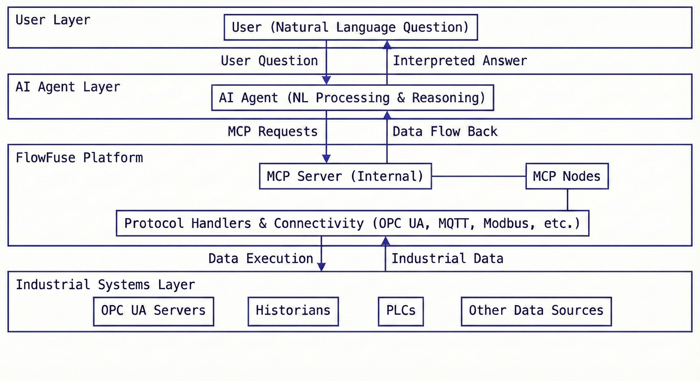

OPC UA servers store everything. Finding anything takes hours.

<!--more-->

Your historian has six months of production data across 847 variables. Wednesday's batch failed quality checks. The root cause is in there—a sensor drift, a temperature anomaly, something that happened before the failure became visible. But variables are named `ns=2;s=Device1.PLC.DB1.Temp_Sensor_3`. The namespace structure was designed for PLC efficiency, not human investigation.

So you click through hierarchies. Cross-reference documentation that's two firmware versions out of date. Export data to Excel. Build correlation matrices. Check timing against process logs. Four hours later, you find it.

OPC UA gave machines a common language. It solved connectivity. But it created an accessibility problem: the data infrastructure that captures everything makes finding specific answers remarkably slow.

The solution isn't better visualization or more dashboards. It's removing humans from the navigation process entirely. AI agents can browse OPC UA servers, pull historian data, run correlations, and surface answers while you're still typing the question.

# The Investigation Bottleneck

Implementation isn’t the problem anymore. Industrial teams connect devices, configure historians, and establish data flows with remarkable efficiency using modern platforms like FlowFuse. The bottleneck emerges when someone needs to actually use that data.

Your dashboard flags a reject rate spike on Line 3. That's the easy part—monitoring works. But dashboards show symptoms, not causes. Finding the cause means pulling data for dozens of variables, checking what changed in the hours before the spike, testing correlations between temperature sensors and quality metrics, comparing this week's patterns against baseline operations. What should take minutes consumes your morning because every step requires manual work.

Here's what makes this a systemic problem rather than an isolated inconvenience: Every operational question follows this same investigative pattern. Why did energy consumption jump last Tuesday? Which sensor readings predict motor failures? What operating conditions maximize throughput on the packaging line? Different questions, identical process—navigate namespaces, extract data, analyze patterns, interpret results. The data exists. The infrastructure works. But accessing meaningful insights requires hours of manual effort each time.

Standard solutions miss the point. Hiring more analysts just distributes the same manual work across more people. Building more dashboards only helps when you already know what to monitor—they don't help with exploration, with unexpected questions, with the kind of investigation that drives real operational improvement.

## What AI Changes

The value proposition is straightforward: Replace manual investigation workflows with automated execution.

Thursday afternoon, Line 3's reject rate spikes. The traditional approach takes six hours minimum if the data's clean and you know exactly where to look: Pull historian data for fifty variables that might matter. Build correlation matrices in Excel. Analyze sensor drift patterns. Cross-reference timing against process logs. Compare current performance against last month's baseline. Pull in a colleague to verify you didn't miss something obvious.

Ask an AI agent: *"What changed in Line 3 before Thursday's spike?"*

The agent queries your historian across relevant subsystems. Runs timing correlations against the reject rate increase. Identifies statistical anomalies in sensor data. Tests relationships between variables. Flags causation with confidence intervals. Five minutes later you're reviewing root cause analysis, not building it from scratch.

This efficiency compounds across every investigative use case:

Predictive analysis that would take weeks becomes instant queries. Understanding how motor current relates to product quality typically requires extracting time-series data from your historian, cleaning datasets, running statistical tests, validating correlations, interpreting significance—three months of dedicated work. The agent returns correlation matrices with confidence intervals and outlier analysis while you're finishing your coffee.

Compliance documentation that takes weeks to compile generates on demand. Audits need complete OPC UA server documentation—node hierarchies, relationship mappings, system architecture, operational ranges calculated from historical performance. Manually, that's weeks of browsing address spaces and organizing specifications. The agent generates it directly from live server metadata and your historical data. Infrastructure changes next quarter? Regenerate the documentation instead of manually updating deprecated specs.

Pattern recognition at scale becomes feasible. Agents analyze patterns across days, weeks, months of continuous operation—patterns humans miss because they require simultaneous analysis of thousands of variables. "Show me every instance where Variable_A spiked within ten minutes of Variable_B changing" becomes a query you actually ask instead of a question you abandon because the manual investigation would take too long.

The mechanical work executes automatically: namespace navigation, data retrieval, correlation testing, anomaly detection. Your time goes to what requires actual judgment—interpreting analytical findings against operational knowledge, deciding whether to adjust processes or schedule maintenance. Questions you'd previously skip because investigation overhead exceeded potential value become queries worth asking.

## The Technology Behind It

FlowFuse makes this work through a straightforward architectural approach that connects AI reasoning to industrial data systems.

As an industrial data platform, FlowFuse already handles connectivity to OPC UA servers, historians, and other industrial systems. The new capability comes from MCP nodes that expose this connectivity through the Model Context Protocol—a standardized interface that lets AI systems interact with any data source using common operations like browse, read, query, and analyze.

Here's how it flows: You ask your AI agent a question in natural language. The agent translates that into MCP operations—browse this namespace, retrieve these variables, analyze this time range. FlowFuse receives those operations and executes them against your actual infrastructure, handling all the OPC UA protocol complexity, session management, and security. The agent gets back structured data, interprets it, and gives you an answer.

{data-zoomable}
_High-level architecture diagram showing the interaction between Al agents and industrial systems via the FlowFuse Platform._

The architecture separates concerns cleanly. AI handles the reasoning—figuring out what data matters and how to interpret it. FlowFuse handles the execution—dealing with industrial protocols, data access, and system integration. Neither tries to do the other's job.

For teams building their own integrations, the implementation details are documented here: [Building MCP Server Using FlowFuse](https://flowfuse.com/blog/2025/10/building-mcp-server-using-flowfuse/)

**Watch It Work**

The video below shows an AI agent generating complete OPC UA server documentation on request—finishing in minutes what typically requires weeks of manual effort.

<lite-youtube
  videoid="agxAw4B91Nw"
  style="width: 1024px; overflow: hidden; background-image: url('/blog/2026/01/images/ai-opcua-document-generation.jpg'); background-size: cover; background-position: center;"
  title="AI Agent Generating OPC UA Documentation">
</lite-youtube>

## What This Unlocks

Connecting agents to OPC UA infrastructure delivers capabilities manual investigation can't match at scale.

**Autonomous navigation across address spaces.** Agents read node hierarchies, examine metadata—DisplayNames, EngineeringUnits, data types, access levels—follow references between nodes, build structural understanding of systems. You describe what you need, agent locates relevant nodes. No memorizing namespace paths or node IDs. Looking for a pump's discharge pressure sensor buried five levels deep in your hierarchy? Agent finds it by understanding equipment relationships, not because someone documented the exact path.

**Automated data analysis across historians.** Agents pull historical data, run statistical tests, calculate correlations, detect anomalies, compare time periods, validate significance. Ask "How does ambient temperature affect motor current draw on Line 2?" and get months of historian data analyzed—variables correlated, confounding factors accounted for, confidence intervals calculated. Manual approach means days of Excel work: extraction, cleaning, statistical analysis, validation. Agent returns analyzed results in minutes while you're still drinking your coffee.

**Pattern recognition at operational scale.** Agents analyze patterns across days, weeks, months of continuous operation—patterns humans miss because they require simultaneous analysis of thousands of variables. "Show me every instance where Variable_A spiked within ten minutes of Variable_B changing" becomes a query you actually ask instead of a question you abandon. Finding subtle leading indicators of equipment degradation across hundreds of sensors? Agent correlates every variable combination, identifies statistically significant patterns, surfaces predictions. Doing this manually would take months of dedicated work. Nobody attempts it because nobody has months to spare.

Investigation capabilities that previously required dedicated data science teams become natural language queries. Complex analyses finish in minutes instead of weeks. Questions you'd skip because the investigation wasn't worth the effort become routine operational intelligence you actually use.

## The Bigger Picture

The value in industrial data was never about collection—it was always about the questions that data could answer. Those questions just cost too much time to pursue. When investigation drops from hours to minutes, the economics change completely. Different questions become worth asking. Documentation stays current because updating it is on-demand instead of weeks of work. Pattern analysis across thousands of variables becomes routine instead of heroic.

This isn't about replacing people with automation. It's about making the data infrastructure you already built actually useful for the decisions it was meant to inform. Your team still interprets results, makes judgment calls, and takes action. The AI just handles the mechanical work of data access and analysis.

And it's not limited to OPC UA. FlowFuse's MCP approach works the same way across any industrial system—MQTT brokers, Modbus devices, SQL databases, REST APIs, whatever protocols you're running. Same natural language interface, same investigation capabilities, different underlying systems. The infrastructure you have becomes the infrastructure you can actually use.

***If you want a single platform to reliably connect OPC UA servers, devices, and data systems—and make that data usable by both people and AI—FlowFuse provides the foundation. [Contact us to learn more](/contact-us/)***