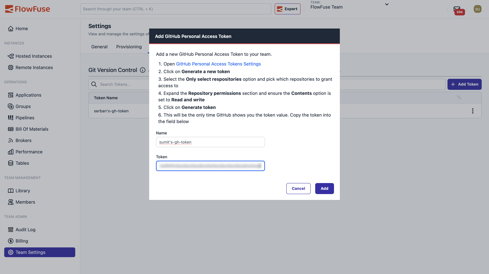

If you've been using Node-RED in production, you already know the pain points. Flows get complex. Teams grow. Someone makes a change that breaks production at 2 AM. You need to roll back, but which version was working? Who approved this deployment? How do you keep your dev environment in sync with production?

<!--more-->

Traditional Node-RED doesn't have answers to these questions. But modern software development has solved these problems decades ago with version control and DevOps pipelines.

That's the gap FlowFuse fills.

## FlowFuse: DevOps for Node-RED

FlowFuse is a platform built specifically for running Node-RED at scale. It handles deployment, management, security, team collaboration, and more so you can focus on building flows instead of managing infrastructure.

Every FlowFuse can automatically create snapshots whenever flows are deployed. These snapshots let you track changes over time and roll back when needed. You can also create manual snapshots to mark important milestones.

The real power comes from DevOps pipeline stages. You set up stages like development, staging, and production, then push snapshots through them. Make changes in dev, test in staging, promote to production. Everything's tracked and auditable.

## Why Git Integration Matters

We realized that many organizations already use Git as their central version control system. Their CI/CD pipelines run on Git commits. Their backup systems rely on Git repositories. Their compliance tools track changes through Git history too. To fit seamlessly into these existing workflows, Node-RED flows needed to be in Git too.

That's why we built Git integration for FlowFuse. FlowFuse pipeline stages now connect directly to Git repositories. Push your snapshots to Git and pull changes back when you need them.

**Note:** Git integration currently supports GitHub repositories.

Git integration brings several key advantages. Your flows are backed up in Git repositories alongside your other code, so if an instance is accidentally deleted, your flows remain safe and recoverable. For some companies, having all code assets version-controlled in Git repositories is a compliance requirement they must meet.

Git integration works alongside FlowFuse's DevOps features—snapshots, pipelines, rollbacks—giving you the full power of both systems.

## Setting Up Git Integration

Let's walk through connecting your FlowFuse instances to a Git repository.

### Prerequisites

Before you begin, make sure you have:

- **FlowFuse Team Account**: Git integration is available exclusively to Enterprise users. If you don't have a Enterprise account, visit the [FlowFuse pricing page](/pricing) or contact `sales@flowfuse.com` to upgrade.

- **GitHub Account**: You'll need a GitHub account with permission to create repositories and generate personal access tokens.

### Step 1: Create a GitHub Repository

First, set up a repository where your Node-RED flows will live:

1. Log in to your GitHub account
2. Click the **+** icon in the top right corner and select **New repository**
3. Name your repository (e.g., "nodered-flows" or "production-flows")
4. Choose **Public** or **Private** depending on your needs
5. You can initialize with a README if you'd like documentation
6. Click **Create repository**

Keep this repository URL handy—you'll need it later.

### Step 2: Generate a GitHub Personal Access Token

FlowFuse needs permission to push and pull from your repository. GitHub uses Personal Access Tokens for this:

1. Go to [GitHub Personal Access Tokens Settings](https://github.com/settings/tokens)
2. Click **Generate new token** and select **Generate new token (fine-grained)**
3. Give your token a descriptive name like "FlowFuse Node-RED Integration"
4. Set an expiration date (we recommend 90 days for security)
5. Under **Repository access**, choose **Only select repositories** and pick which repos FlowFuse can access
6. Under **Permissions**, expand **Repository permissions**
7. Find **Contents** and set it to **Read and write**
8. Click **Generate token** at the bottom

**Critical**: GitHub shows this token only once. Copy it immediately and store it somewhere secure. You'll paste it into FlowFuse in the next step.

### Step 3: Add Your Token to FlowFuse

Now let's connect FlowFuse to your GitHub account:

1. Log in to your FlowFuse account
2. Navigate to **Team Settings** in the left sidebar
3. Click the **Integrations** tab
4. Find the Git integration section and click **Add Token**

{data-zoomable}
_Team Settings - Integrations tab showing Git integration options_

5. Give your token a name (like "GitHub Production Flows")
6. Paste the Personal Access Token you copied from GitHub
7. Click **Add**

{data-zoomable}
_Adding a GitHub Personal Access Token to FlowFuse_

Your token is now available to all Node-RED instances in your FlowFuse team.

### Step 4: Configure a Pipeline Stage for Git

This is where it comes together. You'll configure a pipeline stage to push snapshots to your Git repository.

**Important**: A Git repository stage needs something to push. Make sure your pipeline has at least one stage before the Git stage—typically a Node-RED instance stage. The pipeline will take snapshots from that source stage and push them to Git.

1. In FlowFuse, navigate to your application
2. Go to the **DevOps Pipelines** section
3. Select the pipeline you want to add the Git stage to (or create a new one)
4. Click **Add Stage**
5. In the stage settings, select the Type **Git Repository**
6. Give the stage a name
7. Select the token you created earlier
8. Enter your repository URL (e.g., `https://github.com/your-username/nodered-flows.git`)
9. Enter the snapshot file name (e.g., `flow.json`). Leaving this blank will use the instance name. This is the name your flows will be saved as in the Git repository. When pulling changes back from Git, you must enter the exact same file name that exists in your repository to retrieve the correct flows.
10. Specify a branch name for pushing changes (like `main`). Make sure the branch already exists in your repository.
11. Optionally, specify a branch name for pulling changes (like `main`). Make sure the branch already exists in your repository.
12. Enter a secret credential key. This can be any strong passphrase. You'll need to re-enter it when pulling changes through the DevOps pipeline in FlowFuse.

{data-zoomable}
_Configuring a Git Repository stage in a DevOps pipeline_

13. Click **Add Stage**

{data-zoomable}
_DevOps pipeline with Git repository stage added_

### Step 5: Push a Snapshot to Git

With the Git repository stage configured in your pipeline, you're ready to push your Node-RED flows to Git.

1. Open your Node-RED instance in FlowFuse that is part of the DevOps pipeline containing the Git repository stage
2. Make any required changes to your Node-RED flows, or keep them as-is if you want to push the current state
3. Navigate to the **DevOps Pipelines** section and select the pipeline that includes the Git repository stage
4. Create a **snapshot** to capture the current state of your flows
5. Click **Run Pipeline** and promote the snapshot through each stage until it reaches the Git repository stage
6. Once the pipeline completes successfully, FlowFuse automatically commits the snapshot to the configured Git repository

After the pipeline run finishes, you can open your Git repository and verify:

- A new commit containing your Node-RED flows
- A commit message linked to the snapshot
- A complete, auditable history of changes

At this point, your Node-RED workflows are version-controlled in Git and fully integrated into your existing CI/CD and DevOps processes.

### Step 6: Pull Changes from Git

FlowFuse's Git integration works both ways. You can push flows to Git and pull changes back from Git into your Node-RED instances.

The pipeline process is identical whether you're pushing or pulling—only the stage order changes. When pushing, your Git repository stage sits at the end of the pipeline. Snapshots flow from your Node-RED instance through intermediate stages and finally commit to Git. When pulling, the Git repository stage moves to the beginning. The pipeline fetches the latest commit from your configured branch, creates a snapshot, and promotes it through subsequent stages to your target instances.

This bidirectional workflow solves several common challenges. Teams can commit flow changes directly to the repository and pull them into FlowFuse. You can migrate flows from other systems by committing them to Git first. Your Git repository serves as both a backup destination and a source of truth.

## Conclusion

FlowFuse simplifies everything about running Node-RED at scale—deployment, security, scaling, and team management. Git integration bridges the gap between FlowFuse's DevOps features and your existing development infrastructure. Your flows stay version-controlled, your team stays synchronized, and your operations stay simple.

Want to see how FlowFuse makes Node-RED production-ready? [Book a demo](/book-demo/) and we'll walk you through the entire platform and all its features.
