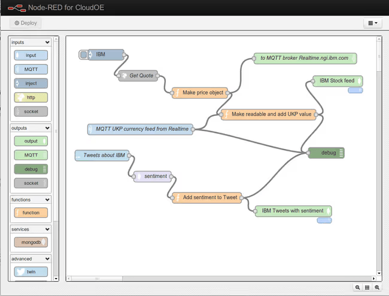
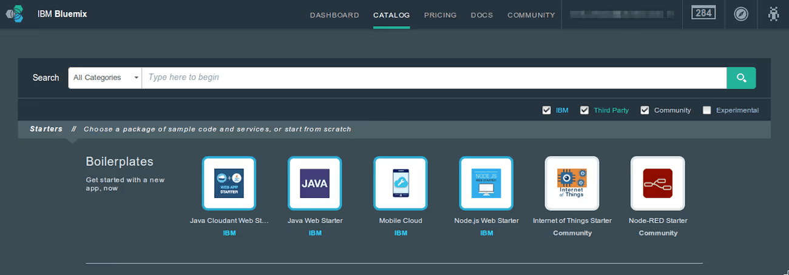
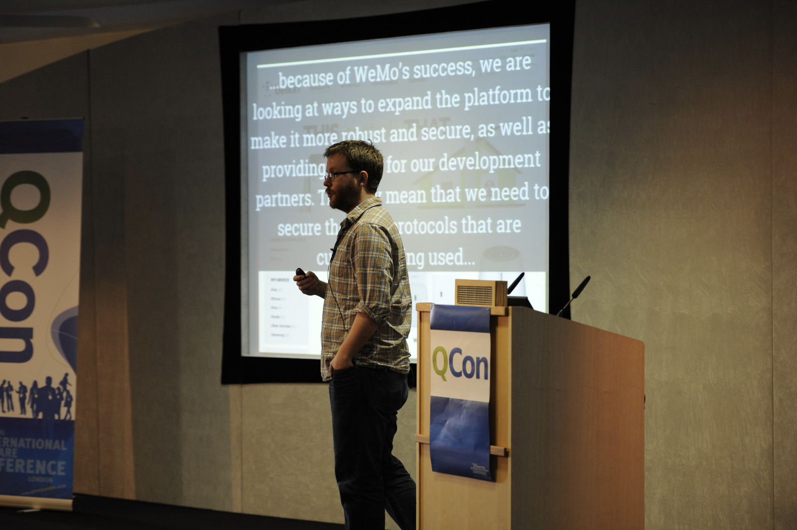
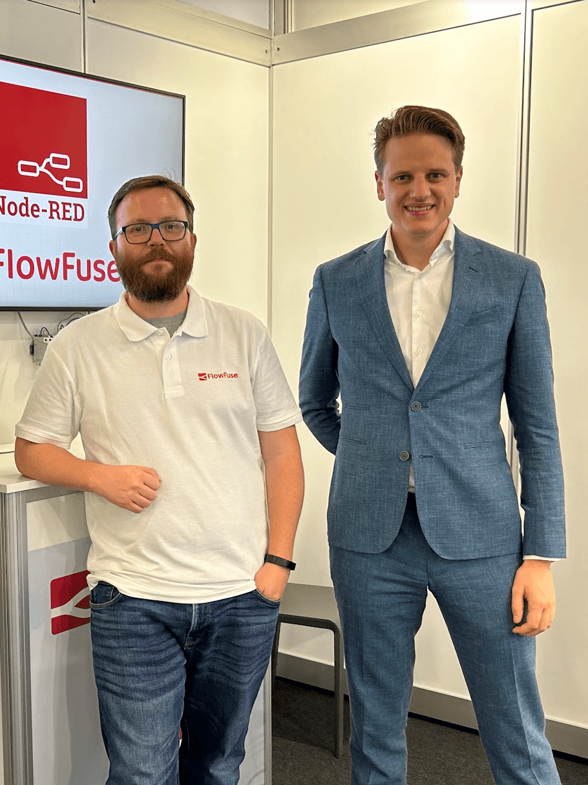

In late 2011, Nick O'Leary was a "plumber" of the digital age. As part of IBM's Emerging Technology Group, he spent his days building experimental projects that pushed the boundaries of what connected systems could do. But there was a problem: for every new experiment, he found himself writing the same boilerplate code over and over — the tedious "wiring" work needed to make different systems talk to each other.

<!--more-->

## The Birth of Node-RED

The frustration was mounting. Each new project at IBM's Emerging Technology lab meant rewriting integration code from scratch. Nick knew there had to be a better way.

On a "wet January day in 2013," Nick decided to try something new. He wanted a way to visualize mapping messages across an MQTT infrastructure. He turned to Node.js — then a relatively new technology — as the foundation.

Over a single weekend, he built a rough prototype that allowed him to drag boxes and draw wires instead of writing endless integration code. When he showed it to his colleague Dave Conway-Jones on Monday morning, Dave’s response was immediate and world-changing: "Go on then."

{data-zoomable}
_Dave and Nick_

The name was a light-hearted play on words. "Node" reflected the Node.js runtime and the flow-based model, while "RED" was a cheeky nod to "Code Red." While some later suggested it stood for "Rapid Event Developer," Nick and Dave never felt the need to formalize it. It was simply a vibrant alternative to the "Big Blue" corporate standard.

{data-zoomable}
_Early Node-RED Screenshot_

Those two words meant everything. Dave didn't just approve — he joined in. Together, they started refining the tool, adding features, testing it on real IBM projects. What began as Nick's weekend hack became their shared mission. Within weeks, they had transformed a rough prototype into something that actually worked in production. The tool that was supposed to save Nick time on one project was now saving their entire team hours every week.

Node-RED offered something different: freedom. Drag boxes. Connect wires. Make anything talk to anything. No permission required.

## The Public Spark

The transition from a lab tool to a public project wasn't a corporate rollout; it was a grassroots explosion. By late 2013, Nick and Dave had seen enough: Node-RED was too useful to keep locked inside the walls of IBM.

### The First Commit: September 5, 2013

The public story of Node-RED began with a push, not a press release. On **September 5, 2013**, the first code was uploaded to GitHub. It was a "soft launch" — a way to see if the world actually needed a visual tool for "wiring" the Internet of Things. Within weeks, the community responded with an intensity that caught even the creators by surprise.

### The "Workshop" Moment: Wuthering Bytes

The first external validation happened just a week after the GitHub release at the **Wuthering Bytes** technology festival. After Nick gave a brief, unprepared lightning talk, he walked into a workshop the following day and was stunned to see **Node-RED on every single screen.** A workshop facilitator had discovered the code on GitHub just days earlier and immediately scrapped his original plan. He realized that instead of teaching students how to troubleshoot line-by-line syntax, he could use Node-RED to let them actually *build* something. In thirty minutes, the class had achieved what usually took an entire day. It was the first time Nick saw people he had never met using his creation to solve real problems.

### The London Node.js User Group (LNUG)

While the hardware community was the first to adopt it, the **London Node.js User Group (LNUG)** was where the project faced its first true technical trial. Standing before a room of seasoned JavaScript developers, Nick had a 30-minute slot to prove that Node-RED wasn't just a visual toy — it was a powerful tool built on the very event-driven architecture they loved. The talk was a massive success, generating immediate buzz across social media and solidifying Node-RED’s reputation within the developer community.

<lite-youtube videoid="CF7BGDj2_G8" params="rel=0&start=1740" style="margin-top: 20px; margin-bottom: 20px; width: 100%; height: 480px;" title="LNUG October 2013: Node-RED - Nick O'Leary"></lite-youtube>

### The Big Stage: ThingMonk 2013
 
While the September meetups provided the spark, **ThingMonk on December 3, 2013**, was the "Big Bang." This was the first major professional and industrial stage for Node-RED. It was here that the industry elite — the architects of the "Internet of Things" — realized that Node-RED was the answer to the "glorious mess" of incompatible protocols.

In his presentation, "Wiring the Internet of Things," Nick showed that visual programming wasn't just a shortcut for beginners; it was a professional-grade solution for the most complex integration problems on the planet.

<lite-youtube videoid="zUoCJb0jzuo" params="rel=0" style="margin-top: 20px; margin-bottom: 20px; width: 100%; height: 480px;" title="ThingMonk 2013: Wiring The Internet of Things"></lite-youtube>

### 2014: Proving the Concept

If 2013 was the spark, 2014 was the foundation. This was the year Node-RED moved from a lab experiment to a professional tool.

**IBM's launch of Bluemix** (now IBM Cloud) marked a pivotal moment — Node-RED became a flagship starter app, validating that visual programming could power enterprise-grade cloud applications. The year also saw multiple major version releases that enhanced the platform's capabilities.

{data-zoomable}
_Node-RED featured as a flagship starter app on IBM Bluemix in 2014_

During this period, Nick took the project on the road — speaking at conferences and meetups to actively build the community around Node-RED. A major milestone came at QCon London 2014, a moment Nick has often described as especially meaningful. The talk marked a turning point, demonstrating to the professional software industry that visual programming could be a serious, scalable solution for complex data integration.

{data-zoomable}
_Nick O’Leary presenting Node-RED at QCon London 2014_

## The Explosion: The Raspberry Pi Milestone

By November 2015, Node-RED was officially integrated into the Raspbian Jessie image, marking its transition from a manual install to a core component of the Raspberry Pi ecosystem. The [announcement was made by Simon Long](https://www.raspberrypi.com/news/latest-raspbian-update/), the Raspberry Pi Foundation's UX Engineer, who detailed the update in a blog post on December 2, 2015. This milestone meant that millions of $35 computers suddenly shipped with a visual programming tool built specifically for the "Internet of Things," sitting prominently in the application menu alongside educational staples like Scratch and Python.

{data-zoomable}
_Screenshot of the Raspbian Jessie desktop menu showing Node-RED included by default with Scratch and Python on Raspberry Pi_

The impact was immediate and massive. Students learning to code on Raspberry Pi discovered Node-RED next to Python. Hobbyists building weekend projects found it pre-installed. Educators teaching IoT concepts had a visual tool ready to use. What had required hunting through forums and installation guides was now just a click away in the menu. The barrier to entry dropped to zero, and the community exploded.

Within months, Node-RED flows for Raspberry Pi projects flooded online forums. Home automation guides assumed you had it installed. The "install Node-RED" step disappeared from tutorials — it was just there. This wasn't just about convenience. It was about legitimacy. Being bundled with Scratch and Python signaled that Node-RED wasn't a niche hack — it was essential infrastructure for the IoT era.

## A Home for the Future: The OpenJS Foundation

By 2016, Node-RED had outgrown its "side project" status at IBM. To ensure the tool remained open and vendor-neutral, [IBM moved Node-RED into the newly formed JS Foundation](https://nodered.org/blog/2016/10/17/js-foundation) (which merged in 2019 to become the OpenJS Foundation) as a founding project.

This was a pivotal moment for industrial adoption. By moving the project to a neutral foundation, Node-RED was no longer just an "IBM tool" — it became a public utility. Large-scale industrial players like Hitachi and Siemens could now contribute to the code and build their own products on top of it without fear of "vendor lock-in." It signaled that Node-RED was a stable, world-class piece of software infrastructure, governed by the same community standards as jQuery and Node.js.

The foundation move unlocked something crucial: trust at scale. When a Fortune 500 manufacturer evaluates tools, vendor neutrality isn't optional — it's mandatory. The OpenJS Foundation gave Node-RED the governance structure, intellectual property protections, and community oversight that enterprises require. Companies that would never bet their production lines on an IBM internal tool could now build on Node-RED with confidence. The path from hobbyist workshops to factory floors was open.

## The Community Takes Over

The community didn't just use Node-RED — they built it. By 2023, the library contained over 4,300 nodes. Every new smart device gets a Node-RED node within weeks. Every protocol got wrapped. Forums filled with shared flows. Someone in Germany would solve a lighting problem at 2 AM, share the solution, and someone in California would adapt it for their garage door an hour later.

This wasn't just a user base — it was a movement. Makers, hobbyists, and tinkerers around the world were solving problems and sharing solutions freely. The barrier to contribution was low — anyone could create a node and publish it. The barrier to adoption was even lower — anyone could install a node with a single click.

The community's creativity extended across domains. Nodes were built for popular platforms, industrial protocols, cloud services, databases, messaging systems, AI services, and thousands of integrations beyond. If a technology existed, someone had already made it work in Node-RED.

But something unexpected was happening beneath the surface. While the community shared home automation flows in forums, engineers in factories were quietly watching. They saw the same drag-and-drop simplicity that connected smart lights could connect production equipment. They saw the protocol-agnostic approach that worked for hobbyists could work for industrial systems. They saw a tool that both IT and operations teams could actually understand.

The movement that began in living rooms was about to reach factory floors.

## The Bridge Nobody Planned

The movement reached Hitachi's factory floors in a way nobody anticipated. Node-RED emerged as a crucial communication tool bridging the gap between IT and factory engineers. Its intuitive interface allowed the entire flow to be visible on screen, facilitating discussions and collaborative efforts seamlessly.

For decades, IT and OT spoke different languages. IT managed databases and networks. OT ran machines and production lines. They needed each other but couldn't understand each other. Node-RED gave them a shared vocabulary—visual flows that both sides could read.

A factory engineer could build a flow reading data from a Modbus PLC. An IT engineer could look at that same flow and immediately understand what it did. No translation needed. The same visual language that connected smart home devices was now connecting industrial equipment to enterprise systems.

The movement had arrived in the industry. And it brought its community-driven, protocol-agnostic approach with it.

## The Numbers Prove It

[The 2019](https://nodered.org/about/community/survey/2019/) survey captured the movement mid-expansion: 31.5% used it in manufacturing, and 24% had created PLC applications. Home automation remained strong, but the industry was already significant.

By [2023](https://nodered.org/about/community/survey/2023/), the industrial footprint had solidified. Manufacturing remained the second largest industry at 40%, up from 31.5%. Just over 40% now use Node-RED professionally. Home automation usage held steady at 70% — both sectors thriving, not competing.

The protocols revealed the depth of industrial adoption. MQTT and HTTP dominated both sectors. But Modbus and OPC-UA — industrial protocols — saw significant growth. These weren't hobbyists experimenting. These were engineers connecting real production equipment.

The movement had conquered two worlds simultaneously.

## FlowFuse: Conquering Industrial IoT

By 2021, the challenge had shifted. Node-RED worked brilliantly for individual developers, but enterprises needed more: how do you scale it across tens of thousands of factory instances? How do you secure it? How do you make teams collaborate on flows without stepping on each other's work? To solve these problems, Nick founded FlowFuse (formerly FlowForge).

But a technical revolution needs both an inventor and an architect. In January 2022, Zeger-Jan van de Weg (ZJ) joined as CEO. Drawing on his experience as an early GitLab employee, ZJ knew how to turn a successful open-source project into an enterprise-grade platform. While Nick continues to guide the technical direction as CTO, ZJ leads the effort to scale industrial automation for Fortune 500 companies.

{data-zoomable}
_Nick and ZJ_

Together, they have raised $14.5 million to build the infrastructure enterprises demand. With this funding, they assembled a talented team spanning engineering, product, customer success, marketing, sales, and community, each member contributing their unique expertise to drive FlowFuse's growth across every aspect of the business.

Between 2021 and 2025, FlowFuse evolved into a full industrial ecosystem through deliberate focus on operational maturity. The journey began with team collaboration and scaling — introducing version control, team permissions, and DevOps pipelines that let engineering teams work together on flows like software projects, then deploy updates across thousands of remote Node-RED instances with discipline. With collaboration and scale established, the focus shifted to enterprise security, adding SSO, RBAC, and SOC 2 compliance to meet strict governance requirements. Next came infrastructure independence, integrating a built-in MQTT broker and FlowFuse Tables to reduce reliance on external services. By 2025, as AI began reshaping industry, FlowFuse entered the intelligence era with AI assistance, MCP nodes, and FlowFuse Expert — an AI copilot that converts plain-English industrial problems directly into working Node-RED flows.

FlowFuse's mission went beyond enterprise features. It invested continuously in Node-RED core development and community sustainability. When the original [Node-RED Dashboard was deprecated](https://discourse.nodered.org/t/announcement-node-red-dashboard-v1-deprecation-notice/89006/2), FlowFuse rebuilt [Node-RED Dashboard 2.0](https://dashboard.flowfuse.com) from the ground up.

That commitment extended to the ecosystem itself. Through the [Certified Nodes program](/blog/2025/07/certified-nodes-v2/), FlowFuse identifies critical community nodes and subjects them to rigorous security and quality testing. To ensure long-term reliability, FlowFuse supports maintainers financially or assumes maintenance responsibility — an approach aligned with the expectations of large industrial organizations.

Education and community came next. FlowFuse launched [Node-RED Academy](https://node-red-academy.learnworlds.com), the first official Node-RED Academy offering Node-RED certification, providing a clear path from learning flows to building production-ready systems. This was followed by major investment in [modernizing the Node-RED editor UI](https://discourse.nodered.org/t/node-red-survey-shaping-the-future-of-node-reds-user-experience/98346/95) through an open, community-driven process. The journey culminated in the Node-RED Conference, bringing together over 1,000 live attendees worldwide and transforming a distributed user base into a connected industrial community.

Five years into its journey, FlowFuse stands as a rare example of open source scaling into industrial reality without losing its soul. What started as a way to operate Node-RED at scale is now a production platform deployed in some of the world's largest factories — increasingly taking on responsibilities once dominated by legacy industrial platforms. It demonstrates that when community stewardship, engineering rigor, and long-term vision align, open source can form the backbone of modern industrial systems. 

This vision has translated into explosive market adoption, with the company multiplying its annual recurring revenue and customer base by nearly 5x in the last year alone.

## Why It Succeeded

Node-RED won because it was simple when everyone else was complicated.

The smart home industry sold subscriptions and proprietary hubs. Industrial automation sold certifications and consulting contracts. Both pretended connecting systems required expertise only they could provide.

Node-RED proved them wrong. Drag a box. Draw a line. Done.

The same principles work everywhere. A homeowner connecting a thermostat to weather data uses the exact concepts an engineer uses connecting factory equipment to a data lake. Input. Logic. Output. The scale changes. The principles don't.

The visual interface removed the gatekeepers. You didn't need to understand APIs or write integration code. You could see the logic, understand it, and modify it — all on one screen. When both the factory floor worker and the IT manager can look at the same flow and grasp what it does, you've eliminated the translation layer that created vendor dependency.

## Today and Tomorrow

Today, Node-RED spans from living rooms to factory floors. FlowFuse has made it enterprise-ready.

Home users still rely on Node-RED to make incompatible smart devices work together. But FlowFuse has transformed industrial adoption—turning a powerful tool into production infrastructure with fleet management, enterprise security, and DevOps pipelines that Fortune 500 companies trust.

The scale is substantial. Manufacturing plants run FlowFuse across thousands of remote sites. Energy companies depend on it for critical infrastructure monitoring. What started as visual programming for hobbyists now handles mission-critical operations where downtime costs millions per hour.

The momentum continues building. FlowFuse is pushing Node-RED into new territory — AI-powered flow generation, advanced analytics, and capabilities that didn't exist two years ago. As AI reshapes manufacturing and operations, Node-RED is positioned at the center of that transformation.

The revolution that began in living rooms and reached factory floors is entering its next phase.

## Final Note

Writing this reminded me why I fell in love with Node-RED. But the real story isn't in these words — it's unfolding right now in someone's garage, on a factory floor, in a student's first "it works!" moment.

What amazes me most is the community's generosity. People don't just solve problems — they share them, celebrate each other's wins. Curiosity matters more than credentials. "I don't know, but let's figure it out together" is the standard response.

If this story touched you, please share it. Someone out there might need the reminder that the impossible is usually just the not-yet-possible.

Thank you for reading, and happy New Year!

If you're facing scaling challenges that led to FlowFuse's creation, [reach out to us](/contact-us/).
