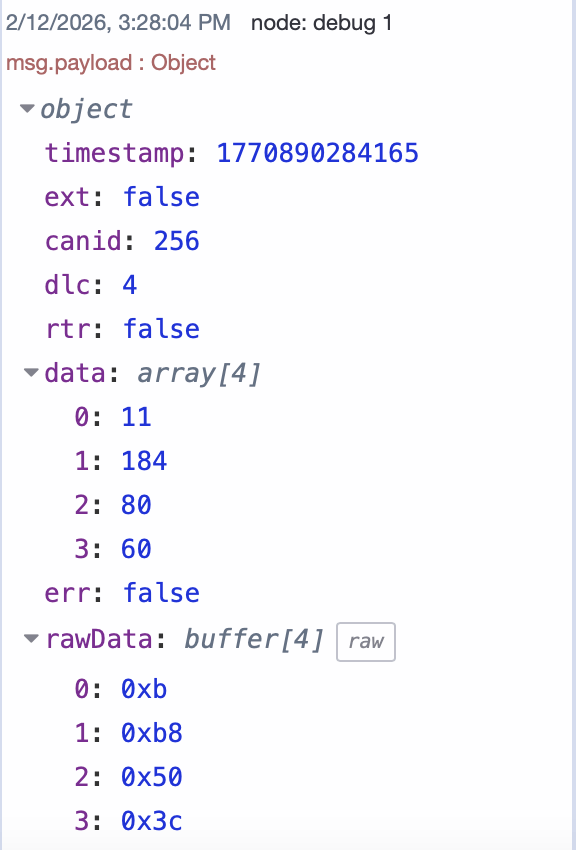

If you work with vehicles, industrial automation, or embedded systems, you've likely encountered **CAN bus**—the communication backbone that connects ECUs, sensors, controllers, and actuators in real-world environments. The challenge isn't just reading CAN data; it's getting that data into your dashboards, cloud platforms, databases, or industrial control systems.

<!--more-->

Traditionally, this meant dealing with vendor-specific drivers, proprietary gateway hardware, and low-level C code just to bridge CAN bus to modern IT infrastructure. **SocketCAN** and **FlowFuse** offer a better approach.

SocketCAN brings CAN bus support directly into the Linux networking stack, treating CAN interfaces like Ethernet or Wi-Fi. Combined with FlowFuse's visual flow-based programming (built on Node-RED), you can connect CAN bus devices to virtually any system—building real-time dashboards, streaming data to cloud platforms, integrating with SCADA systems, or bridging to MQTT, databases, REST APIs, and industrial protocols—all without writing low-level code or relying on proprietary tools.

In this tutorial, you'll set up SocketCAN on Linux, integrate it with FlowFuse, and learn how to send and receive CAN frames—establishing the foundation for connecting your CAN infrastructure to the broader industrial ecosystem.

## Understanding CAN Bus

CAN (Controller Area Network) is a robust communication protocol that allows multiple devices—such as sensors, controllers, and actuators—to share data over a two-wire bus. Commonly used in automotive, industrial, and embedded systems, CAN broadcasts all messages to every device on the network, with each message identified by an ID that devices use to filter relevant data.

## What Is SocketCAN?

SocketCAN is a Linux kernel feature that integrates CAN bus support directly into the networking stack. It exposes CAN hardware as standard network interfaces (like `can0` or `vcan0`), allowing you to configure and interact with CAN using familiar Linux networking commands. This abstraction means your application code remains the same whether you're using a USB-to-CAN adapter, an embedded controller, or a virtual interface—making development, testing, and hardware changes significantly simpler.

## Getting Started

To follow this tutorial, you'll need a Linux environment where you can run FlowFuse and configure SocketCAN. In our setup, FlowFuse runs on an Ubuntu-based edge device, and we use a virtual CAN interface to simulate a real CAN bus. This allows you to complete the tutorial without any physical CAN hardware.

### Prerequisites

Before you begin, ensure your environment meets the following requirements:

- **Linux Operating System**
  SocketCAN is a Linux kernel feature and requires a Linux-based system. This guide is tested on Ubuntu 20.04+ and other Debian-based distributions, though the same concepts apply to any modern Linux distribution with kernel 2.6.25 or later.

- **Running FlowFuse Instance**
  FlowFuse is built on top of Node-RED, providing the fastest and most production-ready way to deploy, manage, and govern your flow applications on edge devices. If you're using plain Node-RED, this tutorial will work there as well. For installation details of FlowFuse, see this [guide](/blog/2025/09/installing-node-red/).

- **System Permissions**
  Root or sudo privileges are required to load kernel modules, create network interfaces, and configure SocketCAN devices.

- **CAN Hardware or Virtual Interface**
  This tutorial uses a **virtual CAN (vcan)** interface to demonstrate SocketCAN and FlowFuse integration without requiring physical hardware.
  In production deployments, physical CAN interfaces are typically used, such as:

  - USB-to-CAN adapters (for example, PEAK PCAN-USB or Kvaser devices)
  - Embedded CAN controllers (such as MCP2515 via SPI)
  - Built-in CAN interfaces on industrial computers or single-board computers

The FlowFuse flows and application logic remain the same when switching between virtual and physical CAN interfaces; only the underlying CAN interface configuration differs.

### Enabling CAN Interfaces with SocketCAN

Before FlowFuse can interact with a CAN bus, a CAN network interface must be available and active at the operating system level. SocketCAN does not automatically create or enable interfaces; this step is always required, whether you are using a virtual or physical CAN bus.

The setup differs slightly depending on your environment.

#### Option A: Virtual CAN (vcan) — Development and Testing

A virtual CAN interface allows CAN frames to be exchanged entirely in software. It is useful for development, testing, and learning, but it does not model physical bus timing or electrical behavior.

##### Enable vcan Support

Load the virtual CAN kernel module:

```bash
sudo modprobe vcan
```

Verify that it is loaded:

```bash
lsmod | grep vcan
```

##### Create and Enable the Interface

Create a virtual CAN interface named `vcan0`:

```bash
sudo ip link add dev vcan0 type vcan
sudo ip link set up vcan0
```

Verify the interface:

```bash
ip link show vcan0
```

At this point, `vcan0` is ready to be used by SocketCAN applications such as FlowFuse.

#### Option B: Physical CAN Hardware — Production Systems

When using real CAN hardware, the interface is exposed by a hardware driver, but it still must be explicitly configured and enabled.

##### 1. Hardware Driver

Most common CAN hardware is supported directly by the Linux kernel:

- USB-to-CAN adapters are typically detected automatically when connected
- SPI-based CAN controllers (for example, MCP2515) require kernel and device-tree configuration
- Built-in CAN controllers may require BIOS or kernel configuration

Once the driver is loaded, a CAN interface such as `can0` becomes visible to the system.

##### 2. Configure and Enable the Interface

Physical CAN interfaces must be configured with a bitrate before use:

```bash
sudo ip link set can0 up type can bitrate 500000
```

This command enables the CAN interface, sets the bus bitrate, and makes the interface available to SocketCAN applications.

##### 3. Verify the Interface

```bash
ip link show can0
```

If the interface is up, it can be used immediately by FlowFuse.

#### Comparison: Virtual vs Physical CAN

| Aspect                | Virtual CAN (vcan)   | Physical CAN      |
| --------------------- | -------------------- | ----------------- |
| Hardware required     | No                   | Yes               |
| Electrical bus        | No                   | Yes               |
| Bitrate configuration | Not required         | Required          |
| Kernel driver         | `vcan`               | Hardware-specific |
| FlowFuse (Node-RED) flows        | Same                 | Same              |
| Typical use           | Development, testing | Production        |

### Using SocketCAN in FlowFuse

Once a CAN interface (vcan0 or can0) is enabled at the operating system level, FlowFuse can interact with it like any other SocketCAN-compatible application. At this stage, no CAN frames are flowing yet—FlowFuse simply gains access to the interface.

In this section, we'll focus on how FlowFuse connects to SocketCAN and what that means conceptually, before building any actual flows.

The flow looks like this:

")

FlowFuse does not communicate directly with CAN hardware. Instead, it relies on SocketCAN, which exposes CAN interfaces through the Linux networking stack.

Once a CAN interface is enabled at the operating system level—whether a virtual interface like vcan0 or a physical interface like can0—it becomes available to any SocketCAN-compatible application. FlowFuse simply opens this interface and exchanges CAN frames using standard socket operations.

This design has two important advantages:

- FlowFuse remains hardware-agnostic. The same flows work with virtual CAN interfaces, USB-to-CAN adapters, or embedded CAN controllers.
- All hardware-specific configuration—such as driver loading and bitrate setup—is handled by the operating system, not by FlowFuse.

As a result, the application logic in FlowFuse stays the same across development, testing, and production environments. The only requirement is that the appropriate CAN interface is created and enabled before FlowFuse starts

#### Installing the SocketCAN Node

FlowFuse does not include native CAN support out of the box. To interact with SocketCAN interfaces (`can0`, `vcan0`, etc.), you need to install a module that provides CAN input and output nodes.

Follow these steps:

1. Open the Instance editor in your browser
2. Click the menu icon (☰) in the top-right corner
3. Select **Manage palette**
4. Open the **Install** tab
5. Search for `node-red-contrib-socketcan`
6. Click **Install** next to the package

Once installed, the SocketCAN nodes will appear in the FlowFuse palette.

##### Installation Troubleshooting

If the installation fails, it is usually due to one of the following reasons:

- FlowFuse is not running on a Linux system (SocketCAN is Linux-only)
- Required build tools are missing on the system

To resolve this, ensure you are running on Linux and install the required build dependencies:

```bash
sudo apt update
sudo apt install -y build-essential
```

After installing the build tools, retry installing `node-red-contrib-socketcan` from the FlowFuse palette.

### Working with CAN Frames in FlowFuse

Once a CAN interface (`vcan0` or `can0`) is enabled and the SocketCAN nodes are installed, FlowFuse can begin exchanging CAN frames. At a high level, there are only **two operations** involved when working with CAN in FlowFuse:

- **Receiving CAN frames** from the bus
- **Transmitting CAN frames** onto the bus

FlowFuse represents these operations using dedicated input and output nodes provided by the SocketCAN module.

#### Receiving CAN Frames

Receiving CAN frames means listening to all messages that appear on the CAN bus and processing them inside FlowFuse.

1. Drag a `socketcan-out` node from the FlowFuse palette onto the canvas.
2. Open the node configuration and add the interface by clicking the **+** button next to the interface. Enter your interface name, e.g., `vcan0` (for virtual CAN) or `can0` (for physical CAN).
3. Click Add, then Done to save the interface.
4. Connect the output of the `socketcan-out` node to a **Debug** node.
5. Deploy the flow to begin receiving CAN frames.

Once connected, the node will show a **green status box** with the text:

```
connected <your-interface-name>
```

This indicates that the `socketcan-out` node is successfully linked to your CAN interface and ready to send messages.

When frames are received, FlowFuse outputs them as JavaScript objects containing fields such as:

- `timestamp` — the time the frame was received (in milliseconds since epoch)
- `ext` — indicates whether the frame uses an **extended CAN ID** (true/false)
- `canid` — the **CAN identifier** for the message
- `dlc` — the **Data Length Code**, i.e., the number of data bytes in the frame
- `rtr` — **Remote Transmission Request** flag (true if the frame requests data)
- `data` — an array of bytes representing the **payload** of the frame
- `err` — indicates whether the frame contains an **error** (true/false)
- `rawData` — a copy of the data payload in its **raw byte form**



This makes it easy to filter, decode, or route messages using standard FlowFuse nodes.

<lite-youtube
  videoid="MoL3vw9x5eg"
  style="width: 1024px; overflow: hidden; background-image: url('/blog/2026/02/images/receiving-can.png'); background-size: cover; background-position: center;"
  title="Receiving CAN Frames">
</lite-youtube>

#### Transmitting CAN Frames

Transmitting CAN frames means sending messages onto the CAN bus from FlowFuse. This allows you to control devices, trigger actions, or communicate with other ECUs on the network.

1. Drag a `socketcan-in` node from the FlowFuse palette onto the canvas.
2. Open the node configuration and set the interface to `vcan0` (for virtual CAN) or `can0` (for physical CAN).
3. Leave the node in **transmit** mode to send messages onto the bus.
4. Connect the input of the `socketcan-in` node to any source node, such as an **Inject** node for testing.
5. Configure the message in the **Inject** node by setting the payload as a JavaScript object containing the fields `canid`, `data`, and optionally `ext` for extended frames.
6. Deploy the flow to begin transmitting CAN frames.

For example, a message object could look like this:

```json
{
  "canid": 512,
  "data": [22, 45, 170, 255],
  "ext": false
}
```

This would send a standard CAN frame with ID `0x200` and 4 bytes of data onto the bus.

<lite-youtube
  videoid="oWI3Fs9_gyI"
  style="width: 1024px; overflow: hidden; background-image: url('/blog/2026/02/images/transmitting-can.png'); background-size: cover; background-position: center;"
  title="Transmitting CAN Frames">
</lite-youtube>

##### String-Formatted Messages

Alternatively, CAN messages can be defined as strings using a compact format:

```
<canid>#{R|data}
```

Where:
- **canid** — The CAN identifier in hexadecimal format. Must be less than `0x7ff` (2047) and specified with fewer than three digits for a standard ID.
- **data** — The data payload for the CAN frame, specified in hexadecimal format.
- **R** — Indicates a Remote Transmission Request (RTR) frame instead of a data frame.

For example:

```
200#16 2D AA FF
```

This sends a CAN frame with ID `0x200` and data bytes `[0x16, 0x2D, 0xAA, 0xFF]`.

To send an RTR frame:

```
200#R
```

This requests data from devices listening to CAN ID `0x200` without sending any payload.

## Conclusion

By combining SocketCAN with FlowFuse, you've eliminated much of the complexity traditionally associated with CAN bus development. What once required low-level C code, vendor-specific drivers, and deep protocol knowledge can now be accomplished with visual flows and straightforward message handling.

The real power of this approach becomes clear when you consider scalability. The same FlowFuse flows work identically whether you're testing with a virtual CAN interface on your laptop or deploying to production hardware with physical CAN controllers. The abstraction layer provided by SocketCAN means your application logic remains stable even as your hardware requirements evolve.

Once you've connected to your CAN bus, the possibilities expand significantly. You can build real-time monitoring dashboards to visualize CAN data, send telemetry to cloud platforms for analytics and storage, or bridge CAN networks with virtually any other protocol or system. FlowFuse's extensive ecosystem of nodes and integrations supports connections to databases, MQTT brokers, REST APIs, industrial protocols, and more—making it straightforward to integrate your CAN infrastructure into larger IoT and automation workflows.

*Managing Node-RED across multiple edge devices or looking for a platform that makes connecting and scaling easier? FlowFuse makes it simple to deploy, monitor, and maintain your infrastructure at scale. [Get in touch](/contact-us/) to discuss your project and see how we can help.*
