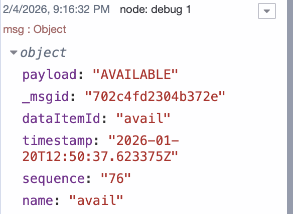
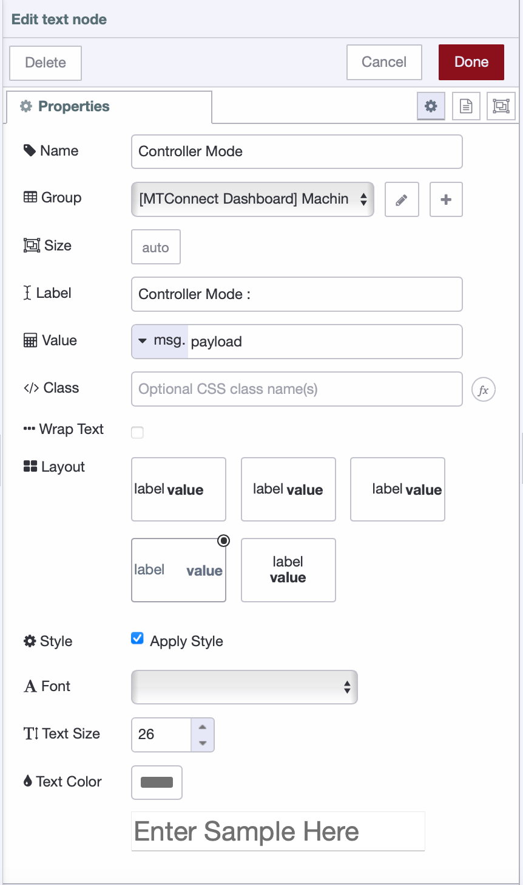
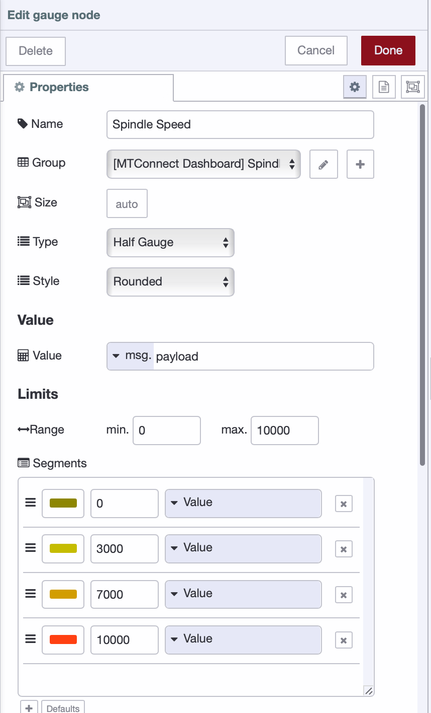

Most manufacturing facilities run MTConnect agents on their CNC machines, but the XML data these agents produce isn't directly usable. You receive streams of timestamped measurements, state changes, and condition flags wrapped in hierarchical XML structures. Converting this into a functional dashboard means solving three problems: retrieving the data reliably, parsing it correctly, and routing specific values to the right display components.

<!--more-->

This article walks through the implementation. You'll connect FlowFuse to an MTConnect agent, extract data items from the XML response, and build dashboard widgets that update in real time.

## What MTConnect Is and Why It Matters

[MTConnect](https://www.mtconnect.org/getting-started/) is an open manufacturing standard that defines how equipment communicates operational data. Before MTConnect, each machine tool manufacturer used proprietary protocols. Connecting a Mazak, Haas, and DMG MORI to the same monitoring system meant writing custom integrations for each brand. MTConnect solves this by providing a vendor-neutral protocol that any machine can implement.

The standard specifies what data machines should report and how to structure it. A spindle speed reading from a Haas looks identical to one from a Mazak when both machines run MTConnect agents. This standardization makes it possible to build dashboards and monitoring systems that work across mixed machine fleets without custom code for each manufacturer.

MTConnect agents typically run as software on the machine controller or on a separate computer connected to the machine. The agent reads data from the controller's internal systems and exposes it through HTTP endpoints that return XML. You don't interact with the machine directly—you interact with the agent.

## Data Types in MTConnect

MTConnect organizes data into three categories:

- Samples - Continuous numeric measurements like spindle speed, axis position, temperature, power consumption. These values change smoothly and have units.
- Events - Discrete state changes like mode switches, program starts, door opens. Values are strings or enumerations.
- Condition - Equipment health at the component level: normal, warning, fault, unavailable. Multiple conditions can be active simultaneously.

Agents expose this through HTTP endpoints. /current returns latest values for all data items. /sample?from=X&count=Y returns time-series data.

## XML Response Structure

When you query an MTConnect agent, the response is an XML document rooted in the `Streams` element, which contains one or more `DeviceStream` elements—each representing a device or machine.

Within each `DeviceStream`, `ComponentStream` elements describe individual machine components such as spindles, axes, or controllers. Each component reports its data using three categories: `Samples`, `Events`, and `Conditions`.

Samples represent continuously measured values, while Events represent discrete or state-based changes. Conditions are reported inside a `Conditions` container and use state-specific elements—such as `Normal`, `Warning`, or `Fault`—rather than a generic condition element. Multiple condition states may be active at the same time, as long as they represent different condition data items.

Each reported data item includes a `dataItemId` for identification, a `timestamp` indicating when the value was recorded, and the value itself provided as text content, for example:

```xml
<SpindleSpeed dataItemId="S1spd" timestamp="2026-01-30T14:23:17.492Z">2847</SpindleSpeed>
```

While this hierarchical structure provides a complete and standardized view of the machine, dashboard implementations must traverse multiple levels of nesting and correlate `dataItemId` values with their definitions in the Devices model to extract and display the data they care about.

## Getting Started

Now that we understand the structure of MTConnect and the challenges involved, let's look at how to collect and visualize MTConnect data using FlowFuse.

FlowFuse is an industrial application platform built on Node-RED that brings data collection, transformation, and visualization together in one place. Instead of writing custom integration code, you build flows visually by dragging, configuring, and connecting nodes, then deploying them—no separate tools required.

### Prerequisites

Before you begin, you need:

- **FlowFuse instance** – An active FlowFuse account with an instance created and access to the Node-RED Editor. Sign up at https://app.flowfuse.com and follow the FlowFuse getting started guide at https://flowfuse.com/docs/user/introduction/#getting-started-with-flowfuse. If you are new to Node-RED, you can also check out our [course](https://node-red-academy.learnworlds.com/) on Node-RED.
- MTConnect agent – A CNC machine running an MTConnect agent or an MTConnect simulator such as the public agent at `agent.mtconnect.org` or a locally hosted agent
- Network access – Connectivity from the FlowFuse instance to the MTConnect agent's HTTP endpoint, with the FlowFuse Remote Device Agent installed when connecting from cloud-hosted FlowFuse to on-premises machines

### Collecting MTConnect Data

Bringing MTConnect data into FlowFuse is the first step toward a live dashboard. While you could use the standard HTTP Request node to query MTConnect agents, which is the most common approach, that method requires manually parsing XML responses and navigating through large nested objects to extract specific data points. In this article, I'll show you an easier way.

The Solution Engine node (`node-red-contrib-solution-engine`) makes this straightforward because it lets you access any data point directly by its dataItemId, without having to worry about parsing XML or navigating nested structures.

You can install the node by following the instructions in the FlowFuse documentation: [Using the Palette Manager](https://flowfuse.com/node-red/getting-started/library/#using-the-palette-manager).

Once installed, follow these steps to start collecting data:

1. Add the `mtconnect-dataitem` node to your canvas and open its configuration.

2. Enter the host of your MTConnect agent or broker (for example, `mtconnect.isoc.net`).

3. Enter the port your agent is listening on.

4. Path (optional): leave this empty in most cases. The node automatically detects the type of agent or broker and chooses the correct endpoint:

   - For SolutionEngine agents, it uses `/api/v6/mtc/current`.
   - For generic MTConnect brokers like `mtconnect.isoc.net`, it uses `/current`.

   Only fill in this field if your broker uses a custom endpoint that differs from the defaults. Entering `/current` manually for standard brokers may cause the node to fail.

5. Enter the `dataItemId` for the value you want to retrieve.

6. Once everything is configured, deploy the flow.

To trigger the node, add an Inject node, set the polling interval you want, and connect it to the `mtconnect-dataitem` node. This will fetch the latest data at regular intervals and send it to your dashboard or other nodes in the flow.

When the node successfully retrieves data, it outputs the following fields: `msg.payload` (the value), `dataItemId`, `timestamp`, `sequence`, and `name`. The node also shows the status with a green square when data is found successfully. If the value isn't available, it will display a yellow square.



## Building the Dashboard

Now that you're successfully retrieving MTConnect data, the next step is to display it on a live dashboard. FlowFuse makes this straightforward with its [dashboard package](https://dashboard.flowfuse.com). You can bind any data item to a visual component, and it updates automatically whenever new data arrives.

Before you start, make sure to install the `@flowfuse/node-red-dashboard` package to add the dashboard nodes.

For this tutorial, we'll demonstrate two example data points: Controller Mode and Spindle Speed. You can apply the same steps to all other data points as an exercise. I'm using a public MTConnect demo agent ([https://demo.mtconnect.org](https://demo.mtconnect.org)) to make it easy to follow along.

**Note:** This is a brief demonstration to help you understand the workflow. When building your production dashboard, make sure to use the appropriate host and port for your actual MTConnect agent, and select widgets that best suit your specific monitoring needs and use case.

I've provided additional data points with their `dataItemId`s below so you can practice. Try to match the dashboard shown in the image below, or create your own layout by selecting different `dataItemId`s and widget types. For more information on available dashboard widgets, see the FlowFuse documentation: [https://dashboard.flowfuse.com/nodes/widgets](https://dashboard.flowfuse.com/nodes/widgets).


### Available Data Points for Practice

| Data Item ID | Name | Description |
|--------------|------|-------------|
| `execution` | Execution State | Program execution status (ACTIVE, READY, STOPPED) |
| `doorstate` | Door State | Machine door status (OPEN/CLOSED) |
| `program` | Program Name | Currently loaded program name |
| `activeprog` | Active Program | Currently executing program |
| `Tool_number` | Tool Number | Active tool number |
| `pallet_num` | Pallet Number | Current pallet identifier |
| `Xabs` | X-Axis Absolute Position | Current X-axis absolute position in mm |
| `Zabs` | Z-Axis Absolute Position | Current Z-axis absolute position in mm |
| `Bpos` | B-Axis Position | Current B-axis rotational position |
| `Cpos` | C-Axis Position | Current C-axis rotational position |

### Steps to Create the Dashboard

1. Drag an Inject node onto the canvas, double-click it, and set Repeat to interval for every 1 second.

2. Drag two mtconnect-dataitem nodes onto the canvas and connect them to the inject node.

3. Double-click the first mtconnect-dataitem node and configure it: Host: `demo.mtconnect.org`, Port: `5000`, Data Item ID: `mode`. For the second node, use the same configuration except Data Item ID: `Srpm`. Click Done for both nodes.

4. Drag a Text widget onto the canvas and double-click it. Click the + button next to Group to create a new group: Group Name: `Machine State`, select the page and check Display group name, then click Done.

5. In the Text widget configuration: Label: `Controller Mode:`, Layout: Select the 4th option, enable Style option, Font: Default, Text Size: `26`, then click Done.



6. Connect the mode mtconnect-dataitem node output to the Text widget input.

7. Drag a Gauge widget onto the canvas and double-click it. Create a new group: Group Name: `Spindle Speed`. In the Gauge widget configuration: Type: Half gauge, Style: Rounded, Value: `msg.payload`, Range limits: `0` to `10000`.

8. Add three segments by clicking the + button in the Segments section and configure them as shown in the image below.



9. Connect the Srpm mtconnect-dataitem node output to the Gauge widget input.

10. Click Deploy in the top-right corner.

To achieve the page layout as shown in the dashboard I have built, follow the [Setting Page Layout guide](/blog/2024/05/node-red-dashboard-2-layout-navigation-styling/#setting-page-layout) and set it to Notebook.

Your dashboard should now display live updates for Controller Mode and Spindle Speed from the MTConnect agent. You can extend this by adding more data items from the table above, experimenting with different widget types, and organizing them into logical groups for your specific monitoring needs.

Below is the complete flow configuration. If you've successfully built the dashboard following the steps above, you can compare it with this reference implementation:


[{"id":"5daedf163d8ff55a","type":"group","z":"e98fbc22244df867","name":"Spindle Speed","style":{"label":true},"nodes":["52df691dc45e95db","95d475e6ecb616fc","2267147b9ee9cc86"],"x":134,"y":119,"w":652,"h":82},{"id":"52df691dc45e95db","type":"mtconnect-dataitem","z":"e98fbc22244df867","g":"5daedf163d8ff55a","name":"","host":"https://demo.mtconnect.org","port":"5000","path":"","dataItemId":"Srpm","x":430,"y":160,"wires":[["95d475e6ecb616fc"]]},{"id":"95d475e6ecb616fc","type":"ui-gauge","z":"e98fbc22244df867","g":"5daedf163d8ff55a","name":"Spindle Speed","group":"9df7f1ad772380dd","order":1,"value":"payload","valueType":"msg","width":"5","height":3,"gtype":"gauge-half","gstyle":"rounded","title":"","alwaysShowTitle":false,"floatingTitlePosition":"top-left","units":"RPM","icon":"","prefix":"","suffix":"","segments":[{"from":"0","color":"#8d8600","text":"","textType":"value"},{"from":"8000","color":"#d29d00","text":"","textType":"value"},{"from":"9500","color":"#ff4013","text":"","textType":"value"}],"min":0,"max":"10000","sizeThickness":16,"sizeGap":4,"sizeKeyThickness":8,"styleRounded":true,"styleGlow":false,"className":"","x":680,"y":160,"wires":[[]]},{"id":"2267147b9ee9cc86","type":"inject","z":"e98fbc22244df867","g":"5daedf163d8ff55a","name":"Trigger","props":[{"p":"payload"}],"repeat":"1","crontab":"","once":false,"onceDelay":0.1,"topic":"","payload":"","payloadType":"date","x":240,"y":160,"wires":[["52df691dc45e95db"]]},{"id":"9df7f1ad772380dd","type":"ui-group","name":"Spindle Speed","page":"df8568c32d9e9bfa","width":"5","height":"3","order":3,"showTitle":true,"className":"","visible":"true","disabled":"false","groupType":"default"},{"id":"df8568c32d9e9bfa","type":"ui-page","name":"MTConnect Dashboard","ui":"34bdc26026de2a48","path":"/page1","icon":"home","layout":"notebook","theme":"ecea95aad5b94726","breakpoints":[{"name":"Default","px":"0","cols":"3"},{"name":"Tablet","px":"576","cols":"6"},{"name":"Small Desktop","px":"768","cols":"9"},{"name":"Desktop","px":"1024","cols":"12"}],"order":1,"className":"","visible":true,"disabled":false},{"id":"34bdc26026de2a48","type":"ui-base","name":"My Dashboard","path":"/dashboard","appIcon":"","includeClientData":true,"acceptsClientConfig":["ui-notification","ui-control"],"showPathInSidebar":false,"headerContent":"page","navigationStyle":"default","titleBarStyle":"default","showReconnectNotification":true,"notificationDisplayTime":1,"showDisconnectNotification":true,"allowInstall":false},{"id":"ecea95aad5b94726","type":"ui-theme","name":"Default Theme","colors":{"surface":"#1f2933","primary":"#00a3d7","bgPage":"#f5f7fa","groupBg":"#ffffff","groupOutline":"#e5e7eb"},"sizes":{"density":"default","pagePadding":"12px","groupGap":"12px","groupBorderRadius":"4px","widgetGap":"12px"}},{"id":"da2bf9f0f5377d70","type":"group","z":"e98fbc22244df867","name":"Machine State","style":{"label":true},"nodes":["8f895b1f6bcb91e9","09c59f876c3785b8","b83ef79948c36e6d","8e820966be8f9874","6fb9250c86c29e88","2d665d743deeac21","4df4be8a5a835810"],"x":134,"y":219,"w":652,"h":202},{"id":"8f895b1f6bcb91e9","type":"inject","z":"e98fbc22244df867","g":"da2bf9f0f5377d70","name":"Trigger","props":[{"p":"payload"}],"repeat":"1","crontab":"","once":false,"onceDelay":0.1,"topic":"","payload":"","payloadType":"date","x":240,"y":320,"wires":[["09c59f876c3785b8","8e820966be8f9874","2d665d743deeac21"]]},{"id":"09c59f876c3785b8","type":"mtconnect-dataitem","z":"e98fbc22244df867","g":"da2bf9f0f5377d70","name":"","host":"https://demo.mtconnect.org","port":"5000","path":"","dataItemId":"mode","x":430,"y":260,"wires":[["b83ef79948c36e6d"]]},{"id":"b83ef79948c36e6d","type":"ui-text","z":"e98fbc22244df867","g":"da2bf9f0f5377d70","group":"44eef3deae3ebe65","order":1,"width":0,"height":0,"name":"","label":"Controller Mode : ","format":"{{msg.payload}}","layout":"row-spread","style":true,"font":"","fontSize":"26","color":"#717171","wrapText":false,"className":"","value":"payload","valueType":"msg","x":670,"y":260,"wires":[]},{"id":"8e820966be8f9874","type":"mtconnect-dataitem","z":"e98fbc22244df867","g":"da2bf9f0f5377d70","name":"","host":"https://demo.mtconnect.org","port":"5000","path":"","dataItemId":"execution","x":440,"y":320,"wires":[["6fb9250c86c29e88"]]},{"id":"6fb9250c86c29e88","type":"ui-text","z":"e98fbc22244df867","g":"da2bf9f0f5377d70","group":"44eef3deae3ebe65","order":3,"width":0,"height":0,"name":"","label":"Execution : ","format":"{{msg.payload}}","layout":"row-spread","style":true,"font":"","fontSize":"26","color":"#717171","wrapText":false,"className":"","value":"payload","valueType":"msg","x":650,"y":320,"wires":[]},{"id":"2d665d743deeac21","type":"mtconnect-dataitem","z":"e98fbc22244df867","g":"da2bf9f0f5377d70","name":"","host":"https://demo.mtconnect.org","port":"5000","path":"","dataItemId":"doorstate","x":440,"y":380,"wires":[["4df4be8a5a835810"]]},{"id":"4df4be8a5a835810","type":"ui-text","z":"e98fbc22244df867","g":"da2bf9f0f5377d70","group":"44eef3deae3ebe65","order":2,"width":0,"height":0,"name":"","label":"Door State : ","format":"{{msg.payload}}","layout":"row-spread","style":true,"font":"","fontSize":"26","color":"#717171","wrapText":false,"className":"","value":"payload","valueType":"msg","x":650,"y":380,"wires":[]},{"id":"44eef3deae3ebe65","type":"ui-group","name":"Machine State","page":"df8568c32d9e9bfa","width":"4","height":1,"order":1,"showTitle":true,"className":"","visible":true,"disabled":false,"groupType":"default"},{"id":"9350e391e87fe7a5","type":"group","z":"e98fbc22244df867","name":"Program & Tool","style":{"label":true},"nodes":["df36b3a29c31ce98","a0217e5e2aa5f44c","0629feeaf7920e2c","2f2a09682b0967db","fdd85c0cb9116148","2067a83f2e4cf2e1","733c2464b32ad3f6","1a8683bb29c9708d","4060d2c10f0cc6d9"],"x":134,"y":439,"w":652,"h":262},{"id":"df36b3a29c31ce98","type":"mtconnect-dataitem","z":"e98fbc22244df867","g":"9350e391e87fe7a5","name":"","host":"https://demo.mtconnect.org","port":"5000","path":"","dataItemId":"program","x":440,"y":480,"wires":[["a0217e5e2aa5f44c"]]},{"id":"a0217e5e2aa5f44c","type":"ui-text","z":"e98fbc22244df867","g":"9350e391e87fe7a5","group":"e7af486f283064fa","order":1,"width":0,"height":0,"name":"","label":"Program (Main)  : ","format":"{{msg.payload}}","layout":"row-spread","style":true,"font":"","fontSize":"26","color":"#717171","wrapText":false,"className":"","value":"payload","valueType":"msg","x":660,"y":480,"wires":[]},{"id":"0629feeaf7920e2c","type":"mtconnect-dataitem","z":"e98fbc22244df867","g":"9350e391e87fe7a5","name":"","host":"https://demo.mtconnect.org","port":"5000","path":"","dataItemId":"activeprog","x":450,"y":540,"wires":[["2f2a09682b0967db"]]},{"id":"2f2a09682b0967db","type":"ui-text","z":"e98fbc22244df867","g":"9350e391e87fe7a5","group":"e7af486f283064fa","order":4,"width":0,"height":0,"name":"","label":"Program (Active) : ","format":"{{msg.payload}}","layout":"row-spread","style":true,"font":"","fontSize":"26","color":"#717171","wrapText":false,"className":"","value":"payload","valueType":"msg","x":670,"y":540,"wires":[]},{"id":"fdd85c0cb9116148","type":"mtconnect-dataitem","z":"e98fbc22244df867","g":"9350e391e87fe7a5","name":"","host":"https://demo.mtconnect.org","port":"5000","path":"","dataItemId":"Tool_number","x":450,"y":600,"wires":[["2067a83f2e4cf2e1"]]},{"id":"2067a83f2e4cf2e1","type":"ui-text","z":"e98fbc22244df867","g":"9350e391e87fe7a5","group":"e7af486f283064fa","order":3,"width":0,"height":0,"name":"","label":"Tool ID : ","format":"{{msg.payload}}","layout":"row-spread","style":true,"font":"","fontSize":"26","color":"#717171","wrapText":false,"className":"","value":"payload","valueType":"msg","x":640,"y":600,"wires":[]},{"id":"733c2464b32ad3f6","type":"mtconnect-dataitem","z":"e98fbc22244df867","g":"9350e391e87fe7a5","name":"","host":"https://demo.mtconnect.org","port":"5000","path":"","dataItemId":"pallet_num","x":450,"y":660,"wires":[["1a8683bb29c9708d"]]},{"id":"1a8683bb29c9708d","type":"ui-text","z":"e98fbc22244df867","g":"9350e391e87fe7a5","group":"e7af486f283064fa","order":2,"width":0,"height":0,"name":"","label":"Pallet ID : ","format":"{{msg.payload}}","layout":"row-spread","style":true,"font":"","fontSize":"26","color":"#717171","wrapText":false,"className":"","value":"payload","valueType":"msg","x":640,"y":660,"wires":[]},{"id":"4060d2c10f0cc6d9","type":"inject","z":"e98fbc22244df867","g":"9350e391e87fe7a5","name":"Trigger","props":[{"p":"payload"}],"repeat":"1","crontab":"","once":false,"onceDelay":0.1,"topic":"","payload":"","payloadType":"date","x":240,"y":560,"wires":[["df36b3a29c31ce98","fdd85c0cb9116148","0629feeaf7920e2c","733c2464b32ad3f6"]]},{"id":"e7af486f283064fa","type":"ui-group","name":"Program & Tool","page":"df8568c32d9e9bfa","width":"3","height":"2","order":2,"showTitle":true,"className":"","visible":"true","disabled":"false","groupType":"default"},{"id":"46321a3ca1be0e85","type":"group","z":"e98fbc22244df867","name":"Position (Work)","style":{"label":true},"nodes":["db9b9d1633807788","e8b23a150120a81e","8547410491f90a0d","130dd01d8d29297f","19099f474caffd2e","2e34c68a3e9a30b2","0c375b39b14df4f1","3f61d2622a728b13","1fbf908ad8b311db","08ddb29a3ec4d7e5","69b9bad3c1781b6e"],"x":134,"y":719,"w":652,"h":322},{"id":"db9b9d1633807788","type":"mtconnect-dataitem","z":"e98fbc22244df867","g":"46321a3ca1be0e85","name":"","host":"https://demo.mtconnect.org","port":"5000","path":"","dataItemId":"Xabs","x":430,"y":760,"wires":[["e8b23a150120a81e"]]},{"id":"e8b23a150120a81e","type":"ui-text","z":"e98fbc22244df867","g":"46321a3ca1be0e85","group":"e697761e6d26019e","order":1,"width":0,"height":0,"name":"","label":"X : ","format":"{{msg.payload}}","layout":"row-spread","style":true,"font":"","fontSize":"26","color":"#717171","wrapText":false,"className":"","value":"payload","valueType":"msg","x":710,"y":760,"wires":[]},{"id":"8547410491f90a0d","type":"mtconnect-dataitem","z":"e98fbc22244df867","g":"46321a3ca1be0e85","name":"","host":"https://demo.mtconnect.org","port":"5000","path":"","dataItemId":"Yabs","x":430,"y":820,"wires":[["130dd01d8d29297f"]]},{"id":"130dd01d8d29297f","type":"ui-text","z":"e98fbc22244df867","g":"46321a3ca1be0e85","group":"e697761e6d26019e","order":2,"width":0,"height":0,"name":"","label":"Y : ","format":"{{msg.payload}}","layout":"row-spread","style":true,"font":"","fontSize":"26","color":"#717171","wrapText":false,"className":"","value":"payload","valueType":"msg","x":710,"y":820,"wires":[]},{"id":"19099f474caffd2e","type":"mtconnect-dataitem","z":"e98fbc22244df867","g":"46321a3ca1be0e85","name":"","host":"https://demo.mtconnect.org","port":"5000","path":"","dataItemId":"Zabs","x":430,"y":880,"wires":[["2e34c68a3e9a30b2"]]},{"id":"2e34c68a3e9a30b2","type":"ui-text","z":"e98fbc22244df867","g":"46321a3ca1be0e85","group":"e697761e6d26019e","order":3,"width":0,"height":0,"name":"","label":"Z : ","format":"{{msg.payload}}","layout":"row-spread","style":true,"font":"","fontSize":"26","color":"#717171","wrapText":false,"className":"","value":"payload","valueType":"msg","x":710,"y":880,"wires":[]},{"id":"0c375b39b14df4f1","type":"mtconnect-dataitem","z":"e98fbc22244df867","g":"46321a3ca1be0e85","name":"","host":"https://demo.mtconnect.org","port":"5000","path":"","dataItemId":"Bpos","x":430,"y":940,"wires":[["3f61d2622a728b13"]]},{"id":"3f61d2622a728b13","type":"ui-text","z":"e98fbc22244df867","g":"46321a3ca1be0e85","group":"e697761e6d26019e","order":4,"width":0,"height":0,"name":"","label":"B : ","format":"{{msg.payload}}","layout":"row-spread","style":true,"font":"","fontSize":"26","color":"#717171","wrapText":false,"className":"","value":"payload","valueType":"msg","x":710,"y":940,"wires":[]},{"id":"1fbf908ad8b311db","type":"mtconnect-dataitem","z":"e98fbc22244df867","g":"46321a3ca1be0e85","name":"","host":"https://demo.mtconnect.org","port":"5000","path":"","dataItemId":"Cpos","x":430,"y":1000,"wires":[["08ddb29a3ec4d7e5"]]},{"id":"08ddb29a3ec4d7e5","type":"ui-text","z":"e98fbc22244df867","g":"46321a3ca1be0e85","group":"e697761e6d26019e","order":5,"width":0,"height":0,"name":"","label":"C : ","format":"{{msg.payload}}","layout":"row-spread","style":true,"font":"","fontSize":"26","color":"#717171","wrapText":false,"className":"","value":"payload","valueType":"msg","x":710,"y":1000,"wires":[]},{"id":"69b9bad3c1781b6e","type":"inject","z":"e98fbc22244df867","g":"46321a3ca1be0e85","name":"Trigger","props":[{"p":"payload"}],"repeat":"1","crontab":"","once":false,"onceDelay":0.1,"topic":"","payload":"","payloadType":"date","x":240,"y":860,"wires":[["db9b9d1633807788","8547410491f90a0d","19099f474caffd2e","0c375b39b14df4f1","1fbf908ad8b311db"]]},{"id":"e697761e6d26019e","type":"ui-group","name":"Position (Work)","page":"df8568c32d9e9bfa","width":6,"height":1,"order":4,"showTitle":true,"className":"","visible":"true","disabled":"false","groupType":"default"},{"id":"7500e4ba5bb1ce02","type":"global-config","env":[],"modules":{"node-red-contrib-solution-engine":"0.9.4","@flowfuse/node-red-dashboard":"1.30.2"}}]


## Conclusion

Your MTConnect dashboard is now live, pulling real-time machine data and displaying it through visual widgets. The setup you've built here works the same way across any MTConnect-compliant machine in your facility.

This is what FlowFuse does—it makes connecting to equipment, collecting data, transforming it into useful formats, and visualizing it on dashboards straightforward. Beyond basic monitoring, you can log production metrics to databases for trend analysis, set up automated alerts when machines enter fault states, integrate shop floor data with MES or ERP systems, and build event-driven workflows that respond to machine conditions. For production environments, FlowFuse Enterprise provides role-based access control, audit logging, high availability infrastructure, and dedicated support—giving you the operational controls needed to run manufacturing applications reliably across multiple facilities.

Want to deploy this across your facility? [Contact us](https://flowfuse.com/contact-us/) to discuss your manufacturing monitoring requirements.
