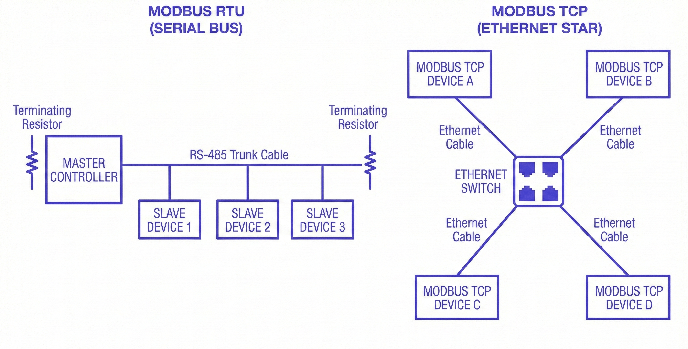
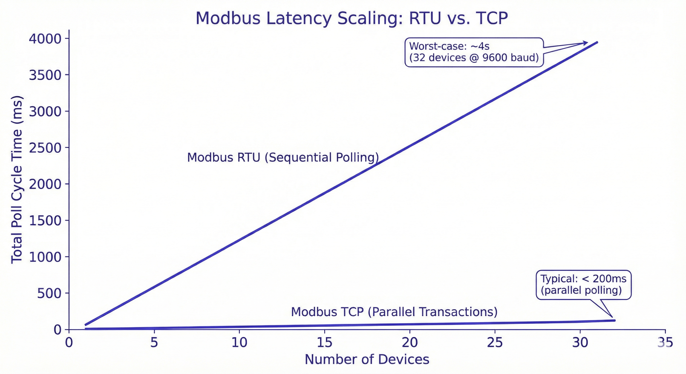
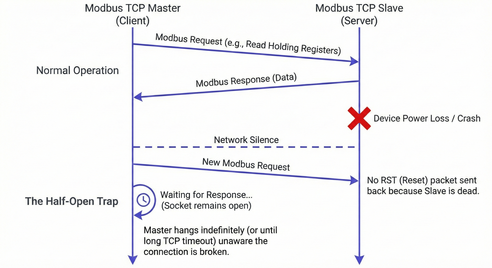

Modbus shipped in 1979. It has outlasted every protocol that was meant to replace it, survived the transition from relay logic to microprocessors and modern SCADA systems, and is still running production lines today. That kind of longevity does not happen by accident. It exists because the protocol is simple, deterministic, and unambiguous, at least in its original form, a point I have discussed in more detail in a [separate article](/blog/2026/01/why-modbus-still-exist/).

<!--more-->

Then TCP came along. The data model stayed the same, identical function codes and identical register maps. But the assumptions underneath changed completely, including expectations about the network, failure modes, and what happens when things go wrong. The industry gained real capability, but it also inherited an entirely new class of problems, ones that look nothing like the challenges Modbus engineers spent forty-seven years learning to solve.

That gap is what most people miss. And it is exactly what this post is about.

## They Are Not the Same Protocol in Different Clothes

Modbus RTU runs over serial. That sounds simple until you consider what serial actually means in practice: one master, multiple slaves, one conversation at a time. The master initiates every transaction, the slave responds, and nothing else happens on the wire until that exchange completes.

The physical layer is almost always RS-485 in industrial installations, a differential pair that can run hundreds of meters, tolerate significant electrical noise, and connect up to 247 devices on a single bus.

That architecture imposes hard constraints. Only one device can transmit at a time. Timing between bytes within a frame matters: RTU uses silence on the line to mark frame boundaries, so a gap of 3.5 character times signals the end of one message and the start of the next. Get the baud rate wrong, introduce a noisy cable that stretches a byte, or misconfigure inter-character timing, and the frame parser loses its place. The message is silently discarded. No retransmission, no acknowledgment, just a timeout.

Modbus TCP moves the same application layer onto Ethernet and wraps it in a TCP socket. The serial constraints disappear. Multiple masters can coexist, transactions can be pipelined, and the physical layer handles collision detection and retransmission. What you gain in flexibility, you trade for a different set of assumptions. TCP guarantees delivery, but not timing. A retransmission storm on a busy network can stretch response times in ways that RTU, for all its limitations, never would.

## Latency: What the Numbers Actually Mean on the Floor

RTU latency is predictable almost to the microsecond. That sounds like a strength until you realize how slow predictable can be.

At 9600 baud, a typical Modbus RTU transaction (request plus response) takes 50 to 100 milliseconds per device. Move to 115200 baud and that drops under 10 milliseconds. But you are still polling sequentially. Ten devices at 9600 baud means your slowest sensor gets updated once per second at best. Add more devices and the math gets worse in a straight line.

That ceiling matters. A real-world example: a water treatment plant running 32 RTU devices on a single RS-485 bus at 9600 baud had a worst-case poll cycle of nearly four seconds. When the control engineer needed tighter feedback on a pH dosing loop, the only options were to reduce the device count on that segment, split the bus, or increase baud rate, all of which required physical work on a running system.

Modbus TCP removes the baud rate ceiling and adds pipelining. A well-configured TCP master can have multiple transactions in flight simultaneously. On a lightly loaded Ethernet network, round trip times under 2 milliseconds are routine. For many applications, that is enough to stop thinking about latency altogether.

The catch is that Ethernet latency is not flat. It varies with network load, switch queue depth, and the TCP stack on the device side. Most of the time the numbers look excellent. Under the wrong conditions, they do not. A PLC with a modest embedded TCP stack, hit with traffic from a network scan or a broadcast storm, can stretch its response time by an order of magnitude. RTU would have delivered the same response time it always does.

RTU offers better worst-case latency. TCP offers better average latency. In industrial control, worst-case is usually what you design for.

## Failure Modes: What Breaks, How It Breaks, and Whether You Will Know

This is where the two protocols diverge most sharply, and where choosing wrong costs the most.

### RTU Failures Are Loud and Physical

RTU failures tend to be physical. A corroded terminal block. A cable run too close to a variable frequency drive. A termination resistor missing from one end of the bus. The symptoms are usually obvious: CRC errors climb, devices stop responding, the master logs timeouts.

What RTU rarely does is fail silently. Framing errors and timeouts are visible. The master knows a transaction failed. The application layer gets a clear signal that something is wrong, even if locating the fault takes time.

Locating it is the hard part. RS-485 is a shared medium, which means a single bad connection can drag down every device on the segment. Isolating which node is responsible requires methodical disconnection or a bus analyzer. Neither is fast at 2 AM with a line down.

**But at least you know it is down.**

### TCP Failures Are Quiet and Strange

TCP failures are quieter and more varied. The physical layer is more robust: Ethernet cable is forgiving, switches regenerate signals, and a single bad port does not take down the network. But the failure surface is much broader.

A device can be electrically healthy, passing traffic, and still behaving badly. Connection state gets out of sync. A TCP socket on a cheap embedded device does not close cleanly after a timeout, leaving the master waiting on a half-open connection that looks alive but delivers nothing. A managed switch renegotiating link speed during a firmware update introduces 30 seconds of elevated latency that looks, from the application's perspective, like a slow device.

The worst TCP failures are the ones that are almost working. Partial connectivity. Occasional dropped transactions. Response times elevated but not elevated enough to trip a timeout threshold.

RFC 793 formally defines the half-open state: when one end of a TCP connection crashes or closes without notifying the other, the remaining side may wait indefinitely on a connection that appears alive and delivers nothing ([RFC 793, Section 3.4](https://www.rfc-editor.org/rfc/rfc793)). Rockwell Automation's troubleshooting documentation describes how conditions like duplex mismatches during switch replacement can produce exactly this pattern: performance that degrades quietly and stays within configured thresholds ([Rockwell Automation, ENET-AT003](https://literature.rockwellautomation.com/idc/groups/literature/documents/at/enet-at003_-en-p.pdf)).

RTU tends to fall over cleanly. TCP tends to degrade quietly. Degraded is harder to catch than broken.

### TCP Introduces a Failure Mode That RTU Never Had: Security

Modbus has no authentication. On a serial bus, that is usually acceptable, because physical access to the wire implies physical access to the facility. On an Ethernet network, that assumption collapses entirely.

Modbus TCP devices reachable from a corporate network, or worse from the internet, will respond to commands from anyone who sends them. No credentials. No audit trail. No way to distinguish a legitimate master from an attacker with a laptop and a Modbus client.

This is not theoretical. Shodan regularly turns up Modbus TCP devices with publicly routable IP addresses. ICS security assessments routinely find Modbus exposed on flat networks shared with corporate IT. The clearest demonstration of what that exposure enables is [FrostyGoop](https://www.dragos.com/blog/protect-against-frostygoop-ics-malware-targeting-operational-technology/), malware discovered by Dragos in 2024 and the first ever to use Modbus TCP to cause direct physical impact. Attackers targeted a district energy company in Lviv, Ukraine supplying heat to over 600 apartment buildings — port 502 was open to the internet, no network compromise required, and remediation took nearly two days while residents endured sub-zero temperatures. No credentials were needed. Modbus provided none to ask for.

RTU is not inherently secure either, but attacking it requires being physically present on the wire. TCP removes that requirement entirely.

## Choosing Between Them

Most engineers do not choose between RTU and TCP from a blank slate. They inherit a system, get handed a specification, or discover that the device they need only supports one of them. The real decision is narrower: whether what is already in place is appropriate for what the system now needs to do.

RTU is the right answer when device count is small, cable runs are already there, polling rates are modest, and nothing outside the cabinet needs to reach the network. Those conditions describe a large percentage of working industrial installations. Changing a system that meets all of them adds risk for no operational benefit.

TCP makes sense when you need to integrate field devices with higher-level systems like SCADA, historians, or MES, when device count or poll rate has grown beyond what serial can comfortably handle, or when the network already exists and adding serial infrastructure would cost more than it saves. It also makes sense when you need multiple masters, which serial cannot support without external arbitration hardware.

The hybrid case is a serial network running reliably for fifteen years, with a gateway at the head end converting RTU to TCP for the SCADA system. It is more common than either pure scenario, and more sensible than it looks on paper. The gateway adds a failure point, but it also insulates field devices from the corporate network. That insulation is worth keeping. Replacing it to simplify the architecture is usually not the right trade.

## What to Actually Do Differently Based on This

If you are deploying RTU: use the highest baud rate the cable length and device count will reliably support, do not leave devices at 9600 baud out of habit; document your bus topology, because when something fails at night the person troubleshooting will not be you; and install proper termination resistors at both ends of every RS-485 segment, since this causes more problems than almost anything else.

If you are deploying TCP: isolate Modbus devices on a dedicated VLAN or network segment and never put them on the corporate LAN; configure short TCP timeouts and explicit connection retry logic in your master, because half-open connections will happen; and log poll latency over time, since degradation that stays inside timeout thresholds will not alarm and you have to trend it.

If you are maintaining a hybrid gateway architecture, resist the urge to rationalize it away. It is doing work.

The two protocols make different guarantees, fail differently, and require different diagnostic skills when something goes wrong. Understanding that distinction before the system is designed costs nothing. Understanding it for the first time during an incident costs considerably more.

*If you are working with either protocol in production, FlowFuse supports both [Modbus RTU](/blog/2025/09/using-modbus-with-flowfuse/) and [Modbus TCP](/node-red/protocol/modbus/) across the full OT/IT stack, so the protocol layer does not become another thing to solve. [Get started here.](/get-started)*
