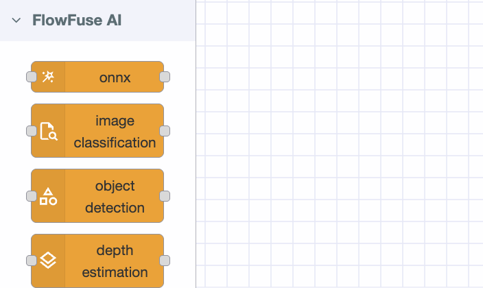
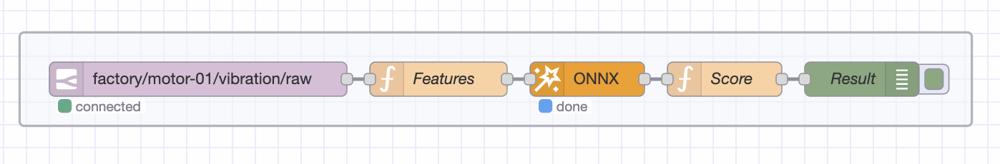

Bearing wear, shaft misalignment, and imbalance don't appear overnight. They develop over days or weeks, leaving a clear trail in vibration data long before any audible or thermal symptoms emerge. By the time a technician hears grinding or feels heat, the window for low-cost intervention has already closed.

<!--more-->

The challenge isn't visibility: it's continuity. Manual spot-checks capture a fraction of developing faults, and only if the timing is lucky. What's needed is something that watches constantly, understands what normal looks like, and flags the moment something shifts.

This guide walks through building exactly that: a custom AI model that learns the healthy vibration signature of your motor, detects deviations in real time, and integrates directly into Node-RED using FlowFuse with no separate ML infrastructure required.

<lite-youtube
  videoid="Fkv2x3Kv0lY"
  style="width: 1024px; overflow: hidden; background-image: url('/blog/2026/02/images/anomaly-detection.png'); background-size: cover; background-position: center;"
  title="Motor Anomaly Detection System Built Using FlowFuse">
</lite-youtube>

## How It Works

An accelerometer mounted on the motor captures vibration across three axes (X, Y, Z) and publishes batches of raw readings to an MQTT broker every half-second. A Node-RED flow subscribes to those readings, extracts 33 statistical features per batch (covering energy, peak forces, shape, and distribution across all three axes) and passes them to a trained autoencoder.

### Why an Autoencoder?

An [autoencoder](https://en.wikipedia.org/wiki/Autoencoder) is a neural network trained to compress its input and then reconstruct it. The architecture used here is:

```
Input (33) → Dense (16) → Dense (8) → Dense (16) → Output (33)
```

The bottleneck layer (8 nodes) forces the model to learn a compact representation of the input. When trained exclusively on healthy motor data, the model learns to reconstruct normal vibration patterns with very low error. When conditions change (a bearing begins to wear, alignment drifts, imbalance develops) the vibration signature shifts, reconstruction error rises, and the system flags an anomaly.

This approach is well-suited to industrial use because you almost certainly have abundant examples of normal operation, but few or no labeled examples of specific fault modes. You don't need to know what failure looks like; you only need to define what normal looks like.

## Building the System

The implementation has three stages: setting up hardware to collect vibration data, training the autoencoder on normal operation, and deploying the trained model in Node-RED for real-time inference.

## Part 1: Hardware and Data Requirements

This guide assumes you already have a vibration sensor publishing batches of acceleration readings across X, Y, and Z axes at regular intervals. The examples were built using an ESP32 wired to an ADXL345 accelerometer. If your hardware differs, the rest of the steps remain unchanged as long as your sensor publishes the same payload format.

### Expected Payload Format

Each MQTT message contains a half-second snapshot of motor vibration. The sensor captures 256 measurements per axis and packages them into a single JSON payload:

```json
{
  "motor_id": "motor-01",
  "ts": 1718000000000,
  "x": [0.12, 0.11, 0.13, 0.14, ...],
  "y": [0.04, 0.05, 0.04, 0.03, ...],
  "z": [0.98, 0.97, 0.99, 0.96, ...]
}
```

At 500 Hz sampling, 256 values represent roughly half a second of continuous vibration. This batching approach matters because it gives the AI model enough context to detect patterns: a single data point is meaningless, but 256 points reveal the behavioral signature of how the motor is actually running.

The `motor_id` and `ts` fields are ignored by the model and can be omitted or renamed without effect.

> **If your sensor uses different settings:** The feature extraction math works regardless of sample count or sampling rate. If your sensor samples at 200 Hz and sends 128 values per batch, each window represents 640 ms instead of 500 ms; the model doesn't care about absolute timing, only the shape of the vibration signature. Aim for at least 100–200 ms of data per window; anything shorter may not carry enough signal for reliable detection.

### MQTT Broker

You'll need an MQTT broker to route messages between the sensor, the training script, and Node-RED. Make sure your sensor is publishing to a consistent topic so all three can stay in sync.

> **Tip:** If you're using [FlowFuse](/) for enterprise Node-RED, a built-in MQTT broker is available on **Pro** and **Enterprise** tiers with no external setup required. [Contact us](/contact-us) for more information.

## Part 2: Training the Autoencoder

Before deploying anything in Node-RED, you need a trained model that understands what normal motor vibration looks like. This is done with a single Python script that connects to your MQTT broker, collects vibration data while the motor runs normally, then automatically trains and exports the model when you're done.

### Prerequisites

**System requirements:** Python 3.11 or later. The steps below were tested on macOS (Apple Silicon); adapt as needed for Linux or Windows.

Create and activate a virtual environment:

```bash
python3 -m venv venv
source venv/bin/activate
```

> **Windows:** Replace `source venv/bin/activate` with `venv\Scripts\activate`.

Install dependencies:

```bash
pip3 install numpy paho-mqtt torch onnx onnxruntime scikit-learn
```

### Configuration

All setup lives in a single configuration block at the top of the script. Before running, update these variables to match your environment:

| Variable | Description |
|---|---|
| `BROKER` | Hostname or IP of your MQTT broker |
| `PORT` | `1883` for plain MQTT, `8883` for TLS |
| `USERNAME` | Broker username. Leave empty `""` if not required |
| `PASSWORD` | Broker password. Leave empty `""` if not required |
| `CLIENT_ID` | Any unique string identifying this client |
| `TOPIC` | The MQTT topic your sensor publishes to |
| `MIN_WINDOWS` | Minimum samples to collect before training (default: 300) |
| `MIN_STD` | Minimum standard deviation floor that prevents near-constant features from skewing normalisation (default: 0.1) |
| `CLIP` | Hard clamp applied after normalisation to prevent extreme values (default: 5.0) |
| `EPOCHS` | Number of training epochs (default: 200) |
| `LEARNING_RATE` | Adam optimizer learning rate (default: 0.001) |
| `THRESHOLD_SIGMA` | Multiplier for threshold calculation: `mean + N × std` of training errors (default: 3) |

> **Threshold tuning:** The default `mean + 3σ` threshold is a solid starting point, but every motor environment is different. If you see too many false positives during normal operation, increase `THRESHOLD_SIGMA`. If faults are being missed, decrease it. You can also edit `threshold.json` directly after training without rerunning the script.

### Collect and Train

Create a file called `train_model.py` and paste the following. **Start the motor first, then run the script.** The model needs to learn what running vibration looks like. Collecting data with the motor stopped or barely loaded will produce a model that treats idle conditions as normal and misses real anomalies.

```python
"""
Motor Vibration Anomaly Detection: Data Collection and Training
"""

import json
import signal
import sys
import numpy as np
import torch
import torch.nn as nn
import onnx
import onnxruntime as ort
from onnx import numpy_helper, TensorProto, helper
import paho.mqtt.client as mqtt
from paho.mqtt.client import CallbackAPIVersion

# ── Configuration ────────────────────────────────────────────────────────────
BROKER         = "broker.example.com"            # Your MQTT broker address or IP
PORT           = 1883                            # 1883 for plain MQTT, 8883 for TLS
USERNAME       = ""                              # Leave as "" if broker has no auth
PASSWORD       = ""                              # Leave as "" if broker has no auth
CLIENT_ID      = "motor-trainer-01"             # Any unique string for this client
TOPIC          = "factory/motor-01/vibration/raw" # Must match your sensor's publish topic

# ── Training parameters ───────────────────────────────────────────────────────
MIN_WINDOWS    = 300    # Minimum samples before training is allowed
MIN_STD        = 0.1    # Prevents near-constant features from exploding normalisation
CLIP           = 5.0    # Hard clip applied after normalisation
EPOCHS         = 200    # Number of training epochs
LEARNING_RATE  = 1e-3   # Adam optimiser learning rate
THRESHOLD_SIGMA = 3     # Threshold = mean + N * std of training reconstruction errors
# ─────────────────────────────────────────────────────────────────────────────

training_data = []
stop_flag = [False]

def extract_features(sig):
    """Extract 11 time-domain features from a signal array."""
    sig  = np.asarray(sig, dtype=np.float64)
    mean = np.mean(sig)
    std  = np.std(sig) + 1e-9

    rms              = np.sqrt(np.mean(sig ** 2))
    peak             = np.max(np.abs(sig))
    peak_to_peak     = np.max(sig) - np.min(sig)
    crest_factor     = peak / (rms + 1e-9)
    variance         = np.var(sig)
    std_dev          = np.std(sig)
    skewness         = np.mean(((sig - mean) / std) ** 3)
    kurtosis         = np.mean(((sig - mean) / std) ** 4) - 3
    mean_abs         = np.mean(np.abs(sig)) + 1e-9
    shape_factor     = rms / mean_abs
    impulse_factor   = peak / mean_abs
    mean_sqrt_abs    = np.mean(np.sqrt(np.abs(sig)))
    clearance_factor = peak / (mean_sqrt_abs ** 2 + 1e-9)

    return [rms, peak, peak_to_peak, crest_factor, variance,
            std_dev, skewness, kurtosis, shape_factor,
            impulse_factor, clearance_factor]

def featurize(payload):
    """Concatenate features from X, Y, Z → 33-element vector."""
    return (extract_features(payload["x"]) +
            extract_features(payload["y"]) +
            extract_features(payload["z"]))

def on_connect(client, userdata, flags, reason_code, properties):
    if reason_code == 0:
        print(f"Connected to {BROKER}")
        client.subscribe(TOPIC)
        print(f"Subscribed to {TOPIC}")
        print("Run motor normally. Press Ctrl+C when done collecting.\n")
    else:
        print(f"Connection failed: {reason_code}")

def on_message(client, userdata, msg):
    if stop_flag[0]:
        return
    try:
        payload = json.loads(msg.payload.decode())
        training_data.append(featurize(payload))
        n = len(training_data)
        print(f"  Collected {n} windows", end="\r")
    except Exception as e:
        print(f"\nError parsing message: {e}")

def train_and_export():
    N = 33
    print(f"\n\nCollected {len(training_data)} windows. Starting training...")
    X = np.array(training_data, dtype=np.float32)

    # Normalisation with minimum std floor
    mean = X.mean(axis=0)
    std  = X.std(axis=0)

    clamped = std < MIN_STD
    if clamped.any():
        print(f"  Clamping {clamped.sum()} near-constant features to std={MIN_STD}")
        std[clamped] = MIN_STD

    X_norm = np.clip((X - mean) / std, -CLIP, CLIP)
    print(f"  Normalised range: [{X_norm.min():.3f}, {X_norm.max():.3f}]")

    scaler = {"mean": mean.tolist(), "std": std.tolist(), "clip": CLIP}
    with open("scaler_params.json", "w") as f:
        json.dump(scaler, f, indent=2)
    print("  Saved scaler_params.json")

    # Autoencoder definition
    class Autoencoder(nn.Module):
        def __init__(self, n):
            super().__init__()
            self.encoder = nn.Sequential(
                nn.Linear(n, 16), nn.ReLU(),
                nn.Linear(16, 8), nn.ReLU(),
            )
            self.decoder = nn.Sequential(
                nn.Linear(8, 16), nn.ReLU(),
                nn.Linear(16, n),
            )
        def forward(self, x):
            return self.decoder(self.encoder(x))

    model   = Autoencoder(N)
    opt     = torch.optim.Adam(model.parameters(), lr=LEARNING_RATE)
    loss_fn = nn.MSELoss()
    data_t  = torch.tensor(X_norm, dtype=torch.float32)

    model.train()
    for epoch in range(1, EPOCHS + 1):
        opt.zero_grad()
        loss = loss_fn(model(data_t), data_t)
        loss.backward()
        opt.step()
        if epoch % (EPOCHS // 5) == 0:
            print(f"  Epoch {epoch}/{EPOCHS}  loss={loss.item():.6f}")

    # Calculate threshold
    model.eval()
    with torch.no_grad():
        recon  = model(data_t).numpy()
        errors = np.mean((recon - X_norm) ** 2, axis=1)
        thresh = float(errors.mean() + THRESHOLD_SIGMA * errors.std())

    with open("threshold.json", "w") as f:
        json.dump({"threshold": thresh}, f, indent=2)
    print(f"  Threshold (mean+{THRESHOLD_SIGMA}σ): {thresh:.6f}")
    print("  Saved threshold.json")

    # Export to ONNX
    # Built manually to avoid version conflicts between PyTorch and ONNX exporters
    layers   = [("encoder.0","enc0"),("encoder.2","enc2"),
                ("decoder.0","dec0"),("decoder.2","dec2")]
    has_relu = [True, True, True, False]
    inits, nodes = [], []
    cur = "features"

    for (prefix, tag), relu in zip(layers, has_relu):
        w = model.state_dict()[f"{prefix}.weight"].numpy().T.astype(np.float32)
        b = model.state_dict()[f"{prefix}.bias"].numpy().astype(np.float32)
        inits += [numpy_helper.from_array(w, name=f"w_{tag}"),
                  numpy_helper.from_array(b, name=f"b_{tag}")]
        mm = f"mm_{tag}"; add = f"add_{tag}"
        nodes += [helper.make_node("MatMul", [cur, f"w_{tag}"], [mm]),
                  helper.make_node("Add",    [mm,  f"b_{tag}"], [add])]
        cur = add
        if relu:
            r = f"relu_{tag}"
            nodes.append(helper.make_node("Relu", [cur], [r]))
            cur = r

    graph = helper.make_graph(
        nodes, "autoencoder",
        [helper.make_tensor_value_info("features", TensorProto.FLOAT, [None, N])],
        [helper.make_tensor_value_info(cur, TensorProto.FLOAT, [None, N])],
        initializer=inits,
    )
    proto = helper.make_model(graph, opset_imports=[helper.make_opsetid("", 11)])
    proto.ir_version = 7
    onnx.checker.check_model(proto)
    onnx.save(proto, "motor_autoencoder.onnx")
    print("  Exported motor_autoencoder.onnx")

    # Sanity check
    sess = ort.InferenceSession("motor_autoencoder.onnx")
    out  = sess.run(None, {"features": X_norm[:5].astype(np.float32)})[0]
    mse  = float(np.mean((out - X_norm[:5]) ** 2))
    print(f"\n  Sanity MSE (5 normal samples): {mse:.6f}  threshold: {thresh:.6f}")
    if mse < thresh:
        print("  ✓ Model correct , normal data scores below threshold.")
    else:
        print("  ⚠ Sanity MSE above threshold , collect more data and retrain.")

    print("\nDone. Copy these 3 files to your Node-RED server:")
    print("  motor_autoencoder.onnx  scaler_params.json  threshold.json")

def handle_sigint(sig, frame):
    stop_flag[0] = True
    if len(training_data) < MIN_WINDOWS:
        print(f"\n\nNeed at least {MIN_WINDOWS} windows. Restart and collect longer.")
        sys.exit(1)
    train_and_export()
    sys.exit(0)

signal.signal(signal.SIGINT, handle_sigint)

client = mqtt.Client(callback_api_version=CallbackAPIVersion.VERSION2,
                     client_id=CLIENT_ID)
client.username_pw_set(USERNAME, PASSWORD)
client.on_connect = on_connect
client.on_message = on_message
client.connect(BROKER, PORT, keepalive=60)
client.loop_forever()
```

Let it collect for 5–10 minutes (aim for 300+ windows), then press **Ctrl+C once** and wait. The script will train the model and export three files:

- `motor_autoencoder.onnx` , the trained model in a portable, runtime-agnostic format
- `scaler_params.json` , the scaling parameters used to normalise input features
- `threshold.json` , the reconstruction error value above which a reading is flagged as anomalous

> **Sanity check:** Watch the output at the end. `✓ Model correct` means the model correctly scores normal data below the threshold. A warning means you should collect more data with the motor under its typical load and retrain.

### When to Retrain

The model captures what normal looks like at the time of training. Plan to retrain after any significant change to the motor's operating conditions: a maintenance overhaul, a change in load profile, a new mounting position, or seasonal temperature shifts that affect the vibration baseline. The process is identical , run the script again with the motor under its new normal conditions, replace the three output files, and restart the Node-RED flow.

## Part 3: Deploying in Node-RED

The model now knows what healthy looks like. This section builds the Node-RED flow that runs continuously, scores every incoming vibration batch in real time, and raises an alert the moment something shifts.

### Installing the AI Nodes

FlowFuse provides a dedicated AI nodes package for Node-RED that includes ONNX runtime support.

> **Note:** These nodes are only available to FlowFuse users. If you don't have an account, [get started here](/get-started/) and follow the steps to [run the device agent](/blog/2025/09/installing-node-red/).

1. Open the Node-RED editor and go to **Menu → Manage Palette**
2. Search for `@flowfuse-nodes/nr-ai-nodes`
3. Click **Install**

Once installed, you will see new nodes in the palette under the FlowFuse AI category. This guide uses the **onnx** node.



### Loading the Model Files

Place your three model files in the FlowFuse Device Agent directory before building the flow:

```bash
sudo mkdir -p /opt/flowfuse-device/models
sudo cp motor_autoencoder.onnx /opt/flowfuse-device/models/
sudo cp scaler_params.json /opt/flowfuse-device/models/
sudo cp threshold.json /opt/flowfuse-device/models/
```

### Building the Inference Flow

The flow has five stages: receive the payload, extract features, scale and prepare, run inference, and score the result.

**1. Subscribe to MQTT**

Add an **mqtt-in** node and configure it to connect to the same broker and topic used during training. Set the output to auto-detect so the JSON payload is parsed automatically.

If you are using the built-in FlowFuse MQTT broker, use the [FlowFuse MQTT nodes](/node-red/flowfuse/mqtt/) , these connect automatically when dragged into the flow.

**2. Extract Features**

Add a **function** node. In the **Setup** tab, add the module `fs`. Then paste the following into the **On Message** tab:

```javascript
function extractFeatures(sig) {
    const arr = sig.map(Number);
    const n = arr.length;
    const mean = arr.reduce((a, b) => a + b, 0) / n;
    const std = Math.sqrt(arr.reduce((a, b) => a + (b - mean) ** 2, 0) / n) + 1e-9;
    const absArr = arr.map(Math.abs);
    const rms = Math.sqrt(arr.reduce((a, b) => a + b * b, 0) / n);
    const peak = Math.max(...absArr);
    const meanAbs = absArr.reduce((a, b) => a + b, 0) / n + 1e-9;
    const meanSqrtAbs = absArr.reduce((a, b) => a + Math.sqrt(b), 0) / n;
    return [
        rms, peak, Math.max(...arr) - Math.min(...arr),
        peak / (rms + 1e-9),
        arr.reduce((a, b) => a + (b - mean) ** 2, 0) / n,
        Math.sqrt(arr.reduce((a, b) => a + (b - mean) ** 2, 0) / n),
        arr.reduce((a, b) => a + ((b - mean) / std) ** 3, 0) / n,
        arr.reduce((a, b) => a + ((b - mean) / std) ** 4, 0) / n - 3,
        rms / meanAbs, peak / meanAbs, peak / (meanSqrtAbs ** 2 + 1e-9),
    ];
}

// Scaler and threshold are cached in flow context after the first message.
// If you update the model files, restart the Node-RED flow to reload them.
if (!flow.get('scaler')) {
    const sc = JSON.parse(fs.readFileSync('/opt/flowfuse-device/models/scaler_params.json'));
    const th = JSON.parse(fs.readFileSync('/opt/flowfuse-device/models/threshold.json'));
    flow.set('scaler', sc);
    flow.set('threshold', th.threshold);
}

const scaler = flow.get('scaler');
const CLIP = scaler.clip || 5.0;
const MIN_STD = 0.1;

const raw = [
    ...extractFeatures(msg.payload.x),
    ...extractFeatures(msg.payload.y),
    ...extractFeatures(msg.payload.z)
];

const normalised = raw.map((v, i) => {
    const s = Math.max(scaler.std[i], MIN_STD);
    const n = (v - scaler.mean[i]) / s;
    return Math.max(-CLIP, Math.min(CLIP, n));
});

msg.input = {
    data: new Float32Array(normalised),
    type: "float32",
    dims: [1, 33]
};
msg.payload = msg.input;
msg.threshold = flow.get('threshold');
return msg;
```

This function extracts 11 time-domain features per axis (33 total), loads the scaler on first run, and normalises the feature vector. The `MIN_STD` floor and `±CLIP` clamp mirror the values used during training and prevent near-constant features from producing extreme values, which are a common source of false positives with vibration sensors.

> **If you changed the model file path**, update the two `readFileSync` paths to match your chosen directory.

**3. Run the Model**

Add an **onnx** node and configure it:

- **Model path:** `/opt/flowfuse-device/models/motor_autoencoder.onnx`
- **Input:** `msg.payload`

The autoencoder compresses the 33-feature input through the bottleneck and reconstructs it on the output side. The reconstructed tensor is accessible in the next node via `msg.payload`. Since the output key name depends on how the ONNX graph was exported, the scoring node retrieves it dynamically rather than relying on a hardcoded name.

**4. Score the Reconstruction Error**

Add a second **function** node:

```javascript
if (!context.get('initialized')) {
    flow.set('score_history', []);
    context.set('initialized', true);
}

// Generic output key lookup — works regardless of tensor name
const outputKey = Object.keys(msg.payload)[0];
const reconstructed = msg.payload[outputKey].cpuData;

const input = Array.from(msg.input.data);
const threshold = msg.threshold;

const mse = input.reduce((s, v, i) => s + (reconstructed[i] - v) ** 2, 0) / input.length;

let history = flow.get('score_history') || [];
history.push(mse);
if (history.length > 10) history.shift();
flow.set('score_history', history);

const smoothed = history.reduce((a, b) => a + b, 0) / history.length;

msg.anomaly_score = smoothed;
msg.is_anomaly    = smoothed > threshold;
msg.severity      = smoothed > threshold * 2 ? 'CRITICAL' : smoothed > threshold ? 'WARNING' : 'NORMAL';
msg.payload       = { anomaly_score: smoothed, threshold, is_anomaly: msg.is_anomaly, severity: msg.severity };
return msg;
```

This function computes mean squared error between the model's reconstruction and the normalised input, applies a 10-window rolling average to reduce sensitivity to transient spikes, then classifies the result as `NORMAL`, `WARNING`, or `CRITICAL`.

> **Recovery time:** After an anomaly clears, the score returns to normal once the rolling window fills with healthy readings , typically 10 × your publish interval. At 500 ms publishing, that's roughly 5 seconds. Reduce the history window size for faster recovery; increase it to suppress false alarms.

Once deployed, the flow should look like this:



**5. Act on the Result**

Connect the scoring output to whatever suits your operation. For testing, a debug node shows results in real time. For production, an mqtt-out node can publish anomaly alerts downstream, and the [FlowFuse Dashboard](https://dashboard.flowfuse.com) package can visualise the anomaly score over time with a clear motor state indicator.

### What the Output Looks Like

Each message produces a structured result:

```json
{
  "anomaly_score": 0.842,
  "threshold": 0.703,
  "is_anomaly": true,
  "severity": "WARNING"
}
```

When `is_anomaly` is `false`, the motor is behaving within the expected range. When it flips to `true`, the vibration pattern has shifted beyond the acceptable boundary, giving you time to act before the problem becomes a failure. A severity of `CRITICAL` means the score has crossed twice the threshold, signalling a more significant deviation that warrants immediate attention.

## What This System Won't Tell You

This approach works well, but it's worth being clear about where it stops.

The autoencoder learns a statistical boundary around the vibration patterns it was trained on. It doesn't understand physics, it doesn't know the difference between a worn bearing and a loose mounting bolt, and it has no concept of severity beyond the reconstruction error score. When it flags an anomaly, it's telling you that something has changed, not what changed or why. Diagnosing the root cause still requires a technician with domain knowledge.

Training data quality matters more than model architecture. A model trained on data collected while the motor was lightly loaded, recently serviced, or running in cool ambient conditions will treat those as "normal." If real operating conditions differ, the threshold may be poorly calibrated from day one, generating either chronic false positives or, worse, missing genuine faults. There's no substitute for collecting training data under representative, sustained, real-world load.

False positives are inevitable in early deployment. External vibration from nearby equipment, transient load spikes, or sensor cable movement can all push the score above threshold momentarily. The rolling average window helps, but it doesn't eliminate them. Treat the first few weeks as a calibration period: log alerts, investigate them, and adjust `THRESHOLD_SIGMA` or the window size based on what you learn. The system improves with attention.

Finally, anomaly detection is an early warning layer, not a maintenance strategy on its own. It tells you to look sooner, not what to do when you get there. Pair it with regular physical inspection, lubrication schedules, and, where possible, a domain expert who can interpret the alerts in context. Used that way, it earns its place. Used as a replacement for those things, it will eventually let you down.

*Most motor failures are predictable. The vibration signature is there weeks before the damage is done. This guide shows how to capture that signal and act on it. FlowFuse brings the full pipeline together in one place: sensor ingestion, feature extraction, and custom-trained AI inference, without managing separate infrastructure. [Try it free](/get-started/).*
