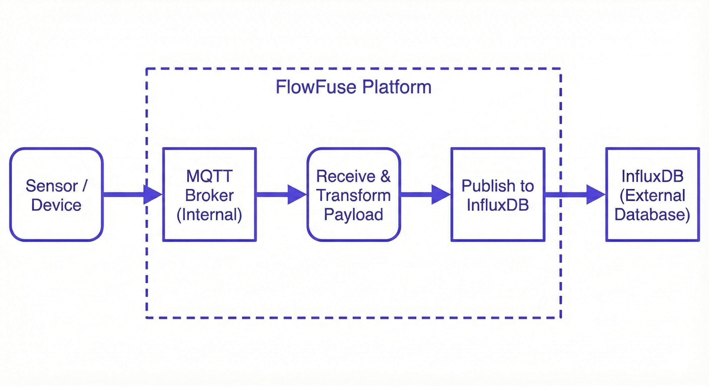
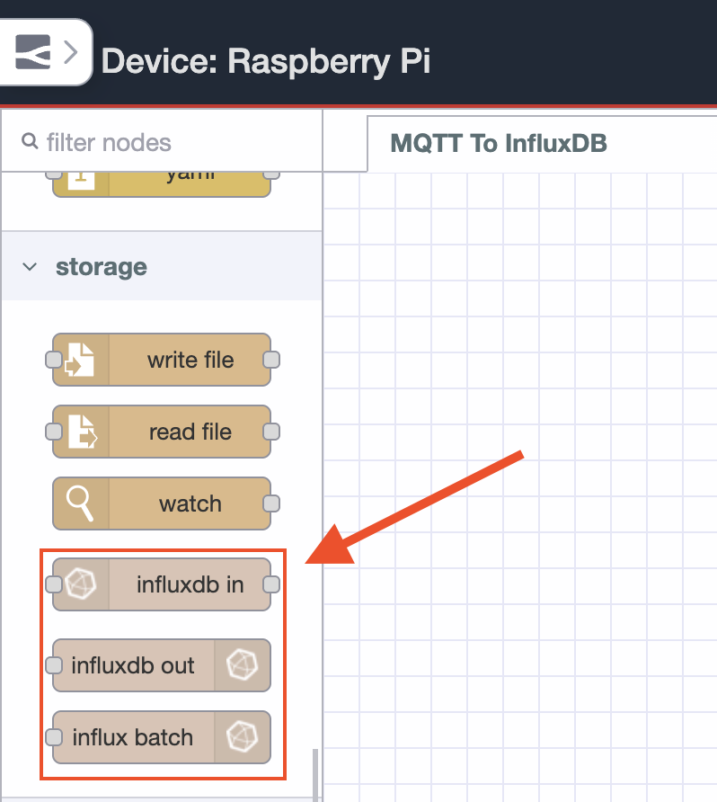
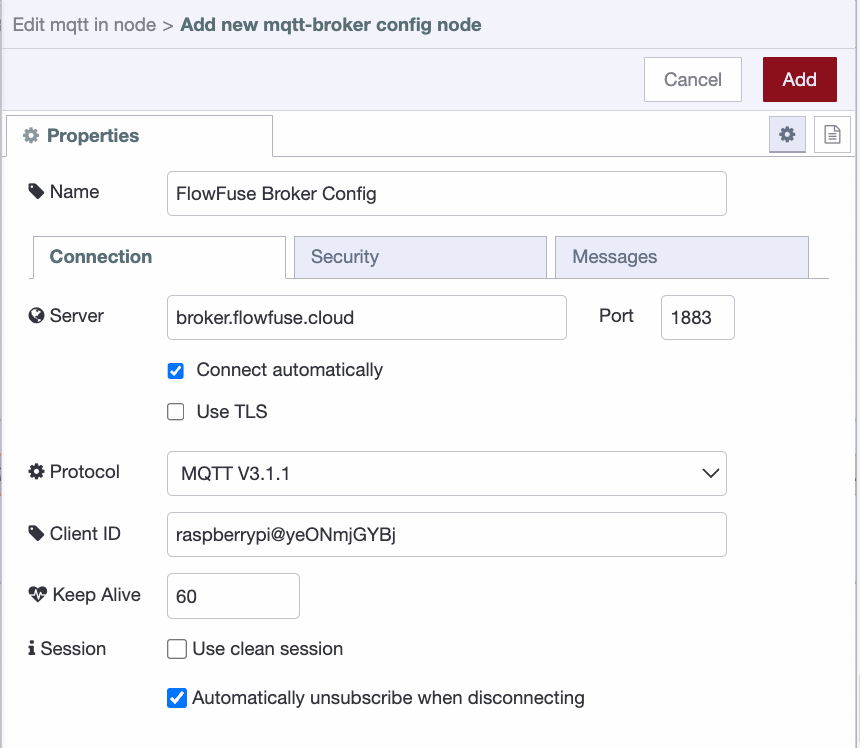
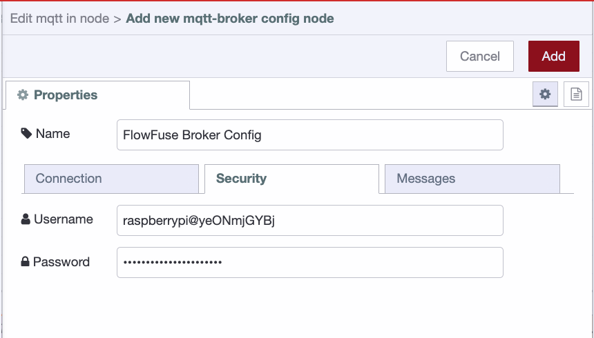
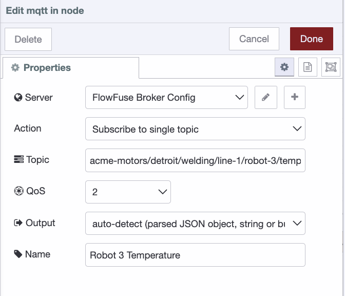
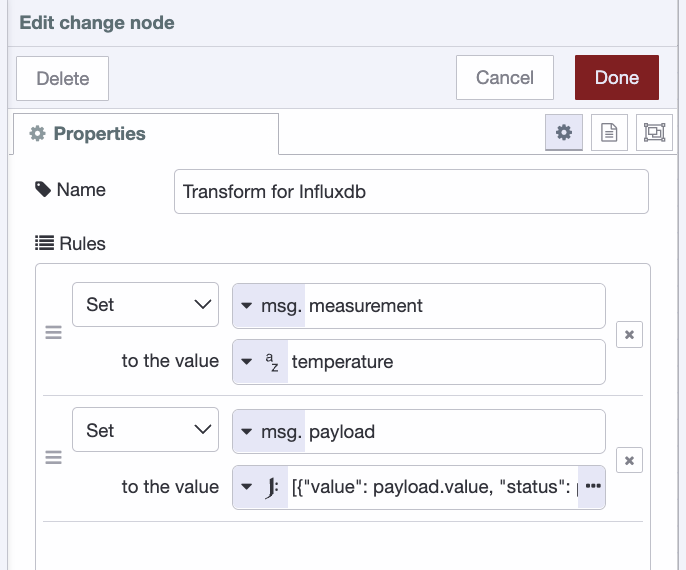
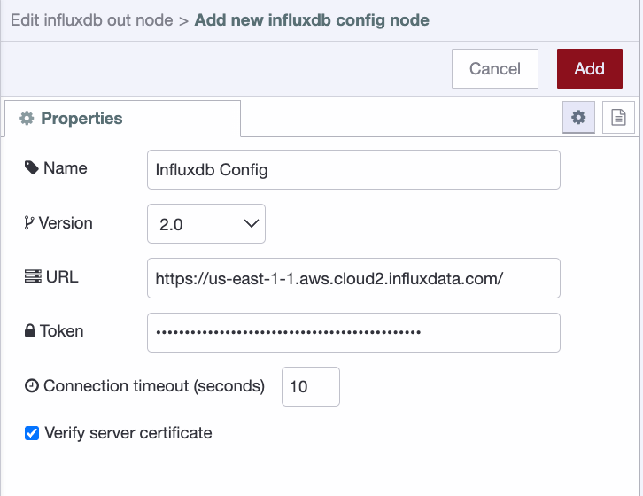
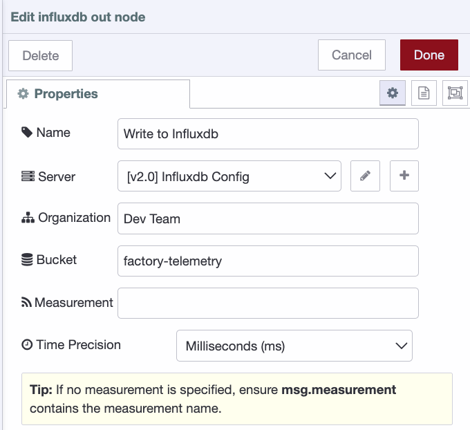

An MQTT to InfluxDB is one of the most common and most critical pipelines in IIoT. Every timestamped telemetry event that drives decisions on the floor needs to land somewhere it can be queried, trended, and acted on.

<!--more-->

The typical approach is a custom Python script that subscribes to the broker, parses the payload, and writes to InfluxDB. It works until a sensor changes its payload format, or the script quietly dies over a weekend and nobody notices until Monday. Now you're debugging a process nobody else fully understands, with no visibility into what failed or when. Others stitch together multiple tools, each with its own config, its own failure modes, and its own logs to dig through at 2am. The complexity ends up hidden in places that are hard to see, hard to debug, and hard to hand off.

This article takes a different approach. Using FlowFuse (the enterprise platform built on [Node-RED](/)), you'll build the entire pipeline as a visual flow covering MQTT subscription, payload transformation, and InfluxDB write. Every step is visible, editable, and easy to hand off.

## TL;DR

- **What**: Build an MQTT-to-InfluxDB pipeline that subscribes to a broker, transforms the payload, and writes time-series data to InfluxDB.
- **How**: Three nodes in FlowFuse: MQTT in, change node for transformation, and InfluxDB out. No custom scripts or glue code.
- **Why FlowFuse**: Every step is visual, editable, and easy to hand off. When something breaks, you know exactly where to look.

## Prerequisites

Before you start, make sure you have the following in place.

- A running FlowFuse instance. If you don't have one yet, [sign up]() to get started.
- An MQTT broker. FlowFuse Pro and Enterprise include a [built-in broker](/docs/user/teambroker/), and the [MQTT nodes](/node-red/flowfuse/mqtt/) configure themselves automatically. If you are using an external broker, keep your host, port, and credentials handy.
- A running InfluxDB instance, either local or on InfluxDB Cloud. Keep your URL, token, organization, and bucket name handy.

## Building the Pipeline

The flow has three stages. An MQTT in node subscribes to your broker and receives incoming sensor payloads. A change node transforms that payload into the structure InfluxDB expects. An InfluxDB out node takes that structured data and writes it to your bucket. That's the entire pipeline. Let's build it.



### Step 1: Install the InfluxDB Node

Node-RED does not include an InfluxDB node out of the box, so you will need to install it first.

1. Open the Node-RED editor in your FlowFuse instance.
2. Click the main menu in the top right corner and select Manage Palette.
3. Go to the Install tab and search for [node-red-contrib-influxdb](/integrations/node-red-contrib-influxdb/).
4. Click Install. Once complete, the InfluxDB nodes will appear in your palette on the left side.



### Step 2: Configure the MQTT In Node

Drag an MQTT in node onto the canvas and double-click it to open its settings. Click the pencil icon next to the Server field to add a new broker connection.

1. Enter your broker host in the Server field and set the Port.
2. Select `MQTT 3.1.1` as the protocol version.
3. Leave the Client ID blank to let Node-RED generate one automatically.
4. The keepalive is 60 seconds by default, so there’s no need to change it.
5. Check `Automatically unsubscribe when disconnecting`.



6. Switch to the Security tab and enter your broker username and password.
7. Click Add to save the broker configuration.



If you are on FlowFuse Pro or Enterprise, the built-in broker details will already be picked up by the node and you can skip the above.

Once the broker is configured:

1. Set the Topic to `acme-motors/detroit/welding/line-1/robot-3/temperature`.
2. Set QoS to 2 to minimize message loss and reduce duplicates between the broker and Node-RED. For true end-to-end de-duplication, add an idempotency strategy (for example, a unique key or timestamp handling) before writing to InfluxDB.
3. Give the node the name `robot 3 temperature` and click Done.



### Step 3: Transform the Payload with a Change Node

When the MQTT in node receives a message, `msg.payload` will look like this:
```json
{
  "timestamp": 1738830735000,
  "value": 187.6,
  "unit": "celsius",
  "sensor_id": "temp-robot-3",
  "status": "normal"
}
```

The InfluxDB out node does not accept this structure directly. With `node-red-contrib-influxdb`, the easiest pattern is to pass `msg.payload` as an array, the first containing the fields to write and the second containing the tags. In InfluxDB, fields are the values you aggregate and query over, while tags are metadata used mainly for filtering and grouping. Getting this split right matters because you cannot aggregate or perform math on tags, only on fields.

1. Drag a change node onto the canvas and connect it to the MQTT in node.
2. Double-click it to open its settings and add the following rules:
   - Set `msg.measurement` to the string value `temperature`. If your payload already contains the measurement name, you can set `msg.measurement` dynamically from `msg.payload.measurement` instead, making the flow reusable across multiple sensors without any changes. Otherwise, you can configure the measurement name directly in the InfluxDB out node.
   - Set `msg.payload` to the JSONata expression:
```
     [{"value": payload.value, "status": payload.status, "time": payload.timestamp}, {"sensor_id": payload.sensor_id, "unit": payload.unit}]
```
3. Give the node the name `transform for influxdb` and click Done.



### Step 4: Configure the InfluxDB Out Node

1. Drag an InfluxDB out node onto the canvas and connect it to the change node.
2. Double-click it to open its settings and click the pencil icon next to the Server field to add a new InfluxDB connection.
   - Set Version to `2.0`.
   - Enter your InfluxDB instance URL.
   - Enter your API token.
3. Click Add to save the connection.



4. Set the Organization to your organization name.
5. Set the Bucket to the bucket you want to write data into.
6. Leave the Measurement field blank since we are passing it via `msg.measurement` from the change node. If you prefer to hardcode it, enter `temperature` here.
7. Give the node the name `write to influxdb` and click Done.



### Step 5: Deploy and Test

With all three nodes connected, click the Deploy button in the top right corner of the Node-RED editor. Once deployed, the flow will immediately start listening for messages on the topic you configured.

As your sensor publishes readings, open your InfluxDB instance and navigate to Data Explorer. Select your bucket, filter by measurement, and run the query. You should see the values and tags coming in from the pipeline.

If no data appears, open the Node-RED debug panel and check for any error messages on the InfluxDB out node. The most common issues are an incorrect API token, a mismatched organization name, or a bucket that does not exist yet in InfluxDB.

## Conclusion

Most MQTT-to-InfluxDB pipelines don't fail because the technology is wrong. They fail because the implementation is invisible: a script running somewhere, maintained by someone, that nobody else fully understands until it stops working.

What you've built here flips that. Three nodes, one canvas, zero ambiguity about where data comes from, how it's shaped, and where it lands. When something breaks, and in IIoT, something always eventually breaks, you're not grepping through logs or reverse-engineering a process. You're looking at a flow that tells you exactly what happened and where.

From here, the pipeline is yours to grow. Handle multiple sensors by parameterizing the topic and measurement. Add a catch node so malformed payloads get logged instead of silently dropped. Connect your InfluxDB bucket to a FlowFuse dashboard and put live telemetry on the floor where operators can actually see it.

The three nodes you deployed today are the foundation. Everything else is just adding to what's already visible.
