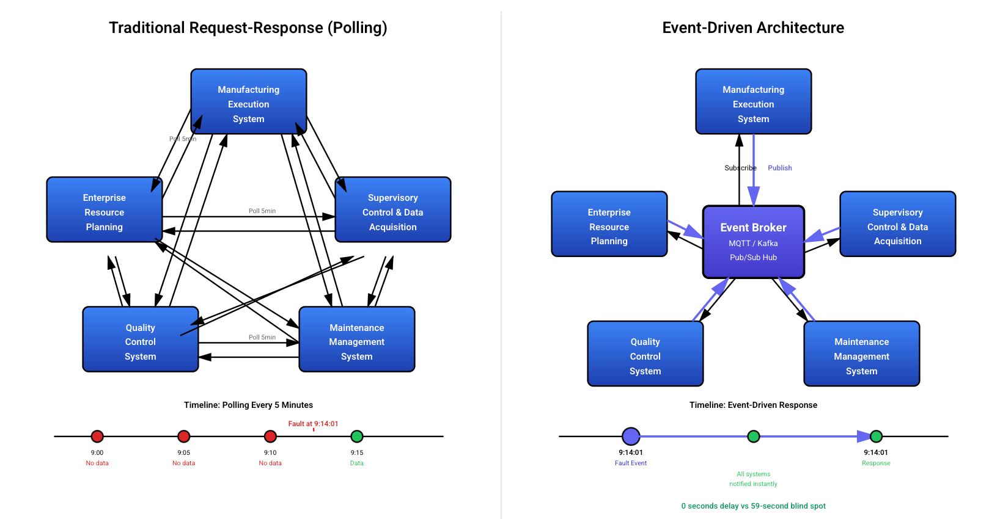

Nearly 99% of the requests your manufacturing systems make return the same answer: nothing changed. The 1% that matter? You find out too late. This isn't a monitoring problem. It's an architecture problem.

<!--more-->

*Event-Driven Architecture (EDA) flips this model entirely. Instead of systems asking questions on a schedule, they listen for events and react the moment something happens, eliminating the gap between occurrence and response.*

In manufacturing, an "event" is any significant occurrence. A machine completes a cycle. A sensor detects an anomaly. A part fails inspection. Inventory hits a threshold. When these events occur, they are immediately broadcast to all interested systems, which respond automatically and in parallel.

When a machine finishes a production run, it triggers an event. Instantly, the inventory system updates stock levels. Maintenance logs machine hours. Quality control schedules an inspection. Production planning releases the next order. No manual intervention. No waiting.

This is what real-time responsiveness looks like in practice. Faster issue detection, dynamic optimization, and the ability to absorb disruptions before they cascade.

## The Structural Limits of Traditional Manufacturing Systems

Traditional manufacturing systems operate on request-response models. The MES queries the ERP for inventory counts. SCADA polls sensors at fixed intervals. Quality systems run batch processes to aggregate data. Each system asks for what it needs, when it needs it. This worked when manufacturing moved slowly. It breaks down in modern production environments.

The waste is structural. Nearly 99 out of every 100 polling requests return no new information, and polling models consume orders of magnitude more server resources than event-driven alternatives to maintain the same data freshness. Bandwidth and processing power are spent confirming that nothing has changed.

Between polling intervals lies real risk. A fault appears on the floor at 9:14:01 AM. The monitoring system, configured to poll every five minutes, won't detect it until 9:15:00. During those 59 seconds, defective output flows downstream while costs accumulate at rates exceeding $38,000 per minute in automotive facilities. Schedules drift. Quality issues propagate. The gap between what's happening and what the business knows keeps widening.

Point-to-point integrations make this worse. Connection counts follow the n(n-1)/2 formula. Five systems require ten connections. Ten systems demand 45. Each connection carries its own protocol, authentication scheme, and maintenance overhead. A firmware update means manual remapping across dozens of endpoints. New functionality requires weeks of integration work. A single failure can cascade through every tightly coupled system downstream.

The architecture that once enabled the factory now constrains it.

## How Event-Driven Architecture Works

Every polling system works the same way. Your MES wakes up on a timer and asks if anything changed. Usually nothing has. So it waits, then asks again. Multiply this across every system pair on your floor and you have an architecture that spends most of its energy confirming that nothing has happened.

EDA inverts this. Every significant occurrence gets broadcast the moment it happens. Any system that needs to know receives it immediately. Systems that don't are never involved.

Three components make this possible. Event producers generate the signal. PLCs, sensors, vision systems. Their only responsibility is to announce what happened. Event consumers act on it. The MES updates work orders. The ERP adjusts inventory. The maintenance platform logs runtime hours. Each subscribes only to relevant events and acts independently, so multiple consumers can respond to the same event simultaneously. The event broker connects them without coupling them. It receives events, routes them to subscribers, and keeps a durable log. Neither side needs to know the other exists. Adding a new consumer means subscribing it to the broker. Nothing else changes.

That last property is what solves the integration complexity problem. In point-to-point architectures, every new connection requires negotiated APIs and coordinated work across teams. The broker absorbs that complexity entirely.

The durable log solves a problem polling handles poorly. Events that occur while a system is offline are replayed in order when it comes back. Transient outages stop being data integrity problems. The record of what happened on the floor stays complete regardless of which systems were available when it happened.

## The Business Impact of Running on Events

Most factories don't lose money because their equipment is bad. They lose it because their systems are slow to know what's happening and slower to act on it.

That slowness isn't a people problem. It's structural. When your systems communicate by asking rather than listening, there's always a gap between what's happening on the floor and what the business knows about it. Teams fill that gap with buffers, manual checkpoints, and end-of-shift reports. It works until it doesn't.

EDA closes that gap. When something happens, every system that needs to know finds out immediately. The right processes trigger automatically. No polling cycle. No batch job. No one manually connecting the dots.

The scale of what's at stake makes this worth stating plainly. Unscheduled downtime costs the world's largest manufacturers trillions annually, representing a double-digit percentage of revenue. Nearly three-quarters of manufacturing leaders report that delays in reporting problems trigger chain reactions across their operations. These aren't technology metrics. They're business outcomes produced by architectures that were never designed to respond in real time.

Quality compounds the same way. The 1-10-100 rule of manufacturing quality states that a defect costs $1 to catch pre-production, $10 to catch during production, and $100 once it reaches the customer. Every minute a failed inspection goes unbroadcast to downstream systems, that multiplier is running. EDA stops the propagation at the source by ensuring the result is instantly visible to every process that needs to act on it.

Integration debt follows the same logic. Enterprise-level manufacturing software implementations routinely take many months to multiple years. Every new capability your team wants requires a project. EDA changes the economics entirely. New systems subscribe to the broker. Existing systems stay untouched. What once consumed quarters now requires configuration.

And when something does go wrong, you have a complete timestamped record of everything that happened on the floor. Not reconstructed timelines. Root cause analysis that took days takes hours. Audits have a chain of custody by default.

The factories pulling ahead right now aren't the most automated. They're the ones where information moves as fast as production does. Every minute that gap exists, it has a cost. EDA removes it.

## What It Takes to Move to Event-Driven Architecture

The hardware is already there. Sensors, [PLCs](/blog/2025/12/what-is-plc/), [SCADA systems](/solutions/scada/). All running. EDA doesn't replace them. It changes how they communicate.

You need an event broker and something that connects to legacy systems. [MQTT](/blog/2024/06/how-to-use-mqtt-in-node-red/) for shop floor devices. Kafka for enterprise loads. [Node-RED](/node-red/) to bridge the gap. That's the stack.

The real work is defining what counts as an event. A sensor produces tens of thousands of readings per day. Broadcasting all of them is noise. The event is when temperature crosses a threshold, stays abnormal, or trends wrong. Exceptions, not data points.

Your team already knows which deviations matter. Which delays cascade. Which variations are normal. Get this wrong and you build a system that generates alerts faster than anyone can ignore them.

Start where waiting costs the most. Downtime reported late doesn’t need better sensors. The stop event needs to fire when it happens and route to maintenance, scheduling, and analytics simultaneously. One workflow. Measured impact. Studies show event-driven systems responding in milliseconds rather than minutes, reducing manual intervention dramatically and improving process completion rates at scale. Prove it on one line, then expand to the next bottleneck.

The broker is straightforward. The translation layer isn't. Your [MES](/solutions/mes/) doesn't listen for events. Your [ERP](/blog/2025/06/connect-shop-floor-to-odoo-erp-flowfuse/) expects scheduled queries. Your quality system runs batch jobs. Bridging that gap is where real effort lives.

Brownfield doesn’t require cutover. Legacy runs. New workflows build on events. Each migration reduces polling overhead and creates durable audit trails. Value compounds.

The factories that fail treat this as infrastructure. The ones that succeed pick the highest-cost delay, fix it with events, measure the difference, and move on. Value drives adoption. Not architecture diagrams.

*FlowFuse makes event-driven architecture practical for manufacturing by connecting IT and OT systems through a single platform that supports virtually any protocol, includes a built-in MQTT broker, and provides enterprise-grade deployment and security. [Start with a free trial today.](https://app.flowfuse.com/account/create)*

## Sources & References

- APIPark — *Moving Beyond API Polling to Asynchronous Architectures*
  [https://apipark.com/technews/TbhGSEzF.html](https://apipark.com/technews/TbhGSEzF.html)
- DZone — *Webhooks vs. Polling: You’re Better Than This*
  [https://dzone.com/articles/webhooks-vs-polling-youre-better-than-this-1](https://dzone.com/articles/webhooks-vs-polling-youre-better-than-this-1)
- Insane Cyber — *The Real Cost of Industrial Downtime*
  [https://insanecyber.com/real-cost-industrial-downtime/](https://insanecyber.com/real-cost-industrial-downtime/)
- StackSync — *Why Integration Complexity Grows Exponentially*
  [https://www.stacksync.com/blog/integration-complexity-growth](https://www.stacksync.com/blog/integration-complexity-growth)
- Siemens — *The Cost of Downtime in Manufacturing*
  [https://www.siemens.com/global/en/products/services/industry-operations-services/digital-enterprise-services/manufacturing-operations-management/manufacturing-intelligence/downtime-cost.html](https://www.siemens.com/global/en/products/services/industry-operations-services/digital-enterprise-services/manufacturing-operations-management/manufacturing-intelligence/downtime-cost.html)
- Rockwell Automation — *The True Cost of Downtime*
  [https://www.rockwellautomation.com/en-us/company/news/blogs/the-cost-of-downtime.html](https://www.rockwellautomation.com/en-us/company/news/blogs/the-cost-of-downtime.html)
- American Society for Quality (ASQ) — *Cost of Quality and the 1-10-100 Rule*
  [https://asq.org/quality-resources/cost-of-quality](https://asq.org/quality-resources/cost-of-quality)
- Gartner — *Manufacturing ERP Implementation Timelines*
  [https://www.gartner.com/en/documents/manufacturing-erp-implementation](https://www.gartner.com/en/documents/manufacturing-erp-implementation)
- International Journal of Science and Advanced Technology (IJSAT) — *Event-Driven Manufacturing Automation Systems*
  [https://www.ijsat.org/papers/2025/1/2907.pdf](https://www.ijsat.org/papers/2025/1/2907.pdf)
