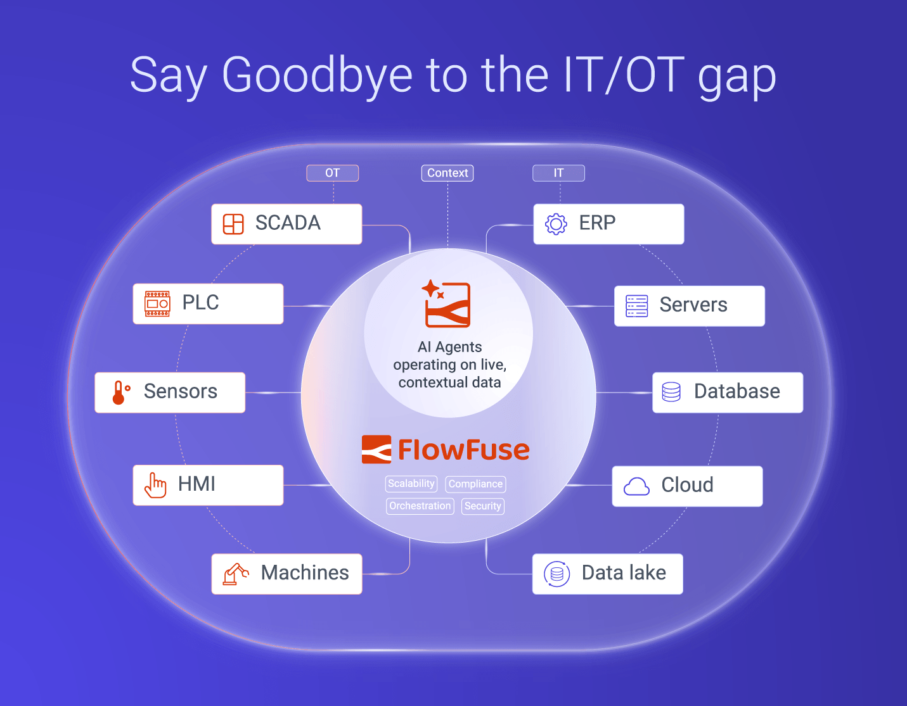

Every week, another vendor promises "AI on the edge" with glossy demos and yet another dashboard. With FlowFuse customers though, in real factories, the hard part is not the model; it is getting trustworthy, contextual data from all machines to the right AI, at the right time.The real competitive advantage will not come from who has the flashiest model, but from who owns the most reliable connecting tissue between hardware, IT systems, AI agents, and the cloud. This tissue empowers better model accuracy and creates an operational advantage for our customers.

## Why AI Deployments Fail When You Forget About Connectivity

Manufacturers that have already modernized their SCADA or rolled out cloud data lakes, lake houses, and other lake-based properties, are often surprised by how fragile their "AI initiative" becomes once it touches the factory floor.
It is no secret that data is trapped in proprietary PLCs and vendor‑locked SCADA systems, with IT and OT speaking different languages or protocols, and every site maintaining its own patchwork of scripts, gateways, and one‑off integrations.
So what happens? You end up with predictable problems: fragile, one-off connections, IT changes that take half a year, OT changes that have impact on data semantics but go unnoticed and AI projects that look great on paper but never actually run in the real world at scale.
The fundamental issue lies in the deep divide between Information Technology (IT) and Operational Technology (OT). Shop floor teams are often left in the dark about how their data is leveraged by upstream systems, while IT teams struggle to grasp the operational significance underlying the tags and signals they process. This unbridged gap ensures that every AI initiative remains an expensive, custom-built, and inherently brittle undertaking.

## The new stack: AI‑driven edge connectivity

A different architecture is emerging: a unified, future-proof connectivity layer that sits between machines, plant networks, enterprise systems, and AI services. This layer becomes the common ground where IT and OT share a unified model of metrics from assets, other events, and decisions made, ensuring that neither side operates in a vacuum. And I have to say that I’m proud of stating that FlowFuse is at the forefront of this innovation. 
In this new paradigm we’re facing, edge devices run a consistent runtime, such as open-source Node‑RED, so that connectivity, transformation, and control logic look the same on every line, every site, and every device family.
AI is then wired directly into this connective tissue via emerging AI standards like Model Context Protocol (MCP) and other native AI nodes, turning the connectivity fabric into a living "nerve system" where agents can safely read, reason, and act on live operational data.

## OK but… what "Future-Proof" means at the edge?

Getting AI, especially large language models (LLMs), to work with the edge isn't just about sticking them onto your existing middleware. It means that AI is embedded into how connectivity is designed, deployed, and operated: models and agents that turn natural‑language descriptions into flows, blueprints that spin up AI chat agents over plant data, and smart suggestions that propose the next node or transformation in context.
The main thing is, it also means that AI agents can run close to the process, on a gateway or industrial PC, using ONNX models for things like spotting defective parts produced,  and predicting maintenance and downtime, while the cloud handles the rules, oversight, and updates for the whole fleet.
That split (smart procedures happening at the edge, and the cloud just keeping things organized) is precisely what makes the IT and OT worlds finally click. OT gets to be fast and independent, and IT still has the main view and control over the whole shebang.

## We can finally say goodbye to the IT/OT gap. 

FlowFuse was built on a simple belief: industrial teams need one platform that can connect any machine, move data across any protocol, model it in any data platform, and run applications wherever they create the most value.
Both IT and OT get the tools they need, from a wide connectivity suite, to Git integration, and a platform to scale it to hundreds or thousands of different devices.It hooks up to things like PLCs, sensors, and existing Operational Technology (OT) gear using standard protocols like Modbus, OPC UA, and MQTT. This lets you securely stream data to the cloud or your own premises without messing around with complicated firewalls or VPNs. You name it, FlowFuse will connect everything. 
At the enterprise level, FlowFuse Cloud provides the central "control tower" to standardize blueprints, ensure version consistency, enforce security policies, and roll out changes across hundreds or thousands of devices with a single action.

On top of this connectivity fabric, FlowFuse Expert acts as the AI assistant tuned for industrial teams that will make your life easier as you never imagined.
Grounded via MCP in your actual machines, brokers, and databases, it does much more than chat: it generates live Node‑RED flows, data mappings, dashboards, and even queries that are directly deployable into your environment. Because it connects to both OT sources (PLCs, industrial brokers, historians) and IT systems (data lakes, CMDBs, corporate apps), Expert sees, understands and manages both halves of the map. 100% control of both IT and OT. It translates plant-floor requirements into IT-compliant flows and ensures that security and governance policies are automatically applied to edge configurations. It acts as the structural bridge that finally closes the IT/OT gap.
For OT engineers, this means months‑long projects compress into days or minutes; for IT, it means governance and security controls stay intact even as more of the work shifts closer to the plant floor.

_IT/OT Gap Diagram_

## From pilots to a scalable "AI nerve system"

Here’s the thing - Most companies will not win by building the most sophisticated individual model, but by institutionalizing a repeatable pattern: connect, contextualize, and act on data at the edge, with AI embedded at every step. If you’ve followed FlowFuse’s history you’ve probably seen how our tagline and our storytelling has been evolving following that logic. “Connect, Collect, Build and Scale with FlowFuse” - This is what this is about. 
FlowFuse gives manufacturers that pattern in a form they can actually operate: open‑source at the core with Node‑RED, industrial‑grade features for deployment and observability, and a layer of proprietary Artificial Intelligence that actually understands the realities of plant networks, not just cloud APIs.
The result is a new kind of infrastructure: a persistent "AI nerve system" that spans hardware, IT, AI, and cloud, so that when the next model, vendor, or use case arrives, your connectivity is already in place, deployed and ready to scale. This structural bridge ensures that the historical friction between IT and OT becomes a foundation for collaboration.
If the last decade was about moving workloads to the cloud, the next decade in manufacturing will be about bringing intelligence to the edge. And how this must be done? Safely, consistently, and fast enough to matter.
The companies that treat AI‑driven edge connectivity as a strategic foundation, not a side project, will be the ones that turn experiments into durable competitive advantage.

