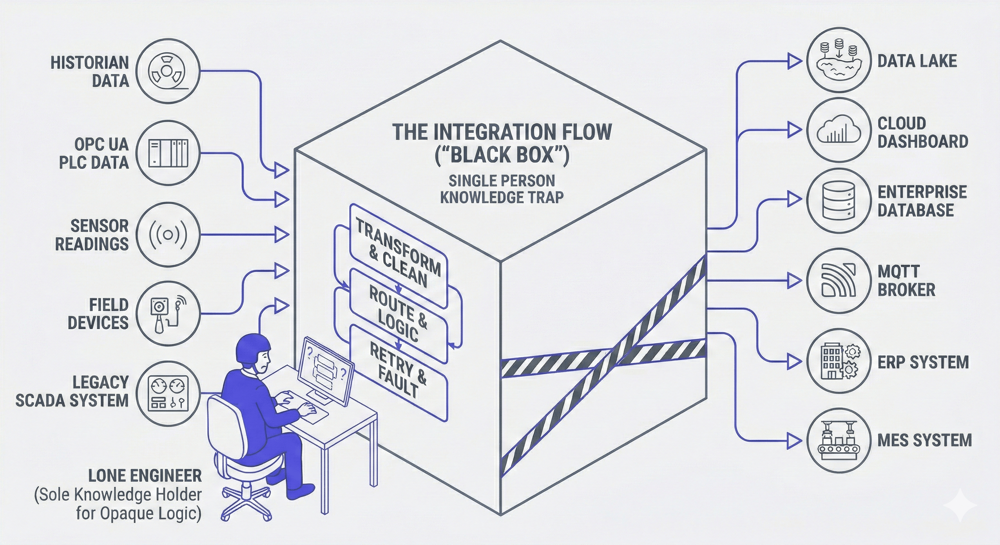

The bus factor is a simple idea. If one person leaves your team, how much breaks? If the answer is "a lot," your bus factor is one. Most integration systems have a bus factor of one.

<!--more-->

It's not because teams are sloppy. Integration work just tends to accumulate in corners. Systems get built quickly to solve real problems, and the person who builds them naturally becomes the person who understands them. They know why the retry logic is set the way it is, why data gets reshaped at that particular step, why two systems connect the way they do. That knowledge rarely makes it into documentation because there's always something more urgent to work on.

Time passes. The system keeps running. Nobody questions it. Then that person moves to another team, takes a two-week vacation, or just gets sick at the wrong moment, and suddenly a routine maintenance task turns into a two-day investigation.

The problem isn't unique to integration systems, but it hits them harder. Integration logic lives between other systems, it's rarely the focus of code reviews, and it's usually the last thing anyone thinks to document. Knowledge concentrates fast and spreads slowly.

The good news is it's a solvable problem. The first step is knowing you have it. Before you read further, take two minutes to assess where your team stands today.

<iframe src="https://bus-factory-problem-dashboard.flowfuse.cloud/dashboard/bus-factory-calculator" width="100%" height="800px" frameborder="0"></iframe>

Now you know where you stand. The rest of this article explains how integration systems end up here, why documentation alone never fixes it, and what it actually takes to change it.

## Why Integration Systems Are Especially Vulnerable

Most engineering work leaves a trail. Pull requests, code reviews, commit messages, test cases. Software teams have spent decades building habits and tooling that make their work legible to others. Integration work tends to skip all of that.

A flow gets built by one person to solve a specific problem: connect a PLC to a database, route sensor data to a dashboard, translate one protocol into another. It works, it gets deployed, and then it runs quietly in the background while everyone moves on. The person who built it moves on too, to the next urgent problem, the next system, the next deadline.

The people doing this work aren't cutting corners. They're IT engineers, automation specialists, OT technicians, and process engineers working under real time pressure. Their job is to get systems talking, not to produce documentation for a future colleague they've never met. In most organizations, nobody has ever defined what good engineering practice looks like for integration work, so the default is to ship and move on.

There's a structural problem compounding this. Integration flows don't belong cleanly to any one team. They're not part of the application codebase. They're not clearly IT's responsibility or OT's. They live in their own runtime, often on edge devices or gateways distributed across a facility, and they connect systems that different teams own. Nobody has obvious ownership, so nobody feels obvious accountability for making the knowledge transferable.

The result is a system that works fine as long as the right person is available. The moment they're not, you find out just how much was living only in their head.

## What Happens When the Knowledge Walks Out the Door

The immediate impact is visible: something breaks and nobody knows how to fix it. But the slower damage is harder to measure.

Teams start treating their own integration flows as black boxes. They're afraid to touch them because they don't understand them well enough to know what will break. New team members spend weeks or months just trying to figure out what exists and what it does. Simple changes take longer than they should because every modification requires archaeology first.

Over time, organizations start building new flows around existing ones instead of modifying them, because modifying them feels risky. The system gets more complex. More people build more flows that only they understand. The bus factor gets worse, not better.

In manufacturing environments, this isn't just a productivity problem. Integration flows connect real machines, real production lines, and real safety systems. A flow that nobody understands is a flow that nobody can safely change, debug, or improve. That's a real operational risk, and it compounds with scale.

## The Documentation Problem

The obvious answer is: write better documentation. And yes, that's true. But saying "just document it" has never actually solved the problem, and it's worth understanding why.

Documentation is a separate task. That's the core issue. When an engineer finishes building a flow, the work feels done. The flow works. Sitting down to document it means context-switching into a different mode of thinking, opening a different tool, and writing for an audience that doesn't exist yet. Most of the time, that just doesn't happen.

Even when documentation does exist, it goes stale. A flow gets modified. The documentation doesn't. Six months later, the documentation describes something that no longer exists, which is sometimes worse than no documentation at all.

The teams that actually maintain good documentation tend to do it because it's built into how they work, not because they decided to be more disciplined. The process makes it easy and the tooling keeps it close to the work.

## How FlowFuse Approaches the Problem

FlowFuse is an industrial data platform built on [Node-RED](/node-red/). It's designed for teams who need to connect machines, systems, and data across IT and OT environments at scale, with the governance and reliability that production environments require.

What makes it relevant to the bus factor problem isn't just the platform itself. It's where FlowFuse has chosen to embed intelligence.

[FlowFuse Expert](/docs/user/expert/#flowfuse-expert) is an AI assistant that lives directly inside the Node-RED editor. Not in a separate tool. Not in a sidebar you have to open separately. Right there, in the environment where the work actually happens.

The Flow Explainer feature is the most direct answer to the knowledge concentration problem. Select any flow or group of nodes, click Explain, and FlowFuse Expert reads the connections, analyzes the function code, and generates a plain-language explanation of what the flow does and why. 

<lite-youtube
  videoid="YRc1DwkghRs"
  style="width: 1024px; overflow: hidden; background-image: url('/blog/2026/02/images/ff-expert-explaining-flow.jpeg'); background-size: cover; background-position: center;"
  title="FlowFuse Expert Explaining Selected Flow">
</lite-youtube>

That explanation can be saved as a comment node inside the flow itself, or copied into a documentation tab, with a single click. The documentation stays with the flow. It doesn't live in a wiki that nobody updates.

For teams inheriting flows they didn't build, this changes the equation significantly. Instead of spending days trying to reverse-engineer what a flow does, a new team member can get a working explanation in seconds and then ask follow-up questions. FlowFuse Expert can also help debug flows, suggest the next node in a sequence, generate function code from plain-language descriptions, and build out test data that looks realistic enough to actually validate logic. It handles the JavaScript, the regex, the CSS, the JSON, so engineers can focus on the domain knowledge they actually have.

The AI is also not generic. FlowFuse Expert is trained on FlowFuse's own documentation, knows the platform's nodes and patterns, and understands the industrial context it's operating in. It generates real, deployable artifacts rather than code snippets that need to be heavily adapted before they're useful.

## Reducing the Bus Factor in Practice

FlowFuse Expert is one piece of a broader approach FlowFuse takes to making integration knowledge more durable.

The platform includes version control for flows, so changes are tracked and teams can roll back when something goes wrong without needing to call the person who made the change. It supports team collaboration on a single Node-RED instance, which means flows don't have to be the work of one person in isolation. DevOps pipelines let teams move flows through development, staging, and production environments with proper governance rather than deploying directly to production from someone's laptop.

Put together, these features don't just reduce the bus factor. They change the conditions that create it. When flows are version-controlled, when multiple people work on them together, when an AI can explain them on demand, the concentration of knowledge in one person's head becomes much harder to sustain accidentally.

The bus factor never fully goes away. Key people will always carry important knowledge. But there's a meaningful difference between a team where one person is the only one who understands something, and a team where one person understands it best but the system can explain itself well enough that others can follow, contribute, and take over.

The goal isn't to make everyone interchangeable. It's to make sure that when someone is out, the work can continue.

## Closing Thought

Integration systems are the connective tissue of industrial operations. When they're well understood and well documented, they're an asset. When they're opaque and person-dependent, they're a liability that just hasn't failed yet.

The bus factor problem doesn't go away on its own. Knowledge concentrates by default, distributing it requires the right conditions, the right process, and tooling that makes the good behavior easier than the bad. That's exactly what FlowFuse is built to do.

If you're ready to see how it works in practice, [book a demo](https://flowfuse.com/book-demo/) and we'll show you how teams are using FlowFuse to make their integration systems something anyone on the team can understand, maintain, and build on.
