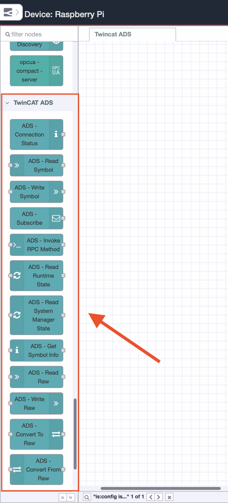
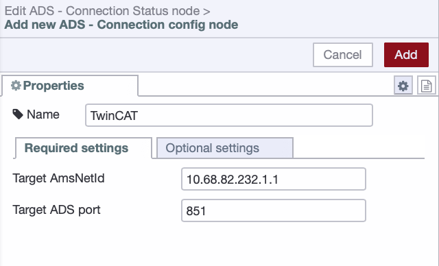
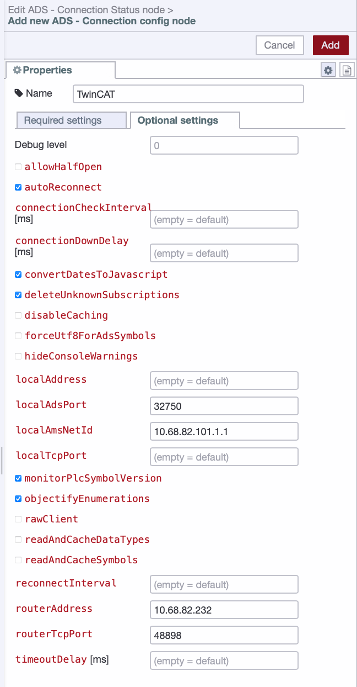
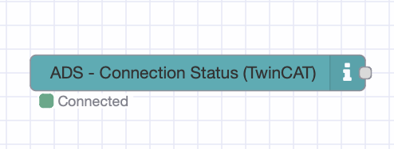
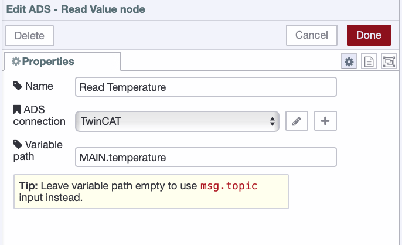
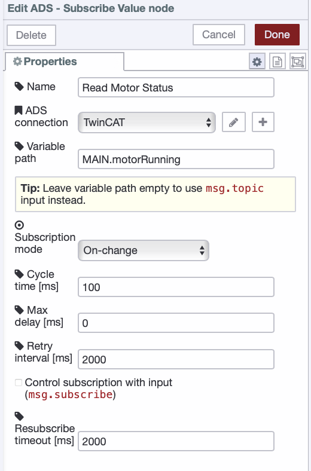
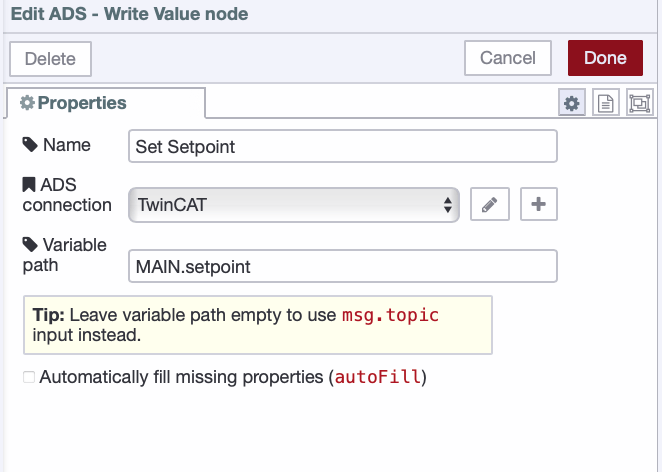
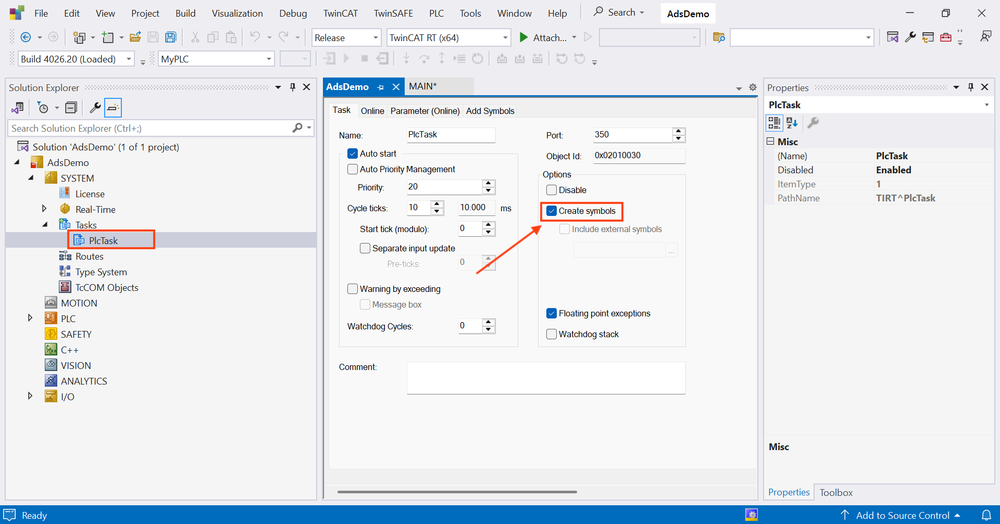

Beckhoff TwinCAT is one of the most widely deployed PLC platforms in industrial automation. ADS, its native communication protocol, gives you direct read and write access to PLC variables without additional licensing or middleware, and connecting from FlowFuse means tapping into that same channel TwinCAT uses internally.

<!--more-->

The challenge is usually not the tooling. It is the routing layer. AMS Net IDs, route tables, firewall rules. Get any of those wrong and ADS fails without telling you why. This guide covers the routing first, before touching a single FlowFuse node, because that is where most people get stuck.

By the end you will have live TwinCAT variables flowing into [FlowFuse](/).

## Prerequisites

Before you begin, make sure you have the following in place:

- TwinCAT 3.1 runtime running on a Beckhoff IPC
- FlowFuse running on an edge device with network access to the TwinCAT machine. If you don't have an account yet, [sign up]() to get started, then [follow this guide to quickly run a FlowFuse instance on your edge device](/blog/2025/09/installing-node-red/).
- Both devices on the same network
- Port 48898 open between the two devices
- [Symbol creation](#enable-symbol-creation) enabled on PlcTask so variables are accessible by name over ADS
- PLC logged in and deployed on port 851
- PLC in Run mode — the TwinCAT system tray icon must be green
- Symbol paths of the variables you want to read or write, available from whoever wrote the PLC program

> If you don't have a real PLC available and want to follow along with a test setup, see
> [Setting Up a Test PLC](#setting-up-a-test-plc) at the end of this guide before continuing.

## What is ADS and Why It Matters

ADS, Automation Device Specification, is not an integration layer Beckhoff added for external tools. It is the internal communication backbone of the TwinCAT runtime itself. The same protocol TwinCAT XAE uses when you go online with a PLC, the same one the HMI uses to read variables, the same one the NC task uses to talk to the PLC task. When you connect from FlowFuse, you are using that same channel.

Every TwinCAT device has an AMS Net ID. It looks like an IP address with two extra octets: `10.68.82.232.1.1`. The first four typically match the device IP, the last two are almost always `1.1` by convention. This is how the ADS router identifies devices on the network, and it is what you will configure in every connection you make from FlowFuse.

Within a device, different TwinCAT components are reachable on different ADS ports. The PLC runtime listens on port `851` by default. If your machine runs multiple PLC tasks, each task gets its own port: the first task is `851`, the second is `852`, and so on. Check with the controls engineer which port corresponds to the task containing your variables.

Three things cause silent failures: wrong AMS Net ID, missing route, blocked port 48898. ADS gives you nothing when any of these are wrong. No error, no timeout message, just silence. That is why we cover routing before touching a single FlowFuse node.

## Configuring ADS Routes

TwinCAT will not accept an ADS connection from an unknown host. Every external device that needs to connect must be explicitly trusted in TwinCAT's route table. This is stored in a file called `StaticRoutes.xml` on the TwinCAT machine.

TwinCAT provides a route manager in the system tray under **Router > Edit Routes**. However it does not expose the Flags setting, which defaults to `64` and will silently block connections from non-Windows devices such as Linux or Mac based edge devices. Editing `StaticRoutes.xml` directly is the only way to set Flags to `0`, which allows connections from any trusted device on your network.

Before adding the route you need two pieces of information:

- The IP address of your FlowFuse edge device
- The AMS Net ID you will assign to it, which is the IP address with `.1.1` appended

For example if your FlowFuse device IP is `10.68.82.101`, its AMS Net ID is `10.68.82.101.1.1`.

> **Important:** Your FlowFuse edge device must be on the same network as the interface TwinCAT's AMS Net ID is bound to. TwinCAT binds its AMS Net ID to a specific network interface on startup. If your machine has multiple network interfaces, confirm which IP the AMS Net ID uses — you can find it by right clicking the TwinCAT tray icon and selecting **About TwinCAT System**. Your FlowFuse device must be reachable on that same network, otherwise the ADS handshake will fail even if port 48898 is open.

**Edit StaticRoutes.xml:**

> If you do not have direct access to the TwinCAT machine, ask the controls engineer or machine builder to make this change. Share this section with them so they know exactly what needs to be set, particularly the `Flags` value of `0`.

> **Warning:** The PowerShell command below overwrites the entire `StaticRoutes.xml` file. If the TwinCAT machine already has existing routes configured, back up the file before running this command or add your route entry manually inside the existing `<RemoteConnections>` block instead.

1. On the TwinCAT machine open PowerShell as administrator
2. Run the following command, replacing `YOUR_EDGE_DEVICE_IP` with the actual IP of your FlowFuse device:

```powershell
$xml = @"
<?xml version="1.0"?>
<TcConfig xmlns:xsi="http://www.w3.org/2001/XMLSchema-instance">
  <RemoteConnections>
    <Route>
      <Name>flowfuse-edge</Name>
      <Address>YOUR_EDGE_DEVICE_IP</Address>
      <NetId>YOUR_EDGE_DEVICE_IP.1.1</NetId>
      <Type>TCP_IP</Type>
      <Flags>0</Flags>
    </Route>
  </RemoteConnections>
</TcConfig>
"@
$xml | Set-Content "C:\Program Files (x86)\Beckhoff\TwinCAT\3.1\Target\StaticRoutes.xml"
```
> Note: In this example, TwinCAT 3.1 is installed. If you are using a different version, replace 3.1 with the version installed on your system. The installation path may also vary depending on your TwinCAT setup.

3. Restart the TwinCAT router from the system tray by right clicking the TwinCAT icon and selecting **Router > Restart**.
4. Open the Windows Firewall and confirm that port 48898 is allowed for inbound TCP connections.

After the router restarts, verify that port 48898 is reachable from your FlowFuse edge device by running `nc -zv <twincat-ip> 48898`. If the connection is refused, confirm the firewall rule was saved and that both devices are on the same subnet.

## Installing node-red-contrib-ads-client in FlowFuse

1. In your FlowFuse instance open the Node-RED editor
2. Click the hamburger menu in the top right and select **Manage Palette**
3. Go to the **Install** tab
4. Search for `node-red-contrib-ads-client`
5. Click **Install** and wait for it to complete
6. Click **Close**

Once the installation is complete, a few nodes will appear in the right-hand palette under the TwinCAT ADS category.



## Connecting to TwinCAT

**Add the connection node:**

1. In Node-RED drag an **ADS – Connection Status** node onto the canvas
2. Double click it to open the configuration
3. Next to the **Connection** field click **+** to create a new connection
4. In the **Required Settings** tab fill in the Target AMS Net ID and Target ADS Port:

| Field             | Value                                                        |
| ----------------- | ------------------------------------------------------------ |
| Target AMS Net ID | AMS Net ID of your TwinCAT machine, e.g. `10.68.82.232.1.1` |
| Target ADS Port   | `851`                                                        |



5. Switch to the **Optional Settings** tab and fill in the network settings:

| Field            | Value                                                             |
| ---------------- | ----------------------------------------------------------------- |
| Router Address   | IP address of your TwinCAT machine, e.g. `10.68.82.232`           |
| Router TCP Port  | `48898`                                                           |
| Local AMS Net ID | AMS Net ID of your FlowFuse edge device, e.g. `10.68.82.101.1.1` |
| Local ADS Port   | `32750`                                                           |



The **Router Address** and **Router TCP Port** allow the ADS client to reach the TwinCAT router over the network. The **Local AMS Net ID** identifies your FlowFuse edge device inside the ADS routing system and must match the route configured in `StaticRoutes.xml`. The **Local ADS Port** defines the local ADS endpoint used by the client and normally does not need to be changed.

> **Note:** If your TwinCAT system is in config mode or the PLC runtime takes time to initialize on startup, enable **Allow Half Open** in the connection settings. Without it the client performs a strict system state check on connect and will fail with ADS error 7 even if the router is reachable. With it enabled the client connects regardless and waits for the runtime to become ready.

6. Click **Add** to save the connection configuration
7. Click **Done**
8. Click **Deploy**

Within a few seconds the connection status node should show **connected**, indicating that FlowFuse successfully established an ADS session with the TwinCAT runtime.



## Reading PLC Variables

With the connection working, reading a variable takes three nodes: an inject node to trigger the read, a read value node to fetch the value, and a debug node to see the output.

1. Drag an **inject** node onto the canvas
2. Double click it and leave the default settings so it triggers manually
3. Click **Done**
4. Drag an **ADS - Read Value** node onto the canvas
5. Double click it to configure
6. Select your TwinCAT connection from the **Connection** dropdown
7. Set the **Variable name** to the full symbol path of the variable you want to read. Symbol paths are always in the format `ProgramName.VariableName`. If you are following along with the test PLC, use `MAIN.temperature`. If you are connecting to a real PLC, use the symbol paths provided by the controls engineer.



8. Click **Done**

9. Drag a **debug** node onto the canvas
10. Connect the inject node output to the read value node input
11. Connect the read value node output to the debug node input
12. Click **Deploy**

Click the inject button. You should see the variable value appear in the debug panel.

<lite-youtube
  videoid="wTRmgIyWLyk"
  style="width: 1024px; overflow: hidden; background-image: url('/blog/2026/03/images/ads-read.png'); background-size: cover; background-position: center;"
  title="Reading TwinCAT PLC Variables with FlowFuse">
</lite-youtube>

## Subscribing to Variable Changes

Polling on a fixed timer works but is inefficient. For live data the better approach is to subscribe to variable changes. TwinCAT sends a new value to FlowFuse only when the value actually changes, which reduces unnecessary network traffic and gives you lower latency updates.

1. Drag an **ADS - Subscribe Value** node onto the canvas
2. Double click it to configure
3. Select your TwinCAT connection from the **Connection** dropdown
4. Set the **Variable name** to the full symbol path of the variable you want to monitor. If you are following along with the test PLC, use `MAIN.motorRunning` — it toggles roughly once per second so you will see true and false values arriving in the debug panel without being overwhelmed.
5. Set the **Subscription mode** to **On Change**. This tells the TwinCAT runtime to notify FlowFuse only when the variable value has actually changed, rather than pushing the value on every cycle regardless of whether it changed. If you need a value delivered at a fixed interval even when unchanged, use **Cyclic** instead.
6. Set the **Cycle time** to `100` milliseconds. This is how frequently TwinCAT checks for changes on its side.



7. Click **Done**
8. Connect its output to a debug node
9. Click **Deploy**

The debug node will now receive a message every time the variable value changes in the PLC, with no polling required from FlowFuse.

<lite-youtube
  videoid="JYrzRXCHb9Q"
  style="width: 1024px; overflow: hidden; background-image: url('/blog/2026/03/images/ads-subscribe-image.png'); background-size: cover; background-position: center;"
  title="Subscribing to TwinCAT PLC Variable Changes with FlowFuse">
</lite-youtube>

## Writing to PLC Variables

Writing back to the PLC closes the loop. This is useful for sending setpoints, commands, or reset signals from FlowFuse back to TwinCAT.

1. Drag an **ADS - Write Value** node onto the canvas
2. Double click it to configure
3. Select your TwinCAT connection
4. Set the **Variable name** to the full symbol path of the variable you want to write to. If you are following along with the test PLC, use `MAIN.setpoint`.
5. Leave **Automatically fill missing properties (autoFill)** unchecked. This setting only applies when writing complex types such as structs or function blocks — it reads the current value from the PLC first and merges your changes on top so unspecified fields are not zeroed out. For a simple variable like `MAIN.setpoint` it has no effect.



6. Click **Done**

7. Drag an **inject** node onto the canvas
8. Double click it and set the payload type to match the type of your PLC variable. The payload type must match what the PLC expects — a **Number** for INT or REAL, a **boolean** for BOOL, a **string** for STRING, and so on. If you are following along with the test PLC, `setpoint` is declared as INT so set the payload type to **Number**.
9. Click **Done**

10. Connect the inject node output to the write node input
11. Click **Deploy**
12. Click the inject button to trigger the write

To verify the write worked, add a read value node for the same variable and check that the value updated in the debug panel.

<lite-youtube
  videoid="f0GtEp6OA_M"
  style="width: 1024px; overflow: hidden; background-image: url('/blog/2026/03/images/ads-write-image.png'); background-size: cover; background-position: center;"
  title="Writing to TwinCAT PLC Variables with FlowFuse">
</lite-youtube>

## Troubleshooting

- **Connection fails silently with no error**
The FlowFuse device IP is not in `StaticRoutes.xml` or `Flags` is set to `64` instead of `0`. Edit the file using the PowerShell command in the routing section, then restart the TwinCAT router.

- **ADS error 7: Target machine not found**
The most common cause is that your FlowFuse device and the TwinCAT machine are not on the same network as the interface TwinCAT's AMS Net ID is bound to. Check the AMS Net ID in **About TwinCAT System** on the TwinCAT machine and confirm your FlowFuse device has an IP on that same subnet. Also confirm the FlowFuse device IP is in `StaticRoutes.xml` with `Flags` set to `0`, and that the router was restarted after any changes. If the PLC runtime takes time to initialize on startup, enable **Allow Half Open** in the connection node.

- **Error: Connection to 127.0.0.1:48898 failed**
The Router Address field in the connection node is empty or incorrect. Open the connection node, set the Router Address to the TwinCAT machine IP, and redeploy.

- **Error 1808: Symbol not found**
The variable name is wrong or does not exist in the PLC program. Double check the full symbol path including the program name prefix, for example `MAIN.temperature`. If you are using the test PLC, make sure symbol creation is enabled in PlcTask and the PLC is in Run mode.

- **Error 1804: Failed to get fingerprint**
The FlowFuse device IP is missing from `StaticRoutes.xml` or the TwinCAT router was not restarted after editing the file.

- **Port 48898 not reachable**
Port 48898 is blocked on the TwinCAT machine firewall or the two devices are not on the same network. Confirm the firewall rule is in place and test reachability with `nc -zv <twincat-ip> 48898` from your FlowFuse device.

- **PLC variables not updating**
The PLC is not in Run mode. The TwinCAT system tray icon must be green. A blue icon means the runtime is stopped — right click the tray icon and select **Restart TwinCAT (Run Mode)**.

## Setting Up a Test PLC

This section is for readers who do not have a real TwinCAT PLC available and want to set up a minimal test environment to follow along with this guide. If you already have a PLC running, you do not need this section.

### What You Need

- A Windows machine or laptop
- TwinCAT XAE Shell installed. Download it from the [Beckhoff website](https://www.beckhoff.com)

> **Important:** If your Windows machine has Hyper-V enabled, TwinCAT will not run in KM mode and the system tray icon will stay blue instead of turning green. Make sure Hyper-V is disabled before proceeding. You may need to restart the machine after disabling it.

### Create the Project

1. Open TwinCAT XAE Shell
2. Click **File > New > Project**
3. Select **TwinCAT Projects** then **TwinCAT XAE Project**
4. Give the project a name, for example `AdsDemo`, and click **OK**

### Add a PLC Project

5. In Solution Explorer right click the project name and select **Add New Item**
6. Select **Standard PLC Project**, give it a name, and click **Add**

### Write the PLC Program

7. In Solution Explorer expand **PLC > your project > POUs** and double click **MAIN**
8. In the declaration section (top panel) replace the existing content with:
```
PROGRAM MAIN
VAR
    temperature : REAL := 23.5;
    motorRunning : BOOL := FALSE;
    setpoint : INT := 100;
    cycleCount : INT := 0;
END_VAR
```

9. In the program body (bottom panel) add:
```
temperature := temperature + 0.1;
IF temperature > 100.0 THEN
    temperature := 0.0;
END_IF

cycleCount := cycleCount + 1;
IF cycleCount >= 1000 THEN
    motorRunning := NOT motorRunning;
    cycleCount := 0;
END_IF
```

This gives you three live variables to work with. `temperature` increments continuously every PLC cycle, `motorRunning` toggles roughly once per second, and `setpoint` stays static until you write to it from FlowFuse.

### Enable Symbol Creation

Symbol creation must be enabled for ADS to access variables by name. Without this step the ADS client will connect successfully but fail to find any variables.

10. In Solution Explorer expand the project, then under **Task** double click **PlcTask**
11. Check **Create symbols** in the properties window that opens
12. Click **OK**



### Build and Activate

13. Press **Ctrl+Shift+B** to build the project. Check the output window for any errors before continuing.
14. Right click the PLC instance in Solution Explorer and select **Login**

> **Note:** If Login is not visible in the right click menu, find it in the top menu bar under **PLC > Login**.

15. When TwinCAT prompts you to create the application on port 851, click **Yes**. Do not skip this step or change the port.
16. Press **F5** to start the PLC

The TwinCAT system tray icon must be green before you proceed. A blue icon means the runtime is not running and ADS connections will fail.

Your test PLC is now running. Go back to the [Configuring ADS Routes](#configuring-ads-routes) section and continue from there. The variable paths you will use throughout this guide are `MAIN.temperature`, `MAIN.motorRunning`, and `MAIN.setpoint`.

## Conclusion

You now have a working ADS connection between FlowFuse and TwinCAT, reading variables on demand, subscribing to live changes, and writing values back to the PLC. But this is just the starting point.

This guide covered the core nodes to get you connected and working. The `node-red-contrib-ads-client` package includes several other nodes worth exploring on your own, and future articles will cover more advanced use cases in depth.

With FlowFuse you can take this further. Build real-time dashboards that visualize live PLC data, connect TwinCAT to other systems like databases, ERP, or cloud platforms, set up alerts when variables go out of range, and create operator interfaces that let your team interact with the machine from anywhere. All of it built on the same connection you just configured, without writing a single line of custom integration code.

If you have questions or need help getting set up, [contact us](/contact-us/) and we are happy to help.
