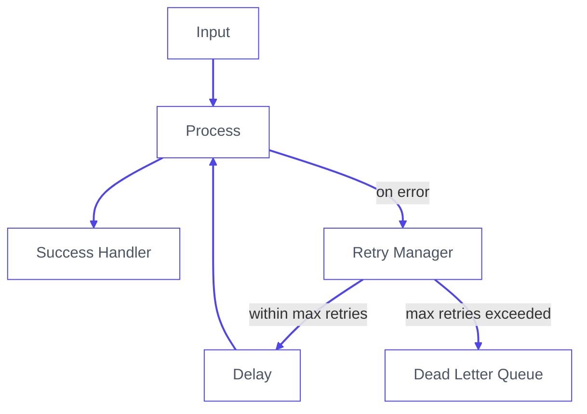

Somewhere in your IIoT pipeline, a message just failed. You don't know which one. You don't know when. And unless you have a Dead Letter Queue, you never will.

<!--more-->

In industrial environments, failure is not the exception. It is the contract. Networks partition. APIs rate-limit. A sensor alert fires at the wrong moment and vanishes without a trace. And unlike consumer applications, missed messages in manufacturing have a real cost.

Dead Letter Queues and retry strategies exist precisely for this. This guide covers both. You will walk away with a production-ready pattern for catching failed messages, retrying them with exponential backoff, and routing the unrecoverable ones into a DLQ where they can be inspected, replayed, or discarded on your terms.

## What Is a Dead Letter Queue?

A Dead Letter Queue is a holding area for messages that could not be delivered. When a message fails processing and has no path forward, it gets routed to the DLQ instead of being dropped or causing your flow to crash.

A message ends up in a DLQ for four reasons. It exceeded the maximum number of retry attempts. It is malformed and cannot be parsed. The target system is permanently unavailable. Or a business rule explicitly rejected it.

The value of a DLQ is not just storage. It is observability. Every failed message arrives with its full payload, error reason, retry history, and timestamps intact. You know exactly what failed, when it failed, and how many times it was attempted before giving up. That information is what makes recovery possible.

Without a DLQ, failed messages disappear silently. With one, failure becomes something you can inspect, act on, and fix.

## The Retry Pattern: Exponential Backoff

Before a message earns its place in the DLQ, you should try, and try again. But naive retries are dangerous. Hammering a failing service every 100ms does not give it time to recover. It makes things worse for everyone.

The industry standard is **exponential backoff with jitter**:

```
delay = min(base * 2^attempt, max_delay) + random_jitter
```

| Attempt | Base Delay | With Jitter (approx.) |
|---------|-----------|----------------------|
| 1       | 1s        | 1.2s                 |
| 2       | 2s        | 2.5s                 |
| 3       | 4s        | 4.1s                 |
| 4       | 8s        | 8.9s                 |
| 5       | —         | → DLQ               |

The jitter prevents the **thundering herd problem**, where every failed client retries at exactly the same moment and overloads the service all over again.

## Building It

In this section, we'll build this pattern in Node-RED step by step.

Node-RED is the de facto standard for IIoT flow-based programming, and FlowFuse is the recommended way to run it in production. It gives you managed deployments, team collaboration, and enterprise-grade support, all built around Node-RED. [Start a free trial here](). Everything in this guide works on standalone Node-RED too.

The architecture has five components:

1. Retry state initializer
2. Catch node for centralized error handling
3. Retry manager with exponential backoff
4. Delay node for controlled retries
5. Dead Letter Queue backed by SQLite

Here's how they connect:



Every step below maps directly to one part of that diagram. Follow it in order.

### Step 1: Initialize Retry State

This function node runs once when a fresh message enters the pipeline. It attaches retry metadata to `msg` so every downstream node knows where the message stands.

1. Drag a **function node** onto the canvas.
2. Double-click it to open its settings.
3. In the **Name** field, enter `Init Retry State`.
4. In the **Function** tab, paste the following code:

```javascript
msg._originalPayload = RED.util.cloneMessage(msg.payload);

if (!msg._retry) {
    msg._retry = {
        attempts: 0,
        maxAttempts: 5,
        lastError: null,
        originalTimestamp: new Date().toISOString(),
        topic: msg.topic
    };
}

return msg;
```

5. Click **Done**.

Two things are happening here worth noting. First, `msg._originalPayload` saves a deep clone of the original payload using `RED.util.cloneMessage` before anything touches it. A plain assignment (`= msg.payload`) would only copy a reference — if a downstream node mutates the object in place, the saved copy changes too. `cloneMessage` ensures the DLQ always holds the payload exactly as it arrived. Some nodes — like the HTTP Request node — also overwrite `msg.payload` with their response body, so this clone is what gets stored in the DLQ later. Second, the `if (!msg._retry)` check ensures initialization only runs on a fresh message. When the retry loop sends the message back through, this block is skipped entirely and the existing retry state is preserved. The underscore prefix on `msg._retry` also protects it from being overwritten by processing nodes.

### Step 2: Add a Catch Node

The catch node monitors your processing nodes and intercepts any message that causes an error, routing it to the retry logic instead of letting it disappear.

Scoping it to `All nodes` is tempting but dangerous. If any node in the retry infrastructure itself throws — for example, the Retry Manager calling `node.error()` — the catch node will intercept it and feed it back into the retry loop, creating an infinite loop. Scoping it explicitly to your processing nodes prevents this.

1. Drag a **catch node** onto the canvas.
2. Double-click it to open its settings.
3. In the **Name** field, enter `Catch Errors`.
4. Set **Catch errors from** to `Selected nodes`.
5. Select only the nodes that do actual processing work — in this pattern, that is your **HTTP Request** node and your **Check Response** function node.
6. Click **Done**.

Next, add a normalization step between the catch node and the retry manager. Node-RED's built-in nodes sometimes attach `msg.error` as an object rather than a string, which causes problems downstream. This function node converts it to a consistent string format.

1. Drag a **function node** onto the canvas.
2. Double-click it to open its settings.
3. In the **Name** field, enter `Normalize Error`.
4. In the **Function** tab, paste:

```javascript
msg.retry = msg._retry;

if (typeof msg.error === 'object') {
    msg.error = msg.error.message || JSON.stringify(msg.error);
}

msg.error = msg.error || 'Processing failed';
return msg;
```

5. Click **Done**.
6. Wire the **catch node** output → **Normalize Error** input.

### Step 3: Add the Retry Manager

This is the decision node. It increments the attempt count, calculates the backoff delay, and routes the message either back into the pipeline for another try or forward to the DLQ if retries are exhausted.

1. Drag a **function node** onto the canvas.
2. Double-click it to open its settings.
3. In the **Name** field, enter `Retry Manager`.
4. Go to the **Setup** tab and set **Outputs** to `2`. This gives the node two output ports — one for retrying, one for the DLQ.
5. Go to the **Function** tab and paste:

```javascript
const MAX_ATTEMPTS = msg.retry.maxAttempts || 5;
const BASE_DELAY_MS = 1000;
const MAX_DELAY_MS = 30000;

msg.retry.attempts += 1;
msg.retry.lastError = msg.error || 'Unknown error';
msg.retry.lastAttemptAt = new Date().toISOString();

// keep _retry in sync
msg._retry = msg.retry;

if (msg.retry.attempts >= MAX_ATTEMPTS) {
    msg.retry.exhausted = true;
    msg.dlq = {
        reason: 'Max retries exceeded',
        attempts: msg.retry.attempts,
        lastError: msg.retry.lastError,
        deadAt: new Date().toISOString()
    };
    return [null, msg];
}

const exponential = BASE_DELAY_MS * Math.pow(2, msg.retry.attempts - 1);
const jitter = Math.random() * 1000;
const delay = Math.min(exponential + jitter, MAX_DELAY_MS);

msg.delay = Math.round(delay);

node.status({
    fill: 'yellow',
    shape: 'ring',
    text: `Retry ${msg.retry.attempts}/${MAX_ATTEMPTS} in ${Math.round(delay / 1000)}s`
});

return [msg, null];
```

6. Click **Done**.
7. Wire the **Normalize Error** output → **Retry Manager** input.

`return [msg, null]` sends the message out of **Output 1** (retry path). `return [null, msg]` sends it out of **Output 2** (DLQ path). No switch node is needed — the routing is built into the return statement.

### Step 4: Add the Delay Node

The delay node holds the message for the calculated backoff period before it re-enters the pipeline. Without this, retries fire instantly and you are hammering an already-struggling service.

1. Drag a **delay node** onto the canvas.
2. Double-click it to open its settings.
3. In the **Name** field, enter `Backoff Delay`.
4. Set **Action** to `Delay each message`.
5. Set **For** to `Override delay with msg.delay`. This tells the node to use the backoff value the Retry Manager calculated rather than a fixed duration.
6. Click **Done**.
7. Wire **Retry Manager Output 1** → **Backoff Delay** input.

Each pass through the loop, the delay gets longer — roughly 1 second on the first retry, 2 seconds on the second, 4 on the third, and so on. When the Retry Manager decides retries are exhausted, it stops sending to Output 1 entirely and routes to Output 2 instead, ending the loop.

Wire **Backoff Delay** output → your processing node input (the HTTP Request node). This completes the retry loop.

### Step 5: Set Up the DLQ Handler

When a message reaches this stage, retries are finished. The goal now is to preserve everything: the original payload, the error reason, how many attempts were made, and the timestamp. That context is what makes later recovery possible.

#### 5a: Install the SQLite Node

1. In the Node-RED editor, click the **menu icon** (top-right hamburger menu).
2. Select **Manage palette**.
3. Go to the **Install** tab.
4. Search for `node-red-node-sqlite`.
5. Click **Install** next to the result and confirm.
6. Wait for the install to complete, then click **Close**.

#### 5b: Create the Database Table

This step runs once on deploy to create the DLQ table if it does not already exist.

1. Drag an **inject node** onto the canvas.
2. Double-click it to open its settings.
3. In the **Name** field, enter `Create Table on Deploy`.
4. Under **Inject once after**, tick the checkbox and set the delay to `0.1` seconds. This makes it run automatically on deploy.
5. Remove all properties from the **msg** list (click the `x` next to each). No payload is needed — just the trigger.
6. Click **Done**.

Now add the SQLite node:

1. Drag a **sqlite node** onto the canvas.
2. Double-click it to open its settings.
3. In the **Name** field, enter `Create DLQ Table`.
4. Next to **Database**, click the pencil icon to create a new database config. Set the path to `/data/node-red-dlq.db` and click **Add**.
5. Set **SQL Query** to `Fixed statement`.
6. Paste the following into the SQL field:

```sql
CREATE TABLE IF NOT EXISTS dlq (
  id TEXT PRIMARY KEY,
  topic TEXT,
  payload TEXT,
  attempts INTEGER,
  last_error TEXT,
  captured_at TEXT
)
```

7. Click **Done**.
8. Wire the **Create Table on Deploy** inject node → **Create DLQ Table** sqlite node.

#### 5c: Build the Insert Flow

This is the path a message takes when retries are exhausted. A change node assembles the SQL parameters, then a sqlite node writes the record.

1. Drag a **change node** onto the canvas.
2. Double-click it to open its settings.
3. In the **Name** field, enter `Build DLQ Params`.
4. Add the following rules one at a time using the **+ add** button:

| Action | Target | Value type | Value |
|--------|--------|------------|-------|
| Set | `msg.params` | JSON | `{}` |
| Set | `msg.params.$id` | msg | `_msgid` |
| Set | `msg.params.$topic` | msg | `retry.topic` |
| Set | `msg.params.$payload` | JSONata | `$string(_originalPayload)` |
| Set | `msg.params.$attempts` | msg | `retry.attempts` |
| Set | `msg.params.$last_error` | msg | `retry.lastError` |
| Set | `msg.params.$captured_at` | JSONata | `$now()` |

5. Click **Done**.

Now add the insert node:

1. Drag a **sqlite node** onto the canvas.
2. Double-click it to open its settings.
3. In the **Name** field, enter `Insert DLQ Record`.
4. For **Database**, select the same `/data/node-red-dlq.db` config created in Step 5b.
5. Set **SQL Query** to `Prepared statement`.
6. Paste the following SQL:

```sql
INSERT OR REPLACE INTO dlq 
  (id, topic, payload, attempts, last_error, captured_at) 
  VALUES ($id, $topic, $payload, $attempts, $last_error, $captured_at)
```

7. Click **Done**.

Finally, wire everything together:

1. **Retry Manager Output 2** → **Build DLQ Params** input.
2. **Build DLQ Params** output → **Insert DLQ Record** input.

Each property in `msg.params` maps directly to a column. `INSERT OR REPLACE` ensures a message that appears multiple times (for example, if a flow is restarted mid-retry) does not create duplicate rows — it overwrites cleanly on the same `id`.

## Putting It All Together: Simulation

The best way to understand the pattern is to watch it work. This simulation models a temperature sensor publishing readings to an HTTP API every 5 seconds. The mock API is deliberately configured to fail 80% of the time so you can watch the full cycle in action: messages attempting delivery, retrying with increasing delays, and after 5 failed attempts landing permanently in SQLite.

Import the flow below directly into Node-RED. It contains everything: the sensor, the mock API, the retry logic, the DLQ handler, and a query button to inspect what landed in the database.

> **Note:** In the simulation, the retry state initialization from Step 1 is folded directly into the **Simulate Reading** function node rather than existing as a separate node. In a real deployment you would keep them separate as described in the tutorial.


[{"id":"53436d0ba3b491ab","type":"group","z":"b413f96e006352db","name":"Create Table","style":{"label":true},"nodes":["01b3c93eae84bed3","7fb4ee9b1ebe15fd"],"x":54,"y":39,"w":552,"h":82},{"id":"01b3c93eae84bed3","type":"inject","z":"b413f96e006352db","g":"53436d0ba3b491ab","name":"Create Table on Deploy","props":[],"repeat":"","crontab":"","once":true,"onceDelay":0.1,"topic":"","x":210,"y":80,"wires":[["7fb4ee9b1ebe15fd"]]},{"id":"7fb4ee9b1ebe15fd","type":"sqlite","z":"b413f96e006352db","g":"53436d0ba3b491ab","mydb":"dlq-db","sqlquery":"fixed","sql":"CREATE TABLE IF NOT EXISTS dlq (id TEXT PRIMARY KEY, topic TEXT, payload TEXT, attempts INTEGER, last_error TEXT, captured_at TEXT)","name":"Create DLQ Table","x":490,"y":80,"wires":[[]]},{"id":"dlq-db","type":"sqlitedb","db":"/data/node-red-dlq.db","mode":"RWC"},{"id":"c116dc0c1fa4a32f","type":"group","z":"b413f96e006352db","name":"Query DLQ Records","style":{"label":true},"nodes":["845cf6028b149512","6873c709903585f1","53e009f96b4a5ca9"],"x":54,"y":559,"w":692,"h":82},{"id":"845cf6028b149512","type":"inject","z":"b413f96e006352db","g":"c116dc0c1fa4a32f","name":"Click to see DLQ records","props":[],"repeat":"","crontab":"","once":true,"onceDelay":0.1,"topic":"","x":210,"y":600,"wires":[["6873c709903585f1"]]},{"id":"6873c709903585f1","type":"sqlite","z":"b413f96e006352db","g":"c116dc0c1fa4a32f","mydb":"dlq-db","sqlquery":"fixed","sql":"SELECT * FROM dlq;","name":"Query DLQ Table","x":470,"y":600,"wires":[["53e009f96b4a5ca9"]]},{"id":"53e009f96b4a5ca9","type":"debug","z":"b413f96e006352db","g":"c116dc0c1fa4a32f","name":"Result","active":true,"tosidebar":true,"console":false,"tostatus":false,"complete":"payload","targetType":"msg","statusVal":"","statusType":"auto","x":650,"y":600,"wires":[]},{"id":"72f15282184a54ca","type":"group","z":"b413f96e006352db","name":"DLQ Implementation","style":{"label":true},"nodes":["165241b144b46929","b79db655339d8779","dadae9fef0a5f19a","56a900e76b026c61","fc34edcdfc399737","f75110c6f00c9ddf","65f85692f7da3657","1a789f634e489ccd","10fe0602b87b0cef","619c82beec0ba73f","40c9842fb89d9742","19b8e1175154fd49"],"x":54,"y":239,"w":1652,"h":202},{"id":"165241b144b46929","type":"http request","z":"b413f96e006352db","g":"72f15282184a54ca","name":"POST /ingest","method":"POST","ret":"obj","url":"http://localhost:1880/ingest","x":1150,"y":300,"wires":[["b79db655339d8779"]]},{"id":"b79db655339d8779","type":"function","z":"b413f96e006352db","g":"72f15282184a54ca","name":"Check Response","func":"// restore retry state from protected property\nmsg.retry = msg._retry;\n\nif (msg.statusCode !== 200) {\n    msg.error = `API returned ${msg.statusCode}`;\n    node.error(msg.error, msg);\n    return null;\n}\n\nreturn msg;","outputs":1,"timeout":"","noerr":0,"initialize":"","finalize":"","libs":[],"x":1350,"y":300,"wires":[["dadae9fef0a5f19a"]]},{"id":"dadae9fef0a5f19a","type":"debug","z":"b413f96e006352db","g":"72f15282184a54ca","name":"Success","active":true,"tosidebar":true,"console":false,"tostatus":false,"complete":"payload","x":1540,"y":300,"wires":[]},{"id":"56a900e76b026c61","type":"catch","z":"b413f96e006352db","g":"72f15282184a54ca","name":"Catch Errors","scope":["165241b144b46929","b79db655339d8779"],"uncaught":false,"x":150,"y":360,"wires":[["fc34edcdfc399737"]]},{"id":"fc34edcdfc399737","type":"function","z":"b413f96e006352db","g":"72f15282184a54ca","name":"Normalize Error","func":"msg.retry = msg._retry;\n\nif (typeof msg.error === 'object') {\n    msg.error = msg.error.message || JSON.stringify(msg.error);\n}\n\nmsg.error = msg.error || 'Processing failed';\nreturn msg;","outputs":1,"x":340,"y":360,"wires":[["f75110c6f00c9ddf"]]},{"id":"f75110c6f00c9ddf","type":"function","z":"b413f96e006352db","g":"72f15282184a54ca","name":"Retry Manager","func":"const MAX_ATTEMPTS = msg.retry.maxAttempts || 5;\nconst BASE_DELAY_MS = 1000;\nconst MAX_DELAY_MS = 30000;\n\nmsg.retry.attempts += 1;\nmsg.retry.lastError = msg.error || 'Unknown error';\nmsg.retry.lastAttemptAt = new Date().toISOString();\n\n// keep _retry in sync\nmsg._retry = msg.retry;\n\nif (msg.retry.attempts >= MAX_ATTEMPTS) {\n    msg.retry.exhausted = true;\n    msg.dlq = {\n        reason: 'Max retries exceeded',\n        attempts: msg.retry.attempts,\n        lastError: msg.retry.lastError,\n        deadAt: new Date().toISOString()\n    };\n    return [null, msg];\n}\n\nconst exponential = BASE_DELAY_MS * Math.pow(2, msg.retry.attempts - 1);\nconst jitter = Math.random() * 1000;\nconst delay = Math.min(exponential + jitter, MAX_DELAY_MS);\n\nmsg.delay = Math.round(delay);\n\nnode.status({\n    fill: 'yellow',\n    shape: 'ring',\n    text: `Retry ${msg.retry.attempts}/${MAX_ATTEMPTS} in ${Math.round(delay / 1000)}s`\n});\n\nreturn [msg, null];","outputs":2,"x":540,"y":360,"wires":[["65f85692f7da3657"],["10fe0602b87b0cef"]]},{"id":"65f85692f7da3657","type":"delay","z":"b413f96e006352db","g":"72f15282184a54ca","name":"Backoff Delay","pauseType":"delayv","timeout":"1","timeoutUnits":"seconds","rate":"1","nbRateUnits":"1","rateUnits":"second","randomFirst":"1","randomLast":"5","randomUnits":"seconds","drop":false,"outputs":1,"x":760,"y":340,"wires":[["1a789f634e489ccd"]]},{"id":"1a789f634e489ccd","type":"change","z":"b413f96e006352db","g":"72f15282184a54ca","name":"Restore Payload","rules":[{"t":"set","p":"payload","pt":"msg","to":"_originalPayload","tot":"msg"}],"x":960,"y":300,"wires":[["165241b144b46929"]]},{"id":"10fe0602b87b0cef","type":"change","z":"b413f96e006352db","g":"72f15282184a54ca","name":"Build DLQ Params","rules":[{"t":"set","p":"params","pt":"msg","to":"{}","tot":"json"},{"t":"set","p":"params.$id","pt":"msg","to":"_msgid","tot":"msg"},{"t":"set","p":"params.$topic","pt":"msg","to":"retry.topic","tot":"msg"},{"t":"set","p":"params.$payload","pt":"msg","to":"$string(_originalPayload)","tot":"jsonata"},{"t":"set","p":"params.$attempts","pt":"msg","to":"retry.attempts","tot":"msg"},{"t":"set","p":"params.$last_error","pt":"msg","to":"retry.lastError","tot":"msg"},{"t":"set","p":"params.$captured_at","pt":"msg","to":"$now()","tot":"jsonata"}],"x":770,"y":400,"wires":[["619c82beec0ba73f"]]},{"id":"619c82beec0ba73f","type":"sqlite","z":"b413f96e006352db","g":"72f15282184a54ca","mydb":"dlq-db","sqlquery":"prepared","sql":"INSERT OR REPLACE INTO dlq (id, topic, payload, attempts, last_error, captured_at) VALUES ($id, $topic, $payload, $attempts, $last_error, $captured_at)","name":"Insert DLQ Record","x":1010,"y":400,"wires":[["40c9842fb89d9742"]]},{"id":"40c9842fb89d9742","type":"debug","z":"b413f96e006352db","g":"72f15282184a54ca","name":"DLQ Record Saved","active":true,"tosidebar":true,"console":false,"tostatus":false,"complete":"payload","x":1570,"y":400,"wires":[]},{"id":"19b8e1175154fd49","type":"link in","z":"b413f96e006352db","g":"72f15282184a54ca","name":"link in 1","links":["9923b8a488b4bf19"],"x":825,"y":280,"wires":[["1a789f634e489ccd"]]},{"id":"fade6e39b9f0722a","type":"group","z":"b413f96e006352db","name":"Simulated API — Fails 80% of the Time","style":{"label":true},"nodes":["6040f7032d6bd6b8","e7a4e5f0b6f764c3","2b4d9ac2139f771b"],"x":54,"y":459,"w":732,"h":82},{"id":"6040f7032d6bd6b8","type":"http in","z":"b413f96e006352db","g":"fade6e39b9f0722a","name":"POST /ingest","url":"/ingest","method":"post","x":150,"y":500,"wires":[["e7a4e5f0b6f764c3"]]},{"id":"e7a4e5f0b6f764c3","type":"function","z":"b413f96e006352db","g":"fade6e39b9f0722a","name":"Mock API 80% Fail","func":"const shouldFail = Math.random() < 0.8;\n\nif (shouldFail) {\n    msg.statusCode = 503;\n    msg.payload = { error: \"Service unavailable\", status: 503 };\n} else {\n    msg.statusCode = 200;\n    msg.payload = { success: true, status: 200 };\n}\n\nreturn msg;","outputs":1,"timeout":"","noerr":0,"initialize":"","finalize":"","libs":[],"x":470,"y":500,"wires":[["2b4d9ac2139f771b"]]},{"id":"2b4d9ac2139f771b","type":"http response","z":"b413f96e006352db","g":"fade6e39b9f0722a","name":"Send Response","x":680,"y":500,"wires":[]},{"id":"0e06f21edaba2375","type":"group","z":"b413f96e006352db","name":"Simulate Sensor Reading","style":{"label":true},"nodes":["227a432a26cf4bd6","e3e6f7c44bd31778","9923b8a488b4bf19"],"x":54,"y":139,"w":552,"h":82},{"id":"227a432a26cf4bd6","type":"inject","z":"b413f96e006352db","g":"0e06f21edaba2375","name":"Every 5s","repeat":"5","crontab":"","once":true,"onceDelay":0.1,"topic":"","x":160,"y":180,"wires":[["e3e6f7c44bd31778"]]},{"id":"e3e6f7c44bd31778","type":"function","z":"b413f96e006352db","g":"0e06f21edaba2375","name":"Simulate Reading","func":"msg.payload = {\n    sensorId: 'sensor-001',\n    temperature: +(Math.random() * 40 + 10).toFixed(2),\n    unit: 'celsius',\n    timestamp: new Date().toISOString()\n};\nmsg.topic = 'sensors/temperature';\nmsg._originalPayload = RED.util.cloneMessage(msg.payload);\n\nif (!msg._retry) {\n    msg._retry = {\n        attempts: 0,\n        maxAttempts: 5,\n        lastError: null,\n        originalTimestamp: new Date().toISOString(),\n        topic: msg.topic\n    };\n}\n\nreturn msg;","outputs":1,"timeout":"","noerr":0,"initialize":"","finalize":"","libs":[],"x":350,"y":180,"wires":[["9923b8a488b4bf19"]]},{"id":"9923b8a488b4bf19","type":"link out","z":"b413f96e006352db","g":"0e06f21edaba2375","name":"link out 1","mode":"link","links":["19b8e1175154fd49"],"x":565,"y":180,"wires":[]},{"id":"9036c4db6b5cffab","type":"global-config","env":[],"modules":{"node-red-node-sqlite":"1.1.1"}}]


## Choosing the Right Storage for Your DLQ

The storage layer you pick for your DLQ is an architectural decision, not a configuration detail. Get it wrong and you will either over-engineer a simple edge deployment or hit a hard ceiling in production.

SQLite is the right starting point for most IIoT edge deployments. It is embedded, needs no additional infrastructure, survives restarts, and gives you full SQL queryability over every failed message. It does one job and does it well.

It has one hard limit: it is local. The moment your pipeline spans multiple Node-RED instances across different machines, each node holds its own isolated queue. Cross-node visibility disappears. Coordinated replay becomes a manual problem. That is when you move to [PostgreSQL](/blog/2025/08/getting-started-with-flowfuse-tables/) as a shared DLQ store across multiple Node RED instances, or, if the pipeline is broker-based, use [MQTT](/blog/2024/06/how-to-use-mqtt-in-node-red/) persistent sessions to improve delivery resilience.

[Kafka](/blog/2024/03/using-kafka-with-node-red/) sits at the far end of the spectrum. Replayable, partitioned, built for distributed scale. It is the right answer for high-throughput pipelines where consumer groups and horizontal scaling are real requirements. It is the wrong answer for an edge gateway that processes a few hundred messages a minute. The operational weight is significant and it deserves to be earned.

Match the storage to the architecture you have, not the one you imagine you might need. Start simple. Migrate when the constraints force you to.

## Closing Thoughts

Every message your system drops was someone's data. A sensor reading that never made it. A transaction that silently disappeared. An event that the downstream system never knew existed. In most Node-RED deployments these failures are invisible. No record, no alert, no way to recover what was lost.

That is the problem this pattern solves.

A Dead Letter Queue does not make your system more reliable. Reliability comes from good infrastructure, careful design, and redundancy. What a DLQ gives you is honesty. An honest record of every message that could not be delivered, with enough context to understand why, and enough structure to do something about it.

The implementation here is lean by design. It runs inside Node-RED with nothing but SQLite underneath it. No broker to manage, no external service to depend on, no additional failure point introduced while trying to handle failure. You deploy it once and it works quietly in the background until the moment you need it.

And you will need it. Not because your flows are poorly built, but because distributed systems fail. APIs go down. Networks drop. Services timeout at the worst possible moment. The question has never been whether that happens. It is whether you are ready when it does.

Now you are.

*If you're building production-grade Node-RED systems and want help designing reliable IIoT pipelines with retries, observability, and DLQs, [contact the FlowFuse team](/contact-us/) to discuss your use case.*
