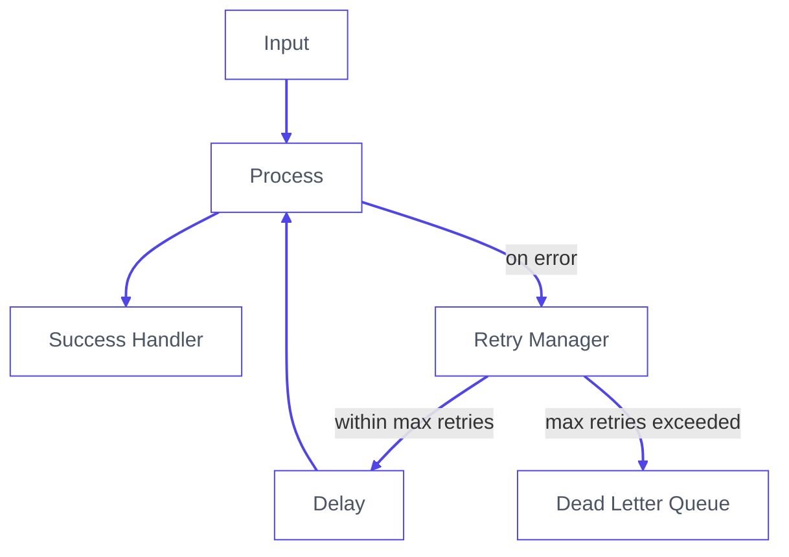

Somewhere in your IIoT pipeline, a message just failed. You don't know which one. You don't know when. And unless you have a Dead Letter Queue, you never will.

<!--more-->

In industrial environments, failure is not the exception. It is the contract. Networks partition. APIs rate-limit. A sensor alert fires at the wrong moment and vanishes without a trace. And unlike consumer applications, missed messages in manufacturing have a real cost.

Dead Letter Queues and retry strategies exist precisely for this. This guide covers both. You will walk away with a production-ready pattern for catching failed messages, retrying them with exponential backoff, and routing the unrecoverable ones into a DLQ where they can be inspected, replayed, or discarded on your terms.

## What Is a Dead Letter Queue?

A Dead Letter Queue is a holding area for messages that could not be delivered. When a message fails processing and has no path forward, it gets routed to the DLQ instead of being dropped or causing your flow to crash.

A message ends up in a DLQ for four reasons. It exceeded the maximum number of retry attempts. It is malformed and cannot be parsed. The target system is permanently unavailable. Or a business rule explicitly rejected it.

The value of a DLQ is not just storage. It is observability. Every failed message arrives with its full payload, error reason, retry history, and timestamps intact. You know exactly what failed, when it failed, and how many times it was attempted before giving up. That information is what makes recovery possible.

Without a DLQ, failed messages disappear silently. With one, failure becomes something you can inspect, act on, and fix.

## The Retry Pattern: Exponential Backoff

Before a message earns its place in the DLQ, you should try, and try again. But naive retries are dangerous. Hammering a failing service every 100ms does not give it time to recover. It makes things worse for everyone.

The industry standard is **exponential backoff with jitter**:

```
delay = min(base * 2^attempt, max_delay) + random_jitter
```

| Attempt | Base Delay | With Jitter (approx.) |
|---------|-----------|----------------------|
| 1       | 1s        | 1.2s                 |
| 2       | 2s        | 2.5s                 |
| 3       | 4s        | 4.1s                 |
| 4       | 8s        | 8.9s                 |
| 5       | 16s       | → DLQ               |

The jitter prevents the **thundering herd problem**, where every failed client retries at exactly the same moment and overloads the service all over again.

## Building It

Node-RED is the de facto standard for IIoT flow-based programming, and FlowFuse is the recommended way to run it in production. It gives you managed deployments, team collaboration, and enterprise-grade support, all built around Node-RED. [Start a free trial here](https://app.flowfuse.com/account/create). Everything in this guide works on standalone Node-RED too.

In industrial environments, a message that fails silently is worse than one that fails loudly. A timeout, a malformed payload, a downstream API returning a 503 can drop data without a trace and leave your pipeline looking healthy when it isn't.

That is exactly what this pattern is built to prevent. Every message gets three guarantees: it will be processed, retried with exponential backoff if something goes wrong, and routed to a Dead Letter Queue with full context if it cannot recover. Here is how it fits together:



Every step below maps directly to one part of that diagram. Follow it in order.

### Step 1: Initialize Retry State

Node-RED carries everything in `msg`. Before your message enters the processing pipeline, attach its retry metadata in a function node.

One important detail: store the original payload in `msg._originalPayload` before the message goes anywhere. The HTTP request node overwrites `msg.payload` with the response body on every call. Without this, the original data is gone by the time a message reaches the DLQ.

```javascript
msg._originalPayload = msg.payload;

if (!msg._retry) {
    msg._retry = {
        attempts: 0,
        maxAttempts: 5,
        lastError: null,
        originalTimestamp: new Date().toISOString(),
        topic: msg.topic
    };
}

return msg;
```

The `if (!msg._retry)` check ensures this only runs on a fresh message. When the retry manager loops the message back through the pipeline, this block is skipped entirely. The underscore prefix on `msg._retry` protects it from being overwritten by the HTTP request node response.

`maxAttempts` is set on the message itself, not hardcoded elsewhere. Different flows can have different retry limits without touching shared configuration.

### Step 2: The Catch Node

Drop a catch node onto your canvas and wire its output to the retry manager. The catch node watches your processing nodes and the moment one of them fails, it pulls the message out of the normal flow and sends it forward for retry handling.

Node-RED's standard nodes, the HTTP request node, the MQTT out node, the database node, do not always attach a clean error reason to the message. They sometimes set `msg.error` as an object rather than a string. Add one function node between the catch node and the retry manager to normalize that:

```javascript
msg.retry = msg._retry;

if (typeof msg.error === 'object') {
    msg.error = msg.error.message || JSON.stringify(msg.error);
}

msg.error = msg.error || 'Processing failed';
return msg;
```

One catch node covers all your processing nodes. Configure it to watch all nodes in the flow and the retry manager will receive a clean, consistent message every time.

### Step 3: The Retry Manager

This is where the decision gets made. Retry or give up.

Add a function node and wire the normalize error node into it. This node does three things: increments the attempt count, calculates how long to wait before the next attempt, and routes the message either back into the pipeline or forward to the DLQ.

```javascript
const MAX_ATTEMPTS = msg.retry.maxAttempts || 5;
const BASE_DELAY_MS = 1000;
const MAX_DELAY_MS = 30000;

msg.retry.attempts += 1;
msg.retry.lastError = msg.error || 'Unknown error';
msg.retry.lastAttemptAt = new Date().toISOString();

// keep _retry in sync
msg._retry = msg.retry;

if (msg.retry.attempts >= MAX_ATTEMPTS) {
    msg.retry.exhausted = true;
    msg.dlq = {
        reason: 'Max retries exceeded',
        attempts: msg.retry.attempts,
        lastError: msg.retry.lastError,
        deadAt: new Date().toISOString()
    };
    return [null, msg];
}

const exponential = BASE_DELAY_MS * Math.pow(2, msg.retry.attempts - 1);
const jitter = Math.random() * 1000;
const delay = Math.min(exponential + jitter, MAX_DELAY_MS);

msg.delay = Math.round(delay);

node.status({
    fill: 'yellow',
    shape: 'ring',
    text: `Retry ${msg.retry.attempts}/${MAX_ATTEMPTS} in ${Math.round(delay / 1000)}s`
});

return [msg, null];
```

The function node has two outputs. Output 1 goes to a delay node wired back into your processing node. Output 2 goes to the DLQ handler. The `return [msg, null]` and `return [null, msg]` statements control that routing. No switch node needed.

### Step 4: The Delay Node

The delay node is what gives failing services time to recover. Without it, retries fire immediately and you are back to hammering a system that is already struggling.

Drop a delay node onto your canvas and wire the first output of the retry manager into it. Then wire its output back into your processing node. One setting matters here: set the delay mode to "override delay with `msg.delay`". That tells the node to read the backoff value the retry manager calculated rather than using a fixed time.

Each pass through the loop the delay gets longer. First retry waits roughly 1 second. Second waits 2. Third waits 4. The message keeps its retry state across every loop because it travels on `msg` the entire time. Nothing is stored externally. Nothing is lost between attempts.

When the retry manager decides the message is done, it stops sending to the delay node entirely and routes to output 2 instead. The loop ends and the message moves to the DLQ.

### Step 5: The DLQ Handler

When a message reaches this node, retries are over. The job now is preservation. Every detail matters here: the original payload, the error reason, how many times it was attempted, and when it finally gave up. That context is what makes recovery possible.

**Install the SQLite node**

1. Open the Node-RED palette manager
2. Search for `node-red-node-sqlite`
3. Click install and restart Node-RED when prompted

**Create the database table**

1. Drop an inject node onto your canvas
2. Configure it to run once on deploy
3. Wire it directly into a sqlite node and set the database path to `/data/node-red-dlq.db`
4. Paste this into the SQL field:

```sql
CREATE TABLE IF NOT EXISTS dlq (
  id TEXT PRIMARY KEY,
  topic TEXT,
  payload TEXT,
  attempts INTEGER,
  last_error TEXT,
  captured_at TEXT
)
```

**Handle failed messages**

1. Wire the second output of the retry manager into a change node
2. Add the following rules in the change node:

Set `msg.params` to `{}` (JSON)

Then set each property:

- Set `msg.params.$id` to `msg._msgid`
- Set `msg.params.$topic` to `msg._retry.topic`
- Set `msg.params.$payload` to JSONata: `$string(_originalPayload)`
- Set `msg.params.$attempts` to `msg.retry.attempts`
- Set `msg.params.$last_error` to `msg.retry.lastError`
- Set `msg.params.$captured_at` to JSONata: `$now()`

3. Wire the change node into a sqlite node pointed at the same database
4. Set the SQL to:

```sql
INSERT OR REPLACE INTO dlq 
  (id, topic, payload, attempts, last_error, captured_at) 
  VALUES ($id, $topic, $payload, $attempts, $last_error, $captured_at) 
```

5. Set the sqlite node to read parameters from `msg.params`

Each property maps directly to its column. The original sensor payload is preserved correctly and the error reason is always a readable string.

## Putting It All Together: Simulation

The best way to understand the pattern is to watch it work. This simulation models a temperature sensor publishing readings to an HTTP API every 5 seconds. The mock API is deliberately configured to fail 80% of the time so you can watch the full cycle in action: messages attempting delivery, retrying with increasing delays, and after 5 failed attempts landing permanently in SQLite.

Import the flow below directly into Node-RED. It contains everything: the sensor, the mock API, the retry logic, the DLQ handler, and a query button to inspect what landed in the database.


[{"id":"47aa09e08439b77a","type":"group","z":"b413f96e006352db","name":"Create Table","style":{"label":true},"nodes":["7f78722f24bdd8c6","61d87e7c2d5bfb76"],"x":254,"y":1239,"w":552,"h":82},{"id":"7f78722f24bdd8c6","type":"inject","z":"b413f96e006352db","g":"47aa09e08439b77a","name":"Create Table on Deploy","props":[],"repeat":"","crontab":"","once":true,"onceDelay":0.1,"topic":"","x":410,"y":1280,"wires":[["61d87e7c2d5bfb76"]]},{"id":"61d87e7c2d5bfb76","type":"sqlite","z":"b413f96e006352db","g":"47aa09e08439b77a","mydb":"dlq-db","sqlquery":"fixed","sql":"CREATE TABLE IF NOT EXISTS dlq (id TEXT PRIMARY KEY, topic TEXT, payload TEXT, attempts INTEGER, last_error TEXT, captured_at TEXT)","name":"Create DLQ Table","x":690,"y":1280,"wires":[[]]},{"id":"dlq-db","type":"sqlitedb","db":"/data/node-red-dlq.db","mode":"RWC"},{"id":"e33e60f06800e4f4","type":"group","z":"b413f96e006352db","name":"Query DLQ Records","style":{"label":true},"nodes":["18c027a9a41bf2d1","1af64c3d97ea0655","282cac14287e7d5d"],"x":254,"y":1759,"w":692,"h":82},{"id":"18c027a9a41bf2d1","type":"inject","z":"b413f96e006352db","g":"e33e60f06800e4f4","name":"Click to see DLQ records","props":[],"repeat":"","crontab":"","once":true,"onceDelay":0.1,"topic":"","x":410,"y":1800,"wires":[["1af64c3d97ea0655"]]},{"id":"1af64c3d97ea0655","type":"sqlite","z":"b413f96e006352db","g":"e33e60f06800e4f4","mydb":"dlq-db","sqlquery":"fixed","sql":"SELECT * FROM dlq;","name":"Query DLQ Table","x":670,"y":1800,"wires":[["282cac14287e7d5d"]]},{"id":"282cac14287e7d5d","type":"debug","z":"b413f96e006352db","g":"e33e60f06800e4f4","name":"Result","active":true,"tosidebar":true,"console":false,"tostatus":false,"complete":"payload","targetType":"msg","statusVal":"","statusType":"auto","x":850,"y":1800,"wires":[]},{"id":"960417d0230b57ac","type":"group","z":"b413f96e006352db","name":"DLQ Implementation","style":{"label":true},"nodes":["8434f0e3b798bb24","43de06c5571da76b","fe2c2e8abe8aa411","43131fd9949b5a05","a44c166364ce0f46","ffb1904a2742fbdb","5d42c2f8acaf3929","dd7a098c82a53e60","1ebbf2447f5440a7","5c737a2ba9034fe0","4a8e455dc37d2e73"],"x":254,"y":1439,"w":1412,"h":202},{"id":"8434f0e3b798bb24","type":"http request","z":"b413f96e006352db","g":"960417d0230b57ac","name":"POST /ingest","method":"POST","ret":"obj","url":"http://localhost:1880/ingest","x":1170,"y":1500,"wires":[["43de06c5571da76b"]]},{"id":"43de06c5571da76b","type":"function","z":"b413f96e006352db","g":"960417d0230b57ac","name":"Check Response","func":"// restore retry state from protected property\nmsg.retry = msg._retry;\n\nif (msg.statusCode !== 200) {\n    msg.error = `API returned ${msg.statusCode}`;\n    node.error(msg.error, msg);\n    return null;\n}\n\nreturn msg;","outputs":1,"timeout":"","noerr":0,"initialize":"","finalize":"","libs":[],"x":1370,"y":1500,"wires":[["fe2c2e8abe8aa411"]]},{"id":"fe2c2e8abe8aa411","type":"debug","z":"b413f96e006352db","g":"960417d0230b57ac","name":"Success","active":true,"tosidebar":true,"console":false,"tostatus":false,"complete":"payload","x":1560,"y":1500,"wires":[]},{"id":"43131fd9949b5a05","type":"catch","z":"b413f96e006352db","g":"960417d0230b57ac","name":"Catch Errors","scope":null,"uncaught":false,"x":350,"y":1560,"wires":[["a44c166364ce0f46"]]},{"id":"a44c166364ce0f46","type":"function","z":"b413f96e006352db","g":"960417d0230b57ac","name":"Normalize Error","func":"msg.retry = msg._retry;\n\nif (typeof msg.error === 'object') {\n    msg.error = msg.error.message || JSON.stringify(msg.error);\n}\n\nmsg.error = msg.error || 'Processing failed';\nreturn msg;","outputs":1,"x":540,"y":1560,"wires":[["ffb1904a2742fbdb"]]},{"id":"ffb1904a2742fbdb","type":"function","z":"b413f96e006352db","g":"960417d0230b57ac","name":"Retry Manager","func":"const MAX_ATTEMPTS = msg.retry.maxAttempts || 5;\nconst BASE_DELAY_MS = 1000;\nconst MAX_DELAY_MS = 30000;\n\nmsg.retry.attempts += 1;\nmsg.retry.lastError = msg.error || 'Unknown error';\nmsg.retry.lastAttemptAt = new Date().toISOString();\n\n// keep _retry in sync\nmsg._retry = msg.retry;\n\nif (msg.retry.attempts >= MAX_ATTEMPTS) {\n    msg.retry.exhausted = true;\n    msg.dlq = {\n        reason: 'Max retries exceeded',\n        attempts: msg.retry.attempts,\n        lastError: msg.retry.lastError,\n        deadAt: new Date().toISOString()\n    };\n    return [null, msg];\n}\n\nconst exponential = BASE_DELAY_MS * Math.pow(2, msg.retry.attempts - 1);\nconst jitter = Math.random() * 1000;\nconst delay = Math.min(exponential + jitter, MAX_DELAY_MS);\n\nmsg.delay = Math.round(delay);\n\nnode.status({\n    fill: 'yellow',\n    shape: 'ring',\n    text: `Retry ${msg.retry.attempts}/${MAX_ATTEMPTS} in ${Math.round(delay / 1000)}s`\n});\n\nreturn [msg, null];","outputs":2,"x":740,"y":1560,"wires":[["5d42c2f8acaf3929"],["dd7a098c82a53e60"]]},{"id":"5d42c2f8acaf3929","type":"delay","z":"b413f96e006352db","g":"960417d0230b57ac","name":"Backoff Delay","pauseType":"delayv","timeout":"1","timeoutUnits":"seconds","rate":"1","nbRateUnits":"1","rateUnits":"second","randomFirst":"1","randomLast":"5","randomUnits":"seconds","drop":false,"outputs":1,"x":960,"y":1540,"wires":[["8434f0e3b798bb24"]]},{"id":"dd7a098c82a53e60","type":"change","z":"b413f96e006352db","g":"960417d0230b57ac","name":"Build DLQ Params","rules":[{"t":"set","p":"params","pt":"msg","to":"{}","tot":"json"},{"t":"set","p":"params.$id","pt":"msg","to":"_msgid","tot":"msg"},{"t":"set","p":"params.$topic","pt":"msg","to":"retry.topic","tot":"msg"},{"t":"set","p":"params.$payload","pt":"msg","to":"$string(_originalPayload)","tot":"jsonata"},{"t":"set","p":"params.$attempts","pt":"msg","to":"retry.attempts","tot":"msg"},{"t":"set","p":"params.$last_error","pt":"msg","to":"retry.lastError","tot":"msg"},{"t":"set","p":"params.$captured_at","pt":"msg","to":"$now()","tot":"jsonata"}],"x":970,"y":1600,"wires":[["1ebbf2447f5440a7"]]},{"id":"1ebbf2447f5440a7","type":"sqlite","z":"b413f96e006352db","g":"960417d0230b57ac","mydb":"dlq-db","sqlquery":"prepared","sql":"INSERT OR REPLACE INTO dlq (id, topic, payload, attempts, last_error, captured_at) VALUES ($id, $topic, $payload, $attempts, $last_error, $captured_at)","name":"Insert DLQ Record","x":1210,"y":1600,"wires":[["5c737a2ba9034fe0"]]},{"id":"5c737a2ba9034fe0","type":"debug","z":"b413f96e006352db","g":"960417d0230b57ac","name":"DLQ Record Saved","active":true,"tosidebar":true,"console":false,"tostatus":false,"complete":"payload","x":1430,"y":1600,"wires":[]},{"id":"4a8e455dc37d2e73","type":"link in","z":"b413f96e006352db","g":"960417d0230b57ac","name":"link in 1","links":["ca847c9dc7d33e59"],"x":1025,"y":1480,"wires":[["8434f0e3b798bb24"]]},{"id":"d4633c38fe1988c5","type":"group","z":"b413f96e006352db","name":"Simulated API — Fails 80% of the Time","style":{"label":true},"nodes":["243055672f6a3ff2","d083103ff280fdf3","fac33d1c784c3839"],"x":254,"y":1659,"w":732,"h":82},{"id":"243055672f6a3ff2","type":"http in","z":"b413f96e006352db","g":"d4633c38fe1988c5","name":"POST /ingest","url":"/ingest","method":"post","x":350,"y":1700,"wires":[["d083103ff280fdf3"]]},{"id":"d083103ff280fdf3","type":"function","z":"b413f96e006352db","g":"d4633c38fe1988c5","name":"Mock API 80% Fail","func":"const shouldFail = Math.random() < 0.8;\n\nif (shouldFail) {\n    msg.statusCode = 503;\n    msg.payload = { error: \"Service unavailable\", status: 503 };\n} else {\n    msg.statusCode = 200;\n    msg.payload = { success: true, status: 200 };\n}\n\nreturn msg;","outputs":1,"timeout":"","noerr":0,"initialize":"","finalize":"","libs":[],"x":670,"y":1700,"wires":[["fac33d1c784c3839"]]},{"id":"fac33d1c784c3839","type":"http response","z":"b413f96e006352db","g":"d4633c38fe1988c5","name":"Send Response","x":880,"y":1700,"wires":[]},{"id":"6e3cb5158bfa1752","type":"group","z":"b413f96e006352db","name":"Simulate Sensor Reading","style":{"label":true},"nodes":["1b682e58a1034c35","5748ac691a0b8249","ca847c9dc7d33e59"],"x":254,"y":1339,"w":552,"h":82},{"id":"1b682e58a1034c35","type":"inject","z":"b413f96e006352db","g":"6e3cb5158bfa1752","name":"Every 5s","repeat":"5","crontab":"","once":true,"onceDelay":0.1,"topic":"","x":360,"y":1380,"wires":[["5748ac691a0b8249"]]},{"id":"5748ac691a0b8249","type":"function","z":"b413f96e006352db","g":"6e3cb5158bfa1752","name":"Simulate Reading","func":"msg.payload = {\n    sensorId: 'sensor-001',\n    temperature: +(Math.random() * 40 + 10).toFixed(2),\n    unit: 'celsius',\n    timestamp: new Date().toISOString()\n};\nmsg.topic = 'sensors/temperature';\nmsg._originalPayload = msg.payload;\n\nif (!msg._retry) {\n    msg._retry = {\n        attempts: 0,\n        maxAttempts: 5,\n        lastError: null,\n        originalTimestamp: new Date().toISOString(),\n        topic: msg.topic\n    };\n}\n\nreturn msg;","outputs":1,"timeout":"","noerr":0,"initialize":"","finalize":"","libs":[],"x":550,"y":1380,"wires":[["ca847c9dc7d33e59"]]},{"id":"ca847c9dc7d33e59","type":"link out","z":"b413f96e006352db","g":"6e3cb5158bfa1752","name":"link out 1","mode":"link","links":["4a8e455dc37d2e73"],"x":765,"y":1380,"wires":[]},{"id":"bee72894af6bb946","type":"global-config","env":[],"modules":{"node-red-node-sqlite":"1.1.1"}}]


## Choosing the Right Storage for Your DLQ

The storage layer you pick for your DLQ is an architectural decision, not a configuration detail. Get it wrong and you will either over-engineer a simple edge deployment or hit a hard ceiling in production.

SQLite is the right starting point for most IIoT edge deployments. It is embedded, needs no additional infrastructure, survives restarts, and gives you full SQL queryability over every failed message. It does one job and does it well.

It has one hard limit: it is local. The moment your pipeline spans multiple Node-RED instances across different machines, each node holds its own isolated queue. Cross-node visibility disappears. Coordinated replay becomes a manual problem. That is when you move to PostgreSQL for shared queuing, or lean on MQTT persistent sessions if your stack is already broker-based.

Kafka sits at the far end of the spectrum. Replayable, partitioned, built for distributed scale. It is the right answer for high-throughput pipelines where consumer groups and horizontal scaling are real requirements. It is the wrong answer for an edge gateway that processes a few hundred messages a minute. The operational weight is significant and it deserves to be earned.

Match the storage to the architecture you have, not the one you imagine you might need. Start simple. Migrate when the constraints force you to.

## Closing Thoughts

Every message your system drops was someone's data. A sensor reading that never made it. A transaction that silently disappeared. An event that the downstream system never knew existed. In most Node-RED deployments these failures are invisible. No record, no alert, no way to recover what was lost.

That is the problem this pattern solves.

A Dead Letter Queue does not make your system more reliable. Reliability comes from good infrastructure, careful design, and redundancy. What a DLQ gives you is honesty. An honest record of every message that could not be delivered, with enough context to understand why, and enough structure to do something about it.

The implementation here is lean by design. It runs inside Node-RED with nothing but SQLite underneath it. No broker to manage, no external service to depend on, no additional failure point introduced while trying to handle failure. You deploy it once and it works quietly in the background until the moment you need it.

And you will need it. Not because your flows are poorly built, but because distributed systems fail. APIs go down. Networks drop. Services timeout at the worst possible moment. The question has never been whether that happens. It is whether you are ready when it does.

Now you are.
