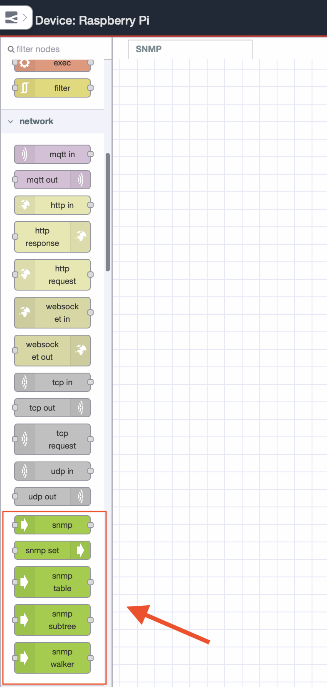

Industrial networks fail quietly. A saturated uplink, a flapping interface, or a device nearing its resource ceiling degrades silently until a line goes down or a control loop breaks.

<!--more-->

SNMP exists precisely to prevent that. Decades proven, it remains the most reliable protocol for extracting health telemetry from switches, routers, PLCs, and RTUs. No agents, no overhead, runs on everything.

The gap has always been implementation. Most teams either over-engineer it with heavyweight NMS platforms or under-engineer it with brittle scripts. Neither is acceptable when network visibility is an uptime and safety concern.

This guide walks through building a production-grade SNMP monitoring pipeline with FlowFuse, polling device metrics, discovering interfaces, and feeding telemetry into a FlowFuse Dashboard where your team can act on it.

## Prerequisites

Before getting started, make sure you have the following in place:

- **FlowFuse:** A running FlowFuse instance on your edge device. If you do not have an account yet, [sign up]() to get started and follow this [guide to get Node-RED running](/blog/2025/09/installing-node-red/).
- **An SNMP-enabled device:** Any managed switch, router, PLC, or RTU with SNMP enabled and UDP port 161 accessible from your FlowFuse instance. If you do not have a real device available, you can run a local SNMP agent for testing — see [net-snmp.org](http://www.net-snmp.org/download.html) for installation instructions for your platform.
- **UDP port 161 access:** Confirm your community string and ensure firewall rules permit SNMP polling from your FlowFuse host to the target device.

## Understanding SNMP

[SNMP](https://en.wikipedia.org/wiki/Simple_Network_Management_Protocol) operates on a simple manager-agent model. The **manager** (your FlowFuse instance) sends requests to the **agent** (a network device or server running an SNMP daemon) and the agent responds with the requested data. All communication happens over UDP port 161.

Data on the agent is organized in a **Management Information Base (MIB)** — a hierarchical tree of objects, each identified by an **Object Identifier (OID)**. Every piece of information you can query from a device, its uptime, interface status, traffic counters, CPU load, has a unique OID.

There are three operations you will use in this guide:

- **GET:** Fetch the value of a specific OID from a device.
- **WALK:** Traverse an entire OID subtree and return all values beneath it. Useful for querying all interfaces at once.
- **SUBTREE:** Fetch a specific OID subtree and everything beneath it. More targeted than a full walk.

SNMP also has versions. **SNMPv1** and **v2c** use a plain-text community string as authentication. **SNMPv3** adds user-based authentication and encryption. For production industrial environments, v3 is the right choice. For this guide, we use v2c to keep the focus on the implementation.

## Installing SNMP Package in FlowFuse

The `node-red-node-snmp` package provides a set of nodes for communicating with SNMP-enabled devices directly from your flows. Before building the monitoring pipeline, install it into your FlowFuse instance.

1. Open your FlowFuse instance and navigate to the Node-RED editor.
2. Click the hamburger menu in the top-right corner and select **Manage Palette**.
3. Go to the **Install** tab.
4. Search for `node-red-node-snmp`.
5. Click **Install** and wait for the installation to complete.

Once installed, you will see the following nodes available in your palette under the network category:

- **snmp** — fetch one or more specific OIDs
- **snmp walker** — walk from a given OID to the end of the MIB tree
- **snmp subtree** — fetch a specific OID subtree and everything beneath it
- **snmp table** — fetch structured SNMP table data
- **snmp set** — write values back to a device


_SNMP nodes available in the Node-RED palette after installing node-red-node-snmp_

For this guide we will be working with **snmp**, **snmp walker**, and **snmp subtree**. These three cover the core read operations needed for network health monitoring.

## Polling Device Metrics with SNMP GET

The snmp node sends a GET request to the agent and returns the values of the OIDs you specify. You can pass a single OID or a comma-separated list — the node fetches all of them in one request and returns the results as an array. This is the right operation when you know exactly what you want to fetch — system uptime, device name, description.

We will poll three key system OIDs in a single GET request every five seconds. All three sit under the `system` group (`1.3.6.1.2.1.1`), which is part of [MIB-II](https://www.rfc-editor.org/rfc/rfc1213.html) — the standard MIB supported by virtually every SNMP-enabled device. Standard OIDs are consistent across vendors, so the same OID returns `sysUpTime` whether you are querying a Cisco switch, a Siemens PLC, or a Linux server. Vendor-specific metrics live under `1.3.6.1.4.1` and vary by device — you will need the vendor's MIB file for those. For browsing standard OIDs, see the [OID reference for the system group](https://www.alvestrand.no/objectid/1.3.6.1.2.1.1.html).

| OID | Name | What it returns |
|---|---|---|
| `1.3.6.1.2.1.1.3.0` | sysUpTime | How long the device has been running, in timeticks |
| `1.3.6.1.2.1.1.5.0` | sysName | The configured hostname of the device |
| `1.3.6.1.2.1.1.1.0` | sysDescr | A full description of the hardware and OS |

1. Drag an **inject** node onto the canvas and double click it. Set the repeat interval to **every 5 seconds** and click **Done**.
2. Drag an **snmp** node onto the canvas and double click it to configure:

| Field | Value |
|---|---|
| Host | IP address of your target device, e.g. `192.168.1.1` |
| Community | `public` |
| Version | `v2c` |
| OIDs | `1.3.6.1.2.1.1.3.0,1.3.6.1.2.1.1.5.0,1.3.6.1.2.1.1.1.0` |

> Note: OIDs in the list must be comma-separated with no spaces between them.

3. Click **Done**.
4. Drag a **debug** node onto the canvas, connect it to the snmp node output, and click **Deploy** to verify the raw response first.

You will notice the response is not immediately human-readable. OctetString values such as `sysName` and `sysDescr` come back as byte arrays, and `sysUpTime` arrives as a raw TimeTicks integer:
```json
[
  { "oid": "1.3.6.1.2.1.1.3.0", "type": 67, "value": 317537, "tstr": "TimeTicks" },
  { "oid": "1.3.6.1.2.1.1.5.0", "type": 4, "value": [34, 116, 101, 115, 116, ...], "tstr": "OctetString" },
  { "oid": "1.3.6.1.2.1.1.1.0", "type": 4, "value": [68, 97, 114, 119, 105, ...], "tstr": "OctetString" }
]
```

We need a function node to convert byte arrays to strings and TimeTicks to a readable uptime format.

5. Drag a **function** node onto the canvas and insert it between the snmp node and the debug node.
6. Double click it and add the following code:
```javascript
const parsed = msg.payload.map(item => {
    let value = item.value;

    if (item.tstr === "OctetString") {
        value = Buffer.from(value).toString("utf8").replace(/"/g, "");
    }

    if (item.tstr === "TimeTicks") {
        const totalSeconds = Math.floor(value / 100);
        const days = Math.floor(totalSeconds / 86400);
        const hours = Math.floor((totalSeconds % 86400) / 3600);
        const minutes = Math.floor((totalSeconds % 3600) / 60);
        const seconds = totalSeconds % 60;
        value = `${days}d ${hours}h ${minutes}m ${seconds}s`;
    }

    return { oid: item.oid, name: item.tstr, value };
});

msg.payload = parsed;
return msg;
```

> **Tip:** If you need different parsing logic for additional OID types or want to transform the output differently, you do not have to write it from scratch. FlowFuse's [AI-powered function generation](/docs/user/expert/node-red-embedded-ai/#function-code-generation) lets you describe what you need in plain English and generates the function node code for you directly inside the editor.

7. Click **Done** and click **Deploy**.

The debug panel will now show clean, readable output:
```json
[
  { "oid": "1.3.6.1.2.1.1.3.0", "name": "TimeTicks", "value": "0d 0h 52m 55s" },
  { "oid": "1.3.6.1.2.1.1.5.0", "name": "OctetString", "value": "test-device" },
  { "oid": "1.3.6.1.2.1.1.1.0", "name": "OctetString", "value": "Linux core-switch-01 5.15.0 #1 SMP x86_64" }
]
```

With system metrics polling cleanly, the next section covers using the snmp walker node to discover and monitor all network interfaces on the device.

## Discovering Interfaces with SNMP Walker

The snmp walker node traverses the MIB tree starting from a given OID and returns every object beneath it. Unlike GET where you specify exact OIDs, walker is useful when you do not know the full OID path in advance — for example, discovering all network interfaces on a device without knowing how many exist or what their index numbers are.

Network interfaces on any SNMP device live under the `ifTable` (`1.3.6.1.2.1.2.2`). Walking this subtree returns every interface along with its name, operational status, speed, and traffic counters — one entry per interface regardless of how many the device has.

| OID | Name | What it returns |
|---|---|---|
| `1.3.6.1.2.1.2.2.1.1` | ifIndex | Unique index number for each interface |
| `1.3.6.1.2.1.2.2.1.2` | ifDescr | Interface name, e.g. `eth0`, `GigabitEthernet0/1` |
| `1.3.6.1.2.1.2.2.1.8` | ifOperStatus | Operational status — `1` = up, `2` = down |
| `1.3.6.1.2.1.2.2.1.10` | ifInOctets | Total inbound bytes on the interface |
| `1.3.6.1.2.1.2.2.1.16` | ifOutOctets | Total outbound bytes on the interface |

Walking from `1.3.6.1.2.1.2.2` returns all of the above for every interface in one request. For the full ifTable OID reference see [alvestrand.no/objectid/1.3.6.1.2.1.2.2](https://www.alvestrand.no/objectid/1.3.6.1.2.1.2.2.html).

> **Note:** The walker node requires a device with a populated interface table. If you are using a lightweight test agent, increase the timeout in the walker node configuration to at least 30 seconds. On resource-constrained devices that cannot handle bulk requests, use the snmp subtree node instead.

1. Drag an **inject** node onto the canvas and double click it. Set the repeat interval to **every 10 seconds** and click **Done**.
2. Drag an **snmp walker** node onto the canvas and double click it to configure:

| Field | Value |
|---|---|
| Host | IP address of your target device, e.g. `192.168.1.1` |
| Community | `public` |
| Version | `v2c` |
| OID | `1.3.6.1.2.1.2.2` |
| Timeout | `30` |

3. Click **Done**.
4. Drag a **function** node onto the canvas and insert it between the walker node and a debug node. Double click it and add the following code to parse the response into a readable structure:
```javascript
const interfaces = {};

msg.payload.forEach(item => {
    if (!item.oid.startsWith("1.3.6.1.2.1.2.2.1.")) return;

    const parts = item.oid.split(".");
    const ifIndex = parts[parts.length - 1];
    const subOid = parts.slice(0, -1).join(".");

    if (!interfaces[ifIndex]) interfaces[ifIndex] = { index: ifIndex };

    let value = item.value;

    const oidMap = {
        "1.3.6.1.2.1.2.2.1.1": "ifIndex",
        "1.3.6.1.2.1.2.2.1.2": "ifDescr",
        "1.3.6.1.2.1.2.2.1.8": "ifOperStatus",
        "1.3.6.1.2.1.2.2.1.10": "ifInOctets",
        "1.3.6.1.2.1.2.2.1.16": "ifOutOctets"
    };

    if (oidMap[subOid]) {
        if (subOid === "1.3.6.1.2.1.2.2.1.2") {
            const data = value.data || value;
            value = Buffer.from(data).toString("utf8").replace(/"/g, "").trim();
        } else if (subOid === "1.3.6.1.2.1.2.2.1.8") {
            value = value === 1 ? "up" : "down";
        }
        interfaces[ifIndex][oidMap[subOid]] = value;
    }
});

msg.payload = Object.values(interfaces).filter(i => i.ifDescr);
return msg;
```

5. Click **Done**.
6. Drag a **debug** node onto the canvas and connect it to the function node output.
7. Connect the inject node output to the walker node input, and the walker node output to the function node input.
8. Click **Deploy**.

The debug panel will show a clean array of interface objects like this:
```json
[
  {
    "index": "1",
    "ifIndex": 1,
    "ifDescr": "lo",
    "ifOperStatus": "up",
    "ifInOctets": 20526,
    "ifOutOctets": 20526
  },
  {
    "index": "2",
    "ifIndex": 2,
    "ifDescr": "enp0s1",
    "ifOperStatus": "up",
    "ifInOctets": 48159944,
    "ifOutOctets": 4263495
  }
]
```

Each entry represents one interface with its current operational status and traffic counters. In the next section we will use the snmp subtree node to fetch interface data more precisely by targeting a specific OID subtree.

## Fetching Interface Data with SNMP Subtree

The snmp subtree node is similar to walker but more targeted. Where walker reads from a given OID to the end of the entire MIB tree, subtree fetches everything beneath a specific OID and stops there. This makes it more predictable and efficient when you know the exact branch you want.

For network health monitoring, a practical use of subtree is pulling all operational status values for every interface in one shot by targeting `ifOperStatus` directly at `1.3.6.1.2.1.2.2.1.8`. This gives you a clean up/down status for every interface on the device without pulling traffic counters or other data you do not need at that moment.

1. Drag an **inject** node onto the canvas and double click it. Set the repeat interval to **every 10 seconds** and click **Done**.
2. Drag an **snmp subtree** node onto the canvas and double click it to configure:

| Field | Value |
|---|---|
| Host | IP address of your target device, e.g. `192.168.1.1` |
| Community | `public` |
| Version | `v2c` |
| OID | `1.3.6.1.2.1.2.2.1.8` |

3. Click **Done**.
4. Drag a **function** node onto the canvas and insert it between the subtree node and a debug node. Double click it and add the following code to parse the interface status values:
```javascript
const statuses = msg.payload.map(item => {
    const parts = item.oid.split(".");
    const ifIndex = parts[parts.length - 1];
    return {
        ifIndex: ifIndex,
        ifOperStatus: item.value === 1 ? "up" : "down"
    };
});

msg.payload = statuses;
return msg;
```

> **Tip:** If you need different parsing logic for additional OID types or want to transform the output differently, you do not have to write it from scratch. FlowFuse's [AI-powered function generation](/docs/user/expert/node-red-embedded-ai/#function-code-generation) lets you describe what you need in plain English and generates the function node code for you directly inside the editor.

5. Click **Done**.
6. Connect the inject node to the subtree node, the subtree node to the function node, and the function node to a debug node.
7. Click **Deploy**.

The debug panel will show a concise status array for every interface:
```json
[
  { "ifIndex": "1", "ifOperStatus": "up" },
  { "ifIndex": "2", "ifOperStatus": "down" }
]
```

This is the most efficient way to run a continuous interface health check, one subtree poll every 10 seconds tells you the operational state of every interface on the device without fetching data you do not need.

With all three polling operations in place, the next step is wiring this data into a [FlowFuse Dashboard](https://dashboard.flowfuse.com/) so the information is visible at a glance.

## Wrapping Up

Industrial networks don't announce their problems. They accumulate them silently until a line goes down, a control loop breaks, or production stops.

The pipeline you've built here changes that. GET, Walker, and Subtree give you precise, continuous visibility into every device on your network. FlowFuse delivers it without the infrastructure overhead of a full NMS platform or the maintenance burden of hand-rolled scripts.

Wire the telemetry into a FlowFuse Dashboard. Set threshold-based alerts. Extend your OID coverage to vendor-specific metrics as your requirements grow. The foundation is in place. Everything else is iteration.

Unmonitored networks are a liability. Now yours isn't.
