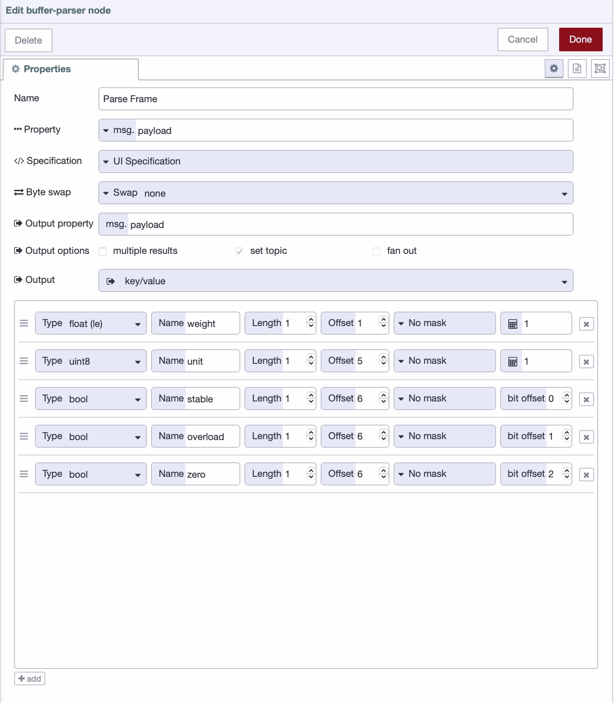

Your device is sending bytes. You don't know what they mean. The device manual is a 40-page PDF from 2003, and page 12 has a table of numbers with no explanation of what to do with them.

<!--more-->

This is the situation most engineers hit when they connect a legacy serial device for the first time. The serial connection works. The bytes arrive. But nothing tells you what those bytes represent, and there is no standard to fall back on the way there is with Modbus.

This article gives you a repeatable method for decoding binary output from any serial device. We'll use an industrial weighing scale as the example. By the end, you'll know exactly how to approach your own device, regardless of what it sends.

## The Method

Every binary parsing problem follows the same four steps.

**Read the manual.** Find the communication protocol section, not the installation guide. You are looking for the frame structure, the byte order, and the data types for each field. If the manual calls it a "data format" or "output format" section, that is the one. Everything else depends on this.

**Identify the frame type.** Frames from serial devices arrive in one of three structures. Fixed length frames are the simplest — every message is always the same number of bytes. Delimiter terminated frames end with a specific byte or sequence. Length prefixed frames include a byte early in the message that tells you how many bytes follow. Knowing which type your device uses determines how you validate and reassemble frames before parsing.

**Validate before you parse.** Every frame should pass a basic sanity check before your parsing logic runs. At minimum, verify the frame length and any start or end markers your device includes. If your device provides a checksum, verify that too. A frame that fails validation gets dropped. A corrupted value that passes through and ends up on a dashboard or in a database is far more damaging.

**Map the bytes.** Once a frame passes validation, assign every byte a meaning based on the manual. Name, type, offset, endianness, scale. This is where FlowFuse's Buffer Parser node does its work, visually, without code, with every field visible at a glance.

The rest of this article walks through all four steps using a concrete example.

## The Example: Industrial Weighing Scale

We'll use a common industrial weighing scale that outputs data over RS-232. You'll find this type of device in packaging lines, logistics warehouses, and food processing plants. It has no Modbus support. It sends its own fixed binary frame every time a stable reading is available.

The manual specifies a fixed-length frame of exactly 10 bytes:

| Byte | Value | Description |
|------|-------|-------------|
| 0 | `0x02` | STX, start of frame |
| 1–4 | 32-bit float | Weight value, little-endian |
| 5 | `0x01` or `0x02` | Unit indicator, 1 = kg, 2 = lb |
| 6 | Bitfield | Status flags |
| 7 | — | Reserved |
| 8 | Byte | Checksum, sum of bytes 1–7 truncated to one byte |
| 9 | `0x03` | ETX, end of frame |

Byte 0 is always `0x02`. Byte 9 is always `0x03`. These are your frame markers. Bytes 1 through 4 carry the weight as a 32-bit IEEE 754 float in little-endian order, meaning the least significant byte comes first. Byte 5 tells you whether the scale is set to kilograms or pounds. Byte 6 is a status bitfield where individual bits carry meaning — bit 0 is stable, bit 1 is overload, bit 2 is zero.

This is the raw buffer the scale sends for a 23.5 kg stable reading:

```
<Buffer 02 00 00 bb 41 01 03 00 5f 03>
```

By the end of this article, that buffer becomes:

```json
{
  "weight": 23.5,
  "unit": "kg",
  "stable": true,
  "overload": false,
  "zero": false
}
```

## Building the Flow in FlowFuse

We'll simulate the device output using an Inject node so you can follow along without hardware. In a real deployment, the Inject node is replaced by a Serial In node receiving bytes directly from the device. The parsing logic, the validation, the Buffer Parser configuration — all of it stays identical. The only difference is where the bytes come from. If you want to set up the actual serial connection, [this article covers that](https://flowfuse.com/blog/2025/07/connect-legacy-equipment-serial-flowfuse/).

The flow is: **Inject node** connected to a **Function node** connected to a **Buffer Parser node** connected to a **Switch node**, each output of the Switch connected to its own **Change node**, both Change nodes connected to a **Debug node.**

### Step 1: Install the Buffer Parser Node

The Buffer Parser node is not included in Node-RED by default. To install it:

1. Open your Node-RED editor
2. Click the hamburger menu (top right)
3. Go to **Manage palette** → **Install** tab
4. Search for node-red-contrib-buffer-parser
5. Click **Install**

Once installed, the node will appear in your palette and you can proceed with building the flow. If you're on FlowFuse, your administrator may have already added it to your shared palette — check before installing.

### Step 2: Simulate the Device

1. Drag an **Inject** node onto the canvas and double-click it
2. Set **msg.payload** type to **Buffer** from the dropdown
3. Enter: `[2,0,0,188,65,1,3,0,1,3]`
4. Click **Done**

Every time you click the Inject button, the flow receives these 10 bytes exactly as it would from a live serial connection.

### Step 3: Validate the Frame

Add a **Function node** and paste in the following. This is the only JavaScript in the entire flow.

```javascript
const buf = msg.payload;

// Check frame length
if (buf.length !== 10) {
    return null;
}

// Check start and end markers
if (buf[0] !== 0x02 || buf[9] !== 0x03) {
    return null;
}

// Validate checksum
let sum = 0;
for (let i = 1; i <= 7; i++) {
    sum += buf[i];
}
if ((sum & 0xFF) !== buf[8]) {
    return null;
}

return msg;
```

Three checks: frame length, start and end markers, checksum. If any fail, the message is dropped. Only clean, verified frames reach the Buffer Parser.

### Step 4: Parse the Bytes

Add a **Buffer Parser node** and double-click it. Set **Output** to **key/value**. Then add one row for each field.

**Weight**
- Name: `weight`
- Type: `floatle` (32-bit IEEE 754 float, little-endian)
- Offset: `1`
- Length: `1`

**Unit**
- Name: `unit`
- Type: `uint8`
- Offset: `5`
- Length: `1`

**Status flag — stable**
- Name: `stable`
- Type: `bool`
- Offset: `6`
- Bit Offset: `0`

**Status flag — overload**
- Name: `overload`
- Type: `bool`
- Offset: `6`
- Bit Offset: `1`

**Status flag — zero**
- Name: `zero`
- Type: `bool`
- Offset: `6`
- Bit Offset: `2`


_Configuring the Buffer Parser node to extract weight, unit, and status flags from the 10-byte frame_

The float conversion, the byte reading, the individual bit extraction — all handled visually without code. The `bool` type with Bit Offset is what makes bitfield parsing possible here. Each status flag is packed into a single byte, and the Buffer Parser pulls them out one bit at a time. If you want a deeper walkthrough of every Buffer Parser field and configuration option, [this article covers it in full](https://flowfuse.com/blog/2025/12/node-red-buffer-parser-industrial-data/).

### Step 5: Map the Unit Value

The Buffer Parser gives you `1` or `2` for the unit byte. A **Switch node** routes the message based on that value, and a **Change node** on each route sets the correct label.

Configure the Switch node:
- Property: `msg.payload.unit`
- Rule 1: equals `1` → output 1
- Rule 2: equals `2` → output 2

Connect each output to its own Change node:
- Output 1 Change node: set `msg.payload.unit` to the string `"kg"`
- Output 2 Change node: set `msg.payload.unit` to the string `"lb"`

Connect both Change nodes to the Debug node. Click **Deploy**, then click the Inject button. Your debug panel will show:

```json
{
  "weight": 23.5,
  "unit": "kg",
  "stable": true,
  "overload": true,
  "zero": false
}
```


[{"id":"d8bc179d698f39a2","type":"group","z":"FFF0000000000001","style":{"stroke":"#b2b3bd","stroke-opacity":"1","fill":"#f2f3fb","fill-opacity":"0.5","label":true,"label-position":"nw","color":"#32333b"},"nodes":["5ee755d20d300b60","e07e9371618f926f","aedfa06fb7109f18","045959569e84a098","947db003dbd32127","23c25ca58a0784b0","e541260b3b581eac"],"x":1294,"y":719,"w":1012,"h":122},{"id":"5ee755d20d300b60","type":"inject","z":"FFF0000000000001","g":"d8bc179d698f39a2","name":"","props":[{"p":"payload"}],"repeat":"","crontab":"","once":false,"onceDelay":0.1,"topic":"","payload":"[2,0,0,188,65,1,3,0,1,3]","payloadType":"bin","x":1390,"y":780,"wires":[["e07e9371618f926f"]]},{"id":"e07e9371618f926f","type":"function","z":"FFF0000000000001","g":"d8bc179d698f39a2","name":"Validate Frame","func":"const buf = msg.payload;\n\n// Check frame length\nif (buf.length !== 10) {\n    return null;\n}\n\n// Check start and end markers\nif (buf[0] !== 0x02 || buf[9] !== 0x03) {\n    return null;\n}\n\n// Validate checksum\nlet sum = 0;\nfor (let i = 1; i <= 7; i++) {\n    sum += buf[i];\n}\nif ((sum & 0xFF) !== buf[8]) {\n    return null;\n}\n\nreturn msg;","outputs":1,"timeout":0,"noerr":0,"initialize":"","finalize":"","libs":[],"x":1560,"y":780,"wires":[["aedfa06fb7109f18"]]},{"id":"aedfa06fb7109f18","type":"buffer-parser","z":"FFF0000000000001","g":"d8bc179d698f39a2","name":"Parse Frame","data":"payload","dataType":"msg","specification":"spec","specificationType":"ui","items":[{"type":"floatle","name":"weight","offset":1,"length":1,"offsetbit":0,"scale":"1","mask":""},{"type":"uint8","name":"unit","offset":5,"length":1,"offsetbit":0,"scale":"1","mask":""},{"type":"bool","name":"stable","offset":6,"length":1,"offsetbit":0,"scale":"1","mask":""},{"type":"bool","name":"overload","offset":6,"length":1,"offsetbit":1,"scale":"1","mask":""},{"type":"bool","name":"zero","offset":6,"length":1,"offsetbit":2,"scale":"1","mask":""}],"swap1":"","swap2":"","swap3":"","swap1Type":"swap","swap2Type":"swap","swap3Type":"swap","msgProperty":"payload","msgPropertyType":"str","resultType":"keyvalue","resultTypeType":"return","multipleResult":false,"fanOutMultipleResult":false,"setTopic":true,"outputs":1,"x":1750,"y":780,"wires":[["045959569e84a098"]]},{"id":"045959569e84a098","type":"switch","z":"FFF0000000000001","g":"d8bc179d698f39a2","name":"Map Unit","property":"msg.payload.unit","propertyType":"msg","rules":[{"t":"eq","v":"1","vt":"num"},{"t":"eq","v":"2","vt":"num"}],"checkall":"true","repair":false,"outputs":2,"x":1920,"y":780,"wires":[["947db003dbd32127"],["23c25ca58a0784b0"]]},{"id":"947db003dbd32127","type":"change","z":"FFF0000000000001","g":"d8bc179d698f39a2","name":"Set kg","rules":[{"t":"set","p":"payload.unit","pt":"msg","to":"kg","tot":"str"}],"action":"","property":"","from":"","to":"","reg":false,"x":2070,"y":760,"wires":[["e541260b3b581eac"]]},{"id":"23c25ca58a0784b0","type":"change","z":"FFF0000000000001","g":"d8bc179d698f39a2","name":"Set lb","rules":[{"t":"set","p":"payload.unit","pt":"msg","to":"lb","tot":"str"}],"action":"","property":"","from":"","to":"","reg":false,"x":2070,"y":800,"wires":[["e541260b3b581eac"]]},{"id":"e541260b3b581eac","type":"debug","z":"FFF0000000000001","g":"d8bc179d698f39a2","name":"Result","active":true,"tosidebar":true,"console":false,"tostatus":false,"complete":"payload","targetType":"msg","statusVal":"","statusType":"auto","x":2210,"y":780,"wires":[]},{"id":"f0a3951924692010","type":"global-config","env":[],"modules":{"node-red-contrib-buffer-parser":"3.2.2"}}]


## When Things Get Harder

The weighing scale had a clean, fixed-length frame. Not every device will.

### Frames Arriving Split Across Multiple Messages

Depending on baud rate and buffer size, a single frame can arrive as two or more separate messages. If you try to parse a partial frame, you get garbage. The fix is a reassembly Function node placed before the validation step, using node context to accumulate bytes until a full frame is available:

```javascript
let buffer = context.get("buffer") || Buffer.alloc(0);
buffer = Buffer.concat([buffer, msg.payload]);

if (buffer.length < 10) {
    context.set("buffer", buffer);
    return null;
}

msg.payload = buffer.slice(0, 10);
context.set("buffer", buffer.slice(10));

return msg;
```

For delimiter-terminated frames, replace the length check with a search for your end byte. For length-prefixed frames, read the length byte first and use that as your target size.

### When Buffer Parser Is Not Enough

Buffer Parser handles fixed-structure protocols well. Two situations require a Function node instead.

The first is conditional structure — where the layout of later bytes depends on the value of an earlier byte. Buffer Parser parses a fixed specification every time. If your frame changes shape based on its own content, you need code.

The second is complex computed fields. If your device sends a raw ADC value that requires a multi-step calibration formula, Buffer Parser's scale field won't cover it. Add a Function node after Buffer Parser to handle only that calculation.

In both cases: let Buffer Parser do what it can, and add a Function node only for the parts it cannot.

> If you're on FlowFuse, you don't need to write that JavaScript yourself. Describe what you need to the [FlowFuse Expert](/docs/user/expert/node-red-embedded-ai/#function-code-generation) in plain English and paste the relevant section of your device manual. It will generate the Function node directly on your canvas.
>
> **Example prompt you can use:**
>
> ```
> I have a serial device sending binary data with this frame structure:
> - Byte 0: 0x02 (start)
> - Byte 1: message type
> - Bytes 2–5: 32-bit float (little-endian)
> - Byte 6: status bitfield
> - Last byte: checksum (sum of bytes)
>
> The frame structure changes based on the message type.
>
> Generate a Node-RED Function node that:
> 1. Validates the frame (start, length, checksum)
> 2. Parses fields based on message type
> 3. Extracts bitfield values into booleans
> ```
>
> Paste your device manual section along with the prompt for best results.

## Applying This to Your Own Device

The weighing scale is one device. To show the method transfers, here is how it applies to a completely different device — an industrial barcode scanner.

The scanner sends a variable-length frame every time it reads a label. The manual specifies a delimiter-terminated structure ending with `0x0D` (carriage return). Here is the frame layout:

| Byte | Value | Description |
|------|-------|-------------|
| 0 | `0x02` | STX, start of frame |
| 1 | uint8 | Scanner ID |
| 2–N | ASCII bytes | Barcode data, variable length |
| N+1 | `0x0D` | CR, end of frame |

The device and the frame look nothing like the weighing scale. The method is identical.

**Read the manual.** Frame structure: delimiter terminated, ends with `0x0D`. Data types: ASCII bytes for the barcode value, uint8 for the scanner ID.

**Identify the frame type.** Delimiter terminated. Your reassembly logic searches for `0x0D` instead of checking a fixed length.

**Validate before you parse.** Check for the STX start byte at position 0 and the `0x0D` end byte at the last position. No checksum on this device, so those two markers are your full validation.

**Map the bytes.** In the Buffer Parser, one row for the scanner ID at offset 1 as uint8. The barcode data is ASCII from offset 2 to the end of the frame, which you read as a string type with the appropriate length.

Four steps. Different device, different frame structure, same process. The Buffer Parser configuration looks different because the bytes are different. The thinking behind it is the same.

This is what the method gives you. Not a recipe for one specific device, but a way of reading any device manual and turning what you find there into a working flow.

If you are managing flows across multiple edge devices, FlowFuse deploys the same configuration everywhere through its remote deployment pipeline, with snapshots to roll back if anything changes on the device side.

## Final Thoughts

Modbus made binary parsing approachable because someone defined the rules in advance. Raw serial devices hand you a PDF instead. That is the real difficulty, not the parsing itself.

The method in this article works for weighing scales, barcode scanners, RFID readers, CNC machines, and whatever proprietary hardware is sitting on your factory floor with no documentation beyond a table of hex values. Once you have applied it once, you will recognize the pattern in every device you connect after it.

The factories with the most valuable operational data are often the ones running the oldest hardware. That data is accessible. It just requires knowing how to read it.
