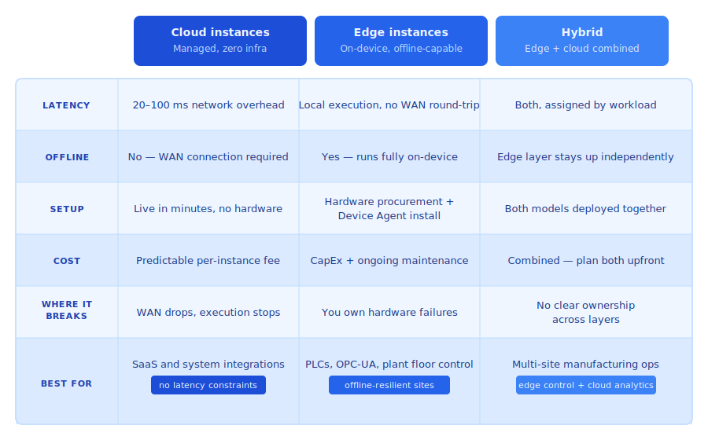

A production line at a mid-size manufacturer goes dark for 22 minutes. Not because the machines failed. Because the WAN link between the factory and the cloud dropped. The logic controlling the line was hosted in the cloud. Without a connection, it couldn't execute. By the time the link recovered, the shift had lost a batch.

<!--more-->

The fix wasn't complicated. The logic needed to run on hardware at the line, not in a datacenter 400 miles away. But by then, the decision had already been made, by default, on day one, when getting something running fast felt more important than getting the architecture right.

FlowFuse supports three deployment models: cloud-hosted instances, Remote Instances running on your own hardware via the Device Agent, and hybrid architectures that combine both. Each model reflects a different set of trade-offs. Here's exactly what each one means and where each one breaks.

*FlowFuse deployment models at a glance: cloud instances trade connectivity dependence for zero operational overhead; Remote Instances trade hardware ownership for local resilience; hybrid splits workloads across both layers.*

## Cloud instances: fast to start, dependent on connectivity

[Cloud instances](/docs/user/introduction/#creating-a-node-red-instance) run in FlowFuse's managed environment. You build integration and automation logic. FlowFuse handles everything else: container orchestration, uptime monitoring, restarts, scaling, and Node-RED runtime maintenance. You get persistent context storage, environment variable management, role-based access control, and the complete FlowFuse feature set with no infrastructure to own.

**This is the right model when:**

- Your data sources are cloud-based: SaaS APIs, external databases, third-party platforms
- Your workflows don't have hard latency requirements
- No compliance constraint requires processing to stay on-premises
- Your data sources do not include plant-floor equipment on OPC-UA, Modbus, or similar protocols - those require a device on the local network regardless of where your logic runs

It's also the fastest and cheapest starting point. Instances run in minutes, nothing to install, and the operational overhead is near zero. No hardware to procure, no OS to patch, no physical failures to debug. You can migrate workloads to the edge later when the need becomes clear.

**Where it breaks:**

Cloud instances require a persistent connection to execute. If your workflows control or monitor equipment on a factory floor, that link becomes a single point of failure. A 30-second outage doesn't slow things down. It stops execution entirely. That's not recoverable by restarting a service.

Beyond connectivity, latency is the other hard constraint. A cloud round-trip typically adds 20 to 100ms of network overhead, more on congested links. For dashboards and reporting, that's invisible. For a quality inspection workflow issuing a pass/fail signal to a reject gate, it can be the difference between a functional system and one that fails unpredictably under load.

## Remote Instances: resilient by design, owned by you

[Remote Instances](/docs/device-agent/register/) run on hardware you control, whether that's an industrial PC, a gateway at the production line, or a compatible gateway device, via the FlowFuse Device Agent. Workflow execution happens entirely on-device, independent of network state.

Deployment works through snapshots: build and test logic on a development instance, capture a snapshot, then mark it as the target for one or more remote devices. On first deployment, the Device Agent installs Node-RED along with the required dependencies, then runs the snapshot locally. Subsequent snapshot updates replace the running flows without reinstalling the runtime. If the device is offline when you push an update, it receives the snapshot on next reconnect.

**This is the right model when:**

- Latency matters: a quality inspection workflow issuing a pass/fail in under 50ms can't absorb a cloud round-trip
- Connectivity is unreliable: remote sites, offshore infrastructure, or environments where WAN uptime can't be guaranteed
- Compliance requires data processing to stay on-premises

**Where it breaks:**

You own the hardware, and that ownership is non-trivial. Device failures, resource contention, OS-level conflicts, and network interface issues become your responsibility. FlowFuse substantially reduces the operational burden through remote deployment, remote terminal access (Team and Enterprise tiers), centralized health monitoring, and automatic snapshot recovery, but it doesn't eliminate the reality of managing physical machines.

The cost structure also shifts. Cloud instances carry a predictable per-instance fee with no capital outlay. Edge deployments require upfront hardware investment, ongoing maintenance, and staff time to manage device lifecycle. At low device counts, this is manageable. At scale, across dozens of sites and hundreds of devices, it becomes a meaningful operational line item that needs to be planned for, not discovered.

## Hybrid: the architecture most serious deployments land on

Most production industrial deployments use both models. Logic that directly controls or monitors equipment runs at the edge. It is latency-sensitive, connectivity-dependent, and often required by policy to stay on-site. Logic that aggregates, contextualizes, and integrates runs in the cloud: dashboards, ERP and MES connections, cross-site analytics, external alerting.

Here's what that looks like in practice for a multi-site manufacturing operation:

**At each site (edge):** read sensor data via OPC-UA or Modbus, issue control commands to PLCs, run local alarming and anomaly detection, buffer telemetry during connectivity loss.

**In the cloud:** aggregate normalized data across sites, power operations dashboards, connect to ERP and MES systems, write to the historian.

*Remote Instances handle local execution and buffering at each site. Cloud instances aggregate, integrate, and manage from a single 
interface. The WAN link between them is treated as unreliable by design - not a dependency.*

FlowFuse manages both environments from a single interface. The same snapshot system, DevOps pipelines, and version history work across hosted and Remote Instances.

The technically important piece is how cloud and Remote Instances communicate when connectivity is intermittent. FlowFuse Project Nodes (available on Team and Enterprise tiers) provide native instance-to-instance messaging within the platform. Note that Project Nodes are not a durable message queue - if a device is offline when a message is sent, that message is dropped. The [store-and-forward](/blueprints/getting-started/store-and-forward/) pattern handles this correctly: the edge device writes incoming data to a local SQLite buffer continuously, then flushes to the cloud on reconnect. This is a well-established FlowFuse architecture, but it needs to be designed in explicitly at the device level. It won't emerge on its own. Teams on the Starter tier can implement the same pattern using MQTT or HTTP in place of Project Nodes.

**Where hybrid breaks:**

Ownership is the failure mode, not complexity. When nobody has explicitly decided who is responsible for each layer, edge and cloud configurations drift apart. One team updates a cloud flow without knowing the Remote Instance depends on it. An incident happens and two people are debugging two environments, each assuming the other owns the problem. The architecture is sound. The gap is organizational, not technical.

## Four questions that determine your architecture

*Answer these four questions in order and your architecture becomes a decision, not a guess.*

Start with where your data lives. Plant-floor equipment talking OPC-UA or Modbus has no business depending on a WAN link to execute. Cloud APIs and SaaS platforms do. The data source usually tells you where the compute belongs - and for plant-floor workloads, it rules out cloud-only from the start.

Then ask how much latency you can absorb. A closed-loop control workflow issuing a command to a PLC can't wait for a cloud round-trip. A dashboard aggregating shift data can. If the answer to "what happens if this takes 100ms longer than expected" is anything other than "nothing," you need edge execution.

Connectivity posture comes next. Reliable, high-bandwidth WAN changes the calculus - cloud instances can handle cloud-native data acquisition when the link is solid. But if uptime can't be guaranteed, edge removes the dependency entirely rather than trying to hedge against it.

The last question is operational. Edge deployments require hardware, capital, and people to manage device lifecycle. Cloud instances require none of that. If your team doesn't have the bandwidth to own physical hardware and your workloads are genuinely cloud-native - SaaS integrations, external APIs, cross-system reporting - cloud instances are the right starting point. For plant-floor workloads talking OPC-UA or Modbus, hardware ownership isn't optional. The question isn't whether to run edge, it's how to manage it well.

## Conclusion

Most manufacturers don't discover the wrong deployment architecture in a planning meeting. They discover it when the WAN drops and the line stops.

Getting something running quickly feels more important than getting the architecture right, and that trade-off is invisible until it isn't. Cloud instances are fast to start, easy to manage, and the obvious choice when you're moving quickly and your data sources are accessible over the internet. That's not wrong. It's wrong when the workload depends on a connection that can't be guaranteed, when a 100ms round-trip matters, or when plant-floor protocols require a device on the local network regardless of where your logic runs.

The three models in this post reflect three different sets of trade-offs, not three tiers of sophistication. Cloud is not a stepping stone to edge. Edge is not more serious than cloud. Hybrid is not always better than either. The right model is the one that matches where your data lives, how much latency your workflows can absorb, how reliable your connectivity is, and how much operational ownership your team can take on.

Get those four questions answered before you deploy, not after. The architecture you start with has a way of becoming the architecture you're stuck with.