Every industrial site generates data. Getting it to AWS securely is where most teams get stuck.

AWS IoT Core is Amazon's managed service for connecting edge devices to the cloud over MQTT. It handles secure device authentication, message routing, and fan-out to any AWS service in your stack: Lambda, DynamoDB, S3, and more. No broker to manage, no infrastructure to maintain.

<!--more-->

FlowFuse is an industrial application platform that connects machines, collects data across any protocol, and builds and deploys industrial applications at scale. In this guide, we'll use FlowFuse as the edge platform to connect to AWS IoT Core.

We'll walk through the full setup from scratch: creating an IoT Thing in AWS, generating X.509 certificates, configuring the right policy, publishing your first message from the edge, and **verifying** it live in the AWS console.

If you're new to MQTT and want to understand how it works before diving in, [this guide covers the fundamentals](/blog/2024/06/how-to-use-mqtt-in-node-red/).

## Prerequisites

Before you begin, make sure you have the following in place:

- A FlowFuse account with a running instance. If you don't have one yet, [sign up]().
- An AWS account with access to the IoT Core service.
- Basic familiarity with the AWS console.

## Step 1: Create an IoT Thing in AWS

A Thing is how AWS IoT Core represents a device. Every connection you make from FlowFuse will be tied to a Thing.

1. Open the [AWS IoT Core console](https://console.aws.amazon.com/iot).
2. In the left sidebar go to **Manage > All devices > Things**.
3. Click **Create things**.

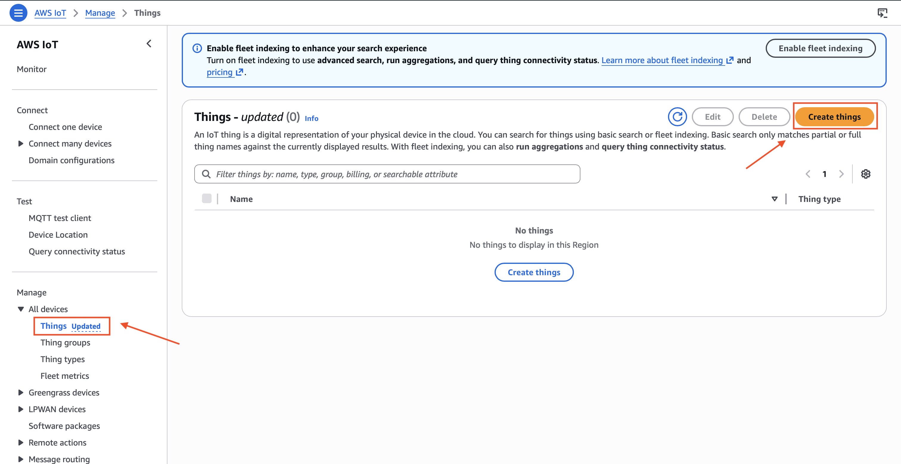
_AWS IoT Core Things page with Create things button_

4. Select **Create a single thing** and click **Next**.

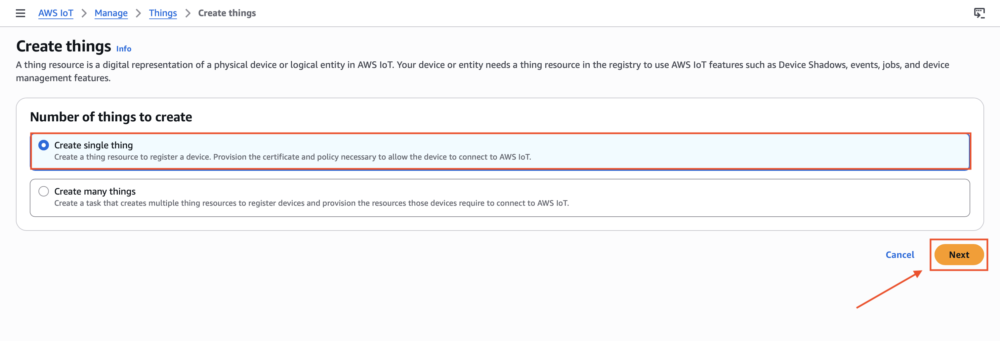
_AWS IoT Core showing Create a single thing option selected_

5. Give your Thing a name, for example `flowfuse-edge`. This name will be used as the MQTT Client ID later. Leave everything else as default and click **Next**.

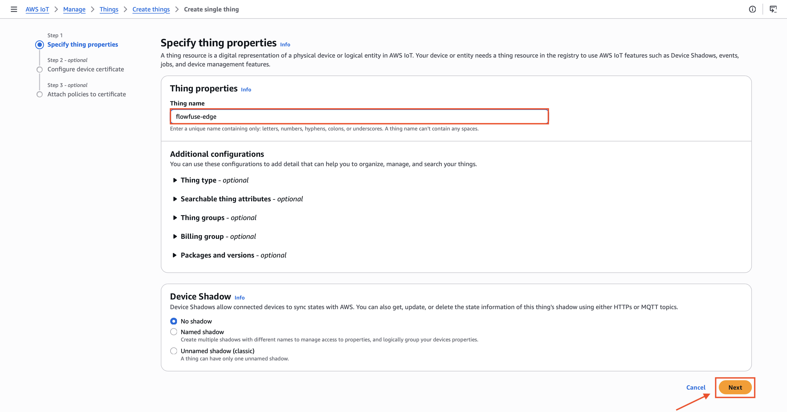
_AWS IoT Core Thing name field with flowfuse-edge entered_

6. Select **Auto-generate a new certificate** and click **Next**.

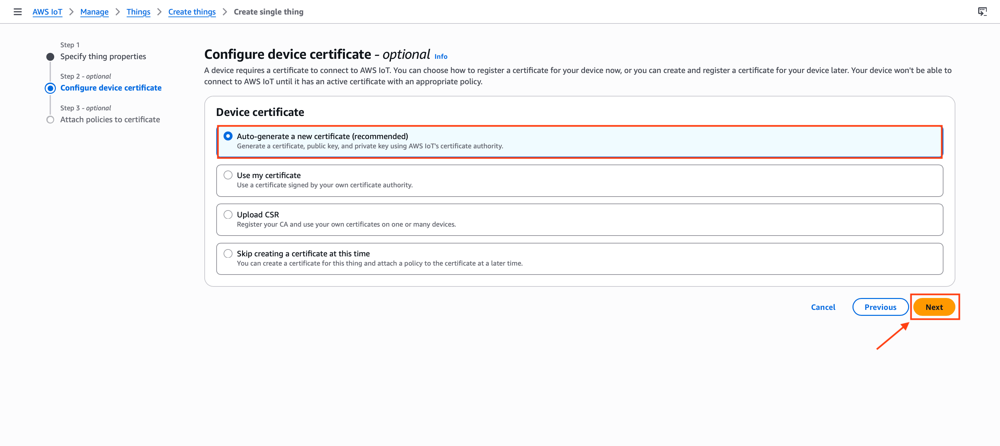
_AWS IoT Core certificate creation page with Auto-generate a new certificate option selected_

7. The next screen asks you to attach a policy. A policy defines what your device is allowed to do: connect, publish, subscribe, or receive. Without one, AWS will reject every connection even if the certificate is valid. Click **Create policy** in the top right. A new tab opens.

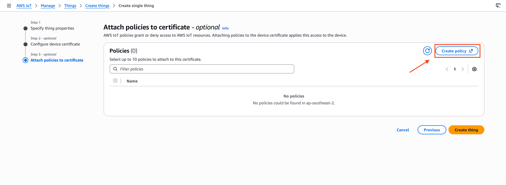
_AWS IoT Core policy attachment screen with the Create policy button visible in the top right_

8. Give it a name like `flowfuse-policy`, switch to the **JSON** editor and paste the following:

```json
{
  "Version": "2012-10-17",
  "Statement": [
    {
      "Effect": "Allow",
      "Action": [
        "iot:Connect",
        "iot:Publish",
        "iot:Subscribe",
        "iot:Receive"
      ],
      "Resource": "*"
    }
  ]
}
```

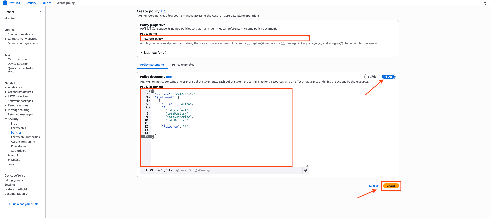
_AWS IoT Core policy editor in JSON mode with the flowfuse-policy name entered and the permission JSON pasted in_

> This wildcard policy works for initial setup. In production, replace `*` with specific ARNs for your Thing, topics, and client ID to follow least-privilege principles.

9. Click **Create** and close the tab.
10. Back on the policy attachment screen, refresh the policy list, select `flowfuse-policy`, and click **Create thing**.

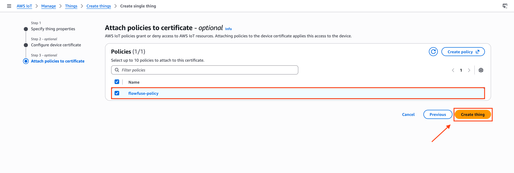
_AWS IoT Core policy attachment screen with flowfuse-policy selected and the Create thing button ready to click_

## Step 2: Download Certificates

Before leaving the confirmation screen, download all three certificate files. You cannot retrieve the private key again after this point.

| File | What it is |
| --- | --- |
| Device certificate | Identifies your FlowFuse instance to AWS |
| Private key | Paired with the certificate, never share this |
| Root CA certificate | Verifies AWS IoT Core on your side |

Click **Download** next to each file. Also download the **Amazon Root CA 1** from the link provided on the same page.

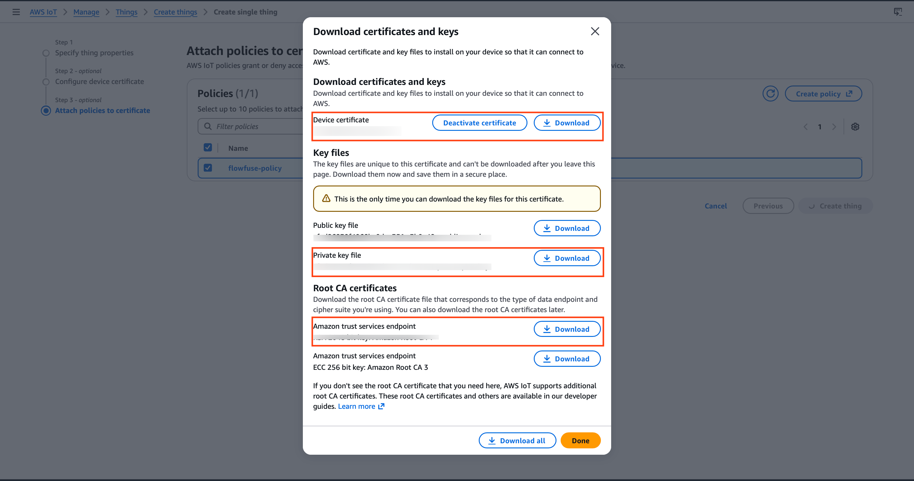
_AWS IoT Core certificate download screen showing the device certificate, private key, and Root CA download buttons_

> Keep these files safe. You cannot download the private key again after leaving this page. If you lose it, you will need to create a new certificate.

## Step 3: Find Your AWS IoT Endpoint

Every AWS account has a unique IoT Core endpoint. This is the host address you will use in FlowFuse.

1. In the left sidebar go to **Connect > Domain configurations**.
2. Click on the default domain configuration to open it.
3. Copy the **Endpoint**. It looks like this:

```
xxxxxxxxxxxxxxx-ats.iot.us-east-1.amazonaws.com
```

Rather than pasting this endpoint directly into the Node-RED broker configuration, store it as a [FlowFuse environment variable](https://flowfuse.com/docs/user/envvar/) — for example, `SERVER`. You can then reference it as `${SERVER}` in the Server field. This keeps the endpoint out of your flow JSON and means the same flow snapshot deploys across multiple edge instances pointing at different AWS accounts or regions without any edits.

## Step 4: Configure the MQTT Connection in FlowFuse

With your certificates downloaded and your endpoint copied, open your FlowFuse instance and go to the Node-RED editor.

First, upload your certificates so Node-RED can use them for the TLS handshake.

1. Drag an **mqtt out** node onto the canvas and double-click it to open its settings.
2. Click the pencil icon next to the **Server** field to create a new broker configuration.
3. Set the following on the **Connection** tab:

| Field | Value |
| --- | --- |
| Server | `${SERVER}` — set via FlowFuse environment variable |
| Port | `8883` |
| Client ID | `${CLIENT_ID}` — set via FlowFuse environment variable |
| Keep alive | `60` |

Define `SERVER` and `CLIENT_ID` under your instance's environment settings in FlowFuse. See [FlowFuse Environment Variables](https://flowfuse.com/docs/user/envvar/) for how to configure them. Keeping these values out of the flow JSON means you can deploy the same flow to multiple edge instances — each with its own Thing name and endpoint — without touching the flow itself. The Client ID must still match your Thing name exactly, so each instance gets its own variable value.

4. Check **Enable TLS**. A TLS configuration field appears.
5. Click the **+** icon next to it to add a new TLS config.
6. Upload each of the three certificate files you downloaded in Step 2:

| Field | File to upload |
| --- | --- |
| Certificate | Device certificate (`.pem.crt`) |
| Private Key | Private key (`.pem.key`) |
| CA Certificate | Amazon Root CA 1 (`.pem`) |

7. Enable **Verify server certificate**.
8. Click **Update** to save the TLS config, then click **Update** again to save the broker config.

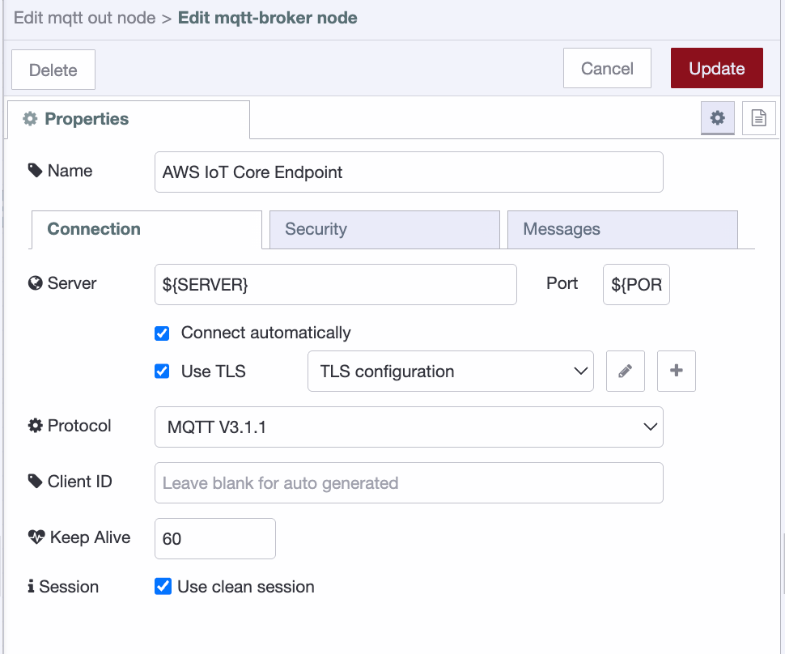
_MQTT broker configuration showing Connection tab with endpoint, port 8883, and Enable TLS checked_

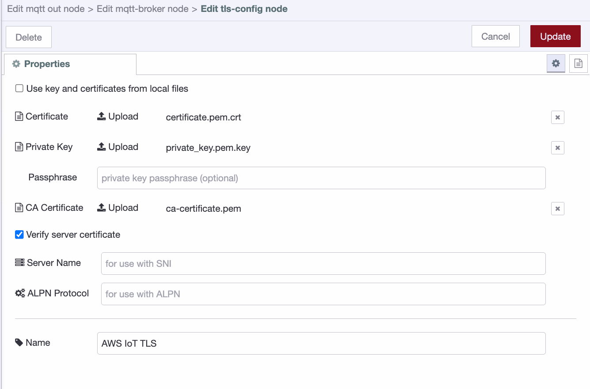
_TLS configuration dialog showing the three certificate upload fields and Verify server certificate enabled_

> AWS IoT Core requires mutual TLS: both sides authenticate each other. Port 8883 is the standard MQTT over TLS port. Connecting on port 1883 without TLS will be rejected.

## Step 5: Build a Flow and Publish Your First Message

With the broker configured, build a simple flow to publish a test message.

For this demo we'll use an **inject** node as the data source. In a real deployment, this would be any node reading live data: an OPC-UA reader, a Modbus poll, a database query, or a sensor feed.

1. Drag an **inject** node onto the canvas and connect it to the **mqtt out** node.
2. Double-click the **inject** node and set the payload to a JSON object, for example:

```json
{ "temperature": 22.5, "unit": "celsius", "source": "flowfuse-edge" }
```

3. Double-click the **mqtt out** node and set the **Topic** to `flowfuse/telemetry`. This is the topic AWS will receive messages on.
4. Click **Done**, then click **Deploy** to apply the flow.

Once deployed, the **mqtt out** node should show a green **connected** status indicator beneath it. If it shows red or is in a reconnecting state, double-check the endpoint, port, client ID, and certificate files.

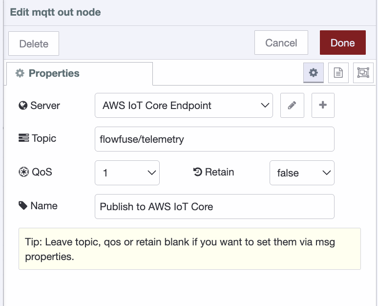
_mqtt out node configuration showing AWS IoT Core Endpoint selected as the server and flowfuse/telemetry set as the topic_

5. Click the button on the **inject** node to trigger a manual publish.

## Step 6: Verify the Message in AWS

Confirm the message arrived in AWS using the built-in MQTT test client.

1. In the AWS IoT Core console, go to **Test > MQTT test client** in the left sidebar.
2. Under **Subscribe to a topic**, enter `flowfuse/telemetry` and click **Subscribe**.
3. Go back to FlowFuse and click the inject button again.
4. The message appears in the AWS test client within seconds.

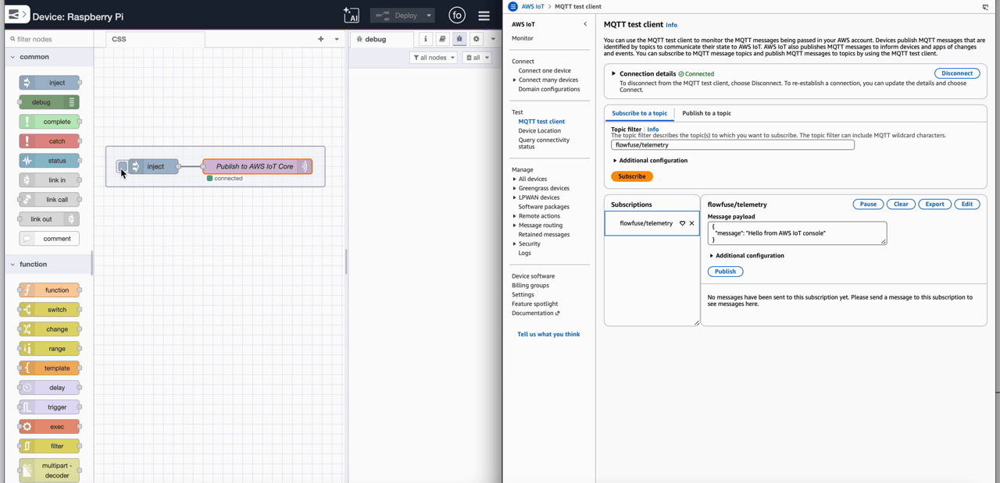
_AWS MQTT test client showing the received JSON message on the flowfuse/telemetry topic_

You've successfully connected FlowFuse to AWS IoT Core. Data published from your FlowFuse instance now flows securely into AWS over mutual TLS, ready to be routed to Lambda, DynamoDB, S3, or any other service in your stack via IoT Core rules.

## What's Next

You've got a working edge-to-cloud pipeline. FlowFuse is publishing data. AWS IoT Core is receiving it.

From here, the real work begins: routing that data somewhere useful. In AWS IoT Core, go to **Message Routing > Rules** to forward your `flowfuse/telemetry` messages to DynamoDB for storage, Lambda for processing, or S3 for archiving — no extra infrastructure needed.

On the edge side, swap the inject node for a live data source. An OPC-UA reader, a Modbus poll, a database query. The broker configuration stays the same. Only the source changes.

A few things worth doing before you go to production:

**Tighten your policy.** The wildcard policy from Step 1 is fine for testing. Replace the `*` resource with specific ARNs scoped to your Thing, your topics, and your client ID.

**Rotate certificates on a schedule.** AWS IoT Core supports certificate rotation without downtime. Build that into your operations plan now.

**Monitor connection state.** Add a status node in Node-RED connected to your mqtt out node. If the connection drops, you'll want to know immediately — not when someone notices missing data an hour later.

Industrial data pipelines aren't complex. They just have a lot of small steps that have to be right. You've done the hard part.
