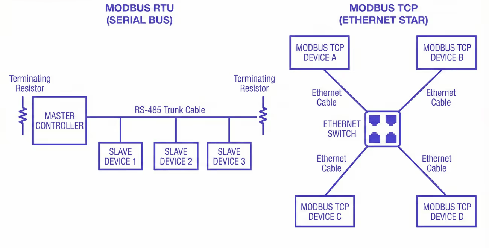
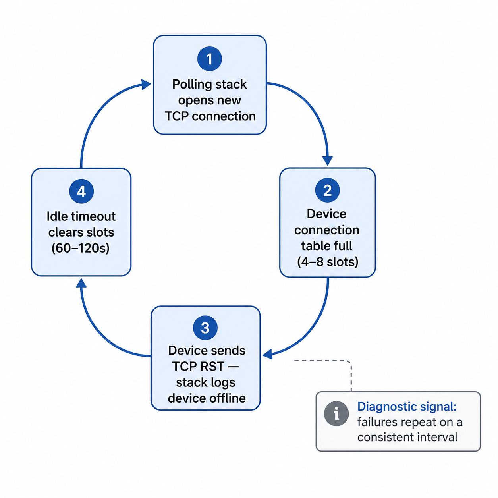
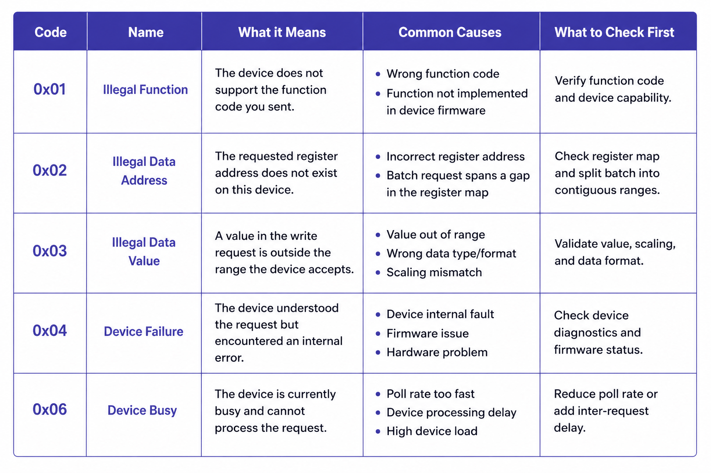
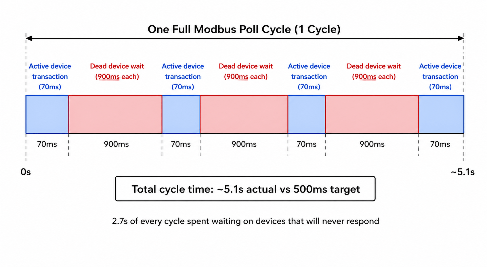

Modbus doesn't fail loudly. It drifts, and by the time operators notice, you've already lost the easy fix.

It shows up as slightly stale values, a poll cycle that's somehow three times slower than configured, operators filing tickets about data that "seems off." Never a hard fault. Never a clear cause.

The [previous article](/blog/2026/04/modbus-polling-best-practices/) covered setup mistakes. This one covers what breaks after that: how to read CRC errors and TCP failures correctly, how dead devices silently consume your poll cycle, and what metrics catch degradation before your operators do.

## Serial and TCP Fail Through Different Mechanisms

[Modbus RTU](https://www.modbus.org/specs.php) and Modbus TCP share the same application protocol. The similarity ends there.

*Comparison of Modbus RTU on RS-485 and Modbus TCP over Ethernet, showing shared serial bus versus network-based communication paths*

They fail through fundamentally different mechanisms, and the most common diagnostic mistake is applying serial troubleshooting logic to a TCP problem, or vice versa. It doesn't just waste time; it produces fixes aimed at the wrong layer entirely.

### RS-485: physical and timing failures

On [RS-485](https://en.wikipedia.org/wiki/RS-485) serial segments, failure is almost always physical or timing-related.

RS-485 is a shared medium with no collision detection built into the protocol. Modbus RTU relies on a strict master-slave architecture where only the master initiates requests and only one device responds at a time. When the physical layer degrades (damaged cable, missing termination resistor, ground loop between panels, high-current wiring running parallel to the RS-485 pair) the master sees [CRC errors](https://en.wikipedia.org/wiki/Cyclic_redundancy_check). The request frame goes out clean. The device receives noise. It either drops the frame silently or sends back something corrupted.

The pattern of where and when errors appear is what makes serial failure diagnosable.

CRC errors distributed across all devices on a segment point to the shared medium: cable damage, missing or doubled termination resistors, ground potential differences between panels. Note that unterminated segments can still produce uneven error distributions. A device at the end of an unterminated run will often show higher CRC error rates than devices at midpoints due to signal reflection, even though the root cause is a shared physical problem. Errors that cluster on one or two specific devices point to those devices: a UART that can't sustain the configured baud rate, a transceiver pulling down bus voltage, or a passive RS-485 converter that doesn't fully meet the electrical spec. Errors that appear at predictable times of day point to induced noise. A 30-meter RS-485 run sharing a cable tray with a 460V motor feed will see induced voltage during motor start transients. Routing away from high-current runs, using shielded twisted pair, and grounding the shield at one end resolves it. Widening the timeout does not.

**Duplicate Slave IDs** are an underappreciated source of corruption. If two devices on the same segment share the same address (a common result after device replacement when the replacement unit ships with a default address already in use) both will respond simultaneously to the same request, corrupting the frame with no physical cause. Before assuming the wiring is at fault, verify that every device address on the segment is unique.

One failure mode that gets far less attention than it deserves: bus contention from a transmit driver that doesn't release the line cleanly.

RS-485 is half-duplex. After sending a request, the master must de-assert its transmit driver before the device can respond. If the driver stays asserted even a few hundred microseconds too long (firmware timing bug, misconfigured enable pin, USB adapter with incorrect turnaround handling) the device's response overlaps with the master's still-active driver. The result is frame corruption on every transaction, every time, and it's indistinguishable from a severely damaged cable.

A [protocol analyzer](https://en.wikipedia.org/wiki/Protocol_analyzer) confirms it immediately by showing both signals active simultaneously. Before you pull cable on a segment where every transaction is corrupted, swap the serial adapter or test with a different master. It takes ten minutes and it's right more often than people expect.

### Modbus TCP: connection management and latency

On Modbus TCP, failure is almost always about connection management and latency. There's no shared medium and no electrical noise path. Instead, you get connection-level problems that the polling stack surfaces as device-offline errors, which are easy to misread as device failures when the device is fine.

The most common TCP failure pattern is connection table exhaustion. Modbus TCP devices enforce a hard limit on simultaneous connections at the firmware level, but this limit varies considerably across hardware, from as few as 1 connection on some embedded devices to 16 or more on capable gateway hardware. A common midrange figure for simple PLCs and meters is 4 to 8, but you should check your device's datasheet rather than assume. If your polling stack opens a fresh [TCP connection](https://en.wikipedia.org/wiki/Transmission_Control_Protocol) for every request rather than maintaining a persistent one, it can fill the connection table within seconds. Once full, the device responds to new connection attempts with a TCP RST. Your stack logs this as the device being offline. The device is operating normally.

Those connection slots release when the idle-connection timeout or the TCP FIN/RST sequence clears them. On most embedded Modbus TCP firmware, this idle timeout is typically 60 to 120 seconds, producing a failure cycle with a consistent interval: errors for roughly 90 seconds, reconnect, fill the table again, repeat.

*Cyclical failure pattern caused by connection table exhaustion. Diagnostic signal: failures repeat at a consistent interval.*

That regularity is the diagnostic signal. A device with intermittent hardware faults fails unpredictably. A device whose connection table is being exhausted fails on a clock. If you're seeing periodic offline events with suspiciously consistent timing, check your connection handling before you assume the device is faulty.

**Transaction ID handling** is worth checking in high-concurrency polling configurations. The [Modbus application protocol specification](https://www.modbus.org/file/secure/modbusprotocolspecification.pdf) defines Transaction IDs to match requests with responses. A polling stack that reuses Transaction IDs before receiving a response to the previous one can match incoming responses to the wrong pending request. When this occurs, the symptom is correct values appearing in the wrong registers. It doesn't show up as an error at all, which makes it unusually difficult to diagnose. If you're seeing values that are off by a plausible amount but never produce error codes, check whether your stack's Transaction ID handling is correct under concurrent load.

The second TCP failure mode that's become more common as industrial networks gain remote access infrastructure is latency on routed network paths pushing transaction times past configured timeouts. This applies to any routed path: site-to-site VPNs, SD-WAN appliances, MPLS links with QoS misconfiguration, or firewalls with deep-packet inspection enabled for industrial protocols. Modbus TCP on a dedicated plant-floor LAN has round-trip latency in single-digit milliseconds. The same configuration over a site-to-site VPN or through a stateful firewall can see 80 to 200ms per transaction. If your timeouts were calculated against a local network and you've since added any routing hops, your effective timeout margin may now be zero under any congestion. The failures are load-dependent: worse during business hours, cleaner overnight, invisible when you run a manual test. The fix is the same as in the last article: measure actual round-trip time under realistic load, then set your timeout to 1.5 to 2x that value.

### The hybrid case: serial-to-Ethernet converters

Most production Modbus installations aren't purely serial or purely TCP. They're RS-485 segments accessed through a serial-to-Ethernet converter with TCP on the network side and RS-485 on the fieldbus side. Both failure modes can exist simultaneously, and the converter adds its own at the boundary.

The most common converter-specific failure is inter-frame gap violation. The [Modbus over Serial Line specification](https://www.modbus.org/file/secure/modbusoverserial.pdf) requires a minimum 3.5-character silent interval between frames. When concurrent TCP requests arrive simultaneously, a converter that doesn't enforce this gap between queued RS-485 dispatches corrupts the second transaction, even when the cable is perfect and both devices are healthy. The error looks serial. The cause is software. Disabling concurrency and forcing strictly sequential requests to that segment is the fastest confirmation: if errors stop, the converter's queuing was the cause.

Three other failure modes are worth knowing before you chase wiring:

**Buffering latency.** Some converters buffer TCP data before forwarding to RS-485, adding variable latency under load. Failures become load-dependent, mimicking electrical problems. Reducing polling concurrency or adding a small inter-request delay often resolves it without hardware changes.

**Silent connection limits.** Like the devices they front-end, converters enforce connection limits, but some accept the connection and then stop responding rather than refusing it. If timeouts resolve when the polling engine restarts but not otherwise, check for a converter connection limit and configure persistent connection reuse.

**Baud rate or parity mismatch.** After any converter replacement, verify baud rate, parity, and stop bits match the segment. A mismatch corrupts every transaction and is easy to miss if the previous unit's settings weren't documented.

Most converters expose diagnostic statistics through a web UI or Telnet interface. Pull those first. Near-zero serial error counters with nonzero queue depth during failures points to a software queuing problem. Climbing serial error counters points to a real physical fault on the RS-485 side.

## Exception Codes Tell You What Type of Error You're Dealing With

Before treating every failed transaction as a generic timeout or communication fault, check the [Modbus exception code](https://www.modbus.org/file/secure/modbusprotocolspecification.pdf). When a device receives a valid request but can't fulfill it, it returns an exception response, and that code is specific enough to redirect your troubleshooting immediately.

The codes you'll encounter most often:

*Modbus exception codes quick reference table showing error codes, meanings, common causes, and first troubleshooting steps*

**Exception 0x01 — Illegal Function**: The device doesn't support the function code you sent. Usually a configuration issue: the polling stack is sending a [function code](https://en.wikipedia.org/wiki/Modbus#Supported_function_codes) the device firmware doesn't implement.

**Exception 0x02 — Illegal Data Address**: The requested register address doesn't exist on this device. This is the most diagnostic exception for register batch problems. If a batch that spans a gap in the device's register map produces this exception, split the batch into two separate reads covering the contiguous ranges.

**Exception 0x03 — Illegal Data Value**: The value in a write request is outside the range the device accepts. Relevant for write operations; not typically seen on reads.

**Exception 0x04 — Device Failure**: The device received and understood the request but encountered an internal error. This is a device-side problem, not a communication problem. Persistent 0x04 responses on a specific register range warrant checking the device's own diagnostics.

**Exception 0x06 — Device Busy**: The device received the request but is temporarily unable to process it. Consistent 0x06 responses mean you're polling faster than the device can handle. Reduce the poll rate for that device or increase the inter-request delay.

Log exception codes as a separate field alongside transaction success/failure. A poll list generating steady 0x02 responses on one device and steady 0x06 on another has two different problems requiring two different fixes.

## Dead Devices Are Draining Your Bus on Every Poll Cycle

There is a problem in almost every Modbus installation that's been running for more than a year: the poll list contains devices that no longer respond, and the master is spending measurable time waiting for them on every single cycle.

Take a serial network with 18 active devices and 3 that are offline. With a 300ms timeout and 2 retries configured, each unresponsive device costs 900ms per cycle. Three offline devices: 2.7 seconds of dead time on every poll cycle. On a bus where each active device transaction takes 70ms, that's the equivalent of roughly 40 active transactions blocked per cycle.

*Dead devices dominate the poll cycle: ~5.1s actual vs 500ms target, with 2.7s wasted on non-responsive devices.*

If your fast-tier registers are supposed to poll at 500ms, your actual cycle time is now well over three seconds. Data still flows. Values still update. Nothing throws a hard error. The system looks operational while running at a fraction of its designed capacity.

### The runtime fix: backoff

After a device fails a configurable number of consecutive polls, move it out of the normal rotation and into a low-frequency check, once every 60 seconds is a reasonable starting point. When it responds again, restore it to the normal rotation immediately.

Most commercial [SCADA](https://en.wikipedia.org/wiki/SCADA) systems and industrial gateways support this natively, usually labeled as device backoff, retry holdoff, or failure-state polling interval. In FlowFuse, you implement this explicitly: track a failure counter per device address, suppress it from the main poll rotation when the counter exceeds your threshold, and run it on a separate low-frequency timer.

Backoff is a runtime mitigation, not a solution. Backoff entries should be reviewed quarterly, and anything that hasn't responded in 30 days warrants a direct question: is this device expected to return, or is it permanently gone? If it's gone, remove it. The poll list should reflect the actual field.

## The Metrics That Tell You What's Actually Happening

A device running at 91% transaction success rate isn't failing visibly. Data still flows, values still update. But 9 out of every 100 polls are producing errors. If that 91% has been drifting down from 99% over six weeks, something is changing: a connector degrading, electrical conditions worsening. The window to investigate at low cost is open right now. It closes when the rate hits 70% and starts producing visible data gaps.

The four metrics worth tracking continuously are transaction success rate, response time, segment-level CRC error count, and poll cycle completion time. Your Modbus master has all of this information on every transaction. The only question is whether you're capturing and storing it.

**Transaction success rate** per device, measured as a rolling average over the last 100 polls, is the primary health indicator. Healthy devices run above 99%. A device that's been at 95% for two weeks is telling you something has changed. The distinction between gradual drift and a sudden drop tells you whether you're looking at environmental degradation or a discrete fault.

**Response time** per device, trended over time, is often a leading indicator of developing problems, though not always. Gradual degradation due to worsening electrical conditions, increasing bus load, or a device struggling under heavier firmware load typically shows up as rising response times before timeouts begin. That said, some failure modes are abrupt: a cable that finally breaks, a device that locks up, a switch port that goes down. These jump straight to timeout failures without any response time warning. Treat response time trending as a useful early-warning signal for gradual faults, not as a guarantee that failures will always be preceded by visible latency drift.

**CRC error count** should be tracked at the segment level, not just per device. A simultaneous uptick across all devices on a segment points to a shared-medium change. One device's error rate rising while the others stay flat points to that device specifically.

**Poll cycle completion time** should be stable. A slow upward drift means something is adding latency: response times lengthening, backoff not engaging on newly failed devices, devices added to the rotation without reviewing the impact on total cycle time. A sudden jump usually means a device started timing out that wasn't before. By the time individual device success rates start dropping visibly, cycle time has usually already been warning you for days.

### Putting it into practice

Instrument your polling layer to write a timestamped record on every transaction: device address, function code, success or failure, response time in milliseconds, exception code on failures, and error type (timeout vs. CRC vs. exception response). Write those records to a [time-series store](/node-red/database/). [InfluxDB](/node-red/database/influxdb/) is a common choice for industrial deployments; a [PostgreSQL](/blog/2025/08/getting-started-with-flowfuse-tables/) table with a timestamp index works fine too.

A reasonable retention strategy is to keep raw transaction records for 7 days and roll up to hourly aggregates (per-device success rate, median response time, CRC error count) for 90 days of trend data.

From that raw stream, you want three derived views:

**Per-device rolling success rate** calculated over a sliding window of the last 100 transactions, not a fixed time window. Time windows conflate a healthy device polled infrequently with a struggling device polled every 500ms.

**Per-device response time baseline and deviation**: compute the [median](https://en.wikipedia.org/wiki/Median) response time per device over the prior 30 days, then flag any device whose current 1-hour median exceeds twice that baseline. Median rather than mean, because a single timeout event skews the mean and obscures the underlying trend.

**Segment-level CRC error rate**: sum CRC failures across all devices sharing a physical segment or converter, and plot that alongside the individual device rates. The divergence between the segment total and any individual device is the diagnostic signal.

In FlowFuse, write a structured record after each Modbus response (device ID, timestamp, success boolean, response time, error type) to a flow targeting your time-series backend.

Build a dashboard that flags any device whose rolling success rate drops below 97%, or whose current response time median exceeds twice its 30-day baseline. Treat these thresholds as starting points. High-noise environments or older legacy devices may warrant looser thresholds; safety-critical systems warrant tighter ones. The goal is to make unplanned degradation visible early, not to produce alerts for every expected variance during a planned network change or device restart.

This is a few hours of implementation work. Done once, it runs indefinitely and gives you the diagnostic foundation that makes every future troubleshooting conversation shorter.

## What You Can Fix Without a Maintenance Window

Changes that affect only the master's behavior (what it polls, how it times out, how it handles failures) can be made at runtime. Changes that affect the physical bus or network topology require the bus to be quiet.

**One change per maintenance window.** If you adjust scan rates, timeout values, register batches, and the device list in the same two-hour window and something breaks, you've lost the ability to know which change caused it. One change per window keeps causality traceable and mistakes recoverable.

With that principle in place:

**Scan rate changes are hot-changeable.** Adding a device to the poll rotation, adjusting a scan interval, moving a register to a different poll tier, disabling a device in persistent backoff: none of these require the serial bus to go quiet. Make the change, watch bus metrics through one full cycle, confirm the outcome.

**Timeout values can be adjusted per device without touching anything else.** If a specific device's response time has increased and is now generating intermittent timeouts, raise that device's timeout to match its current behavior plus a real margin. Keep the change narrow: one device, one parameter, one observable outcome.

**Register batch restructuring can be done incrementally.** If a batch spans a gap in the register map and produces exception 0x02 responses, split it into two clean batches covering the contiguous ranges. The [Modbus data model](https://www.ni.com/en/shop/seamlessly-connect-to-third-party-devices-and-supervisory-system/the-modbus-protocol-in-depth.html) defines four distinct address spaces (coils, discrete inputs, input registers, holding registers) and batches must not cross between them.

Physical changes to the RS-485 segment (wiring, termination, baud rate or parity settings, converter replacement) require the bus to be quiet. So does any change to network topology on the TCP side. Everything else: don't wait.

## Where This Leaves You

What keeps a Modbus installation stable for years is mostly mundane: a poll list reviewed quarterly against the actual field, scan rates tiered with the reasoning written down, timeouts calculated from measured device response times rather than defaults, and per-device success rates visible on a dashboard that someone checks regularly enough to catch drift before it becomes failure. None of it is sophisticated. All of it requires treating the Modbus layer as something that needs ongoing maintenance, not a configuration artifact from the last integration project.

If you've worked through both parts and the installation is still misbehaving, you're likely past what configuration review can resolve. Power quality on the RS-485 segment, a device firmware bug producing malformed responses on specific register ranges, or a network infrastructure change that introduced unexpected latency: these are real causes that look like everything else until you rule everything else out. A [protocol capture](https://en.wikipedia.org/wiki/Packet_analyzer) on the wire during an active failure event will tell you more in twenty minutes than another hour of configuration review. At that point, that's where to start.
