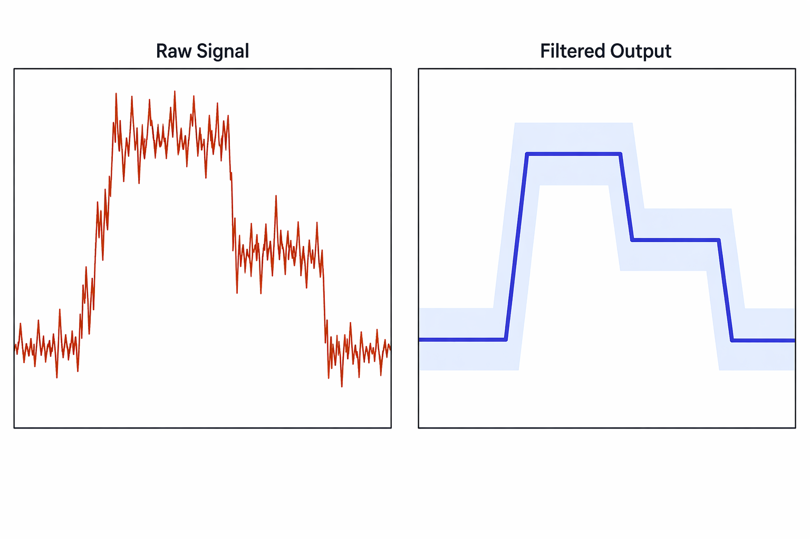
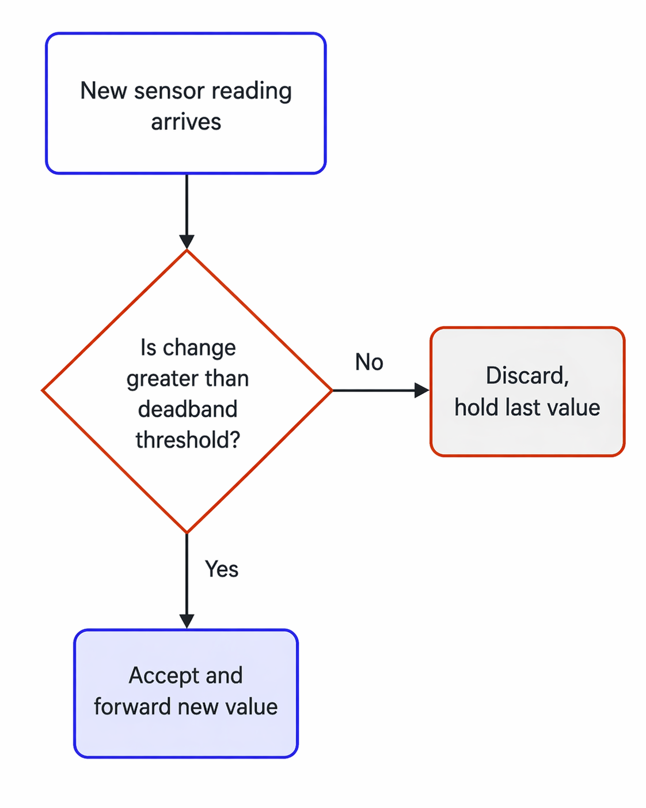
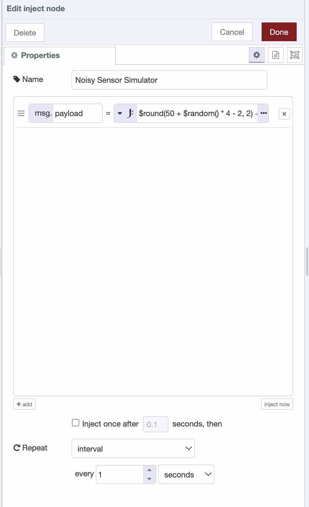
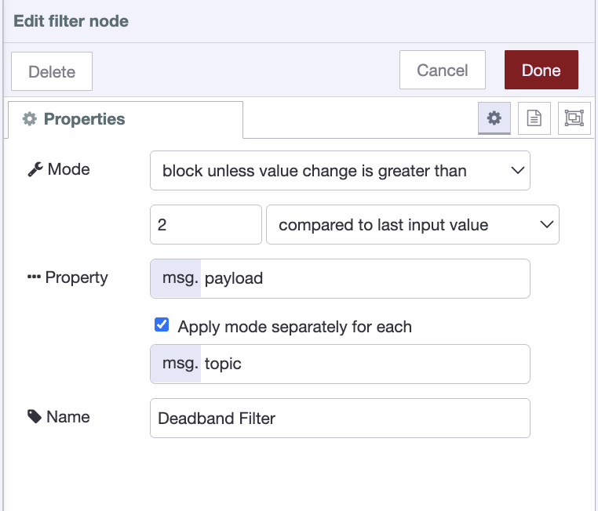
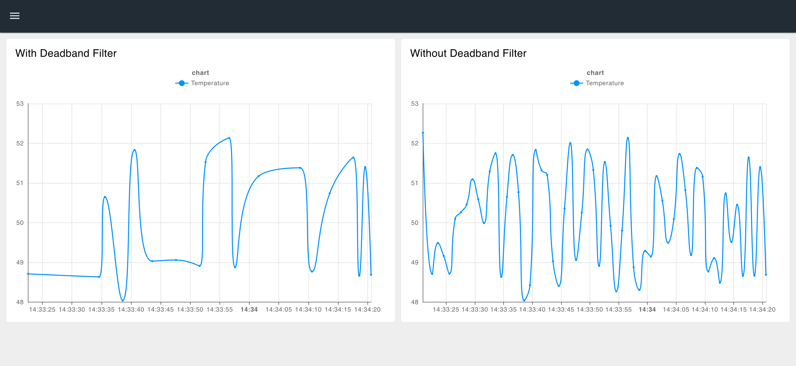

In industrial systems, sensors rarely sit perfectly still. A temperature probe, pressure transducer, or flow meter will constantly fluctuate. Not because the process is changing, but because of electrical noise, vibration, or quantization artifacts in the ADC. If your control system reacts to every tiny wiggle, it triggers unnecessary alarms, wears out actuators, and buries real events in a fog of jitter.

A deadband filter fixes this with a single rule: only report a new value if it has moved beyond a defined threshold from the last accepted reading. Stateless, computationally trivial, and tunable with one parameter. It is the simplest first line of defense for any industrial sensor pipeline. In this post, we will break down how it works, when to use it, and how to implement one in FlowFuse.

## What is a deadband filter?

A deadband filter is a signal processing technique that suppresses small, insignificant changes in sensor readings. Instead of reporting every value the sensor produces, it only forwards a new reading when the value has changed by more than a defined threshold from the last accepted value. Anything that falls within that band is considered noise and silently discarded.

Think of it like a thermostat. Your home heating does not kick in every time the temperature shifts by 0.1°C. It waits until the temperature drops past a meaningful threshold before reacting. A deadband filter applies the same logic to any continuous sensor signal.


*Raw sensor data (left) vs. deadband-filtered output (right). The shaded band shows the deadband zone. The filter only updates when the signal crosses its boundary.*

As shown above, the raw signal on the left is erratic and full of jitter. The filtered output on the right steps cleanly. It only moves when the signal genuinely crosses the deadband boundary, ignoring everything in between.

## How does a deadband filter work?

The logic is straightforward. The filter keeps track of the last value it accepted and compares every new incoming reading against it. If the difference is greater than the deadband threshold, the new value is accepted and passed downstream. If not, it is ignored and the last accepted value is held in place.


*Each incoming sensor reading is compared against the last accepted value. Only readings that exceed the deadband threshold are forwarded. Everything else is silently discarded.*

That single comparison is the entire filter. No buffers, no history, no moving averages. Just one stored value and one threshold check per incoming sample.

## Choosing the right threshold

Setting the deadband too narrow lets noise through and defeats the purpose. Setting it too wide causes the filter to miss real process changes or report them too late. The right value sits just above your sensor noise floor.

A practical starting point is to measure your sensor output when the process is known to be stable, observe the peak-to-peak fluctuation, and set your deadband to roughly that value. From there, tune it in the field until alarms and updates reflect only genuine process changes.

## Prerequisites

Before getting started, you will need the following:

- A running FlowFuse instance. If you do not have one yet, start with a [free trial](https://app.flowfuse.com/account/create) and follow [this guide](https://flowfuse.com/blog/2025/09/installing-node-red/) to get up and running on your edge device.
- A sensor or data source publishing values to FlowFuse via MQTT, Modbus, OPC-UA, or a simulated inject node for testing.

## Collecting sensor data with FlowFuse

Before you can filter anything, you need data flowing in. In industrial environments that means connecting to whatever is already on the floor. PLCs, sensors, drives, and controllers that speak dozens of different protocols, many of them decades old.

This is where FlowFuse earns its place. It connects to virtually any industrial data source out of the box. OPC-UA, Modbus, MQTT, Siemens S7, BACnet, and more. No custom drivers, no middleware. Whether your data lives on a modern IIoT sensor or a legacy PLC that has been running since the 1990s, FlowFuse can reach it.

Every reading arrives ready to use. The sensor value lands in `msg.payload` exactly as it was read, and that is all the filter needs to do its job.

Not sure how to connect your specific device or protocol? [Contact us](/contact-us/) and we will help you get your data flowing.

If you are following along and do not have a live sensor available, you can simulate one using an inject node. Set it to repeat on an interval, and use a JSONata expression to generate a noisy value:

```json
$round(50 + $random() * 4 - 2, 2) + $random() * 0.6 - 0.3
```

This simulates a sensor bouncing between 48 and 52 with tight rapid noise on top, realistic enough to see the deadband filter in action.


*Inject node configured to simulate a noisy sensor, generating random values between 48 and 52 with additional jitter every second.*

## Implementing a deadband filter

FlowFuse has a built-in **filter** node that handles deadband filtering out of the box. No code required. It only passes data when the payload has changed by more than a specified amount, which is exactly what a deadband filter does.

### Step 1: Add the filter node

1. In your palette, search for **filter**.
2. Drag it onto the canvas.

### Step 2: Place it in your flow

1. Position the filter node between your sensor input node and your output node.
2. Wire the sensor input to the filter node input, and the filter node output to your output. Whether that is a dashboard node, a database write node, or an MQTT broker.

### Step 3: Configure the filter node

1. Double-click the filter node to open its settings.
2. Set the **Mode** to `block unless value change is greater than`.
3. Enter your deadband value in the threshold field. You can use an absolute value such as `1.5` or a percentage such as `5%`.
4. Set the comparison to `compared to last valid output value`. This ensures the filter ignores any out-of-range values and always compares against the last value it actually forwarded.
5. Leave the **Property** as `msg.payload` unless your sensor data arrives on a different property.
6. If your flow handles multiple sensors on different topics, check **Apply mode separately for each** and set it to `msg.topic`. This allows a single filter node to handle multiple sensors independently.
7. Click **Done** and deploy your flow.


*Filter node configured in deadband mode with threshold set to 2.5. Only values that differ by more than 2.5 units from the last accepted reading are passed downstream.*

> **Note:** The first value that arrives is always passed through and stored as the reference point. From that point on, every incoming value is compared against it. Only values that differ by more than the threshold are forwarded. When one is, it becomes the new reference point for all comparisons that follow.


*The dashboard above shows two charts connected to the same sensor data. The left chart has the deadband filter applied, the right does not. Notice the noise difference.*

## Conclusion

Noisy sensor data is one of those problems that looks small until it is not. False alarms, worn actuators, bloated historian databases, and dashboards that are impossible to read. All of it traces back to the same root cause. A control system reacting to every fluctuation instead of only the ones that matter.

A deadband filter solves this with a single comparison. No complex logic, no additional infrastructure, no performance overhead. Just a threshold and a rule, applied consistently to every incoming reading.

But filtering noise is just one piece of a reliable industrial data pipeline. FlowFuse goes further. It simplifies collecting data from any device or protocol, implementing patterns like deadband filtering, [store and forward](/blog/2025/11/store-and-forward-edge-data-buffering/) to handle network interruptions, [dead letter queues](/blog/2026/03/how-to-implement-dlq-and-retries/) to catch and recover failed messages, and much more. All of it managed centrally, deployed consistently, and running reliably across your entire fleet.

The filter handles the noise. FlowFuse handles everything else.