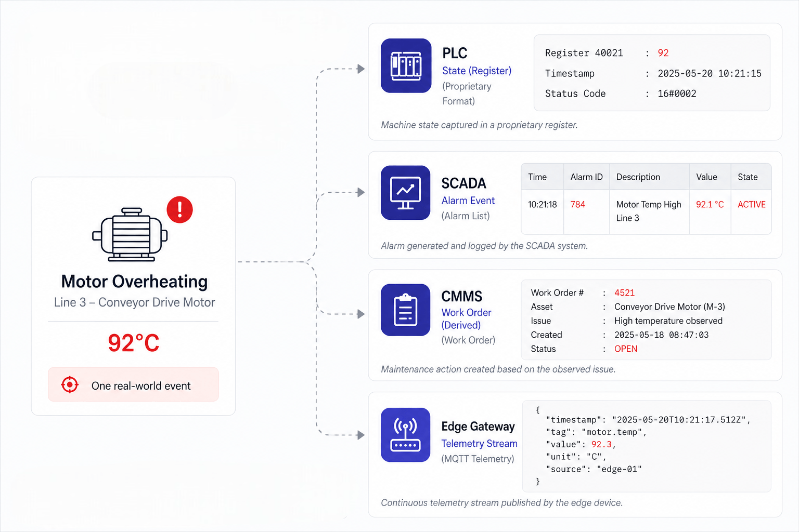
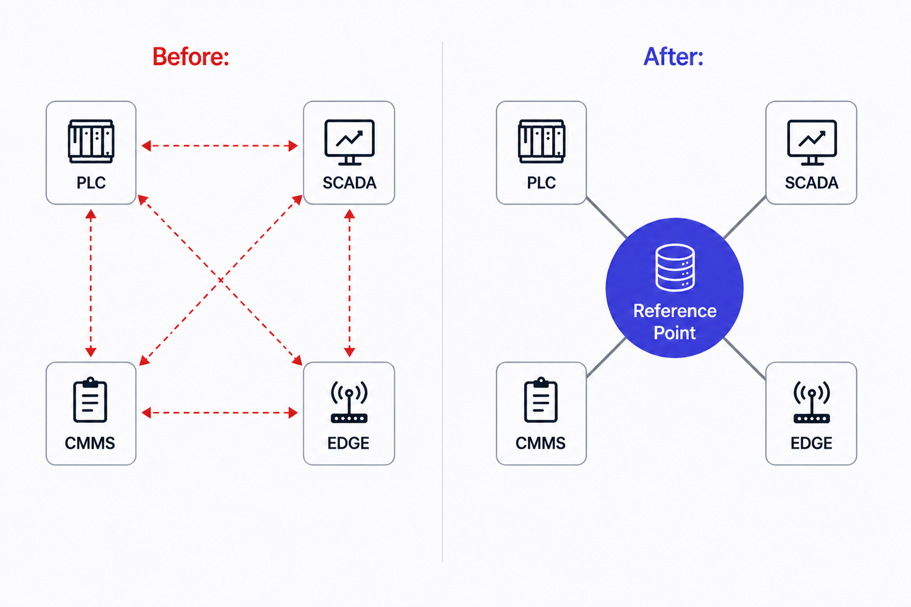
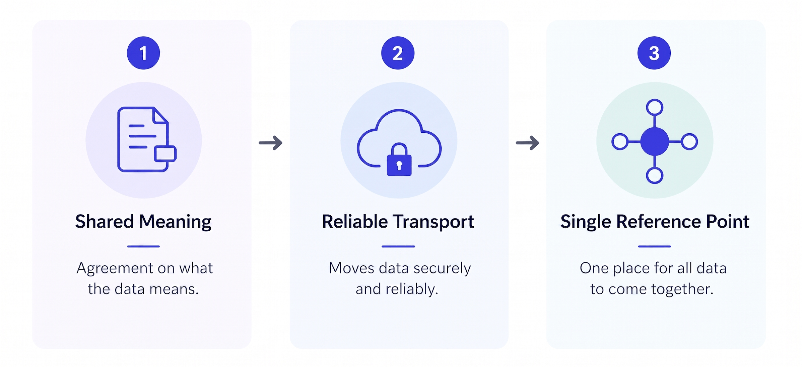
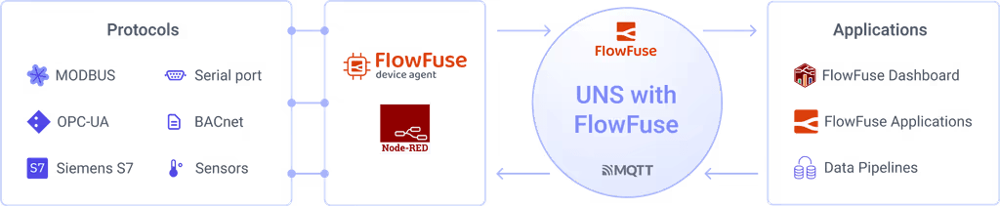
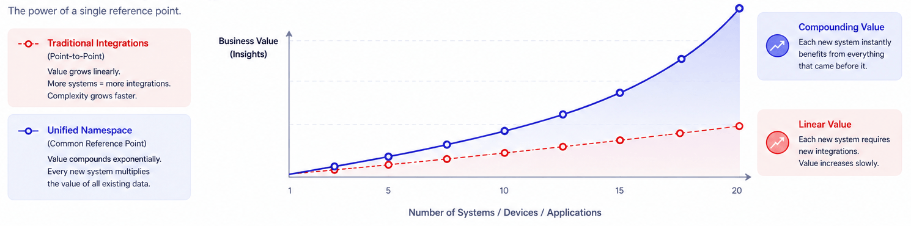

In July 1799, a French soldier digging fortifications near the Egyptian town of Rosetta struck something hard beneath the soil. What he pulled out was a slab of dark granodiorite, about the size of a small door, covered in dense carved text.

<!--more-->

The same decree appeared three times. Once in Ancient Egyptian hieroglyphs. Once in Demotic script. Once in Ancient Greek.

_A photograph of the Rosetta Stone on display at the British Museum, London. The dark granodiorite slab is covered in three scripts: Ancient Egyptian hieroglyphs, Demotic, and Ancient Greek._

For nearly 1,400 years, nobody could read hieroglyphs. Not for lack of material. Carvings covered every temple wall, every tomb, every monument in Egypt. The knowledge was always there, present, physical, accumulating for centuries. It just could not be accessed. The moment scholars found a single shared reference point, an entire civilisation unlocked almost overnight. Not one inscription. Not one tomb. Everything. All at once.

Your factory has been sitting on the same problem. And the same opportunity.

## The inscriptions are already on the walls

Manufacturing has a data shortage the same way Egypt had a stone shortage. It does not.

A typical production line generates more operational data in a single shift than most businesses analysed in an entire year a decade ago. Every machine cycle logged. Every temperature deviation recorded. Every alarm captured, every throughput number written down, every pressure reading stored somewhere. The factory floor is covered in inscriptions.

And almost none of it is being read.

Not because the data does not exist. Because it exists in forms that cannot speak to each other. A PLC stores fault history in a proprietary register format that only its own software understands. A SCADA system captures the same event three seconds later under a different identifier in a different schema. A maintenance platform has a ticket opened two days earlier flagging an anomaly on the same line. An edge gateway has been forwarding raw telemetry upstream for months that no analytics tool has ever been configured to consume.

_Diagram showing a motor overheating event represented differently across four systems: a PLC register value, a SCADA alarm, a CMMS work order, and an edge gateway telemetry stream, illustrating fragmented factory data with no shared reference point._

Four systems. Four records. One event. None of them know the others exist.

This is what fragmented factory data actually looks like in practice. Not a gap in coverage. A gap in shared meaning. The same truth inscribed repeatedly across disconnected systems, in incompatible formats, with no reference point that would let anyone recognise they are all saying the same thing.

The factory is not data-poor. It is data-illiterate. And there is a significant difference between the two.

## Why the obvious fix makes it worse

The standard response to this problem is integration. Build an adapter. Write a translation layer. Connect system A to system B and get the data flowing.

It works. For a while.

The part that nobody talks about honestly enough is what integration looks like at scale. Point-to-point connections do not grow with your factory. They grow faster. Five systems require ten connections to fully link them. Ten systems require forty-five. Twenty systems require one hundred and ninety. Every new machine, every new platform, every new analytics tool added to the floor multiplies the integration surface. Each connection is custom-built, specific to the two systems it bridges, and fragile the moment either side changes.

_Diagram comparing point-to-point integrations with a single reference point, showing how many system-to-system connections create complexity while a central reference simplifies connectivity._

Most factories do not feel this pain acutely until they are already deep in it. The integrations accumulate quietly. The team that built them moves on. The documentation, if it existed at all, goes stale. Then a vendor releases a firmware update, or a new system needs to connect to six existing ones, and suddenly the technical debt that was invisible becomes the main reason a project that was supposed to take three months takes eighteen.

This is the trap that hieroglyphic scholars would recognise immediately. If you try to decode an ancient language by building a custom translation between every pair of known scripts, you end up with an unmanageable web of bilateral dictionaries, each one valid only for the two scripts it connects, none of them reusable, all of them requiring maintenance forever.

That is not decipherment. That is the problem wearing a different hat.

The Rosetta Stone worked not because it translated one script into another. It worked because it provided a fixed reference point that everything could map to. One anchor. Unlimited readability in every direction.

## What a fixed reference point looks like in a factory

_A common language in industrial systems requires shared meaning, reliable transport, and a single reference point._

A common language in industrial systems is not a single wire protocol. People hear "common language" and think: pick one standard, mandate it, enforce it everywhere. That is not how it works, and the factories that have tried it by mandate alone have the scars to prove it.

What actually works is three things aligned together.

**A shared data model.** Not just agreement on how to transmit a value, but agreement on what a value means. [OPC-UA](/blog/2025/07/reading-and-writing-plc-data-using-opc-ua/) is the industrial world's most serious attempt at this. It does something no previous protocol attempted at scale: it separates meaning from transport. A temperature reading in OPC-UA is not a number. It is a structured object that carries the units, the valid range, the source, and the relationship to other values. Any system that speaks OPC-UA reads that object and understands exactly what it means, with no assumptions, no custom mapping, no translator standing in between.

**A reliable transport layer.** OPC-UA defines the vocabulary. [MQTT](/blog/2024/06/how-to-use-mqtt-in-node-red/) moves it. Lightweight, publish-subscribe, designed for the unreliable networks and constrained hardware that characterise real factory floors rather than data centre diagrams. Sparkplug B closes the gap that vanilla MQTT leaves open: without it, two systems both speaking MQTT can still be writing in different dialects. With it, every message has a predictable structure before you read a single byte of content.

**An architecture that removes the N² problem entirely.** The [Unified Namespace](/solutions/uns/) is what changes the geometry. Instead of bilateral connections between systems, every device and every application publishes to and subscribes from a single broker. The broker is the fixed reference point, the Rosetta Stone. Every system maps to it. Every system becomes readable to every other system, not because they were directly connected, but because they share the same anchor.

_Industrial data flow from PLC to analytics via MQTT broker_

Add a new machine and it publishes to the namespace. Every downstream system already subscribed to that topic hierarchy gets the data automatically. No new integration project. No new translation layer. No new debt.

## The dimension that changes everything

Here is what the Rosetta Stone actually did that tends to get overlooked.

It did not make one inscription readable. It made every inscription readable, including ones not yet found, ones buried under cities that would not be excavated for another century, ones carved on monuments that had not yet been discovered. The key worked forward as well as backward. Once the reference point existed, the entire future of Egyptology changed.

This is the dimension of the factory problem that most IIoT conversations miss, because most IIoT conversations stop at connectivity. Connect this machine to that system. Get this data into that dashboard. Valuable, narrowly. But still bilateral. Still one connection at a time. The geometry has not changed.

A Unified Namespace changes the geometry permanently.

When every system in a factory maps to a shared data model published through a common broker, the value does not accumulate linearly. It compounds. A quality defect on line 3 is no longer four disconnected records across four systems. It is one event, described from four angles, readable from a single location, correlatable in minutes rather than days. A maintenance anomaly flagged two days before a failure is not a ticket in one system and an alarm in another. It is a pattern visible across the entire operational picture, searchable historically, usable for prediction.

_Linear vs compounding data value graph_

And every new system added to this architecture inherits the full value of everything that came before it. A new analytics platform connects to the namespace and immediately has access to every data source already publishing there. A new machine comes online and immediately contributes to every model, every dashboard, every alert already consuming from that part of the namespace.

This is what a fixed reference point actually buys. Not a cleaner integration. A fundamentally different trajectory. The factory stops accumulating translation debt and starts accumulating readable knowledge.

## Most factories are closer than they think

IIoT has a reputation for difficult, expensive, multi-year transformations. Some of that reputation is earned. Connecting a thirty-year-old Modbus device to a modern data architecture is not trivial. Bridging IT and OT teams that have operated in separate worlds for decades takes more than a software deployment. Getting every vendor, every system, and every platform aligned on a shared model requires real organisational will.

But the standards themselves are not the bottleneck anymore. OPC-UA is mature and supported by every major automation vendor. MQTT runs in millions of industrial environments. Sparkplug B is stable and deployable today. The Unified Namespace has moved from architectural concept to production reality at manufacturers who were dealing with exactly the same fragmentation problems described in this article.

The gap for most factories is not the language. It is the practical infrastructure to implement it without a programme that outlasts the budget that funded it. Legacy devices need to be connected without ripping out working equipment. Data needs to be normalised into a consistent structure without stopping the line. The namespace needs to be built incrementally, starting with the highest-value data sources, expanding outward as confidence grows.

That is an engineering problem. Engineering problems are solvable.

[FlowFuse](/) is built for exactly this gap. It connects legacy devices running any protocol, Modbus, PROFINET, OPC-UA, whatever the floor is running, transforms their data into a consistent structure, and publishes it into a Unified Namespace that every downstream system can read from day one. The integration debt stops accumulating. The readable knowledge starts.

## The stone was always there

The French soldier who found the Rosetta Stone was not looking for it. He was building a wall. The breakthrough did not require a new expedition, a new theory, or a new technology. It required recognising what was already in the ground and understanding that the same inscriptions covering every wall around him were suddenly, finally, all saying the same thing.

Every factory producing data it cannot fully read is standing in that same courtyard.

The inscriptions are on the walls. The PLCs are writing. The SCADA systems are writing. The maintenance platforms are writing. The edge gateways are writing. The data has been accumulating for years, in some cases decades, in languages that have never had a shared reference point. Not because the knowledge wasn't there, but because nobody had found the stone.

The standards that make it readable are not experimental. They are proven, deployed, and supported by every major automation vendor on the planet. The Unified Namespace is not a roadmap item. It is running in production at manufacturers dealing with exactly the fragmentation described in this article. The stone has already been found. The decipherment has already begun.

What remains is the infrastructure to bring it to your floor without a multi-year programme, without ripping out working equipment, and without stopping the line to rebuild the architecture underneath it.

That is the gap [FlowFuse](/) was built for. Connect the legacy devices. Normalise the data. Publish it into a namespace every downstream system can read from day one. The translation debt stops. The readable knowledge starts compounding. And every new machine, every new system, every new analytical question you bring to the floor inherits everything that came before it.

The question is not whether this is possible. Several thousand production facilities have already answered that.

The question is how much longer your factory keeps building walls around inscriptions it cannot read.
