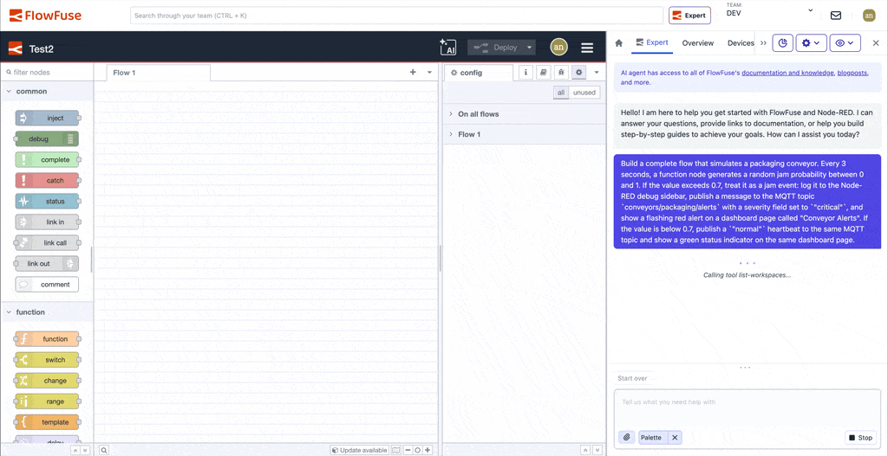

FlowFuse Expert now builds applications for you. Describe what you need, and the flow shows up on the canvas, wired and configured. Ask for a change, it updates on the spot.

<!--more-->

We shared the initial announcement in the [2.30 release post](/blog/2026/05/flowfuse-release-2-30/#expert-application-building). This post walks through building your first flow with FlowFuse Expert and how Expert works alongside your environment.

_Expert building a packaging conveyor monitoring application: MQTT alerts, dashboard indicators, and real-time event simulation, from a single prompt._

## What FlowFuse Expert sees before it builds

Before the first node lands on the canvas, Expert reads your environment. We're tuning the experience to load context agentically based on what each scenario needs. Depending on the task, that can include:

- **Your canvas state**: the nodes you've placed, how they connect, what they do.
- **Your available nodes**: which nodes are installed and at what version.
- **Your infrastructure**: the databases, APIs, MQTT brokers, and services you've connected.
- **Your runtime data**: when you attach it from the debug sidebar, Expert sees the `msg` data, errors, and values flowing through each node. It reasons about runtime behavior, not just wiring. We're working on optimising and automating this soon.

The result is output you can trust to match what you expect, so you reach your intended outcome sooner. Expert builds *with* what you have, *around* what you've already created, and *on top of* your existing infrastructure.

## Try it in two minutes

Expert is currently in **soft launch** on FlowFuse Cloud while we refine the experience. Self Hosted Enterprise support is coming in the next release.

During the soft launch, Expert must be manually enabled for your FlowFuse Cloud team. [Contact us](/contact-us/) using the email address associated with your team, and we’ll enable it for you. If you don’t already have a FlowFuse account, [sign up]() first.

Once enabled, open the editor and [find the FlowFuse Expert chat](/docs/user/expert/chat/#opening-the-chat-interface). The chat is our integrated AI across the whole suite, so you'll find it everywhere from FlowFuse to Node-RED Editor. 

Paste this in:

*"Build a live dashboard with three machines (Machine 1, Machine 2, Machine 3). Each one should keep switching on its own every 2 seconds between Running (green), Idle (yellow), or Fault (red), so at any moment they can be in different states, with the name, state, and colored indicator updating live on the page."*

You can watch Expert do its work as the flow builds itself on the canvas. A few seconds later it's wired up and ready. Hit Deploy, open the dashboard, and the cards start cycling through Running, Idle, and Fault.

You didn't go hunting through the palette or keep the documentation open in another tab. The flow just showed up.

> For now Expert can only build flows when you're on a Node-RED instance hosted on FlowFuse Cloud. We're rolling this out wider from the next release onwards.

From there, you can replace simulated data with live machine data, redesign the dashboard, add alarms, connect MQTT or OPC UA sources, and keep refining the application through prompts instead of manual building.

<lite-youtube
  videoid=""
  style="width: 1024px; overflow: hidden; background-image: url('/blog/2026/05/images/flowfuse-expert-video-thumbnail.jpg'); background-size: cover; background-position: center;"
  title="Building Industrial Apps With FlowFuse Expert">
</lite-youtube>

## Working with Expert day-to-day

Describe outcomes, not outputs. Tell Expert what you want to end up with and let it figure out the building blocks. Fine-tune the specifics afterward. And you're never locked in: you can keep working manually on the canvas right alongside Expert.

A few patterns that help you get the most out of Expert today. We're continuing to tune things so these matter less over time.

### Share context when something looks off

If a card's blank or a value's wrong, you don't have to hunt for the cause yourself. Expert can look up runtime data on its own. If you want to point it at something specific, you can also share context directly through the debug sidebar.

### Build end-to-end, then refine

Get the whole thing wired up first. Data flowing, dashboard bound, the basic loop running. Then iterate. Don't be afraid to dig deeper on any piece as you go.

If you need to fix specific things, it's best to do them one at a time for now, so you can verify each result.

### Deploy with your context in mind

If the flow is connected to a production process, take a minute to look over what Expert built before hitting Deploy. If it's a sandbox or a prototype, deploy away and see what happens. As Expert keeps improving, you'll be able to trust the output earlier without the manual check.

### Start fresh when the chat gets noisy

AI models can get poisoned with unrelated context over time. If results start drifting, starting a new chat often gives better results than trying to dig out of a bad thread.

## Where to go next

For the full reference on what FlowFuse Expert reads, how it interacts with your canvas, and advanced usage, see the [FlowFuse Expert documentation](/docs/user/expert/). We're updating these alongside the agentic experience as it evolves.
