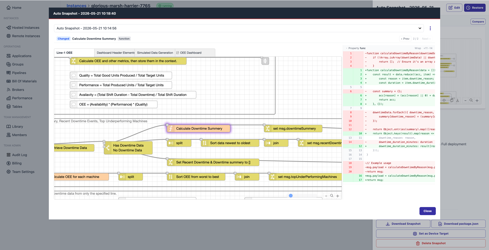
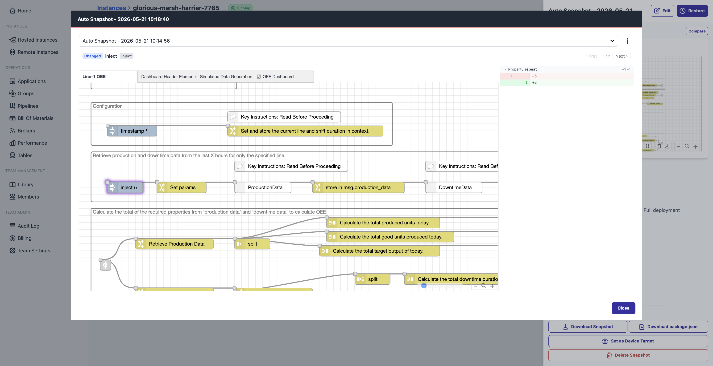
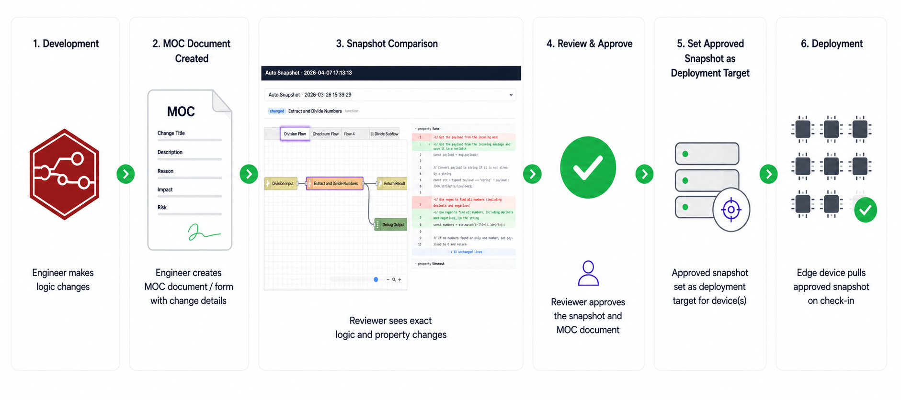

Approving a logic change you cannot fully see is not MOC. It is a signature on a description.

Here is the problem that creates, and how FlowFuse snapshot comparison solves it.

<!--more-->

## The Gap in Every IIoT MOC Process

[Management of Change](https://www.advancedtech.com/blog/what-is-moc-in-manufacturing/) requires that every change to control logic or operating procedures is reviewed, approved, and documented before it reaches production. The intent is sound: catch problems before they cause incidents.

In practice, the reviewer sees a ticket. "Updated OEE calculation." "Modified threshold on line 4 flow." A threshold changed from 80 to 8. A retry block deleted. Nobody reviewing a ticket sees any of that. They read it, they sign it, and the change goes out.

That is not a process failure. It is a tooling failure. Until recently, there was no practical way for a reviewer to see the exact lines of function code that changed, or which environment variable was modified, or which nodes were added or removed. So teams worked around it with descriptions, and hoped the descriptions were accurate.

That is where incidents trace back to.

## What Snapshot Comparison Shows

A [snapshot](/docs/user/snapshots/) in FlowFuse captures the complete state of a deployed instance at a point in time: every node, function block, configuration value, and environment variable. Comparing two snapshots produces a diff of everything that shifted between them.

The engineer makes their changes and creates a named snapshot. That snapshot becomes the artifact attached to the MOC request.

The reviewer compares it against the snapshot currently running in production. What they see is not a description of the change. It is the change.

For configuration changes, the view shifts to a side-by-side property comparison.

Function node logic appears as a line-level code diff: red for removed, green for added. Property changes, such as a modified threshold, an updated endpoint, or a changed environment variable, show old and new values side by side. The left sidebar lists every node that was added, deleted, or changed, so the reviewer knows the full scope before they start.

This creates a real audit trail for industrial change control. Reviewers can see exactly what changed instead of relying on summaries or manual descriptions.

## From Review to Deployment

When the reviewer has worked through the diff, they approve the named snapshot. That snapshot is then set as the deployment target for the edge device, and the device pulls it on next check-in.

In FlowFuse, the reviewed artifact and the deployed artifact are the same thing. For audits, incident investigations, and regulatory compliance, that traceability is what MOC was always meant to produce.

For teams on Team or Enterprise plans, FlowFuse also creates auto snapshots on every deploy, a passive safety net that captures the exact state running on each instance or device, even when a named snapshot was not part of the workflow. Up to ten auto snapshots are retained automatically, giving teams a recoverable history without any extra steps.

For teams managing logic across many devices, the same approved snapshot can be pushed to an entire fleet without re-entry. For teams that need a full version history, rollback capability, or deployment traceability, the [full snapshot documentation](/docs/user/snapshots/) covers every available action.
