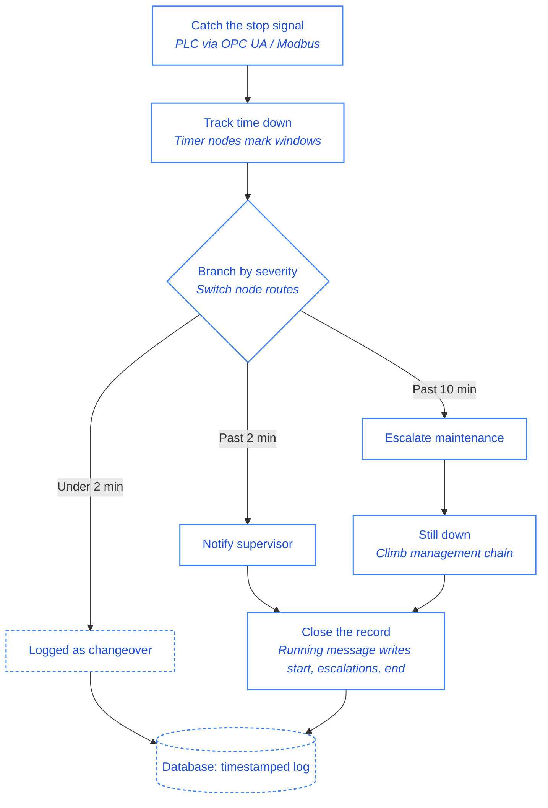

In most factories, downtime still lives in a spreadsheet. Someone writes down when a machine stopped, when it got noticed, and when it ran again. It looks like control. The longer I look at how plants actually run, the more I read it as something else: a record of how late everyone found out.

<!--more-->

The problem is the person in the middle. A machine stops, someone has to notice, then open the file and type the row. Each step adds delay, and downtime doesn't wait for the paperwork. By the time the row is written, the loss is already counted.

But here's the part worth sitting with: the machine already knows it stopped. We don't need a person to notice and write it down; we need the event itself to raise its hand. That's what an event-driven workflow does. If you don't know what that means, [read this article](/blog/2026/02/what-is-event-driven-architecture-in-manufacturing/), and in this post I'll tell you how to build one.

## How the Workflow Works and What You Need

The process begins the instant a machine stops, not when a person notices. A sensor or PLC detects the halt and generates an event, timestamped to the second. That event is passed to a rules layer, which holds the core logic of the system, evaluating the duration of the stoppage against predefined thresholds to decide what happens next.

If the stoppage is brief, under two minutes, say, it's logged as a routine changeover and nothing further happens. Cross that threshold, and the event escalates to the line supervisor. Still unresolved after the next interval, and maintenance gets the same alert. Past that point, it climbs further up the management chain. Each escalation fires automatically, based purely on whether the previous step was closed out in time, with every handoff timestamped as it happens. No one has to remember to log anything.

Here's what that looks like built in [FlowFuse](/):

- **Catch the stop signal:** Most PLCs expose machine state through [OPC UA](/blog/2025/07/reading-and-writing-plc-data-using-opc-ua/) or [Modbus](/node-red/protocol/modbus/), and FlowFuse has nodes for both. Point one at the right tag, and the moment the state flips to stopped, it lands in your flow as a timestamped message.

- **Track how long it's been down:** A couple of [timer nodes](/blog/2025/12/node-red-timer/) mark the passage of time: past two minutes, past ten, whatever windows fit your line.

- **Branch by severity:** A switch node routes the message: short stops go straight to a [database](/blog/2025/08/getting-started-with-flowfuse-tables/); longer ones also notify the supervisor over [email](/node-red/notification/email/) or [Telegram](/node-red/notification/telegram/); and if it's still unresolved at the next threshold, maintenance gets the same message, escalating further up if needed.

- **Close the record:** When the "running" message comes through, a final node writes the resolution time back into that record: start, every escalation, and end, all filled in by the flow itself.

Set this up once per line in FlowFuse, and it keeps running on its own. The spreadsheet still exists, but now it's the output, not the task.

## What Changes Once It's Running

The stakes here aren't abstract. Unplanned downtime typically runs [$25,000 per hour for mid-sized plants, climbing past $500,000 per hour for large operations](https://manufacturingleadgeneration.com/manufacturing-downtime-statistics/), and [Siemens' research](https://www.teamsense.com/blog/cost-of-downtime-manufacturing) found that while the number of downtime incidents per month has fallen in recent years, average restart time has nearly doubled, from 49 minutes to 81 minutes. That's the gap this workflow targets: not how often machines stop, but how long it takes for the right person to find out and act.

A manual log can't see that gap at all. If a stop lasts 81 minutes, the spreadsheet just shows "down for 81 minutes," with no way to tell whether 5 of those minutes were detection, 30 were waiting for someone to notice and write it down, and 46 were the actual repair. With event-driven timestamps, each becomes its own measurable interval: stop detected at 9:14:32, supervisor notified at 9:16:32, maintenance escalated at 9:24:32, resolved at 9:31:08. Three different problems with three different owners and three different fixes, instead of one number you can't act on. And since downtime is one of the core inputs to your [OEE calculation](/blog/2026/05/fixing-oee-measurement-in-manufacturing/), inaccurate downtime data doesn't just stay in this spreadsheet; it quietly distorts the availability number your whole plant uses to judge performance.

That gap has a direct dollar value, and it's worth being precise about which part. Faster escalation doesn't make the repair shorter, a seized motor takes just as long to fix whether the supervisor hears about it in one minute or thirty. What it shrinks is the waiting: the detection and notification minutes that happen *before* anyone starts working. For a mid-sized plant at $25,000/hour, each of those minutes is worth roughly $415. If automatic escalation removes 10 minutes of pure waiting from a stoppage, that's about $4,000 recovered on that incident, not from fixing the machine faster, but from not letting it sit idle while the alert worked its way to the right person. A plant with 10 unplanned stops a month that consistently closes a 10-minute waiting gap is recovering on the order of $40,000 a month. The exact figure depends on how much of your downtime is waiting versus repair, which is the point: until you measure the two separately, you're guessing.

This isn't a fix for unreliable equipment. Machines will still break, and the repair still takes as long as it takes. What it fixes is the waiting, the minutes between a stop and someone acting on it, which a spreadsheet can never shrink because it only gets written after those minutes are already gone.

Set up once per line, the workflow:

- Catches every stop the instant it happens, timestamped by the machine itself
- Escalates on a fixed schedule, supervisor, then maintenance, then up the chain, with no manual steps
- Splits a vague "down for 81 minutes" into separate detection, waiting, and repair intervals you can actually act on
- Recovers the waiting minutes, which for most plants is real money per incident

The spreadsheet still exists. Now it's the output, not the task, accurate, self-maintaining, and running on every shift without anyone having to remember a thing.