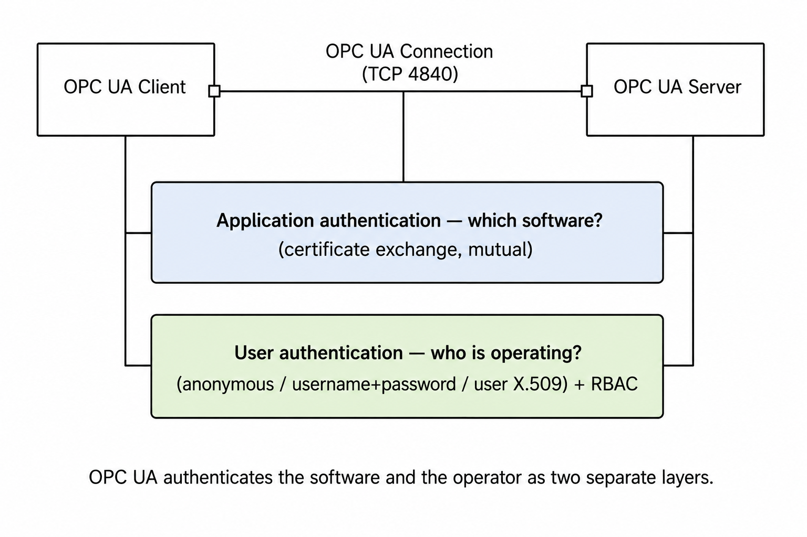
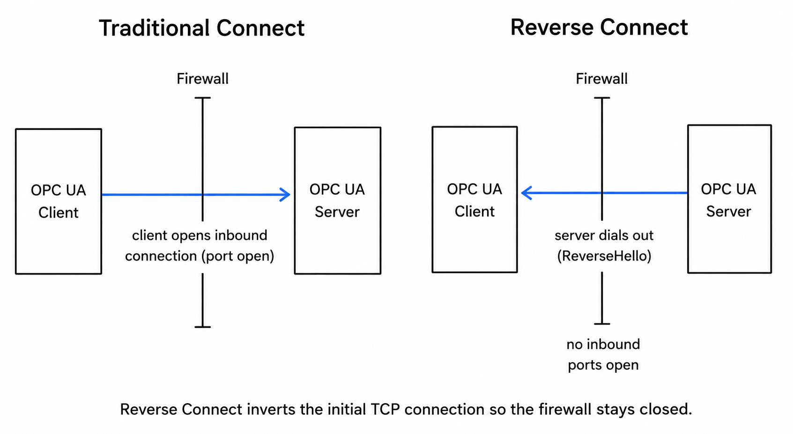
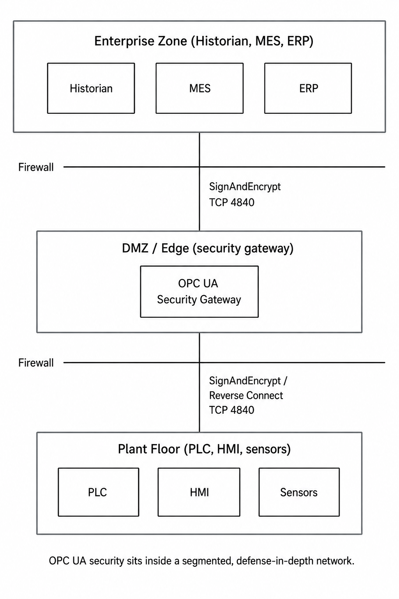
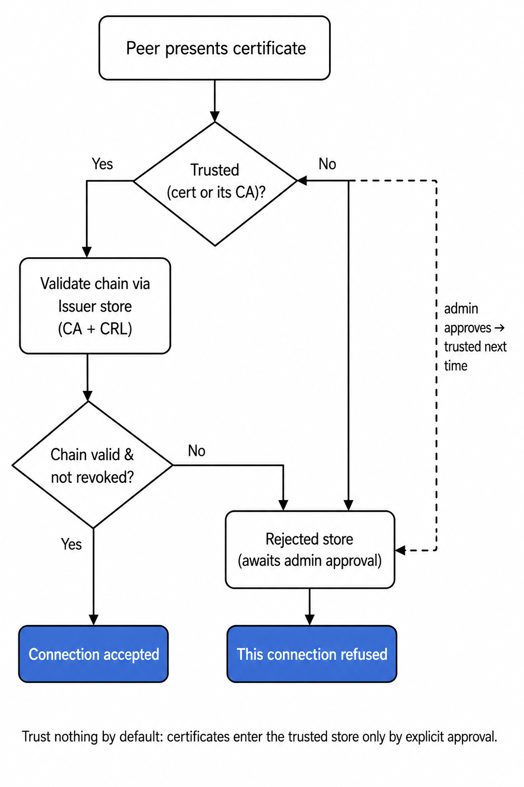
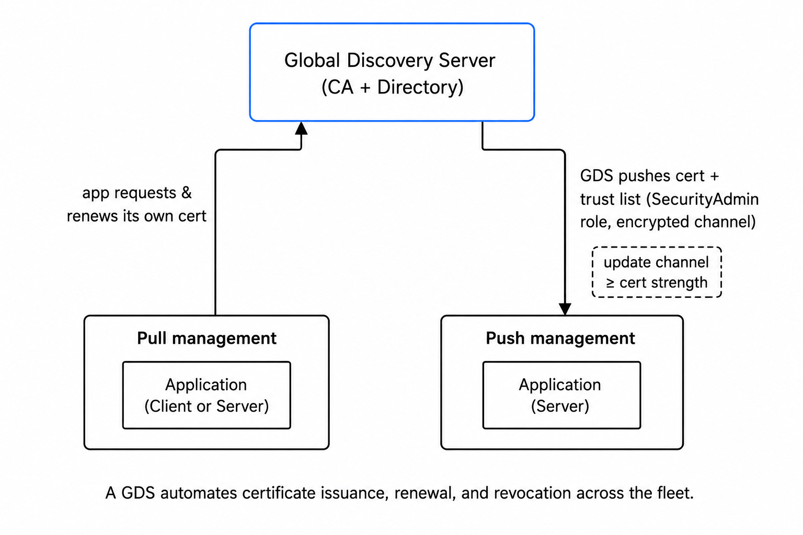

In [Part 1](/blog/2026/05/opc-ua-security-attack-vectors/), we watched how threat actors actually exploit OPC UA. None of it was broken cryptography. It was disabled trust lists, anonymous logins, dead ciphers nobody removed, and servers Shodan finds on the open internet. The protocol shipped with the tools to stop every one. The attacks worked because the tools were switched off.

This is the part where we switch them on, not as a checklist, but as an architecture where each decision closes a specific vector from Part 1. The order matters, because the cheapest fixes close the widest holes.

## [The model that decides everything else](#the-model)

Part 1 named the trap that sinks more deployments than any zero-day: OPC UA splits *application* authentication (does the server trust this client's certificate?) from *user* authentication (who is this operator, and what may they do?). Teams harden one, leave the other open, and believe they're covered.

The reason this confuses people is that OPC UA secures at the **application layer**, not the transport layer. TLS protects the pipe between two hosts. OPC UA protects the *messages*, independently of the transport, so a receiver detects a tampered process value even on a hostile network. Encryption rides on top of that as a separate layer.

Two facts fall out of this, and both map straight to Part 1's attacks:

- **Every application instance has its own certificate**, not every host, every *running process*. A Node-RED client, a SCADA server, and a historian on the same box each carry their own.
- **Authentication is mutual.** Both sides present a certificate, both sides decide whether to trust. There is no "the server has a cert, the client just connects" shortcut like HTTPS. The machine-in-the-middle attacks CISPA demonstrated work *precisely* when that mutual check is advertised but not enforced.

Hold onto the second point. Almost every control below is a way of making that mutual check real instead of decorative.

*OPC UA authenticates the software and the operator as two separate checks, not one.*

## [Stop accepting inbound connections at all](#reverse-connect)

Part 1 opened with the worst number: 14,220 internet-exposed servers, more than half allowing unauthenticated access. The instinct is to bolt authentication onto an exposed server. The better move is to stop the server from accepting inbound connections in the first place.

OPC UA has a protocol feature built for exactly this, and most "best practices" posts never mention it: **Reverse Connect**. Normally a client opens the TCP connection to a server. Reverse Connect inverts that, the *server* dials out to the client and sends a `ReverseHello` message (OPC UA Part 6), and the client establishes the secure channel over that server-initiated socket. The handshake and all mutual authentication proceed exactly as before; only the direction of the initial TCP connection flips.

*Reverse Connect inverts the initial TCP connection so the firewall stays closed. Only the socket origin flips, the client still drives the OPC UA session.*

Why this matters architecturally: the server sits in the production zone behind a firewall with **no inbound ports open**. From the firewall's perspective the traffic is outbound, the one direction it already permits. A SCADA client or edge gateway in the DMZ listens on a single port; each downstream server connects out to it. You get bidirectional OPC UA communication while the production-network firewall stays completely closed to the outside.

This is the structural fix that makes Part 1's exposure problem disappear rather than merely guarding it. Layer it inside normal defense in depth, IEC 62541 calls for exactly this:

- **Segment the network.** Control network separate from enterprise, firewalls between zones. A typical layout: `SignAndEncrypt` from the enterprise zone (historians, MES, ERP), through a DMZ of edge gateways and protocol bridges, down to a plant floor where PLCs and HMIs sit on isolated VLANs.
- **Put a security gateway in the DMZ.** A gateway can terminate Reverse Connect on both sides and act as the single, aggregating access point to the plant, the only door, and one you control.
- **Keep the single-port design as leverage, not a license.** OPC UA's standard TCP 4840 keeps firewall rules clean. Clean rules are what let you *not* expose the server, not an excuse to.

Vendors agree on the bottom line. Siemens, Schneider, and Rockwell all explicitly advise against putting these servers on the open internet. Reverse Connect is how you comply without losing IT/OT data flow.

*OPC UA security sits inside a segmented, defense-in-depth network.*

## [Make the trust list actually enforce](#trust-list)

This was Part 1's ugliest vector, because the servers *look* secure, they advertise certificate authentication, they just don't enforce it. CISPA tested 48 products and found the failures clustered in trust list handling: missing support, disabled by default, insecure configuration. Here is how the trust check works, and the two settings that quietly defeat it.

When a peer presents a certificate, a correct implementation validates it against three local stores:

- **Trusted store**, certificates (or a CA root) you've explicitly chosen to trust.
- **Issuer store**, intermediate and root CA certificates plus their Certificate Revocation Lists (CRLs), used to walk and verify the chain.
- **Rejected store**, where unknown certificates land on first contact, *pending an administrator's decision*. Nothing here is trusted.

The intended workflow is deliberate friction: an unknown peer's certificate drops into the rejected store, an administrator inspects it, and only then moves it to trusted. That manual approval *is* the security. Two things destroy it:

*Trust nothing by default: certificates enter the trusted store only by explicit approval.*

1. **"Automatically accept all certificates."** Almost every server has this toggle, Siemens TIA Portal, node tooling, test harnesses. It's there to get you past the handshake during commissioning, and it is the single most common reason a "secure" connection is actually wide open. A server set to auto-accept has, in effect, the disabled trust list from Part 1. This default is common enough that even purpose-built Node-RED OPC UA clients often ship with server certificates auto-accepted out of the box, convenient for testing, dangerous in production. Turn it off before production. Every time.
2. **Trusting a commercial public CA's root.** If you drop a public CA into your trusted store, that CA, not you, decides which applications your systems trust. For OPC UA you want a **company-specific CA** whose root you control, or explicit per-application trust. Never a public one.

The concrete mechanic trips up everyone the first time, so it's worth being literal. To let a Node-RED OPC UA client talk to a Siemens S7 server over `SignAndEncrypt`, you copy the client's certificate (in node-based tooling it's typically `PKI/own/certs/client_certificate.pem`) into the *server's* trusted folder, and copy the server's certificate into the *client's* trusted store. Both ends, both directions, because authentication is mutual. Miss one side and you get the "connection could not be established" error that fills the Node-RED forums, almost always because one party doesn't yet trust the other.

The governing rule: **trust nothing by default.** A certificate enters the trusted store only through explicit, human approval. That is the control CISPA kept finding switched off.

## [Force SignAndEncrypt, and rip the deprecated ciphers out](#crypto)

Part 1's Secura research and the CVEs behind it all traced to one root cause: known-weak crypto left switched on in non-default configurations. You close this by removing the option, not by hoping nobody selects it.

**Set the security mode deliberately.** Endpoints advertise a *mode* and a *policy*. The mode is one of three:

- `None`, no signing, no encryption, everything in plaintext. This is the "None" mode 80% of Part 1's exposed servers still offered. Disable it, or bind it to localhost-only diagnostics.
- `Sign`, every message signed but not encrypted. Integrity and authenticity without confidentiality. Use only where you've consciously decided the data is non-sensitive but you still must detect a forged value.
- `SignAndEncrypt`, all three. The answer for anything carrying process data or accepting commands.

**Then remove the dead policies.** `Basic128Rsa15` and `Basic256` are deprecated, the OPC Foundation retired them in spec 1.04 because they lean on SHA-1 and RSA key lengths that no longer meet NIST or BSI guidance, and IEC 62443 and the NIST CSF explicitly flag them. `Basic128Rsa15` is the exact policy behind Part 1's CVE-2024-42512 and CODESYS's CVE-2025-1468 Bleichenbacher oracle. If a server *only* offers these, that's a firmware-update conversation, not a config tweak.

For anything new, `Basic256Sha256` is the floor; the modern policies `Aes128_Sha256_RsaOaep` (faster) and `Aes256_Sha256_RsaPss` (strongest available) are better. The trade-off is backward compatibility, older devices won't speak the newer suites, so the realistic migration is `Basic256Sha256` as the enforced minimum while you push the fleet forward and decommission the deprecated suites as you go. The point is that an attacker can't downgrade to a broken cipher you've physically removed.

## [Separate who-the-software-is from who-the-operator-is](#user-auth-rbac)

Application authentication, handled above, proves *which software* connected. It says nothing about *who* is driving the session. Part 1's anonymous-access vector only fully closes when you enforce both layers, and as Part 1 noted, anonymous *user* access is far less dangerous when *application* authentication is genuinely enforced, and far more dangerous when it isn't.

User authentication options, weakest to strongest:

- **Anonymous**, acceptable only for read-only, non-sensitive dashboards. Never write access, never diagnostics.
- **Username / password**, fine, but only over a `SignAndEncrypt` endpoint, or you've just shipped credentials in plaintext.
- **User X.509 certificate**, strongest, and the natural fit for machine-to-machine.

Then constrain what an authenticated identity can do. Implement **role-based access control from day one.** Running every application with administrator rights is the oversized blast radius Part 1 warned about, one compromise and the attacker owns the read-and-write path to the process. Assign read, write, and browse separately, per role, least privilege. If a server can't enforce granular access itself, put a gateway in front that can.

## [Manage certificates like infrastructure, not a one-time chore](#certificate-lifecycle)

The trust mechanics above assume certificates that are valid, unique, and revocable. At one connection, manual exchange is fine. At a hundred it collapses, and that collapse is what produces the 20-year self-signed certs and shared keys Part 1 punished.

Every instance holds an X.509 v3 Application Instance Certificate (IEC 62541 Part 2): application URI as a globally unique ID, public key, issuer identity, validity window, issuer signature. The private key stays secret on the instance, leak it and that certificate must be revoked and replaced, the precise consequence CODESYS described for the Bleichenbacher oracle.

Non-negotiables regardless of scale:

- **One certificate per instance.** Share a certificate and revoking it after one compromise takes down every instance that shared it.
- **2048-bit RSA minimum**, 4096-bit for long-lived (5+ year) certificates.
- **SAN must match the application URI exactly**, or validation fails in maddening, hard-to-diagnose ways.
- **Track expiry like any operational asset.** Field certs carry absurd multi-decade lifetimes precisely because nobody wants to renew. That's deferral, not security. Reminder 60 days out.
- **Handle CRLs.** A trust store without working revocation can't respond to a compromise.
- **Protect the private-key store**, read/write to an administrator or the application only.

**Automate before it hurts.** A **Global Discovery Server (GDS)** with certificate management acts as your CA and directory, issuing, renewing, and revoking across the fleet over standard PKI protocols (CMP, EST) so you're not vendor-locked. It works two ways:

- **Pull management**, the application (usually a client) calls the GDS to request and refresh its own certificate and trust list. It owns keeping itself current.
- **Push management**, the GDS pushes new certificates and trust lists *to* the application (usually a server), which exposes the methods for it. Push requires an encrypted channel and a client holding the `SecurityAdmin` role, and the GDS will only deliver an update over a channel at least as strong as the certificate being updated, it won't push a 4096-bit cert down a 2048-bit channel.

*A GDS automates certificate issuance, renewal, and revocation across the fleet.*

One field tip even with a GDS: keep a local rejected-certificate store on each application, so you can still see and reason about what tried to connect.

If you're building this on FlowFuse, the OPC UA connectivity is available as one of the Certified Nodes introduced in [FlowFuse 2.31](https://flowfuse.com/blog/2026/06/flowfuse-release-2-31/), vetted and FlowFuse-supported rather than pulled unmaintained from the community registry, which is the supply-chain point above made concrete. As with any OPC UA client, confirm it's set to reject untrusted server certificates before you go to production rather than auto-accepting them.

## [Keep the audit trail on, and watched](#auditing)

Part 1's quietest, most damning detail: most anonymously reachable servers also had auditing *disabled*, so an attacker connected, read the plant, and left no trace. A silent denial-of-service and a client-side compromise both get worse when nothing is watching.

OPC UA emits rich audit events for security-relevant operations. Turn them on, then make sure something *collects and watches* them, events nobody reads are theatre. This is what turns an undetected man-in-the-middle into an alert and a silent DoS into an incident with a timeline.

## [Patch the stack, and especially the gateways](#patch)

Part 1 closed on a supply-chain truth: one flaw in a shared OPC UA library or sample propagates into every product built on it, and integration servers are rich targets because vulnerabilities *chain*, Team82 strung five bugs together to own a Softing gateway.

So architecture doesn't end at configuration. Track CVEs for your specific stack and gateways. Subscribe to the OPC Foundation security bulletins and your vendors' advisories. Patch the integration servers stitching systems together with the same urgency as the servers themselves, owning one reaches everything behind it. And because the client trusts the server, a client fed bad data by a rogue server is its own vector (Part 1's client-side RCE): client-side updates matter as much as server-side.

## [Test what you think you built](#test)

The step everyone skips. Verify configuration matches policy:

- Connect *without* a valid certificate, does the server actually reject it, or is auto-accept still on?
- Read and write *without* authorization, does RBAC actually deny it?
- Point a security testing tool at your endpoints and confirm the advertised modes match the enforced ones.

A trust store you've never tested is a hypothesis, not a control, and Part 1 is a catalogue of deployments where the hypothesis was wrong.

## [The blueprint, in one breath](#blueprint)

Every vector in Part 1 had the same root cause: a tool OPC UA handed you that nobody switched on. The architecture is switching them on, in the order of biggest hole for least effort:

1. **Reverse Connect + segmentation**, the server stops accepting inbound connections; the firewall stays closed.
2. **Enforcing trust list, auto-accept off, company CA**, the mutual check becomes real instead of decorative.
3. **SignAndEncrypt, deprecated ciphers removed**, no cipher to downgrade to.
4. **User auth + RBAC on top of application auth**, both layers, least privilege.
5. **One cert per instance, GDS-managed lifecycle**, valid, unique, revocable, at scale.
6. **Auditing on and watched.**
7. **Stack and gateways patched.**
8. **Tested against the policy, not the assumption.**

OPC UA shipped with the strongest security model in industrial protocols. Part 1 showed what it looks like switched off. This is what it looks like switched on, and where FlowFuse fits is making it the default rather than the project: data pulled off exposed, internet-facing servers into a managed, segmented architecture where Reverse Connect, enforced trust, and least-privilege access are how the system is built, not a hardening pass you hope someone remembers to run.
